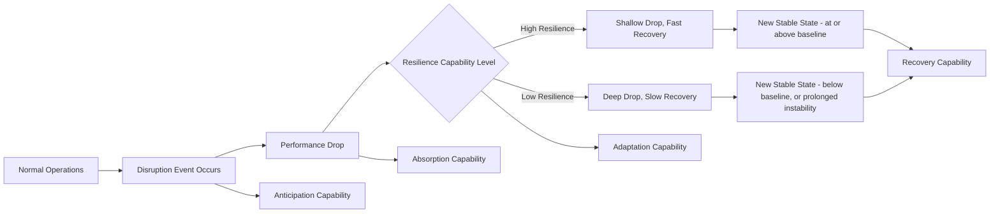
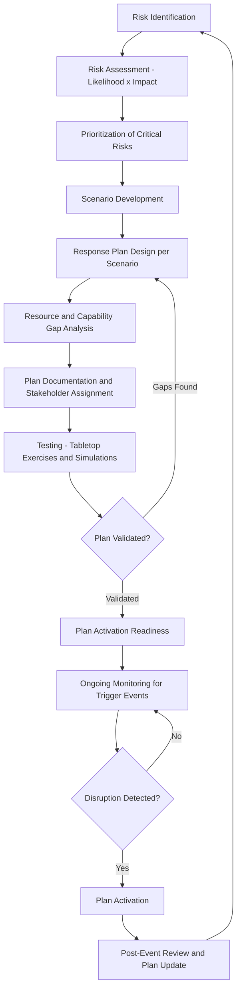

## Supply Chain Resilience and Contingency Planning

### Overview

Supply chain resilience is the capacity of a supply chain to anticipate, absorb, adapt to, and recover from disruptions while maintaining continuity of operations and an acceptable level of service to customers. Contingency planning is the structured, proactive process of preparing specific response plans for defined disruption scenarios before they occur, rather than reacting improvised to each disruption as it happens. Together, these disciplines have moved from a peripheral risk-management function to a core strategic priority following the compounding shocks of the past several years — pandemic disruption, chokepoint closures, and geopolitical instability (see Geopolitical Disruption and Trade Lane Risk).

### Core Conceptual Framework: The Resilience Curve

**Key Points**

- Resilience is commonly visualized as a performance curve over time: a disruption causes a **drop** in performance (service level, throughput, on-time delivery), followed by a **recovery period**, ultimately returning to a **new operating state** (which may match, exceed, or fall short of the pre-disruption baseline).
- Four capabilities determine the shape of this curve:
  - **Anticipation**: The ability to foresee a disruption before or as it begins, through monitoring and early-warning systems.
  - **Absorption**: The ability to withstand the initial shock without complete operational failure (e.g., via buffer inventory or redundant capacity).
  - **Adaptation**: The ability to reconfigure operations dynamically during the disruption (rerouting, alternative sourcing, mode shifts).
  - **Recovery**: The ability to return to, or establish, a stable operating state following the disruption.
- A resilient supply chain minimizes both the depth of the performance drop and the time to recovery, compared to a fragile supply chain that experiences a severe drop and prolonged recovery.

### Resilience Curve Visualization

### Types of Supply Chain Disruption

| Category | Examples | Typical Duration | Predictability |
| --- | --- | --- | --- |
| Geopolitical/conflict | Chokepoint closures, sanctions, trade wars | Weeks to years | Low-moderate (early signals often present) |
| Natural disaster | Earthquakes, hurricanes, floods | Days to months | Moderate (seasonal/regional patterns known) |
| Pandemic/public health | COVID-19-style widespread disruption | Months to years | Low |
| Cyberattack | Ransomware on carrier/port/supplier systems | Days to weeks | Low |
| Supplier failure | Bankruptcy, quality failure, single-source dependency | Weeks to months | Moderate (often preceded by financial warning signs) |
| Labor disruption | Port strikes, trucking strikes | Days to weeks | Moderate (often preceded by negotiation breakdown) |
| Demand shock | Sudden demand spike or collapse | Weeks to months | Low-moderate |
| Infrastructure/technical | Canal drought restrictions, port equipment failure | Days to months | Variable |

### Core Resilience Strategies

#### 1. Redundancy and Diversification

**Key Points**

- **Multi-sourcing**: Qualifying more than one supplier for critical components, reducing single-point-of-failure risk even at some cost premium versus a single-source relationship.
- **Multi-modal and multi-carrier capability**: Maintaining the operational ability to shift between transport modes (ocean, air, rail, road) and carriers, rather than being structurally locked into a single mode/carrier combination for a given lane.
- **Geographic diversification**: Spreading sourcing and manufacturing across multiple regions (connecting directly to the nearshoring/reconfiguration strategies covered elsewhere in this chapter) to reduce correlated risk exposure to any single country or region's disruption events.
- **Safety stock and buffer inventory**: Holding additional inventory beyond immediate operational need specifically to absorb short-to-medium-term supply interruptions, at the direct cost of increased working capital and carrying cost.

#### 2. Visibility and Early Warning Systems

- **Multi-tier supply chain mapping**: Extending visibility beyond direct (tier-1) suppliers to understand tier-2, tier-3, and beyond dependencies, since critical vulnerabilities are frequently hidden deeper in the supply chain than an organization's direct contractual relationships reveal.
- **Real-time monitoring integration**: Leveraging IoT cargo visibility (see related topic) and AI-driven risk-scoring platforms (see Artificial Intelligence in Freight Management) to detect emerging disruption signals earlier than traditional periodic reporting would allow.
- **Financial health monitoring of critical suppliers**: Tracking credit ratings, payment behavior, and other financial indicators of key suppliers to anticipate potential failure before it manifests as an actual supply interruption.

#### 3. Flexibility and Agility

- **Flexible manufacturing and postponement strategies**: Designing products and processes to delay final configuration/customization as late as possible in the supply chain, allowing faster adaptation to demand or supply shifts without extensive re-engineering.
- **Modular and standardized components**: Reducing dependency on highly specific, hard-to-substitute inputs by favoring standardized components with multiple qualified sources where feasible.
- **Contractual flexibility**: Negotiating supplier and carrier contracts with built-in flexibility mechanisms (volume flexibility, force majeure provisions, alternative capacity commitments) rather than rigid fixed-volume, fixed-route agreements.

#### 4. Collaboration and Information Sharing

- **Supplier relationship management**: Deeper, more collaborative relationships with key suppliers (joint contingency planning, shared visibility into capacity and constraints) tend to enable faster joint problem-solving during disruption compared to purely transactional relationships.
- **Industry and government coordination**: Participation in industry consortiums and engagement with government trade/customs agencies can provide earlier access to regulatory changes or disruption warnings than relying solely on internal monitoring.

### Contingency Planning Process

### Architecture: Resilience and Contingency Planning System (svg_diagram)

<svg xmlns="http://www.w3.org/2000/svg" viewBox="0 0 800 400">
<text x="400" y="30" font-size="18" font-weight="bold" text-anchor="middle" fill="#1a1a1a">Contingency Planning Lifecycle (svg_diagram)</text>
<rect x="30" y="60" width="160" height="70" rx="8" fill="#dbeafe" stroke="#2563eb" stroke-width="1.5" />
<text x="110" y="88" font-size="12" text-anchor="middle" fill="#1e3a8a">Risk Identification</text>
<text x="110" y="105" font-size="10" text-anchor="middle" fill="#1e3a8a">and Assessment</text>
<rect x="230" y="60" width="160" height="70" rx="8" fill="#dcfce7" stroke="#16a34a" stroke-width="1.5" />
<text x="310" y="88" font-size="12" text-anchor="middle" fill="#14532d">Scenario Planning</text>
<text x="310" y="105" font-size="10" text-anchor="middle" fill="#14532d">and Response Design</text>
<rect x="430" y="60" width="160" height="70" rx="8" fill="#fef3c7" stroke="#d97706" stroke-width="1.5" />
<text x="510" y="88" font-size="12" text-anchor="middle" fill="#78350f">Testing and</text>
<text x="510" y="105" font-size="10" text-anchor="middle" fill="#78350f">Validation</text>
<rect x="630" y="60" width="150" height="70" rx="8" fill="#fce7f3" stroke="#db2777" stroke-width="1.5" />
<text x="705" y="88" font-size="12" text-anchor="middle" fill="#831843">Activation and</text>
<text x="705" y="105" font-size="10" text-anchor="middle" fill="#831843">Monitoring</text>
<line x1="190" y1="95" x2="230" y2="95" stroke="#475569" stroke-width="2" marker-end="url(#arrow6)" />
<line x1="390" y1="95" x2="430" y2="95" stroke="#475569" stroke-width="2" marker-end="url(#arrow6)" />
<line x1="590" y1="95" x2="630" y2="95" stroke="#475569" stroke-width="2" marker-end="url(#arrow6)" />
<rect x="130" y="180" width="540" height="150" rx="10" fill="#ede9fe" stroke="#7c3aed" stroke-width="2" />
<text x="400" y="205" font-size="13" font-weight="bold" text-anchor="middle" fill="#4c1d95">Supporting Data and Technology Layer</text>
<text x="400" y="230" font-size="10" text-anchor="middle" fill="#4c1d95">Multi-tier supplier mapping databases</text>
<text x="400" y="250" font-size="10" text-anchor="middle" fill="#4c1d95">IoT and AIS real-time visibility feeds</text>
<text x="400" y="270" font-size="10" text-anchor="middle" fill="#4c1d95">AI-driven geopolitical and financial risk scoring</text>
<text x="400" y="290" font-size="10" text-anchor="middle" fill="#4c1d95">TMS/ERP integration for rapid rerouting execution</text>
<line x1="400" y1="130" x2="400" y2="180" stroke="#475569" stroke-width="2" />
</svg>

### Risk Assessment Methodology

**Key Points**

- A standard approach scores identified risks along two dimensions: **likelihood of occurrence** and **potential impact severity**, typically visualized as a risk matrix to prioritize which scenarios warrant detailed contingency plan development versus lighter monitoring.
- **Impact assessment** should consider not only direct financial cost but also service-level impact, customer relationship damage, regulatory/compliance consequences, and potential long-term reputational effects.
- **Single-source and critical-path analysis**: Identifying components, suppliers, or routes where disruption would have outsized impact due to lack of readily available alternatives — these represent the highest-priority targets for redundancy investment, since not all supply chain nodes carry equal risk weight.

### Example: Contingency Plan Structure for a Chokepoint Disruption Scenario

**Example**

A consumer goods company sourcing primarily from Asia via ocean freight through the Suez Canal/Red Sea might maintain a documented contingency plan specifying: (1) trigger conditions for plan activation (e.g., sustained transit disruption exceeding a defined threshold), (2) pre-negotiated alternative routing capacity via the Cape of Good Hope with an already-qualified secondary carrier, (3) a defined safety stock buffer sized to cover the incremental transit time difference between routes, (4) pre-identified alternative or expedited transport options (air freight) for the highest-priority SKUs if ocean disruption extends beyond a defined duration, and (5) designated internal decision-makers authorized to activate each escalation tier without requiring lengthy approval cycles during an active disruption.

### Technology Enablers

- **Digital twin and network simulation platforms**: Allow organizations to model the impact of specific disruption scenarios on their actual network topology before a real disruption occurs, informing which contingency investments deliver the greatest resilience improvement per dollar invested.
- **Multi-tier visibility platforms**: Software specifically designed to map and monitor supplier networks beyond tier-1 relationships, addressing the common resilience blind spot of hidden upstream dependencies.
- **AI-driven risk monitoring**: NLP-based scanning of news, government advisories, and financial data feeds to generate early-warning signals for emerging disruptions (see Artificial Intelligence in Freight Management for underlying techniques).
- **TMS and network flexibility**: A Transportation Management System configured with pre-established alternative carrier and routing options enables faster operational execution of a contingency plan once activated, rather than requiring ad hoc carrier sourcing during an active crisis.

### Organizational and Governance Considerations

- **Clear activation authority**: Effective contingency plans specify who has authority to activate each response tier, avoiding delays caused by ambiguous decision rights during time-sensitive disruption windows.
- **Cross-functional ownership**: Resilience planning typically requires coordination across procurement, logistics, finance, and sales/customer service functions, since disruption response decisions (e.g., expedited freight cost versus service-level protection) involve genuine cross-functional trade-offs.
- **Regular testing and plan maintenance**: Contingency plans that are documented but never tested through tabletop exercises or simulations risk containing unrecognized gaps that only surface during an actual disruption, when it is too late to correct them.
- **Post-event review discipline**: Systematically capturing lessons learned after each disruption event, whether the response was successful or not, feeds back into risk identification and plan refinement for the next cycle.

### Benefits

- **Reduced disruption impact**: Organizations with mature contingency plans and resilience capabilities generally experience shallower performance drops and faster recovery when disruptions occur, compared to organizations without such preparation.
- **Faster decision-making under pressure**: Pre-developed plans with clear activation triggers and authority reduce the cognitive and organizational burden of decision-making during an active crisis, when time pressure is highest.
- **Improved stakeholder confidence**: Demonstrated resilience capability can be a meaningful factor in customer and investor confidence, particularly for industries with high supply chain visibility requirements (pharmaceuticals, critical infrastructure components).
- **Competitive advantage during disruption**: Organizations that maintain service levels during industry-wide disruptions (through superior resilience) can gain market share or strengthen customer relationships relative to less-resilient competitors.

### Limitations and Challenges

- **Cost of resilience investment**: Redundancy, buffer inventory, and diversification all carry real, ongoing costs; building resilience for every conceivable disruption scenario is neither economically rational nor achievable, requiring genuine prioritization trade-offs.
- **Difficulty quantifying return on resilience investment**: Unlike many operational investments, resilience investments pay off specifically during disruption events whose timing and severity are inherently uncertain, making the business case for specific resilience spending more difficult to construct than for investments with predictable, continuous returns. [Inference: this asymmetry — paying continuously for a benefit realized only intermittently — likely explains why resilience investment is frequently under-prioritized relative to its long-run value, particularly in organizations that have not recently experienced a severe disruption.]
- **Planning fatigue and plan staleness**: Contingency plans developed once and never revisited can become outdated as supply chain configurations, supplier relationships, and risk landscapes evolve, reducing their practical value when eventually needed.
- **Incomplete visibility limits planning quality**: Multi-tier supply chain visibility remains genuinely difficult and incomplete for most organizations, meaning even well-intentioned contingency planning may be built on an incomplete picture of actual dependency risk.
- **Novel disruption types**: Contingency plans are inherently built around anticipated scenario categories; genuinely novel disruption types (unprecedented combinations of factors) may fall outside any pre-developed plan, requiring improvised response regardless of prior planning maturity.
- **Organizational silos**: Cross-functional coordination requirements for effective resilience planning can be undermined by organizational structures that don't naturally incentivize collaboration across procurement, logistics, and commercial functions.

### Comparison: Reactive vs. Proactive Resilience Posture

| Dimension | Reactive Posture | Proactive Posture |
| --- | --- | --- |
| Disruption response speed | Slow (ad hoc solution-finding) | Fast (pre-developed plan activation) |
| Cost during normal operations | Lower (no redundancy investment) | Higher (ongoing resilience investment) |
| Cost during disruption | Higher (expedited/spot-market solutions) | Lower (pre-negotiated alternatives) |
| Decision-making under pressure | High cognitive load, ambiguous authority | Lower cognitive load, clear activation protocol |
| Typical recovery time | Longer | Shorter |

### Related Topics

- Geopolitical disruption and trade lane risk (specific disruption category feeding contingency planning)
- Nearshoring and supply chain reconfiguration (diversification as a resilience strategy)
- Artificial intelligence in freight management (predictive risk monitoring and anomaly detection)
- Internet of Things and real-time cargo visibility (early warning data feeds)
- Transportation Management Systems (operational execution of contingency routing)
- Multi-tier supply chain mapping and visibility platforms
- Business continuity planning and crisis management frameworks