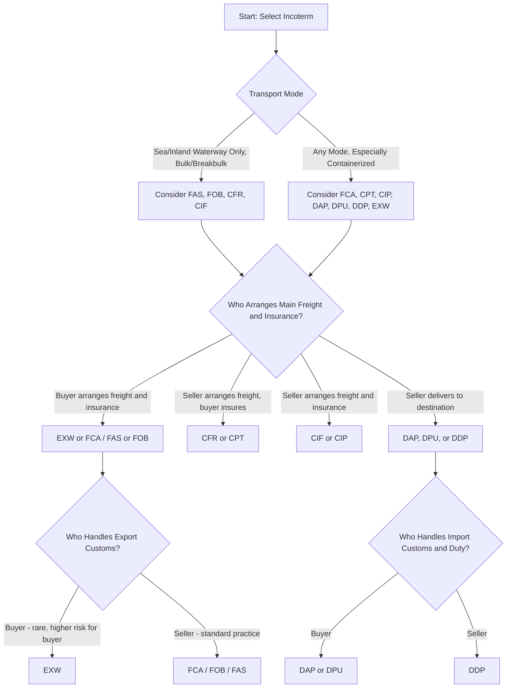

## Selecting Incoterms for Common Trade Scenarios

### Overview

Selecting the appropriate Incoterm for a given trade transaction is a practical decision that balances cost allocation, risk transfer point, control over logistics, insurance responsibility, and customs clearance obligations between buyer and seller. While the 11 Incoterms rules (Incoterms 2020) define the general framework, real-world selection depends heavily on transport mode, the parties' relative logistics capability, risk tolerance, and the specific commercial relationship. This section applies the Incoterms framework to common, practical trade scenarios.

### Quick-Reference Summary of Incoterms 2020 Rules

| Incoterm | Mode | Risk Transfer Point | Seller Arranges Main Carriage | Seller Arranges Insurance |
| --- | --- | --- | --- | --- |
| EXW (Ex Works) | Any | At seller's premises | No | No |
| FCA (Free Carrier) | Any | At named place/carrier handover | No (buyer arranges) | No |
| FAS (Free Alongside Ship) | Sea/inland waterway only | Alongside vessel at port | No | No |
| FOB (Free On Board) | Sea/inland waterway only | Goods on board vessel | No | No |
| CFR (Cost and Freight) | Sea/inland waterway only | Goods on board vessel | Yes | No |
| CIF (Cost, Insurance, Freight) | Sea/inland waterway only | Goods on board vessel | Yes | Yes (minimum cover) |
| CPT (Carriage Paid To) | Any | At first carrier handover | Yes | No |
| CIP (Carriage and Insurance Paid To) | Any | At first carrier handover | Yes | Yes (higher cover, Incoterms 2020 update) |
| DAP (Delivered at Place) | Any | At named destination, ready for unloading | Yes | No |
| DPU (Delivered at Place Unloaded) | Any | At named destination, unloaded | Yes | No |
| DDP (Delivered Duty Paid) | Any | At named destination, duty paid | Yes | No |

### Decision Framework: Key Selection Variables

**Key Points**

- **Transport mode**: FAS, FOB, CFR, and CIF are restricted to sea/inland waterway transport only; using them for containerized or multimodal shipments is a common and consequential error, since risk technically transfers "on board the vessel" — a point that is difficult to define precisely for containerized cargo handed over at a container yard well before vessel loading.
- **Logistics capability and preference**: A party with strong freight-buying power, established carrier relationships, and logistics expertise often prefers to control the main carriage booking (favoring EXW/FCA from a buyer's perspective, or DAP/DDP from a seller's perspective, depending on which party has that capability).
- **Risk tolerance**: Parties less comfortable bearing transport risk prefer Incoterms that transfer risk later in the journey (DAP, DPU, DDP for buyers; EXW, FCA for sellers).
- **Customs expertise and local market access**: DDP requires the seller to handle import customs clearance and duty payment in the buyer's country — a substantial undertaking requiring local regulatory knowledge, often only practical for sellers with established import operations or a customs broker network in the destination market.
- **New-to-export or new-to-import status**: First-time exporters or importers often benefit from Incoterms that place more logistics responsibility on the more experienced trading partner, regardless of which side that is.

### Decision Flow for Incoterm Selection

### Common Trade Scenarios and Recommended Approaches

#### Scenario 1: Containerized Ocean Freight, Established Trading Relationship

**Example**

A US importer regularly sources electronics components from a Chinese manufacturer via full-container-load ocean shipments. Both parties have reasonable logistics sophistication. **FCA (named seller's factory or a named container terminal)** is generally the more technically appropriate choice over FOB for this containerized scenario, since risk transfers cleanly at the container yard/terminal rather than at the ambiguous "on board vessel" point that FOB defines but that doesn't map well to container handling practices. In practice, many established relationships in this scenario still use FOB due to long-standing industry convention and familiarity, even though FCA is technically the more precise fit for containerized cargo — this is a well-recognized gap between technical best practice and common market usage.

#### Scenario 2: New Exporter, Limited Logistics Experience, Buyer Has Strong Freight Capability

**Example**

A small food producer beginning to export for the first time sells to an established European importer/distributor with its own freight forwarding relationships and import customs expertise. **EXW** or **FCA (seller's premises)** allows the inexperienced exporter to hand off logistics responsibility early, transferring the burden of export documentation, freight booking, and destination customs to the more experienced buyer. Note that under EXW specifically, the seller retains no involvement in export customs clearance, which can create practical complications since many countries still require the exporter of record to handle export declaration — this is a frequently cited drawback of EXW, making FCA a often more practical choice even for an inexperienced exporter.

#### Scenario 3: Seller Wants Maximum Control Over Logistics and Delivery Experience

**Example**

A manufacturer selling premium equipment wants to guarantee a controlled, professional delivery experience and retain logistics control through to the buyer's door, partly for brand/service reasons and partly because the seller has superior freight-buying scale. **DAP** or **DDP** places delivery responsibility on the seller through to the named destination. DDP additionally requires the seller to handle import duty and customs clearance in the buyer's country — appropriate only if the seller has the local regulatory capability to do so; otherwise DAP (leaving import clearance and duty payment to the buyer) is the more practical choice.

#### Scenario 4: Multimodal Shipment (Ocean Plus Inland Rail/Truck) to an Inland Destination

**Example**

A shipment moves by ocean freight from Shanghai to Rotterdam, then by rail to an inland warehouse in Germany. Since this involves multiple transport modes, sea-only Incoterms (FOB, CFR, CIF) are not technically appropriate. **CPT** or **CIP** to the named inland destination allows the seller to arrange and pay for the full multimodal carriage while transferring risk to the buyer at the first carrier handover (typically the origin port terminal), giving the buyer earlier risk responsibility despite the seller managing the full transport chain, which requires clear buyer-side insurance arrangements, particularly under CPT where the seller is not obligated to provide insurance (unlike CIP).

#### Scenario 5: High-Value or High-Risk Cargo Requiring Clear Insurance Responsibility

**Example**

A shipment of pharmaceuticals or high-value electronics benefits from clarity on who insures the cargo and at what coverage level. **CIP** (updated under Incoterms 2020 to require higher-level insurance coverage, specifically Institute Cargo Clauses A or equivalent, versus the lower minimum coverage still required under CIF) is generally preferable to CIF for buyers of higher-value, higher-risk goods precisely because of this stronger minimum insurance requirement, and because CIP works across all transport modes rather than being restricted to sea freight.

#### Scenario 6: E-commerce / Direct-to-Consumer Cross-Border Shipping

**Example**

An online retailer shipping directly to individual consumers in another country typically uses **DDP** to ensure the consumer receives their package without unexpected customs duty demands or clearance delays at the border — a critical customer-experience consideration in e-commerce, where an unexpected duty bill or customs hold at delivery creates significant customer dissatisfaction and return/refusal risk. This requires the retailer (or its logistics partner) to have robust customs brokerage capability across the destination markets served.

### Interaction with Documentation and Digital Trade Systems

- The chosen Incoterm directly determines which party is responsible for producing or obtaining specific trade documents (commercial invoice, packing list, certificate of origin, insurance certificate), which in turn affects how digital freight booking platforms (see related topic) and blockchain-based eBL systems allocate document generation and transfer responsibilities within their workflows.
- **TMS and booking platform configuration**: Freight forwarders and shippers typically configure their TMS platforms with default Incoterm-based rules that automatically determine cost allocation, document responsibility, and customs brokerage triggers for each shipment, reducing manual configuration errors across high transaction volumes.

### Common Selection Errors

**Key Points**

- **Using FOB/CFR/CIF for containerized cargo**: The single most frequently cited practical Incoterms error; risk transfer at these terms is defined at vessel loading, which occurs well after container handover to the carrier at a container yard, creating a "risk gap" period not clearly addressed by the chosen term.
- **Using EXW without understanding export customs implications**: Sellers using EXW sometimes retain informal involvement in export clearance despite the term technically placing that burden on the buyer, creating ambiguity about legal responsibility that can complicate matters if an export compliance issue arises.
- **Choosing DDP without destination-market customs capability**: Sellers agreeing to DDP terms without the actual local regulatory knowledge or broker relationships to execute import clearance can face significant delays, unexpected duty costs, or compliance violations in the destination market.
- **Failing to update Incoterm choice as trade relationship or transport mode changes**: A term selected when a relationship began as a small, occasional shipment via a specific mode may no longer be appropriate as volume grows or the transport mode shifts (e.g., a relationship that moves from LCL sea freight to consolidated air freight for time-sensitive orders may require reassessing the original Incoterm choice).

### Comparison Table: Cost and Risk Allocation Across Common Scenarios

| Scenario | Recommended Incoterm | Seller's Main Responsibility | Buyer's Main Responsibility |
| --- | --- | --- | --- |
| Established containerized ocean freight | FCA | Export clearance, delivery to carrier | Main freight, insurance, import clearance |
| New exporter, capable buyer | FCA (seller's premises) | Export clearance | Freight, insurance, import clearance |
| Seller wants full delivery control | DAP | Freight, delivery to destination | Import clearance, duty, unloading |
| Multimodal to inland destination | CPT / CIP | Freight (and insurance under CIP) to named place | Risk from first carrier handover, import clearance |
| High-value cargo needing insurance clarity | CIP | Freight, higher-level insurance coverage | Import clearance, unloading |
| E-commerce/DTC cross-border | DDP | Freight, import clearance, duty payment | Unloading only |

### Benefits of Careful Incoterm Selection

- **Reduces disputes**: Clear allocation of cost, risk, and responsibility reduces the likelihood of disagreements over who bears loss in the event of damage, delay, or customs issues.
- **Aligns with actual logistics capability**: Matching the Incoterm to which party genuinely has the freight-buying power, customs expertise, and risk tolerance produces more efficient outcomes than defaulting to convention or the simplest-seeming option.
- **Improves cost transparency**: A well-matched Incoterm makes the true landed cost of goods clearer to both parties, supporting more accurate pricing and margin analysis.
- **Reduces customer experience risk**: Particularly relevant in e-commerce contexts, appropriate Incoterm selection (e.g., DDP) prevents unexpected costs or delays that damage the end-customer relationship.

### Limitations and Challenges

- **Convention versus technical correctness**: As illustrated in Scenario 1, long-standing market convention (continued FOB use in containerized trade) sometimes persists despite technically more appropriate alternatives (FCA) being available, creating a gap between best practice guidance and actual market behavior that practitioners must navigate pragmatically.
- **Incoterms do not address contract of sale, title transfer, or payment terms**: A common misunderstanding is treating Incoterms as a complete contractual framework; they specifically govern delivery, risk, and cost allocation for transport and customs purposes, not payment terms, warranty, or governing law, which must be addressed separately in the underlying sales contract.
- **Version awareness**: Incoterms are periodically revised (2010, 2020, with future revisions expected); contracts should explicitly reference which version applies (e.g., "FCA Shanghai, Incoterms 2020") since rule definitions have changed materially between versions (e.g., the CIP insurance coverage increase in the 2020 revision).
- **Jurisdictional and local practice variation**: While Incoterms are internationally recognized, some jurisdictions' customs authorities or local commercial practices may interpret specific obligations somewhat differently, meaning parties operating in less familiar markets should verify local practical application rather than assuming uniform global interpretation.

### Related Topics

- Digital freight booking and forwarding platforms (Incoterm-driven booking configuration)
- Blockchain applications in trade documentation (document responsibility allocation by Incoterm)
- Nearshoring and supply chain reconfiguration (Incoterm implications of shifting sourcing regions)
- Trade finance and letters of credit (interaction with Incoterm-defined delivery points)
- Customs brokerage and import compliance requirements by destination market
- Marine and multimodal cargo insurance frameworks (Institute Cargo Clauses)