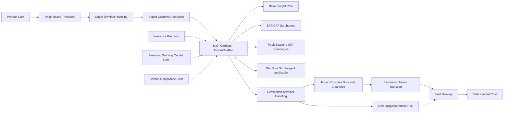

## Costing a Multimodal Shipment End to End

### Overview

Costing a multimodal shipment end to end involves systematically identifying and calculating every cost component across a shipment's full journey — from the seller's origin point through multiple transport modes (e.g., truck, ocean, rail, truck again) to final delivery at the buyer's destination. Unlike single-mode costing, multimodal shipment costing requires reconciling cost structures, documentation, and liability regimes that differ across each mode segment, while also correctly applying the cost allocation defined by the transaction's chosen Incoterm (see Selecting Incoterms for Common Trade Scenarios).

### The Total Landed Cost Framework

**Key Points**

- **Total landed cost (TLC)** is the complete cost of a product delivered to its final destination, encompassing far more than the product's purchase price or freight quote alone.
- A rigorous end-to-end costing exercise typically decomposes total landed cost into distinct categories, each of which may involve multiple line items depending on the specific routing and Incoterm.
- Failing to capture all relevant cost components — particularly accessorial charges and destination-side costs — is one of the most common sources of margin erosion in international trade, since these costs are often less visible at the time of initial quoting than the headline freight rate.

### Cost Component Categories

#### 1. Product/Commercial Cost

- Base unit price of goods as agreed in the commercial invoice.
- Any supplier-side packaging, palletization, or export-preparation costs not already embedded in the unit price.

#### 2. Origin-Side Costs

- **Inland trucking/drayage to origin port or terminal**: Cost of moving goods from the factory/warehouse to the port, airport, or rail terminal where main international carriage begins.
- **Origin terminal handling charges (THC)**: Fees charged by the port/terminal operator for handling the container or cargo at the origin facility.
- **Export customs clearance and documentation fees**: Costs of preparing and filing export declarations, obtaining any required export licenses or certificates.
- **Origin warehousing/consolidation**: If cargo requires temporary storage or consolidation with other shipments before departure.

#### 3. Main Carriage (International Transport) Costs

- **Ocean freight (base rate)**: The core freight rate, typically quoted per container (FCL) or per weight/volume unit (LCL), or per tonne for bulk cargo.
- **Bunker Adjustment Factor (BAF)**: A variable surcharge passed through to shippers reflecting fluctuations in vessel fuel costs, since base freight rates are often negotiated over a period during which fuel costs may change.
- **Currency Adjustment Factor (CAF)**: A surcharge compensating carriers for currency exchange rate fluctuations between the rate-setting currency and the currency of underlying costs.
- **Peak Season Surcharge (PSS)**: Additional charge applied by carriers during periods of high demand relative to available capacity.
- **General Rate Increase (GRI)**: Periodic, broadly applied rate increases carriers implement across a trade lane, distinct from cargo-specific surcharges.
- **War risk / emergency risk surcharges**: Additional premiums applied on lanes transiting designated high-risk zones (see Geopolitical Disruption and Trade Lane Risk for context on when and why these apply).
- **Air freight (if applicable)**: Base air freight rate, typically calculated on the greater of actual weight or **dimensional/volumetric weight** (commonly calculated as length × width × height in cm divided by 6000 for air freight, though the exact divisor can vary by carrier and region), reflecting that low-density, bulky cargo consumes proportionally more aircraft capacity than its actual weight alone suggests.

#### 4. Destination-Side Costs

- **Destination terminal handling charges**: Analogous to origin THC, charged at the arrival port/terminal.
- **Import customs duty and tariffs**: Calculated based on the customs value of goods, applicable tariff classification (HS code), and any preferential trade agreement treatment (or punitive tariffs) applicable to the goods' country of origin.
- **Import customs clearance/brokerage fees**: Fees paid to a licensed customs broker for preparing and filing import documentation.
- **Destination inland transport (final mile)**: Cost of moving goods from the arrival port/terminal/airport to the final delivery destination (warehouse, distribution center, or end customer).
- **Demurrage and detention charges**: Fees incurred if a container is not removed from the terminal (demurrage) or returned empty to the carrier (detention) within the carrier's allotted free time — a frequently underestimated cost category, particularly during port congestion periods.
- **Destination warehousing**: If goods require storage upon arrival before further distribution.

#### 5. Insurance

- **Marine/cargo insurance premium**: Cost of insuring the cargo against loss or damage during transit, whose responsibility (buyer or seller) and minimum coverage level are determined by the chosen Incoterm (CIF and CIP specifically obligate the seller to arrange insurance, at differing minimum coverage standards).

#### 6. Financing and Working Capital Costs

- **Cost of capital tied up in transit inventory**: Longer transit times (a defining characteristic of multimodal, often ocean-dominant, shipments) mean capital is tied up in in-transit inventory for longer, representing a real, though often unaccounted-for, cost.
- **Letter of credit or trade finance fees**: Bank fees associated with financing instruments used to facilitate the transaction, if applicable.

#### 7. Compliance and Risk-Related Costs

- **Tariff/duty risk buffer**: In environments of active trade policy volatility (see Geopolitical Disruption and Trade Lane Risk), some organizations build in a contingency buffer for potential tariff changes affecting goods already in transit or planned for future shipment.
- **Carbon cost/compliance**: Increasingly relevant costs associated with carbon pricing mechanisms (e.g., EU ETS extension to shipping) or voluntary carbon offset purchases tied to the shipment's emissions footprint (see Green Logistics and Freight Carbon Accounting).

### End-to-End Cost Flow Diagram

### Worked Example: Multimodal Shipment Costing

**Example**

Consider a shipment of 500 units of electronic components moving from a factory in Shenzhen to a distribution center in Frankfurt, Germany, via ocean freight to Hamburg followed by rail to Frankfurt (a multimodal routing under a **CIP Frankfurt, Incoterms 2020** term):

| Cost Component | Illustrative Amount (USD) |
| --- | --- |
| Product cost (500 units) | 25,000 |
| Origin trucking (factory to Shenzhen port) | 300 |
| Origin THC | 180 |
| Export customs clearance | 120 |
| Ocean freight base rate (Shenzhen–Hamburg) | 1,800 |
| BAF surcharge | 220 |
| Peak season surcharge | 150 |
| Marine insurance (seller-arranged under CIP) | 95 |
| Destination THC (Hamburg) | 210 |
| Rail freight (Hamburg to Frankfurt) | 340 |
| Import customs duty (illustrative rate applied to customs value) | 1,250 |
| Import clearance/brokerage fee | 180 |
| Final-mile delivery (Frankfurt terminal to DC) | 150 |
| **Total Landed Cost** | **~30,000** |

[Inference: this table illustrates the categories and calculation logic of end-to-end multimodal costing; the specific dollar figures are illustrative placeholders for demonstrating methodology, not sourced current market rates, since actual freight rates, surcharges, and duty rates vary continuously by lane, carrier, commodity, and current market conditions. Always obtain current quotes and applicable duty rates for real transactions.]

### Customs Duty Calculation Methodology

**Key Points**

- Import duty is typically calculated as a percentage of the **customs value** of goods, which is most commonly based on the transaction value (price actually paid or payable) but can include adjustments depending on the applicable Incoterm and destination country's valuation rules.
- Under some Incoterms and jurisdictions, freight and insurance costs incurred before the goods reach the destination country's border may need to be included in the customs value (a "CIF-equivalent" valuation basis), even where the commercial Incoterm itself is not CIF — this valuation and pricing distinction is a frequent source of confusion and requires careful attention to destination-country customs valuation rules specifically, separate from the Incoterm's contractual risk/cost allocation.
- **HS (Harmonized System) code classification** determines the applicable duty rate; misclassification is a common source of costing errors, potential customs penalties, and shipment delays.
- **Preferential trade agreements** (e.g., USMCA, EU trade agreements) can reduce or eliminate duty if the goods meet applicable rules-of-origin requirements and proper documentation is provided (see Nearshoring and Supply Chain Reconfiguration for the strategic implications of rules-of-origin compliance).

### Accessorial and Hidden Cost Considerations

- **Demurrage and detention**: Frequently the largest source of unbudgeted cost overrun in port-congestion scenarios; calculating an accurate cost estimate requires realistic assumptions about free-time windows and potential delay exposure, particularly relevant given the schedule reliability challenges discussed in Geopolitical Disruption and Trade Lane Risk.
- **Container imbalance and repositioning fees**: Some carriers apply surcharges on lanes with structural container imbalances (more containers arriving than departing, or vice versa).
- **Documentation and administrative fees**: Bill of lading issuance fees, telex release fees, and similar per-shipment administrative charges that are individually small but can accumulate meaningfully across high shipment volumes.
- **Currency exchange exposure**: For costs denominated in different currencies across the shipment's journey (e.g., freight quoted in USD, duty assessed in EUR, inland trucking quoted in local destination currency), exchange rate movements between quote and payment dates can materially affect final landed cost, particularly for long transit-time multimodal shipments.

### Technology Support for End-to-End Costing

- **TMS freight audit modules**: As discussed in Transportation Management Systems, freight audit functionality validates that actual invoiced costs match contracted/quoted rates across every cost component, essential for maintaining costing accuracy at scale.
- **Landed cost calculation software**: Specialized modules (often integrated into ERP or dedicated trade compliance platforms) automate HS code lookup, duty rate application, and multi-currency cost aggregation to produce accurate landed cost estimates before shipment, supporting more informed sourcing and pricing decisions.
- **Digital freight booking platforms**: As discussed in Digital Freight Booking and Forwarding Platforms, many platforms now surface an "all-in" quote at time of booking that aggregates base freight and known/estimated surcharges, improving upfront cost visibility compared to traditional itemized quoting processes.

### Benefits of Rigorous End-to-End Costing

- **Accurate margin and pricing decisions**: Understanding true total landed cost, not just headline freight rate, supports more accurate product pricing and margin analysis.
- **Better sourcing and routing decisions**: Comparing total landed cost (not just unit product cost or freight rate alone) across alternative sourcing locations or routing options produces more economically sound decisions, directly relevant to nearshoring/reconfiguration evaluations (see related topic).
- **Reduced budget surprises**: Systematically accounting for accessorial charges, demurrage risk, and currency exposure reduces the frequency and magnitude of unbudgeted cost overruns.
- **Improved negotiating position**: Detailed understanding of cost component structure supports more informed rate negotiation with carriers and forwarders, since shippers can identify which specific surcharges or fee categories are negotiable versus structurally fixed.

### Limitations and Challenges

- **Rate and surcharge volatility**: Ocean freight base rates and surcharges (BAF, PSS, GRI) can change significantly and with limited advance notice, particularly during periods of capacity disruption (see Geopolitical Disruption and Trade Lane Risk), making point-in-time cost estimates potentially unreliable for shipments booked well in advance of actual departure.
- **Customs valuation complexity**: Differing customs valuation rules across destination countries regarding what costs must be included in dutiable value creates genuine complexity for multinational shippers operating across multiple destination markets simultaneously.
- **Demurrage/detention unpredictability**: Given documented port congestion and schedule reliability issues in various current disruption scenarios, accurately forecasting demurrage/detention exposure at the time of initial costing remains inherently difficult.
- **Data fragmentation across cost components**: Different cost components (freight, customs duty, inland transport, insurance) often originate from different systems and providers (carrier invoices, customs broker statements, trucking company invoices), making consolidated, accurate total landed cost tracking an ongoing data integration challenge for many organizations. [Inference: given this fragmentation, organizations without integrated landed-cost software are likely to underestimate true total landed cost more often than they overestimate it, since accessorial and destination-side charges are structurally easier to overlook than the headline freight quote.]

### Comparison: Cost Visibility by Costing Approach

| Approach | Cost Components Captured | Accuracy | Typical Use Case |
| --- | --- | --- | --- |
| Freight quote only | Base freight rate, sometimes major surcharges | Low | Preliminary/rough budgeting |
| Freight plus known surcharges | Base rate, BAF/CAF/PSS, THC | Moderate | Standard commercial quoting |
| Full landed cost model | All categories including duty, brokerage, inland transport, insurance, financing | High | Sourcing decisions, pricing strategy, margin analysis |

### Related Topics

- Selecting Incoterms for common trade scenarios (cost allocation basis for end-to-end costing)
- Digital freight booking and forwarding platforms (all-in quoting functionality)
- Transportation Management Systems (freight audit and cost validation)
- Green logistics and freight carbon accounting (carbon cost as an emerging landed cost component)
- Nearshoring and supply chain reconfiguration (total cost of ownership comparison across sourcing options)
- Customs valuation methodology and HS code classification
- Trade finance and letter of credit cost structures