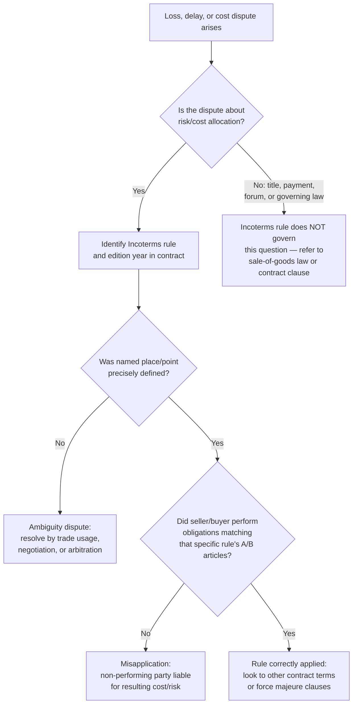

## Case Studies in Incoterms Disputes and Misapplication

### Purpose and Scope

This reference documents recurring patterns of Incoterms® disputes and misapplication drawn from arbitration commentary, ICC guidance, and documented trade practice. Incoterms rules govern the allocation of cost, risk, and delivery obligations between buyer and seller — they do **not** govern transfer of title, payment terms, or dispute resolution mechanisms, and a large share of real-world disputes originate precisely from parties assuming otherwise. Each case study below isolates a specific failure mode, the underlying rule mechanics, and the resolution or best-practice correction.

### Foundational Misconception: What Incoterms Rules Do Not Cover

**Key Points**

- Incoterms rules do not address transfer of ownership/title — this is governed by the underlying sale of goods law or contract terms.
- Incoterms rules do not specify price, currency, or payment method.
- Incoterms rules do not constitute a complete contract of sale — they are incorporated by reference into one.
- Incoterms rules do not override mandatory carriage, insurance, or customs law of the relevant jurisdictions.
- Incoterms rules do not specify dispute resolution forum or governing law.

[Inference] A large proportion of "Incoterms disputes" are, on close reading, not disputes about the rule itself but disputes arising because the parties expected the Incoterms rule to perform a function it was never designed to perform (e.g., transferring title, fixing the payment trigger, or resolving jurisdiction).

### Case Study 1: FOB Risk Transfer Ambiguity Pre-Incoterms 2010

**Scenario**

Under Incoterms 2000 and earlier, FOB (Free on Board) risk transferred when goods passed the ship's rail. In practice, container cargo is not loaded "over the rail" — it is craned into a stacked container yard and later loaded onto the vessel by terminal operators, making the precise moment of rail-passage physically undeterminable and commercially meaningless for containerized trade.

**Dispute pattern**

A cargo loss or damage event occurred between the time goods were delivered to the terminal and the time they were physically placed aboard the vessel. Buyer and seller each argued the other bore risk, because "passing the ship's rail" could not be evidenced for a containerized shipment that was never individually craned over a rail.

**Resolution / correction**

Incoterms 2010 replaced the "ship's rail" standard with the rule that risk transfers **when goods are delivered on board the vessel** — a clearer, evidentially verifiable point tied to loading completion rather than a physical boundary that does not exist for containerized cargo. Incoterms 2010 (and subsequent editions) also explicitly recommended **FCA (Free Carrier)** rather than FOB for containerized shipments, since FCA transfers risk at the seller's premises or a named terminal rather than at the ship's side, matching how containerized cargo is actually handed off to carriers.

[Inference] Cases citing this ambiguity are now largely historical (pre-2010 contracts), but the underlying lesson — that FOB is frequently misapplied to containerized cargo when FCA is the mechanically correct rule — remains one of the most common misapplication patterns still seen in current contracts.

### Case Study 2: CIF/CIP Insurance Coverage Mismatch

**Scenario**

Under CIF (Cost, Insurance and Freight) and CIP (Carriage and Insurance Paid To), the seller is obligated to procure insurance for the buyer's benefit, but the *level* of cover required differs by rule version and by which Incoterms edition governs the contract.

**Dispute pattern**

A buyer receives damaged goods and files an insurance claim, only to discover the seller purchased minimum-coverage insurance (Institute Cargo Clauses (C) — covering only named, catastrophic perils) rather than broader coverage, and the loss event (e.g., water damage from ordinary handling) falls outside the covered perils.

**Rule mechanics**

- Under **Incoterms 2010 and 2020, CIF** requires the seller to obtain insurance at a **minimum** level equivalent to Institute Cargo Clauses (C) unless the parties agree otherwise.
- **Incoterms 2020 changed the default for CIP**: sellers under CIP must now obtain insurance at the **higher** Institute Cargo Clauses (A) level (all-risks, subject to standard exclusions) unless the parties agree a lower level — a deliberate divergence from CIF introduced specifically because CIP is more common in manufactured-goods and multimodal trade where buyers expect broader default cover.

**Resolution / correction**

The dispute typically resolves by reference to which Incoterms edition and rule was actually incorporated into the contract, and whether the parties varied the default insurance clause in writing. [Inference] Because CIF and CIP now carry *different* default insurance levels under Incoterms 2020 — a change from the uniform minimum-cover default in earlier editions — contracts silently rolled over from a prior edition without re-checking the applicable default are a recurring source of coverage-gap disputes.

**Practical correction clause**

Contracts should state explicitly: *"Insurance under [CIF/CIP] shall be procured at [Institute Cargo Clauses (A)/(B)/(C)] level, naming [Buyer] as beneficiary, for not less than [110%] of the CIF/CIP value."*

### Case Study 3: DDP Customs and Tax Liability Miscalculation

**Scenario**

Under DDP (Delivered Duty Paid), the seller bears maximum obligation — delivering goods cleared for import, with all duties and taxes paid, to the buyer's named destination.

**Dispute pattern**

A seller unfamiliar with the buyer's country VAT/GST registration requirements quotes and contracts under DDP without being registered as an importer of record in the destination country. On arrival, customs authorities refuse clearance because the seller cannot be named as importer of record without local tax registration, causing demurrage charges, storage fees, and delivery delays. The buyer and seller then dispute who bears the resulting costs, since DDP nominally places this obligation entirely on the seller, but the seller argues the buyer failed to disclose a local requirement.

**Resolution / correction**

ICC guidance consistently flags DDP as the rule sellers most frequently misapply by underestimating destination-country import complexity, particularly VAT-registration regimes (e.g., EU import VAT, UK post-Brexit import VAT) that require a local fiscal representative or registration the seller may not hold. The corrective practice is:

- Sellers should not quote DDP into a jurisdiction where they lack import registration/fiscal representation, defaulting instead to **DAP (Delivered at Place)** or **DPU (Delivered at Place Unloaded)**, which leave import clearance and duties to the buyer.
- Where DDP is used, the contract should explicitly allocate responsibility for import VAT distinctly from customs duties, since some jurisdictions treat these as legally separate obligations even though DDP text bundles "duties and taxes" together.

### Case Study 4: DAT/DPU Terminal Definition Confusion (Incoterms 2010 → 2020 Transition)

**Scenario**

Incoterms 2010 included **DAT (Delivered at Terminal)**, requiring the seller to deliver and unload goods at a named terminal. Incoterms 2020 renamed and broadened this rule to **DPU (Delivered at Place Unloaded)**.

**Dispute pattern**

Contracts drafted before 2020 but performed after 1 January 2020 (the Incoterms 2020 effective date) referenced "DAT" by name. Because DAT is not a defined term under Incoterms 2020, disputes arose over whether the parties' obligations should be interpreted under 2010 DAT mechanics or reinterpreted as DPU, and whether the named delivery point qualified as a "terminal" (2010 language) versus "any place" (2020 language, which is broader and includes non-terminal locations such as a project site).

**Resolution / correction**

The determining factor is **explicit incorporation**: a contract that states "DAT Incoterms 2010" is unambiguously governed by the 2010 definition of a terminal-only delivery point, regardless of the fact that ICC no longer publishes DAT. The dispute risk arises specifically from contracts that reference "DAT" without an edition year, or that use "DAT" in contracts formed after 2020 (post-dating the rule's retirement), creating interpretive ambiguity about which rule set governs.

**Practical correction**

Always cite the Incoterms edition year explicitly (e.g., "DPU Rotterdam Terminal, Incoterms® 2020") — never cite a bare rule abbreviation without a year, since ICC maintains multiple historical editions in parallel and none automatically supersedes another in a signed contract.

### Case Study 5: EXW and the Export Clearance Gap

**Scenario**

Under EXW (Ex Works), the seller's only obligation is to make goods available at their own premises; the buyer bears all subsequent risk, cost, and responsibility — including **export clearance** in the seller's own country.

**Dispute pattern**

A buyer arranges their own freight collection under EXW, but the seller's country requires export declarations, licenses, or security data (e.g., EU Advance Cargo Information requirements) that only the seller, as the exporting party of record, is legally capable of filing. The buyer's carrier is unable to complete export clearance without seller cooperation, causing shipment delays, and the buyer argues the seller has a duty to assist despite EXW nominally placing that burden entirely on the buyer.

**Resolution / correction**

ICC's official commentary on Incoterms 2020 explicitly recommends **against** using EXW for cross-border trade specifically because of this structural problem: many countries' export procedures cannot legally be completed by the buyer or an agent lacking standing as the domestic exporter of record. The ICC-recommended alternative for cross-border transactions is **FCA (Free Carrier)**, under which the seller retains the export-clearance obligation while still handing off goods at an early point (e.g., their own premises), better matching legal reality than EXW.

[Inference] Because EXW's misapplication in international (rather than domestic) trade is a rule-design issue rather than a contract-drafting error, correcting it typically requires renegotiating the Incoterms rule itself rather than adding clarifying language to an EXW clause.

### Case Study 6: FCA and the On-Board Bill of Lading Problem (Documentary Credit Conflict)

**Scenario**

Under FCA, risk and delivery occur when goods are handed to the carrier — which, for containerized sea freight, is typically at an inland container yard or the seller's premises, well before the goods are physically loaded onto the vessel. However, a letter of credit frequently requires the seller to present an **on-board bill of lading** (evidencing loading) to receive payment from the buyer's bank.

**Dispute pattern**

A seller delivers goods to the carrier under FCA terms (completing their delivery obligation and transferring risk), but the carrier does not issue the on-board bill of lading until days later, once the vessel actually sails. The seller cannot present a compliant on-board B/L to the bank until that later date, creating a cash-flow gap and, in disputed cases, triggering a documentary discrepancy rejection under UCP 600 because the bill of lading's "on-board" date falls after the letter of credit's shipment deadline.

**Resolution / correction**

Incoterms 2020 specifically addressed this known conflict by adding an **optional mechanism**: parties using FCA in a documentary credit context may agree that the buyer instructs the carrier to issue an on-board bill of lading to the seller, who can then present it to the bank, even though risk transferred earlier under FCA mechanics. This is a contractual add-on to FCA, not an automatic feature — it must be explicitly agreed and reflected in the carriage contract instructions.

**Practical correction clause**

*"The parties agree that, notwithstanding delivery under FCA at [named place], Buyer shall instruct the carrier to issue an on-board bill of lading to Seller after loading is completed, pursuant to Incoterms® 2020 FCA A6/B6."*

### Case Study 7: Incoterms vs. UCP 600 (Documentary Credit) Conflict of Authority

**Scenario**

A sale contract specifies CIF Incoterms 2020, but the letter of credit issued under the same transaction contains documentary requirements (e.g., requiring a specific date format, additional certificates, or an insurance level) that differ from or contradict the CIF rule's default obligations.

**Dispute pattern**

The seller presents documents compliant with the *Incoterms* CIF obligation, but the bank rejects the presentation as discrepant against the *letter of credit's* wording, because banks examine documents strictly against the credit's terms under UCP 600 — not against the underlying Incoterms rule, which the bank is not a party to.

**Resolution / correction**

[Inference] This is a structural rather than an interpretive dispute: Incoterms rules govern the buyer-seller relationship, while UCP 600 governs the bank-seller (beneficiary) relationship under the credit — they are legally independent frameworks, and a bank has no obligation to honor Incoterms-based arguments when examining documents. The correction is procedural: the letter of credit must be drafted to mirror the sale contract's Incoterms obligations exactly (insurance level, document types, deadlines), since any divergence is resolved in the bank's favor under the credit's own terms, irrespective of what the underlying Incoterms rule required.

### Case Study 8: Named Place Ambiguity Across Multiple Rules

**Scenario**

Applies across CPT, CIP, DAP, DPU, and DDP: each rule requires a "named place of destination," but contracts frequently name only a city or region rather than a precise, single point.

**Dispute pattern**

A contract states "DAP Hamburg, Incoterms 2020." On arrival, a dispute arises over whether "Hamburg" means the port terminal, an inland warehouse, or the buyer's factory within the greater Hamburg area — each location carrying different unloading, demurrage, and risk-transfer consequences. Because DAP places risk transfer at the named place *before* unloading, an imprecise named place directly changes which party bears risk during the final movement leg.

**Resolution / correction**

ICC guidance consistently recommends naming the **most precise point practically possible** — a specific address, terminal code, or berth — rather than a city name, precisely because risk transfer under D-rules (DAP, DPU, DDP) is pinned to arrival at that named place. Where only a general area can be named at contract signature, the contract should include a mechanism for the parties to confirm the precise point in writing before shipment.

### Comparative Summary Table

| Case Study | Rule(s) Involved | Root Cause | Corrective Practice |
| --- | --- | --- | --- |
| 1 | FOB (pre-2010) | Physically undeterminable risk-transfer point for containers | Use FCA for containerized cargo |
| 2 | CIF / CIP | Differing default insurance levels (Institute Cargo Clauses) | Explicit insurance-level clause; check edition year |
| 3 | DDP | Seller lacks destination import/tax registration | Use DAP/DPU, or confirm registration before quoting DDP |
| 4 | DAT → DPU | Contract cites retired 2010 term without edition year | Always cite Incoterms edition year explicitly |
| 5 | EXW | Buyer cannot legally complete seller-country export clearance | Use FCA for cross-border trade |
| 6 | FCA | On-board B/L needed for documentary credit, but FCA delivery occurs earlier | Add explicit on-board B/L instruction clause (2020 mechanism) |
| 7 | CIF + UCP 600 | Incoterms and documentary credit are legally independent frameworks | Mirror Incoterms obligations exactly in the L/C wording |
| 8 | CPT/CIP/DAP/DPU/DDP | Named place too imprecise | Name a specific point, not a general city/region |

### Dispute Resolution Flow (Conceptual)

### Preventive Drafting Checklist

**Key Points**

- Always cite the Incoterms rule **with its edition year** (e.g., "FCA Incoterms® 2020"), never a bare abbreviation.
- Name the **most precise delivery/destination point** practically achievable, not a city or region alone.
- For CIF/CIP, state the **specific insurance clause level** required rather than relying on the rule's default.
- Confirm the seller's or buyer's legal capacity to complete customs/tax obligations in the relevant jurisdiction **before** selecting EXW or DDP.
- Where a letter of credit is used, ensure its documentary requirements are drafted to **mirror** the sale contract's Incoterms obligations exactly.
- Do not assume Incoterms rules govern title transfer, payment terms, or dispute forum — these require separate, explicit contract clauses.
- For containerized cargo, default to FCA/CPT/CIP family rules rather than FOB/CFR/CIF family rules, per ICC's own guidance.

**Next Steps**

- Study UCP 600 documentary credit examination standards and their interaction with Incoterms-based delivery obligations
- Review ICC's official Incoterms® 2020 rule-by-rule commentary for each A1–A10/B1–B10 obligation set
- Examine arbitration case digests (ICC International Court of Arbitration) for contract-drafting patterns in disputed international sale contracts
- Study the CISG (UN Convention on Contracts for the International Sale of Goods) and its interaction with Incoterms rules regarding risk transfer and non-conformity
- Review jurisdiction-specific import VAT/fiscal representative regimes relevant to DDP contracts (EU, UK post-Brexit models)