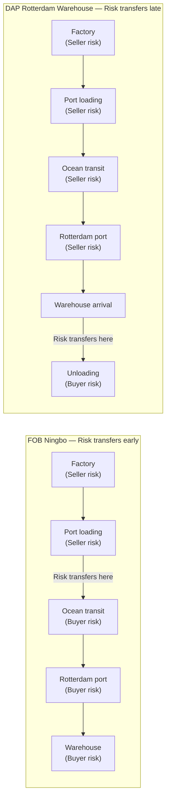
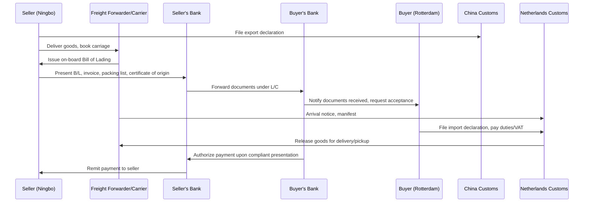

## Simulated Import and Export Shipment Walkthrough

### Purpose and Scope

This walkthrough simulates a complete international shipment from contract formation through final delivery, tracing every decision point where Incoterms® rules, logistics execution, customs procedures, and financial instruments interact. The simulation uses a single, consistent scenario across two rule variants (FOB and DAP) to demonstrate how the same physical shipment produces materially different obligations, cost allocations, and risk exposure depending on the rule selected.

### Simulation Parameters

**Key Points**

- **Seller**: Manufacturer in Ningbo, China (exporter)
- **Buyer**: Distributor in Rotterdam, Netherlands (importer)
- **Goods**: 500 units of industrial pumps, containerized (1 x 40ft FCL), declared value $180,000
- **Transport mode**: Ocean freight, Ningbo → Rotterdam, with inland pre-carriage (factory to port) and on-carriage (port to warehouse)
- **Payment mechanism**: Documentary Letter of Credit (L/C), issued by buyer's bank, confirmed by seller's bank
- **Rules simulated**: (A) FOB Ningbo, Incoterms® 2020; (B) DAP Rotterdam Warehouse, Incoterms® 2020

### Walkthrough A: FOB Ningbo, Incoterms® 2020

**Stage 1 — Contract Formation**

The sale contract specifies: *"FOB Ningbo Port, Incoterms® 2020."* The L/C is opened referencing this term and requires presentation of a clean on-board bill of lading, commercial invoice, packing list, and certificate of origin within 21 days of shipment.

[Inference] Because FOB was designed for break-bulk/conventional cargo where goods are craned directly over a ship's rail, its use here for a full-container-load (FCL) shipment is a common but technically imprecise application — the ICC's own commentary recommends FCA for containerized cargo, a substitution point worth flagging even though FOB remains contractually valid if both parties consent.

**Stage 2 — Export-Side Execution (Seller's Obligations)**

1. Seller manufactures and packs goods, arranges pre-carriage trucking from the Ningbo factory to the container yard.
2. Seller (or its customs broker) files the **export customs declaration** in China, since under FOB the seller retains export clearance responsibility (A2/B2 of the FOB rule).
3. Seller books ocean freight space, but the **contract of carriage is between the seller and the carrier only up to the point of loading** — under FOB, the seller's carriage-contracting obligation does not extend to Rotterdam; the buyer is responsible for nominating and contracting the ocean carrier.
4. Container is loaded onto the vessel at Ningbo port. **Risk transfers to the buyer at the moment goods are delivered on board the vessel** (Incoterms 2020 FOB A2/A3), not at "ship's rail" as under pre-2010 editions.
5. Carrier issues an **on-board bill of lading**, naming the seller as shipper. Seller presents this B/L, invoice, packing list, and certificate of origin to its bank for negotiation under the L/C.

**Stage 3 — Documentary Credit Examination**

Seller's bank examines documents strictly against the L/C's terms under **UCP 600**, independent of the underlying FOB obligations. [Inference] If the B/L's on-board date falls after the L/C's latest shipment date, the bank will reject the presentation as discrepant regardless of whether the goods physically shipped on time — a recurring friction point distinct from the Incoterms rule itself.

**Stage 4 — Ocean Transit and Risk Exposure**

Because risk transferred at loading (Stage 2, step 4), the buyer bears risk of loss or damage during the entire ocean transit, even though the seller may still be handling documentary presentation. If cargo is damaged mid-voyage, the buyer's marine cargo insurance (which the buyer must independently arrange under FOB, since FOB carries no seller insurance obligation) is the buyer's sole recourse.

**Stage 5 — Import-Side Execution (Buyer's Obligations)**

1. Buyer's freight forwarder (nominated by the buyer, since the buyer controls carriage from FOB point onward) tracks the vessel and arranges destination handling.
2. On arrival at Rotterdam, buyer or its customs broker files the **import customs declaration**, pays **import VAT and any applicable duties**, since the seller has no import-side obligation under FOB.
3. Buyer arranges on-carriage trucking from Rotterdam port to its own warehouse.
4. Buyer takes physical possession; the transaction is complete.

**Cost and Risk Allocation Summary (FOB)**

| Activity | Responsible Party |
| --- | --- |
| Export packing, pre-carriage to port | Seller |
| Export customs clearance | Seller |
| Loading onto vessel | Seller (cost and risk until loaded) |
| Main carriage (ocean freight) contract | Buyer |
| Marine insurance | Buyer (not obligated on seller; buyer's choice) |
| Risk during ocean transit | Buyer |
| Import customs clearance, duties, VAT | Buyer |
| On-carriage to final warehouse | Buyer |

### Walkthrough B: DAP Rotterdam Warehouse, Incoterms® 2020

**Stage 1 — Contract Formation**

The same underlying shipment is instead contracted as *"DAP [Buyer's Warehouse Address], Rotterdam, Incoterms® 2020."* Note the named place is a **specific address**, not merely "Rotterdam," directly addressing the named-place ambiguity risk common to D-rules.

**Stage 2 — Export-Side and Main Carriage Execution (Seller's Obligations)**

1. Seller arranges and pays for pre-carriage, export clearance, ocean freight booking, and the **entire main carriage contract through to the named warehouse** — under DAP, the seller bears cost and organizational responsibility for the full journey.
2. Seller may voluntarily insure the cargo for its own risk protection (DAP carries no *mandatory* insurance obligation to the buyer, unlike CIF/CIP, but the seller bears risk for the full transit, creating a strong practical incentive to self-insure).
3. Container ships from Ningbo; **risk remains with the seller throughout ocean transit**, on-carriage, and up to the point of arrival at the buyer's named warehouse — a materially different risk profile than FOB, where risk transferred at origin loading.

**Stage 3 — Import Customs Clearance (Split Obligation Under DAP)**

Critically, **DAP does not include import clearance** — this remains the buyer's obligation even though the seller is delivering all the way to the buyer's warehouse. The buyer must:

1. File the import customs declaration in the Netherlands.
2. Pay import VAT and any applicable duties.
3. Coordinate with the seller's carrier/forwarder so that customs clearance is completed **before** the goods can be "placed at the buyer's disposal" at the named place, since DAP delivery is only complete once goods are ready for unloading, cleared for import.

[Inference] This split — seller bears full transport risk and cost to the door, but buyer bears import clearance — is a frequent source of confusion with DDP, where the seller bears *both*; contracts and operational teams unfamiliar with the DAP/DDP distinction risk assuming the seller will clear customs when the rule does not require it.

**Stage 4 — Arrival and Unloading**

1. Seller's carrier arrives at the buyer's warehouse address.
2. **Risk transfers to the buyer when the goods are made available for unloading** at the named place — the seller is not responsible for the unloading operation itself under DAP (contrast with DPU, where the seller bears unloading).
3. Buyer takes possession and unloads the container.

**Cost and Risk Allocation Summary (DAP)**

| Activity | Responsible Party |
| --- | --- |
| Export packing, pre-carriage, export clearance | Seller |
| Main carriage (ocean freight) contract and cost | Seller |
| Risk during ocean transit and on-carriage | Seller |
| Insurance | Neither mandated; seller has practical incentive to insure given risk exposure |
| Import customs clearance, duties, VAT | Buyer |
| Unloading at destination | Buyer |
| Risk transfer point | Arrival, ready for unloading, at named warehouse |

### Comparative Risk-Transfer Timeline

### Document Flow Across Both Scenarios

[Unverified — illustrative only] The sequence diagram above is a representative simplification of a typical L/C-backed FOB/DAP transaction; actual document flow varies by bank, freight forwarder, and whether the L/C is confirmed, transferable, or negotiated at sight versus usance.

### Key Decision Points Where Rule Choice Materially Changes Outcomes

**Key Points**

- **Insurance responsibility**: Neither FOB nor DAP mandates insurance (unlike CIF/CIP) — under both, the party bearing risk during a given leg has the practical incentive to insure, but no contractual obligation compels it unless separately agreed.
- **Carriage contracting party**: Under FOB, the buyer must nominate the ocean carrier; under DAP, the seller does. This determines who has commercial leverage over freight rates, routing, and carrier selection.
- **Customs clearance split**: FOB places export clearance on the seller and import clearance on the buyer; DAP places export clearance **and full carriage** on the seller, but import clearance remains with the buyer in both cases — the seller's added scope under DAP is transport, not customs.
- **Named place precision**: FOB's named place (Ningbo Port) is a departure point; DAP's named place (buyer's warehouse) is an arrival point — imprecision in either creates different failure modes (departure-side disputes over loading completion vs. arrival-side disputes over what "the named place" actually means).

### Common Simulation Errors to Flag

**Example**

A learner incorrectly assumes that under DAP, the seller also handles import customs clearance because the seller is delivering "to the door." This is the DAP/DDP confusion pattern: DAP delivers to a named place without import clearance, while only **DDP** extends the seller's obligation to include cleared, duty-paid delivery. Simulating DAP with seller-side customs clearance produces an operationally impossible scenario, since the carrier cannot release goods from the port without a completed import declaration, which under DAP only the buyer is entitled and obligated to file.

**Example**

A learner assumes FOB automatically requires the seller to insure the cargo because "the seller is responsible until loading." Insurance and risk are distinct concepts: risk allocation determines who bears loss if damage occurs, while insurance is a separate, non-mandatory (under FOB/DAP/DPU/EXW/FCA/CPT) risk-management choice. Only CIF and CIP carry a mandatory seller insurance obligation.

### Next Steps

**Next Steps**

- Re-run this simulation substituting CIF Rotterdam Port to compare mandatory insurance obligations against the FOB/DAP scenarios above
- Re-run substituting DDP Rotterdam Warehouse to contrast full seller-side customs responsibility against the DAP split obligation demonstrated here
- Model the same shipment with an air freight leg substituted for ocean freight, and identify which Incoterms rules become operationally inappropriate (e.g., FOB/FAS/CFR/CIF are designed for sea/inland waterway transport only)
- Build a cost-allocation spreadsheet simulation varying Incoterms rule choice against a fixed total landed cost, to quantify commercial impact of rule selection on buyer vs. seller net cost
- Study how a single discrepancy in the bill of lading's on-board date affects L/C payment timing under UCP 600, independent of the Incoterms rule governing the sale