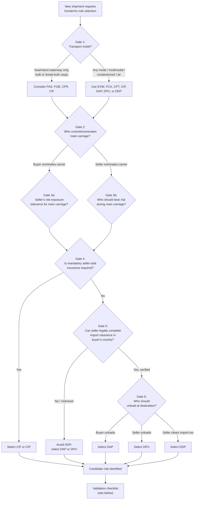

## Building a Logistics Mode and Incoterm Decision Framework

### Purpose and Scope

A decision framework converts the descriptive knowledge of individual Incoterms rules and transport modes into a repeatable, defensible process for selecting the *correct* rule and mode combination for a given transaction. This reference builds that framework as a sequence of decision gates, each resolving one variable (transport mode, risk appetite, customs capability, cost structure) before the next gate is evaluated, culminating in a validated rule selection plus a documentation checklist.

### Why a Framework Is Needed

**Key Points**

- Incoterms rules are frequently selected by habit or precedent ("we always use FOB") rather than by evaluating fit against the specific shipment's transport mode, party capabilities, and risk tolerance.
- The rule groupings themselves already encode a mode constraint: **FAS, FOB, CFR, and CIF are restricted to sea and inland waterway transport only**; using them for multimodal or air shipments is a structural misapplication regardless of commercial intent.
- The remaining rules — **EXW, FCA, CPT, CIP, DAP, DPU, DDP** — are mode-neutral and apply to any transport mode, including multimodal combinations.
- [Inference] A structured framework reduces the two dominant error classes documented in Incoterms disputes: mode-mismatched rule selection (e.g., FOB for air freight) and capability-mismatched rule selection (e.g., DDP into a jurisdiction where the seller cannot register as importer of record).

### Framework Overview

### Gate 1: Transport Mode Constraint

**Key Points**

- This gate is non-negotiable and eliminates entire rule families before any commercial negotiation occurs.
- **Sea/inland waterway only**: FAS (Free Alongside Ship), FOB (Free on Board), CFR (Cost and Freight), CIF (Cost, Insurance and Freight) — all four are defined around a vessel's side or deck as the operative risk-transfer point, which has no equivalent in air, rail, or road transport.
- **Any mode, including multimodal**: EXW, FCA, CPT, CIP, DAP, DPU, DDP — these rules define risk transfer at a location or handoff event rather than a vessel-specific point, making them usable regardless of how many transport legs or modes the shipment involves.
- **Common error**: selecting FOB or CIF for a shipment that will move by air or by multimodal container transport is a structural mismatch — even if commercially agreed, it creates the same ambiguity problems documented in FOB-container disputes, since there is no ship's side or vessel deck in the transaction.

**Decision rule**: If the shipment moves exclusively by sea or inland waterway **and** involves bulk/break-bulk cargo (not containerized), the sea/waterway-only rules remain viable candidates. If the shipment is containerized, multimodal, or involves any air/rail/road leg, restrict candidates to the seven mode-neutral rules.

### Gate 2: Main Carriage Control

**Key Points**

- Determines whether the **buyer** or the **seller** contracts with and nominates the main carrier — this has commercial consequences (freight rate leverage, routing control, carrier relationship) independent of risk allocation.
- **Seller nominates carriage**: CPT, CIP, DAP, DPU, DDP, CFR, CIF — the seller arranges and pays for carriage to a named destination or port.
- **Buyer nominates carriage**: EXW, FCA, FAS, FOB — the seller's obligation ends at or near origin, and the buyer arranges the onward transport.
- [Inference] A party with in-house freight-management expertise or existing carrier contracts often prefers to retain carriage control regardless of risk-allocation preference, meaning Gate 2 is frequently resolved by operational capability rather than by risk appetite alone.

### Gate 3: Risk Allocation During Main Carriage

**Key Points**

- Once carriage control is fixed (Gate 2), the remaining question is which party bears **risk** — not cost — during the main transport leg, since these are separable under the C-rules (CPT, CIP, CFR, CIF): the seller pays for carriage but risk still transfers early (at origin loading/handover), not at destination.
- This is the single most misunderstood mechanic in the C-rule family: **paying for carriage does not mean bearing risk for carriage**. Under CIF, for example, the seller pays freight and insurance to the destination port, but risk transfers to the buyer once goods are loaded at the origin port — the buyer bears transit risk even though the seller is paying for that transit.
- **D-rules (DAP, DPU, DDP)** are the only rules where the seller bears both cost and risk for the entire main carriage through to the named destination.

**Decision rule**: If risk should logically follow cost responsibility all the way to destination (e.g., buyer wants zero risk exposure until physical receipt), select a D-rule. If cost and risk should be deliberately split (seller pays freight but buyer's insurer/risk management should own transit risk from an earlier point), select a C-rule.

### Gate 4: Mandatory Insurance Requirement

**Key Points**

- Only **two rules carry a mandatory seller-side insurance obligation**: CIF (minimum Institute Cargo Clauses (C) level by default) and CIP (minimum Institute Cargo Clauses (A) level by default under Incoterms 2020 — a deliberately higher default than CIF).
- All other rules — including the D-rules — carry **no mandatory insurance obligation** on either party by default; whichever party bears risk during a given leg has practical incentive to insure, but no rule compels it absent a separate contractual clause.
- **Decision rule**: If the buyer requires contractually guaranteed insurance coverage procured by the seller (rather than relying on the seller's discretion or the buyer's own arrangement), select CIF (sea/waterway only) or CIP (any mode). Otherwise, proceed to Gate 5 with the cost/risk-appropriate rule already identified from Gates 2–3.

### Gate 5: Import Clearance Capability

**Key Points**

- This gate exists specifically to prevent the DDP-misapplication pattern documented in Incoterms dispute case studies: a seller contractually obligated to clear import customs in a country where it holds no import registration, VAT/fiscal representation, or legal standing as importer of record.
- **Verification required before selecting DDP**: Does the seller (or its agent) hold, or can it obtain before shipment, the necessary import registration, tax representation, and customs broker relationship in the buyer's country?
- If verification is uncertain or negative, DDP should be eliminated as a candidate regardless of commercial preference, and the framework should default to DAP or DPU, leaving import clearance with the buyer, who by definition has domestic standing to complete it.

**Decision rule**: Yes/verified → DDP remains a candidate (proceed to Gate 6 for unloading allocation, since DDP still requires resolving who unloads, though DDP's default does not include unloading unless separately agreed). No/unknown → eliminate DDP, proceed to Gate 6 with DAP/DPU as candidates only.

### Gate 6: Unloading Responsibility at Destination

**Key Points**

- Distinguishes the three D-rules from each other on a single variable: who performs unloading at the named place.
- **DAP (Delivered at Place)**: seller delivers, ready for unloading; **buyer unloads**.
- **DPU (Delivered at Place Unloaded)**: **seller unloads** — the only Incoterms rule requiring the seller to perform unloading, making it the appropriate choice when the seller controls destination-handling equipment/labor (e.g., project cargo delivered to a site with seller-arranged cranage).
- **DDP (Delivered Duty Paid)**: unloading is not included by default (same as DAP) — DDP's distinguishing feature is import clearance and duty payment, not unloading; a common misconception is assuming DDP bundles unloading responsibility, which it does not unless separately agreed.

**Decision rule**: If the buyer has equipment/labor to unload (typical for standard container deliveries to a buyer's own warehouse), select DAP. If the seller controls destination unloading (e.g., specialized machinery, project-site delivery), select DPU. Layer DDP on top of either only if Gate 5 confirmed seller import-clearance capability.

### Consolidated Decision Table

| Gate | Question | Sea/Waterway-Only Path | Mode-Neutral Path |
| --- | --- | --- | --- |
| 1 | Transport mode | Bulk/break-bulk, sea only | Any mode, incl. multimodal/air |
| 2 | Who nominates carriage | Buyer (FAS/FOB) or Seller (CFR/CIF) | Buyer (EXW/FCA) or Seller (CPT/CIP/DAP/DPU/DDP) |
| 3 | Risk vs. cost split | CIF/CFR: seller pays, buyer bears transit risk | CPT/CIP: seller pays, buyer bears transit risk; D-rules: seller bears both |
| 4 | Mandatory insurance | CIF: ICC (C) minimum | CIP: ICC (A) minimum |
| 5 | Seller import-clearance capability | N/A (import clearance always buyer's under sea/waterway-only rules) | Required only if DDP is being considered |
| 6 | Unloading responsibility | N/A (not applicable to origin-risk rules) | DAP: buyer / DPU: seller / DDP: neither by default |

### Validation Checklist (Post-Selection)

**Key Points**

- Confirm the Incoterms rule is cited **with its edition year** (e.g., "CIP Incoterms® 2020"), never as a bare abbreviation.
- Confirm the **named place/point** is as precise as practically possible (specific address or terminal, not a city name alone), since risk-transfer disputes cluster around imprecise named places.
- If a C-rule (CPT/CIP/CFR/CIF) was selected, confirm both parties understand that **cost responsibility and risk transfer occur at different points** — this should be stated plainly in any internal training material or contract summary to prevent the "seller paid for it, so seller must be liable" misconception.
- If CIF or CIP was selected, confirm the **insurance clause level** is explicitly stated in the contract rather than left to the rule's default, particularly given the CIF/CIP default divergence introduced in Incoterms 2020.
- If DDP was selected, confirm written evidence of the seller's import registration/fiscal representation in the buyer's country **before** contract signature, not after shipment.
- If a letter of credit or other documentary credit is used, confirm the credit's documentary requirements **mirror** the selected Incoterms rule's obligations exactly, since UCP 600 examination is independent of the underlying Incoterms rule.

### Worked Example: Applying the Framework

**Example**

A German machinery manufacturer is shipping a single oversized generator to a mining site in Zambia (landlocked, road delivery required from the nearest port) using a multimodal sea-plus-road route. The buyer has no import-clearance infrastructure in Zambia and has explicitly requested the seller handle the entire door-to-site delivery, including unloading with seller-arranged heavy-lift equipment at the remote site.

- **Gate 1**: Multimodal (sea + road), so sea/waterway-only rules are eliminated. Candidates: EXW, FCA, CPT, CIP, DAP, DPU, DDP.
- **Gate 2**: Buyer wants seller to manage the entire route, so seller nominates carriage. Candidates: CPT, CIP, DAP, DPU, DDP.
- **Gate 3**: Buyer wants zero risk exposure until physical site delivery (remote location, no in-house risk management capability at the mine site). Candidates narrow to D-rules: DAP, DPU, DDP.
- **Gate 4**: No mandatory insurance requirement stated by the buyer; seller will self-insure for its own risk protection given D-rule risk exposure. Gate does not eliminate any D-rule candidate.
- **Gate 5**: Buyer explicitly has no import-clearance capability and wants seller to handle it. Verification confirms seller's Zambia-registered subsidiary can act as importer of record. DDP remains viable.
- **Gate 6**: Buyer explicitly requested seller-arranged heavy-lift unloading at the remote site. This is DPU's defining feature (seller unloads) — but the buyer also wants import clearance handled, which is DDP's defining feature, and unloading is not included in DDP by default.
- **Resolution**: Select **DDP with an explicit supplementary unloading clause**, since no single named Incoterms rule combines both mandatory import clearance (DDP) and mandatory unloading (DPU) — Incoterms rules are not combinable, so the additional obligation must be added as an express contract term layered on top of DDP.

**Output**: *"DDP [Mine Site Address], Zambia, Incoterms® 2020, with Seller additionally responsible for unloading at the named place per Clause [X] of the Sale Contract."*

[Inference] This worked example illustrates a general framework limitation: real-world logistics requirements sometimes fall between two named rules' default obligations, requiring the framework's output to be a base rule plus an explicit supplementary clause rather than a single unmodified rule citation.

**Related Topics**

- Multimodal transport document requirements (FBL/House Bill under FIATA rules) as they interact with mode-neutral Incoterms rules
- Cost-risk decoupling under C-rules and its interaction with marine/cargo insurance markets
- Building a jurisdiction-by-jurisdiction DDP feasibility matrix (import VAT/fiscal representative requirements by country)
- Contract drafting patterns for supplementary obligations layered on top of standard Incoterms rules
- Applying this decision framework to project cargo and heavy-lift shipments with non-standard unloading requirements