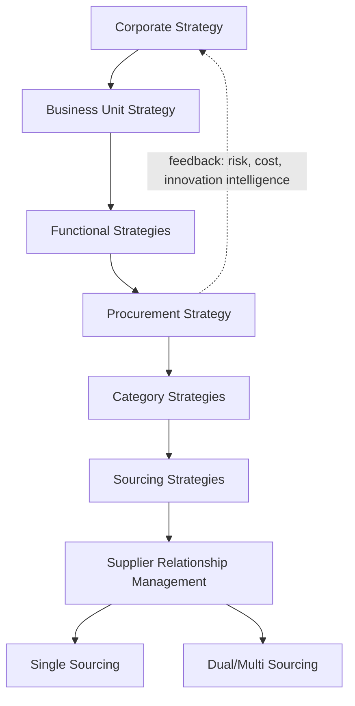
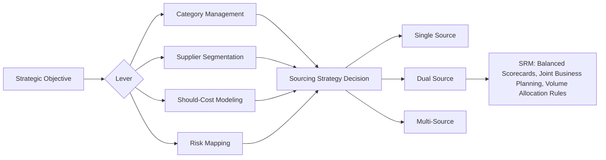

## Role of Procurement in Organizational Strategy

### Overview

Procurement has evolved from a transactional, cost-minimizing back-office function into a strategic capability that directly shapes an organization's competitive position. In the context of Supplier Relationship Management (SRM) and Dual Sourcing, procurement's strategic role is the foundation on which sourcing architecture, supplier segmentation, and risk-mitigation decisions (such as maintaining two qualified suppliers for a critical input) are built.

**Key Points**

- Procurement's strategic mandate spans cost, risk, innovation, and sustainability — not price alone.
- The function's maturity level determines whether sourcing decisions (including dual sourcing) are reactive/tactical or proactive/strategic.
- Strategic procurement is a direct input into corporate strategy formulation, not merely an executor of it.

### From Tactical Buying to Strategic Procurement

#### The Evolution Continuum

Organizations typically progress through recognizable maturity stages:

1. **Transactional/Clerical** — Purchase orders processed reactively; success measured by unit price and delivery.
2. **Commercial** — Category management introduced; competitive bidding and basic supplier scorecards appear.
3. **Coordinated/Integrated** — Procurement aligns with cross-functional stakeholders (engineering, finance, operations); total cost of ownership (TCO) replaces unit price as the primary metric.
4. **Internally Integrated** — Procurement participates in product development, demand planning, and risk management.
5. **Externally Integrated/Strategic** — Procurement co-creates value with suppliers, shapes market strategy, and informs board-level decisions on resilience, ESG, and innovation sourcing.

This model is a widely referenced framework in procurement maturity literature (e.g., the Purchasing Chessboard and CIPS maturity models); exact stage labels vary by source. [Inference — the specific five-stage labeling is a common pedagogical synthesis rather than a single universally standardized taxonomy.]

#### Why This Matters for SRM and Dual Sourcing

Dual sourcing is a strategic tool, not a default policy. Its justification (resilience against disruption, negotiating leverage, capacity flexibility) only makes sense once procurement operates at the "Coordinated" stage or beyond — where TCO, risk exposure, and supply continuity are explicitly weighed against the incremental cost of maintaining a second qualified supplier.

### Strategic Objectives of Procurement

#### 1. Cost Management (Beyond Price)

Total Cost of Ownership (TCO) is the governing framework:

$$TCO = P + Q_c + L_c + I_c + S_c + R_c$$

Where:

- $P$ = purchase price
- $Q_c$ = quality-failure cost (defects, rework, warranty claims)
- $L_c$ = logistics and expediting cost
- $I_c$ = inventory carrying cost
- $S_c$ = switching/qualification cost (relevant when adding a second supplier)
- $R_c$ = risk cost (expected value of disruption exposure)

**Example**

A single-source component priced 8% cheaper than a dual-sourced alternative may still carry a higher TCO once $R_c$ (disruption exposure) and $S_c$ (emergency requalification cost during a shortage) are included.

#### 2. Risk and Resilience Management

Procurement is the organizational function primarily accountable for supply continuity risk. Post-2020 supply shocks (semiconductor shortages, freight disruptions, geopolitical trade restrictions) elevated this objective from secondary to co-equal with cost. Dual sourcing, buffer inventory, and supplier diversification are the standard risk-mitigation levers procurement deploys.

#### 3. Innovation Access

Strategic suppliers are increasingly a source of innovation, not just capacity. Early Supplier Involvement (ESI) programs bring suppliers into product design phases, which requires SRM structures (joint roadmaps, IP-sharing agreements, tiered supplier classification) that a purely transactional procurement function cannot support.

#### 4. Sustainability and Compliance

ESG reporting requirements (e.g., CSRD in the EU, supply chain due diligence laws) push Scope 3 emissions and labor-practice accountability into procurement's remit, since most of an organization's ESG footprint typically sits in its supply base rather than its own operations. [Inference — the magnitude varies by industry, but this is a commonly cited pattern in sustainability/procurement literature.]

### Procurement's Position in the Strategy Hierarchy

The feedback loop (dashed line) is the defining feature of *strategic* procurement: rather than only receiving strategic direction, procurement feeds market intelligence, supply risk data, and supplier innovation signals back into corporate strategy formulation.

### Kraljic Matrix as the Bridge to Sourcing Strategy

The Kraljic Portfolio Matrix (1983) remains the standard tool linking procurement's strategic role to concrete sourcing decisions like dual sourcing.

|  | Low Supply Risk | High Supply Risk |
| --- | --- | --- |
| **High Profit Impact** | Leverage Items — competitive bidding, multiple suppliers | Strategic Items — partnership, often dual/multi sourcing |
| **Low Profit Impact** | Non-Critical Items — efficient transaction processing | Bottleneck Items — secure supply, dual sourcing to reduce dependency |

**Key Points**

- Dual sourcing is most strongly indicated for **Bottleneck** items (high supply risk, low profit impact) to reduce dependency risk, and for **Strategic** items where risk mitigation justifies the added supplier-management overhead.
- For **Non-Critical** items, dual sourcing usually adds unjustified transaction cost.
- Placement in this matrix is itself a strategic procurement judgment, not a mechanical calculation.

### Organizational Structures Reflecting Procurement's Strategic Role

#### Centralized vs. Decentralized vs. Hybrid ("Center-Led")

- **Centralized** — Maximizes leverage and standardization; common where spend consolidation and supplier power management (relevant to dual sourcing decisions) are priorities.
- **Decentralized** — Maximizes responsiveness to local business unit needs; weakens cross-BU negotiating leverage.
- **Center-Led (Hybrid)** — Category strategy and supplier relationship governance set centrally; execution and tactical buying remain local. This is the most common structure in organizations with mature SRM practices. [Inference — prevalence claim based on common practitioner surveys (e.g., CIPS, ISM); exact proportions vary by study and industry.]

#### Reporting Line as a Strategic Signal

Chief Procurement Officer (CPO) reporting directly to CEO/CFO (rather than to Operations) is often cited as an indicator of procurement's strategic standing within an organization, since it enables procurement to influence enterprise risk and capital allocation decisions rather than only executing operational purchasing.

### Procurement's Strategic Levers Mapped to SRM/Dual Sourcing Outcomes

### Metrics That Signal Strategic (vs. Tactical) Procurement

| Metric Category | Tactical Focus | Strategic Focus |
| --- | --- | --- |
| Cost | Purchase Price Variance (PPV) | Total Cost of Ownership (TCO), cost avoidance |
| Risk | On-time delivery % | Supply risk index, single-source exposure % |
| Relationship | Number of suppliers | Supplier health scores, joint innovation pipeline value |
| Value | Savings realized | Value contribution to revenue/EBITDA |

**Example**

A procurement function reporting only "5% cost savings this quarter" is operating tactically. A function reporting "reduced single-source exposure on critical components from 40% to 15% via qualified second sources, while holding TCO flat" demonstrates strategic integration between risk management and sourcing architecture.

### Common Pitfalls

- **Pitfall: Treating procurement strategy as purely a cost function.** This underweights resilience, leading to under-investment in dual sourcing even for high-risk bottleneck items.
- **Pitfall: Strategic language without structural support.** Organizations that claim strategic intent but retain purely decentralized, price-driven KPIs will not sustain dual-sourcing programs, since the second supplier's costs are visible while the avoided-risk benefit is not.
- **Pitfall: No feedback loop to corporate strategy.** Procurement risk intelligence (e.g., supplier concentration in a geopolitically exposed region) that never reaches enterprise risk committees defeats the purpose of strategic positioning.

[Unverified] Specific ROI figures for dual sourcing programs (commonly cited ranges of 2–8% TCO impact in vendor and consultancy literature) are highly context- and industry-dependent and should not be treated as generalizable benchmarks without independent validation.

**Related Topics**

- Kraljic Portfolio Matrix: Detailed Application and Limitations
- Total Cost of Ownership (TCO) Modeling Techniques
- Category Management Framework
- Procurement Organizational Design (Centralized, Decentralized, Center-Led)
- Chief Procurement Officer (CPO) Role and C-Suite Influence
- Supplier Segmentation Models
- Single Sourcing vs. Dual Sourcing vs. Multi-Sourcing: Comparative Framework
- Supply Risk Assessment Methodologies
- Early Supplier Involvement (ESI) in Product Development
- ESG and Scope 3 Emissions in Procurement Strategy