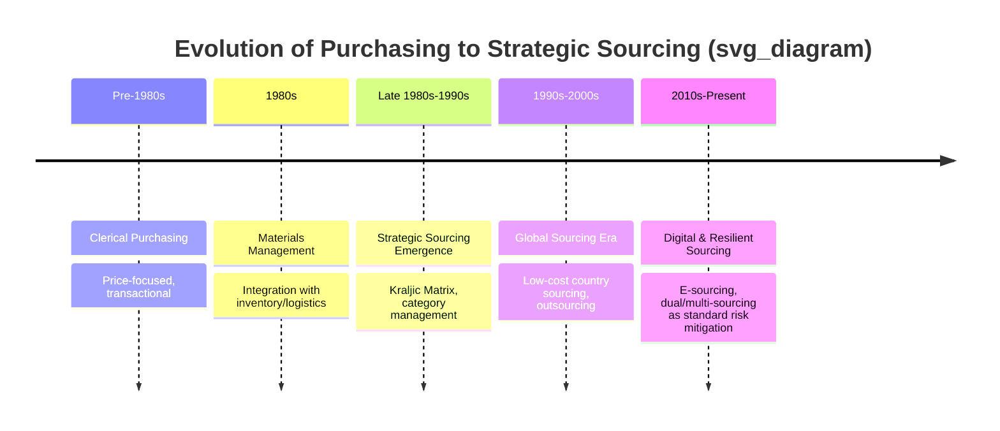
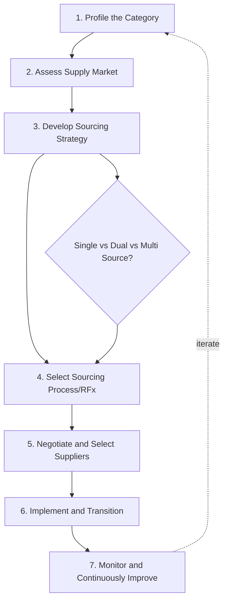

## Evolution From Purchasing to Strategic Sourcing

### Overview

This evolution describes the historical and functional transformation of the procurement discipline from an administrative, order-processing activity into a structured, analytical discipline that actively shapes supply base composition — including decisions like whether to single-source or dual-source a given category. Understanding this progression clarifies *why* modern SRM and dual-sourcing practices exist as formal methodologies rather than ad hoc responses to supply problems.

**Key Points**

- "Purchasing" and "strategic sourcing" are not synonyms; the distinction is methodological, not merely semantic.
- The shift was driven by identifiable historical inflection points, not a gradual, uniform trend.
- Strategic sourcing formalizes what dual sourcing decisions rely on: market analysis, TCO, and structured supplier evaluation.

### Defining the Two Paradigms

| Dimension | Purchasing (Traditional) | Strategic Sourcing |
| --- | --- | --- |
| Primary Goal | Lowest unit price | Lowest total cost of ownership (TCO) |
| Time Horizon | Transactional, order-by-order | Multi-year category strategy |
| Supplier View | Interchangeable vendors | Segmented partners with differentiated relationship models |
| Decision Basis | Price quotes, availability | Spend analysis, market intelligence, risk assessment |
| Organizational Role | Clerical/administrative | Cross-functional, strategic advisory |
| Sourcing Structure | Ad hoc, reactive to stockouts | Deliberate (single/dual/multi-source by design) |

**Example**

Traditional purchasing responds to a supply disruption by emergency-sourcing from whatever vendor can deliver fastest. Strategic sourcing pre-empts the disruption by having already qualified and contracted a second supplier as part of a category strategy — this is the direct lineage from strategic sourcing methodology to formal dual-sourcing programs.

### Historical Trajectory

#### Phase 1: Clerical Purchasing (Pre-1980s)

Purchasing departments functioned as order-processing units. Success was measured by price obtained and delivery met. Supplier relationships were arm's-length and adversarial by default — multiple bids were solicited primarily to drive price competition, not to build resilience.

#### Phase 2: Materials Management (1980s)

Integration of purchasing with inventory control, production planning, and logistics under a unified materials management function. This phase introduced the idea that purchasing decisions affect downstream costs (carrying cost, stockout cost) — an early precursor to TCO thinking.

#### Phase 3: Strategic Sourcing Emergence (Late 1980s–1990s)

Formalized by consulting firms (notably McKinsey's early work on procurement transformation) and popularized through structured methodologies. Key developments:

- **Kraljic's Portfolio Matrix (1983)** — introduced supply-risk/profit-impact segmentation, giving purchasing professionals their first widely adopted analytical tool for differentiating sourcing approaches by category.
- **Category management** — spend is organized into managed categories (e.g., "electronic components," "logistics services") each with its own strategy, rather than treated as undifferentiated transactions.
- **Cross-functional sourcing teams** — engineering, quality, and finance formally participate in sourcing decisions rather than purchasing acting unilaterally.

#### Phase 4: Global Sourcing and Outsourcing Era (1990s–2000s)

Globalization expanded the addressable supplier market. Low-cost country sourcing (China, India, Eastern Europe) became a dominant strategy. This era also introduced the risk trade-offs that later justified dual sourcing: longer lead times, currency exposure, and geopolitical risk in exchange for cost reduction.

#### Phase 5: Digital and Risk-Resilient Sourcing (2010s–Present)

Two convergent forces reshaped strategic sourcing:

1. **Digitalization** — e-sourcing platforms, spend analytics, and (more recently) AI-assisted supplier discovery and risk monitoring.
2. **Resilience imperative** — trade wars (2018+), COVID-19 supply shocks (2020–2022), and regional conflicts affecting logistics corridors made single-source dependency an explicit, quantified risk rather than a theoretical one. Dual and multi-sourcing shifted from a niche risk-management tactic to a mainstream strategic sourcing default for critical categories. [Inference — "mainstream default" reflects a widely observed post-2020 trend in procurement practitioner surveys; the degree of adoption varies significantly by industry and organization size.]

### Timeline Visualization

### The Strategic Sourcing Process Model

Strategic sourcing is typically executed as a repeatable, structured process — commonly represented as a 7-step cycle:

**Key Points**

- Step 3 (Develop Sourcing Strategy) is where the dual-sourcing decision is formally made, informed by the category profile and market assessment from Steps 1–2.
- Step 7 closes the loop — supplier performance monitoring can trigger a re-evaluation of the sourcing structure (e.g., adding a second source after a single-source disruption).

### Core Analytical Tools That Distinguish Strategic Sourcing

#### 1. Spend Analysis

Aggregating and classifying spend data (typically via UNSPSC or similar taxonomy) to reveal consolidation opportunities and category-level leverage — a prerequisite that clerical purchasing never performed systematically.

#### 2. Should-Cost Modeling

Building a bottom-up cost estimate (materials, labor, overhead, margin) to evaluate supplier pricing objectively:

$$C_{should} = M + L + O + G$$

Where $M$ = material cost, $L$ = labor cost, $O$ = overhead allocation, $G$ = reasonable margin. This replaces the purchasing-era practice of accepting quoted prices at face value.

#### 3. Total Cost of Ownership (TCO)

As detailed in the prior topic, TCO extends beyond should-cost to include lifecycle costs — directly informing whether the incremental cost of qualifying a second supplier is justified by risk reduction.

#### 4. Supplier Segmentation

Portfolio approaches (Kraljic and its derivatives) that formally categorize suppliers/items, providing the analytical basis for *which* categories warrant dual sourcing versus single or multi-sourcing.

### Why This Evolution Enables Modern SRM and Dual Sourcing

Dual sourcing as a deliberate strategy — rather than an accidental byproduct of having multiple historical vendors — depends on capabilities that only emerged in the strategic sourcing paradigm:

- **Market assessment** to identify and qualify a viable second supplier (not just accept whoever is available).
- **TCO modeling** to justify the added administrative and coordination cost of managing two suppliers.
- **Category strategy** to determine volume allocation rules (e.g., 70/30 split) between primary and secondary suppliers.
- **Supplier relationship differentiation**, since a dual-sourced strategic item requires a different relationship model (joint planning, balanced scorecards) than a dual-sourced non-critical item (simple competitive rebidding).

[Unverified] Specific percentage figures sometimes cited for cost savings attributable to the shift from purchasing to strategic sourcing (commonly ranges like 5–15% in consulting literature) vary substantially by source methodology and should be treated as illustrative rather than benchmarked.

**Next Steps**

- Kraljic Portfolio Matrix: Detailed Application and Limitations
- Category Management Framework and Category Strategy Development
- Spend Analysis Methodologies and Taxonomies (UNSPSC)
- Should-Cost Modeling Techniques
- Total Cost of Ownership (TCO) Modeling Techniques
- Supplier Segmentation Models
- The 7-Step Strategic Sourcing Process in Depth
- E-Sourcing and Digital Procurement Platforms
- Global Sourcing Risk Factors (Currency, Geopolitical, Logistics)