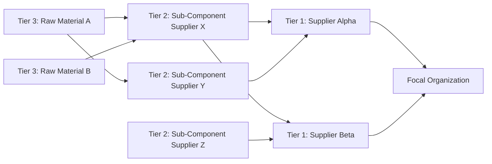
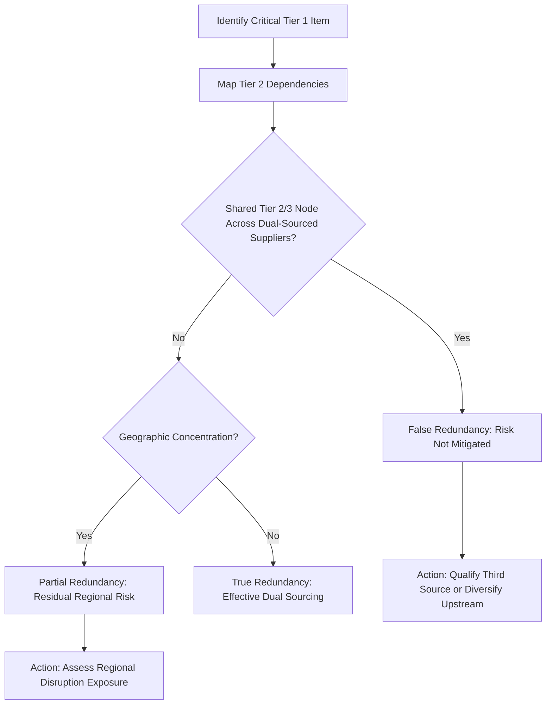

## Supply Chain Tiers and Network Structure

### Overview

Supply chain tier structure describes how suppliers are organized by their distance from the focal (buying) organization, and how those tiers interconnect to form a network rather than a simple linear chain. This structural understanding is foundational to SRM and dual sourcing: a dual-sourcing decision made only at Tier 1 can be undermined if both Tier 1 suppliers depend on the same Tier 2 or Tier 3 source — a phenomenon that has caused major disruptions despite apparently diversified sourcing.

**Key Points**

- Supply chains are networks, not linear chains — the term "chain" is a simplification.
- Tier visibility typically degrades sharply beyond Tier 1, creating hidden concentration risk.
- Effective dual sourcing requires "n-tier" visibility, not just Tier 1 diversification.

### Tier Definitions

#### Tier 1

Suppliers with a direct commercial relationship and contract with the focal organization. These are the suppliers procurement negotiates with, audits, and manages directly.

#### Tier 2

Suppliers to your Tier 1 suppliers. The focal organization typically has no direct contract with Tier 2 and often limited visibility into who they are.

#### Tier 3 and Beyond (Tier-n)

Successive upstream layers — raw material processors, sub-component fabricators, and ultimately raw material extraction (mining, agriculture, chemical feedstock). Visibility here is typically minimal without deliberate mapping efforts.

#### Tier 0 / Downstream Tiers (Occasionally Referenced)

Some frameworks extend the concept downstream: Tier 0 as the focal firm itself, and downstream "customer tiers" (distributors, retailers) — relevant in end-to-end supply chain mapping but outside procurement's typical upstream focus.

### Network Structure vs. Linear Chain

**Example**

In the diagram above, Supplier Alpha and Supplier Beta appear to be a diversified dual-sourcing arrangement at Tier 1. However, both depend on the same Tier 2 supplier (Supplier X). A disruption at Supplier X — a fire, a labor strike, a single-point-of-failure raw material — would simultaneously impact both "diversified" Tier 1 sources, defeating the purpose of the dual-sourcing strategy. This convergent-node pattern is a well-documented cause of supply chain disruptions (e.g., the 2011 Thailand floods affecting multiple auto and electronics OEMs through shared Tier 2/3 component suppliers). [Inference — the general pattern is well-documented in supply chain risk literature; specific causal attribution for any single historical event involves some complexity beyond this simplified illustration.]

### Why Tier Structure Matters for Dual Sourcing

#### 1. False Diversification Risk

As illustrated above, Tier 1 dual sourcing provides no resilience benefit if both suppliers share upstream dependencies. True risk mitigation requires mapping to the point of divergence — the tier at which the two supply paths genuinely separate.

#### 2. Bottleneck Identification

Certain tiers or nodes function as natural chokepoints — a single global producer of a specialty chemical, a geographically concentrated mineral deposit, or a sole-source semiconductor fabrication node. Identifying these requires n-tier mapping; they are frequently invisible at the Tier 1 contract level.

#### 3. Geographic Concentration Risk

Even with different corporate suppliers at Tier 1 and Tier 2, both may be physically located in the same region (e.g., same industrial cluster, same port-dependent logistics corridor), creating correlated risk exposure to natural disasters, regional conflict, or infrastructure failure.

### Network Topology Patterns

| Topology | Description | Dual-Sourcing Implication |
| --- | --- | --- |
| **Convergent** | Many upstream sources feed into few downstream nodes | Common cause of hidden single points of failure |
| **Divergent** | Few upstream sources feed many downstream nodes | A disruption at the shared source cascades broadly |
| **Parallel/Redundant** | Genuinely independent paths with no shared nodes | The structure dual sourcing intends to achieve |
| **Network/Mesh** | Multiple interconnected paths with partial overlap | Most realistic real-world pattern; requires careful mapping to assess true redundancy |

### Supply Chain Mapping Methodology

#### Level 1: Tier 1 Contract Mapping

Baseline data most organizations already hold — direct suppliers, contract terms, spend volume.

#### Level 2: Tier 2 Disclosure-Based Mapping

Obtained via supplier questionnaires, contractual disclosure requirements, or supplier-provided bill-of-materials (BOM) traceability. Increasingly required by regulation (e.g., conflict minerals reporting, EU deforestation regulation supply chain due diligence).

#### Level 3: Tier-n Probabilistic/Inferred Mapping

Where direct disclosure is unavailable, organizations use industry databases, trade data analysis, and supplier-of-supplier surveys to infer likely upstream dependencies. This is inherently less precise than direct disclosure. [Unverified — the accuracy of inferred mapping techniques varies significantly by industry, data availability, and vendor methodology; no universal accuracy benchmark applies.]

#### Digital Tools

Supply chain mapping software (e.g., Interos, Everstream Analytics, Resilinc) aggregates trade data, corporate ownership records, and geospatial data to construct probabilistic n-tier maps. [Unverified — specific vendor capabilities and accuracy change frequently; evaluate current documentation before relying on any single provider's claims.]

### Structural Risk Assessment Framework

### Network Structure and Supplier Segmentation Interaction

Tier position interacts with the Kraljic segmentation introduced earlier:

- A **Bottleneck item** (high risk, low profit impact) is especially prone to hidden tier-2/3 concentration, since low commercial priority means it rarely receives deep mapping investment — creating an underappreciated risk category.
- A **Strategic item** typically justifies the cost of full n-tier mapping, given its high profit impact.

### Common Pitfalls

- **Pitfall: Equating "two suppliers" with "resilience"** without verifying upstream independence.
- **Pitfall: One-time mapping.** Supply networks are dynamic — Tier 1 suppliers change their own sub-suppliers without notification obligations in most standard contracts, causing tier maps to decay in accuracy over time.
- **Pitfall: Ignoring logistics/infrastructure nodes.** Ports, transportation corridors, and customs chokepoints function as de facto network nodes even though they are not "suppliers" in the traditional sense, and can defeat dual-sourcing resilience just as a shared component supplier can.

**Related Topics**

- N-Tier Supply Chain Mapping Techniques and Tools
- Supply Chain Risk Assessment Frameworks
- Kraljic Portfolio Matrix: Detailed Application and Limitations
- Geographic and Geopolitical Concentration Risk Analysis
- Bill of Materials (BOM) Traceability
- Single Point of Failure (SPOF) Identification Methodology
- Supplier Disclosure Requirements and Conflict Minerals Reporting
- Business Continuity Planning in Supply Networks