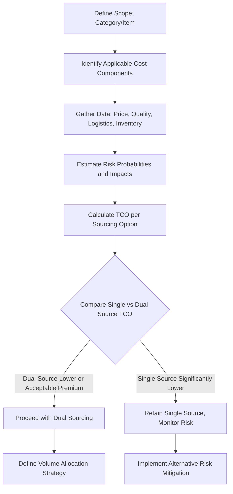

## Total Cost of Ownership Fundamentals

### Overview

Total Cost of Ownership (TCO) is the analytical framework that quantifies all costs associated with acquiring, using, and disposing of a good or service — not just its purchase price. TCO is the primary decision-support mechanism for comparing single-source versus dual-source arrangements, since dual sourcing typically carries a visible price premium (lower volume leverage per supplier, duplicated qualification costs) that is only justifiable once its offsetting risk-reduction value is captured quantitatively.

**Key Points**

- TCO reframes "cost" from a single number (price) to a multi-dimensional lifecycle calculation.
- Purchase price is frequently a minority share of TCO for complex goods.
- Dual sourcing cannot be rigorously justified — or rejected — without a TCO framework, since a pure price comparison will almost always favor single sourcing.

### Core TCO Formula

$$TCO = P + Q_c + L_c + I_c + S_c + M_c + D_c + R_c$$

Where:

- $P$ = Purchase price (unit price × volume)
- $Q_c$ = Quality cost (defects, rework, warranty, field failures)
- $L_c$ = Logistics cost (freight, customs, expediting)
- $I_c$ = Inventory carrying cost (capital, storage, obsolescence)
- $S_c$ = Switching/qualification cost (supplier onboarding, tooling, validation)
- $M_c$ = Maintenance/support cost over asset life (relevant for capital equipment)
- $D_c$ = Disposal/end-of-life cost
- $R_c$ = Risk cost (expected value of disruption exposure)

Not all components apply to every purchase category; the formula is a superset to be scoped per category. [Inference — the specific component list is a common synthesis across TCO literature (e.g., Ellram's foundational TCO work); exact taxonomies vary by source and industry.]

### TCO Component Detail

#### 1. Purchase Price ($P$)

The most visible and easiest-to-compare cost, but frequently the smallest share of TCO for engineered or capital-intensive goods. For simple commodities, $P$ may dominate; for complex equipment, published estimates suggest acquisition price can represent well under half of lifetime cost. [Unverified — the specific proportion varies enormously by industry and asset type; treat any single percentage figure as illustrative rather than a general benchmark.]

#### 2. Quality Cost ($Q_c$)

Includes:

- Incoming inspection and rejection cost
- Rework and scrap
- Warranty claims
- Field failure cost, including brand/reputation impact (difficult to quantify precisely, often estimated)

**Example**

A supplier offering a 3% lower unit price but a defect rate 2 percentage points higher than an alternative may have a higher effective cost once rework labor and warranty exposure are included — this comparison is exactly the kind of judgment a formal $Q_c$ calculation is designed to make explicit rather than left to intuition.

#### 3. Logistics Cost ($L_c$)

Freight (including mode — ocean vs. air), customs duties, tariffs, and expediting costs incurred when standard logistics fail to meet schedule. Increasingly volatile given the geopolitical and trade-policy environment.

#### 4. Inventory Carrying Cost ($I_c$)

$$I_c = V \times (i + s + o + t)$$

Where $V$ = average inventory value, and the rate components are: $i$ = cost of capital, $s$ = storage cost rate, $o$ = obsolescence/shrinkage rate, $t$ = taxes/insurance rate. Commonly aggregated into a single "carrying cost rate," frequently cited in a broad range (commonly 15–30% of inventory value annually in procurement literature), though the appropriate rate is organization- and industry-specific. [Unverified — treat any specific percentage as a starting reference point requiring validation against the organization's actual cost of capital and storage economics.]

#### 5. Switching/Qualification Cost ($S_c$)

Directly relevant to dual sourcing: the cost of qualifying a second supplier (engineering validation, sample testing, audits, tooling duplication, certification). This is the primary cost that a TCO analysis must weigh against the risk reduction dual sourcing provides.

#### 6. Risk Cost ($R_c$)

The expected value of disruption exposure:

$$R_c = \sum_{i} P(disruption_i) \times Impact_i$$

Where the summation is across identified risk scenarios (single-source failure, geopolitical event, natural disaster), $P(disruption_i)$ is the estimated probability of scenario $i$, and $Impact_i$ is its estimated cost impact (lost production, expedited replacement sourcing, customer penalties). This is the component that most directly quantifies the value proposition of dual sourcing — a well-constructed $R_c$ term captures exactly what disappears when a second qualified source exists.

### TCO Comparison Framework: Single vs. Dual Source

| TCO Component | Single Source | Dual Source | Typical Direction of Difference |
| --- | --- | --- | --- |
| $P$ (price) | Lower (full volume leverage) | Higher (split volume, less leverage per supplier) | Dual source higher |
| $S_c$ (qualification) | One-time, single supplier | Duplicated across two suppliers | Dual source higher |
| $I_c$ (inventory) | May require larger safety stock as hedge | Can often run leaner safety stock | Dual source lower |
| $R_c$ (risk) | Full exposure to single-source disruption | Substantially reduced exposure | Dual source lower |
| Administrative overhead | Lower (one relationship to manage) | Higher (two relationships, allocation management) | Dual source higher |

**Example**

If a component's annual spend is $10,000,000, single-sourced at a 3% price advantage ($300,000 savings) but carrying an estimated 5% annual probability of a disruption costing $4,000,000 in lost production, the risk-adjusted cost is:

$$R_c = 0.05 \times \$4{,}000{,}000 = \$200{,}000$$

In this simplified example, the $300,000 single-source price advantage exceeds the $200,000 expected risk cost, which would argue for single sourcing on TCO grounds *before* accounting for switching costs, inventory effects, or risk-aversion (as opposed to risk-neutral expected value) considerations that many organizations apply to catastrophic-but-low-probability events. [Inference — this is an illustrative worked example with hypothetical figures, not a benchmark or general result; real analyses require organization-specific probability and impact estimates, and may reasonably weight low-probability/high-impact events beyond simple expected value.]

### TCO Calculation Process

### Common TCO Modeling Approaches

#### 1. Weighted-Factor Model

Assigns weights to cost/risk categories based on strategic priority rather than pure dollar calculation — useful when some components (e.g., reputational risk) resist precise quantification.

#### 2. Activity-Based Costing (ABC) Model

Traces costs to specific activities (inspection, expediting, warranty processing) using actual cost-driver data — more precise but data-intensive.

#### 3. Monte Carlo / Probabilistic Model

Treats risk components as probability distributions rather than point estimates, producing a range of TCO outcomes rather than a single figure — better suited to capturing the tail risk that dual sourcing is often specifically designed to mitigate. [Inference — this approach is standard in quantitative risk management literature; its application specifically to procurement TCO is a natural extension rather than a universally standardized named methodology.]

### Common Pitfalls

- **Pitfall: Omitting risk cost entirely.** A TCO model that only includes $P$, $Q_c$, $L_c$, and $I_c$ will systematically favor single sourcing, since the primary quantifiable benefit of dual sourcing lives in $R_c$.
- **Pitfall: Overstating risk probability to justify a predetermined dual-sourcing decision.** TCO's credibility depends on defensible, evidence-based probability and impact estimates, not figures reverse-engineered from a desired conclusion.
- **Pitfall: Treating TCO as a one-time calculation.** Cost components (especially $R_c$ given a changing geopolitical and climate risk landscape) should be revisited periodically, not fixed at the original sourcing decision.
- **Pitfall: Ignoring switching cost asymmetry.** $S_c$ for adding a second supplier is a one-time cost, while $R_c$ savings recur annually — a short evaluation horizon can wrongly disfavor dual sourcing.

**Related Topics**

- Should-Cost Modeling Techniques
- Supply Risk Quantification and Probability Estimation
- Inventory Carrying Cost Calculation Methods
- Volume Allocation Strategies in Dual Sourcing
- Kraljic Portfolio Matrix: Detailed Application and Limitations
- Activity-Based Costing (ABC) in Procurement
- Monte Carlo Simulation for Supply Chain Risk
- Supplier Qualification and Onboarding Cost Structures