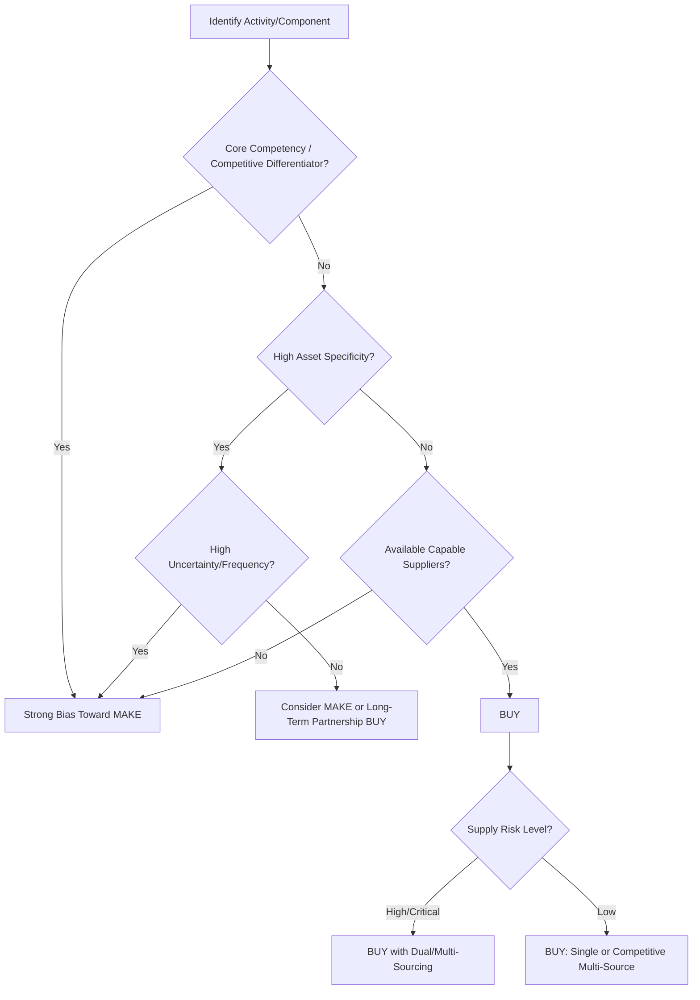
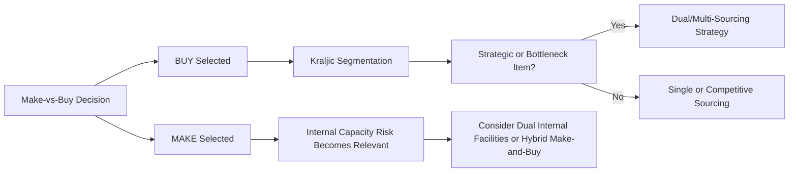

## Make-Versus-Buy Decision Frameworks

### Overview

Make-versus-buy analysis determines whether an organization should produce a good or capability internally or procure it from external suppliers. This decision is the logical predecessor to sourcing strategy: only once "buy" is selected does the subsequent question of single, dual, or multi-sourcing arise. The framework matters to SRM because "buy" decisions create supplier dependency, and the depth of that dependency shapes whether dual sourcing is warranted as a risk mitigant.

**Key Points**

- Make-vs-buy is a strategic, not purely financial, decision — cost is one input among several.
- The decision is reversible only at significant cost (asset-specific investment, capability atrophy), so frameworks emphasize long-term strategic fit over short-term price comparison.
- A "buy" decision on a strategically important item is precisely the scenario where dual sourcing becomes most relevant as a risk mitigant.

### Foundational Theory: Transaction Cost Economics (TCE)

Oliver Williamson's Transaction Cost Economics provides the academic foundation most make-vs-buy frameworks build on. The central logic: firms should internalize (make) activities when the cost of governing that activity through market transactions (buy) exceeds the cost of governing it internally — driven primarily by **asset specificity**, **uncertainty**, and **frequency**.

#### Asset Specificity

The degree to which an investment (equipment, knowledge, relationship-specific processes) has value only within a particular transaction. High asset specificity increases the risk of supplier opportunism (hold-up problem) post-investment, favoring "make" or tightly governed long-term "buy" relationships.

#### Uncertainty

Environmental or behavioral unpredictability. High uncertainty makes complete contracting difficult, favoring internal control (make) or highly flexible, closely managed supplier relationships.

#### Frequency

How often the transaction recurs. Frequent, recurring transactions justify the fixed cost of building specialized governance structures (make, or a deeply integrated strategic supplier relationship).

**Example**

A semiconductor design requiring proprietary process technology (high asset specificity) and rapidly evolving performance requirements (high uncertainty) is a classic "make" candidate — or, if bought, requires unusually deep, exclusive-feeling supplier integration rather than an arm's-length transactional relationship.

### Strategic Dimensions Beyond Cost

#### 1. Core Competency Alignment

Prahalad and Hamel's core competency framework argues organizations should retain internal control over capabilities that provide sustained competitive differentiation, and outsource commoditized activities. An activity central to competitive advantage is a "make" candidate regardless of short-term cost comparison.

#### 2. Strategic Control and IP Protection

Activities involving proprietary technology or trade secrets carry outsourcing risk beyond cost — technology leakage, reverse engineering by contract manufacturers, and erosion of competitive barriers over time.

#### 3. Capacity and Capability Constraints

"Buy" may be necessary regardless of cost preference when internal capacity or capability genuinely does not exist and building it would take longer than the market opportunity allows.

#### 4. Risk and Resilience

This is the dimension most directly linked to dual sourcing: a "buy" decision transfers production risk to the supply base. If the item is critical and supply-constrained, this transferred risk must be actively managed — often via dual sourcing — rather than simply accepted.

### Make-vs-Buy Decision Framework

### Quantitative Cost Comparison Model

While strategic factors dominate, a cost baseline typically supports the decision:

$$C_{make} = FC + (VC \times Q) + Op_c$$

$$C_{buy} = (P \times Q) + T_c + M_c$$

Where:

- $FC$ = fixed cost of internal capability (equipment, facility, capability-building)
- $VC$ = variable unit production cost
- $Q$ = quantity/volume
- $Op_c$ = opportunity cost of capital and management attention tied up in the "make" option
- $P$ = supplier unit price
- $T_c$ = transaction cost (contracting, negotiation, ongoing supplier management)
- $M_c$ = monitoring/quality assurance cost of the buy relationship

The breakeven volume $Q^*$ at which make and buy costs equate:

$$Q^* = \frac{FC + Op_c - T_c - M_c}{P - VC}$$

**Example**

If internal fixed costs ($FC$) are $2,000,000, variable cost ($VC$) is $40/unit, and a supplier's price ($P$) is $55/unit with negligible transaction/monitoring cost difference, the breakeven volume is approximately:

$$Q^* = \frac{2{,}000{,}000}{55 - 40} \approx 133{,}333 \text{ units}$$

Below this volume, buying is more cost-effective; above it, making internally spreads fixed costs more efficiently. This is a simplified illustration — real analyses must also weight the strategic factors (asset specificity, core competency, risk) discussed above, which can override a purely volume-driven conclusion. [Inference — the breakeven formula is a standard cost-accounting construction; the specific figures in the example are illustrative only.]

### Common Make-vs-Buy Frameworks in Practice

| Framework | Primary Lens | Best Suited For |
| --- | --- | --- |
| Transaction Cost Economics (TCE) | Governance cost, opportunism risk | Strategic/high-specificity decisions |
| Core Competency Analysis | Competitive differentiation | Capability-portfolio-level decisions |
| Kraljic-Adjacent Risk/Value Matrix | Supply risk vs. profit impact | Item/category-level sourcing decisions |
| Total Cost of Ownership (TCO) | Full lifecycle cost | Quantitative comparison once make/buy direction is set |
| Real Options Analysis | Value of flexibility under uncertainty | High-uncertainty, high-investment decisions (e.g., new technology) |

[Inference — this table synthesizes commonly referenced frameworks from procurement and strategy literature; organizations often blend elements from multiple frameworks rather than applying one in isolation.]

### The Make-vs-Buy → Sourcing Strategy → Dual Sourcing Chain

**Key Points**

- A "hybrid" make-and-buy strategy (producing a portion internally while also qualifying an external supplier) functions as a form of dual sourcing and is common for items where full internalization is cost-prohibitive but full dependency on one external supplier is unacceptably risky.
- The make-vs-buy decision should be periodically revisited, since asset specificity, supplier market maturity, and strategic priorities change over time — a "buy" decision made under one risk environment may warrant reconsideration (including a shift to dual sourcing or partial insourcing) as conditions evolve.

### Common Pitfalls

- **Pitfall: Treating make-vs-buy as a one-time, purely financial calculation.** Ignoring asset specificity and strategic control factors can lead to outsourcing decisions that later prove difficult and costly to reverse.
- **Pitfall: Underestimating transaction and monitoring costs in the "buy" option.** These costs (contract negotiation, quality audits, supplier relationship management) are frequently underestimated relative to visible unit price.
- **Pitfall: Failing to reassess "buy" decisions for hidden single-source risk.** A buy decision made years earlier, when the supply market had multiple viable suppliers, may now be effectively single-sourced due to supplier market consolidation — a risk state change that warrants renewed dual-sourcing consideration.

**Related Topics**

- Transaction Cost Economics: Asset Specificity, Uncertainty, Frequency in Depth
- Core Competency and Competitive Advantage Frameworks
- Kraljic Portfolio Matrix: Detailed Application and Limitations
- Total Cost of Ownership Fundamentals
- Real Options Analysis in Sourcing Decisions
- Supplier Market Consolidation Risk
- Hybrid Make-and-Buy Strategies
- Outsourcing Risk: IP Protection and Technology Leakage