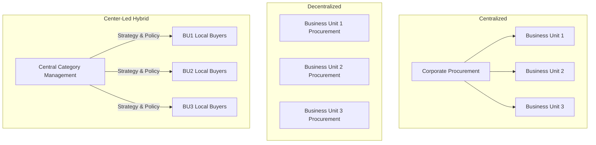
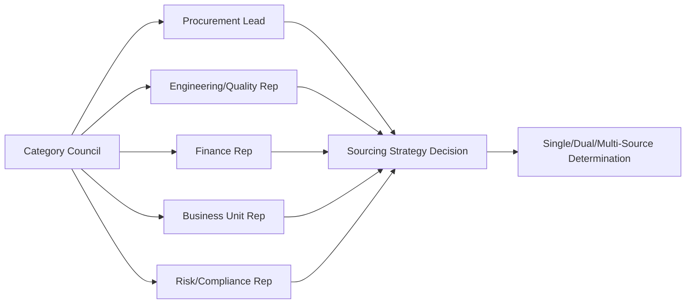
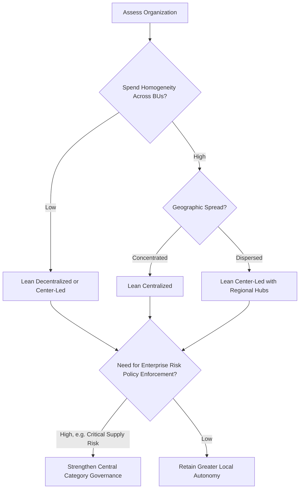

## Procurement Organizational Models

### Overview

Procurement organizational models define how sourcing authority, category strategy, and supplier relationship governance are distributed across an organization's structure. The chosen model directly determines whether dual-sourcing decisions can be made and enforced consistently — a fragmented, fully decentralized structure struggles to maintain coherent supplier qualification standards and volume allocation rules across business units, while an overly rigid centralized structure may be slow to respond to local supply risk signals.

**Key Points**

- No single model is universally superior; fit depends on organizational size, geographic spread, category complexity, and strategic priorities.
- The model chosen shapes procurement's negotiating leverage, responsiveness, and its ability to enforce cross-business-unit sourcing policies like dual sourcing.
- Most large organizations in practice use hybrid structures rather than a pure form of any single model.

### The Three Core Models

#### 1. Centralized Procurement

All sourcing authority, supplier negotiation, and contract execution reside in a single corporate procurement function, regardless of which business unit or location consumes the goods/services.

**Structure characteristics:**

- Single point of authority for supplier selection and contract terms
- Aggregated spend volume across the entire organization
- Standardized processes, systems, and supplier qualification criteria

**Advantages:**

- Maximum negotiating leverage through spend consolidation
- Consistent enforcement of sourcing policy (including dual-sourcing mandates for critical categories)
- Reduced duplication of supplier qualification effort
- Easier enterprise-wide supply risk visibility

**Disadvantages:**

- Slower response to local/business-unit-specific needs
- Risk of one-size-fits-all supplier selection that doesn't fit all business unit requirements
- Can become a bottleneck at scale
- Local stakeholder disengagement ("procurement doesn't understand our needs")

#### 2. Decentralized Procurement

Each business unit, division, or location manages its own procurement independently, with its own budget authority, supplier relationships, and sourcing decisions.

**Structure characteristics:**

- Procurement staff report into business unit leadership, not a central procurement function
- Independent supplier bases per unit, even for overlapping categories
- Locally tailored processes and priorities

**Advantages:**

- High responsiveness to local operational needs
- Strong alignment with business unit priorities and accountability
- Faster decision-making at the local level

**Disadvantages:**

- Fragmented spend eliminates volume leverage
- Inconsistent supplier qualification standards — a supplier disqualified by one unit may still be used by another
- Difficult to enforce enterprise risk policies, including dual-sourcing requirements for critical categories
- Duplicated effort (multiple units separately qualifying similar suppliers)
- Limited enterprise-wide visibility into supply risk concentration

#### 3. Center-Led (Hybrid) Procurement

Category strategy, supplier relationship governance, and policy-setting are managed centrally, while tactical execution and day-to-day supplier interaction remain with business units or regional teams.

**Structure characteristics:**

- Central Category Management Organization (CMO) sets strategy, negotiates master agreements, defines approved supplier lists
- Local/regional buyers execute within centrally defined parameters
- Governance councils or category councils align cross-functional stakeholders

**Advantages:**

- Balances leverage (via central category strategy) with responsiveness (via local execution)
- Enables consistent enforcement of risk policies like dual sourcing at the category level while allowing local flexibility in day-to-day supplier interaction
- Most commonly adopted model among large, complex organizations [Inference — based on common practitioner survey findings (e.g., CIPS, ISM, Deloitte procurement surveys); exact prevalence figures vary by study and year.]

**Disadvantages:**

- Requires clear governance to avoid ambiguity over decision authority
- Can create friction between central category managers and local business unit stakeholders
- More complex to design and maintain than a pure model

### Comparative Summary

| Dimension | Centralized | Decentralized | Center-Led (Hybrid) |
| --- | --- | --- | --- |
| Negotiating Leverage | High | Low | Medium–High |
| Responsiveness | Low | High | Medium–High |
| Policy Consistency (e.g., dual-sourcing enforcement) | High | Low | High (at category level) |
| Implementation Complexity | Low–Medium | Low | High |
| Best Fit | Homogeneous, standardized spend | Highly diversified, autonomous business units | Large, complex organizations with mixed category needs |

### Organizational Structure Diagram

### Category Councils and Governance Structures

Center-led models typically formalize cross-functional decision-making through **category councils**: standing groups combining procurement, engineering, quality, finance, and relevant business unit representatives for each major spend category. These councils are frequently where dual-sourcing decisions are formally ratified, since the decision requires cross-functional input (engineering must approve a second supplier's technical qualification; finance must approve the incremental cost; the business unit must accept any transition risk).

### Reporting Structure and Strategic Positioning

The CPO's (Chief Procurement Officer's) position in the organizational hierarchy is itself a structural signal:

| Reporting Line | Implication |
| --- | --- |
| CPO reports to CEO | Highest strategic visibility; procurement treated as enterprise risk/value function |
| CPO reports to CFO | Strong cost/financial discipline emphasis; risk of overweighting price over resilience |
| CPO reports to COO | Operational integration emphasis; strong link to supply continuity |
| Procurement embedded within Finance/Operations (no dedicated CPO) | Typically indicates lower organizational maturity; strategic sourcing capability often underdeveloped |

[Inference — this table reflects commonly discussed patterns in procurement organizational design literature; the actual strategic outcomes of any specific reporting line depend heavily on organizational culture and individual leadership, not the reporting line alone.]

### Global/Regional Structural Variants

For multinational organizations, an additional dimension layers onto the three core models:

- **Global Category Ownership** — one global category manager owns strategy for a category (e.g., "global electronics components") across all regions.
- **Regional Hub Model** — procurement organized by geographic hub (Americas, EMEA, APAC), each with degrees of autonomy within global policy guardrails.
- **Lead Country/Lead Buyer Model** — one regional team leads negotiation for a category on behalf of all regions, often where that region has the largest spend or supplier market expertise.

This regional dimension directly affects dual-sourcing feasibility: a genuinely resilient dual-sourcing strategy for a global category often requires the two qualified suppliers to be in different geographic regions, which requires the organizational structure to support cross-regional category coordination rather than siloed regional sourcing.

### Choosing a Model: Decision Factors

### Common Pitfalls

- **Pitfall: Choosing a structure based on organizational politics rather than category needs.** A model imposed uniformly across all categories, rather than tailored by category risk/complexity, tends to be either too rigid or too fragmented for at least some spend.
- **Pitfall: Center-led models without clear decision rights (RACI).** Ambiguity over who has final authority — central category manager or local business unit leader — creates friction and can stall time-sensitive decisions like emergency second-source qualification.
- **Pitfall: Structural change without change management.** Shifting from decentralized to centralized/center-led is a significant organizational change that, if implemented without stakeholder buy-in, frequently encounters passive resistance (local units routing around central policy).

**Related Topics**

- Category Management Framework and Category Councils
- RACI Models for Sourcing Decision Governance
- Global vs. Regional Sourcing Structures
- Chief Procurement Officer (CPO) Role and C-Suite Influence
- Change Management in Procurement Transformation
- Cross-Functional Stakeholder Alignment in Sourcing
- Procurement Technology and ERP Integration by Organizational Model