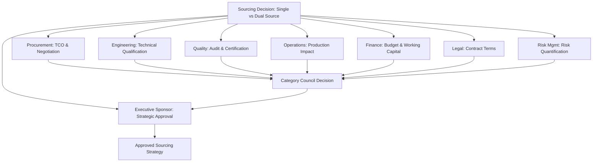
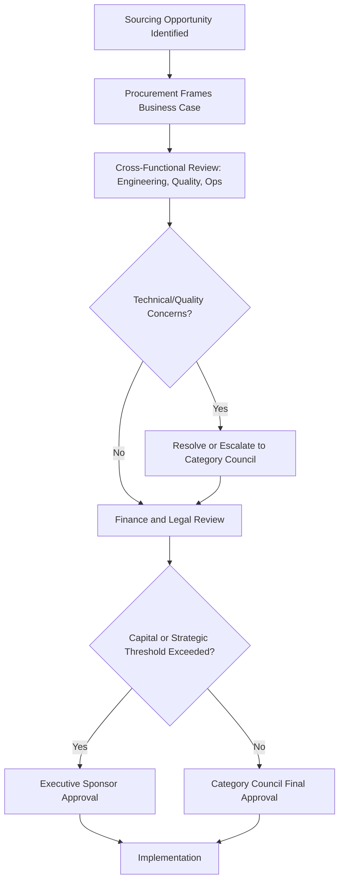

## Key Stakeholders in Sourcing Decisions

### Overview

Sourcing decisions — particularly consequential ones like whether to single-source or dual-source a critical category — are rarely made by procurement in isolation. They require structured input from a defined set of cross-functional stakeholders, each contributing distinct expertise and bearing distinct risk if the decision goes wrong. Understanding stakeholder roles is essential to SRM because supplier relationships must be managed to satisfy multiple internal constituencies, not just procurement's cost objectives.

**Key Points**

- Sourcing decisions fail most often not from poor analysis but from inadequate stakeholder alignment.
- Each stakeholder group brings a distinct risk lens; dual-sourcing decisions in particular require reconciling competing priorities (cost efficiency vs. technical consistency vs. supply assurance).
- Formal stakeholder governance (RACI, category councils) converts ad hoc influence into structured, accountable decision-making.

### Core Internal Stakeholder Groups

#### 1. Procurement/Sourcing

**Primary interest:** Total cost of ownership, supplier market dynamics, negotiation leverage, contract terms.

**Role in dual-sourcing decisions:** Leads the TCO analysis, runs supplier qualification processes, negotiates commercial terms with both suppliers, and typically owns the volume allocation methodology.

#### 2. Engineering/Technical/R&D

**Primary interest:** Specification compliance, technical risk, design integration.

**Role in dual-sourcing decisions:** Validates that a second supplier's output meets identical technical specifications — critical because subtle material or process differences between "equivalent" suppliers can cause downstream integration failures. Engineering often holds effective veto power over supplier qualification regardless of commercial terms.

**Example**

A second supplier offering an electronic component at a lower price may use a different manufacturing process that meets the published specification but has different thermal tolerance behavior — a difference invisible in a spec sheet comparison but potentially critical in the end application. Engineering validation exists specifically to catch this class of risk.

#### 3. Quality Assurance

**Primary interest:** Defect rates, process capability, certification compliance (ISO, industry-specific standards).

**Role in dual-sourcing decisions:** Conducts supplier audits, statistical process control review, and certification verification. Often maintains the Approved Supplier List (ASL) gatekeeping function — a supplier cannot be used, regardless of commercial agreement, without QA sign-off.

#### 4. Operations/Manufacturing

**Primary interest:** Production continuity, schedule adherence, line changeover cost.

**Role in dual-sourcing decisions:** Assesses the practical impact of managing two suppliers (potential need for separate handling procedures, inventory segregation, or line reconfiguration if the two suppliers' parts are not perfectly interchangeable). Often the strongest internal advocate for dual sourcing after experiencing a single-source disruption firsthand.

#### 5. Finance

**Primary interest:** Budget impact, working capital, financial risk exposure.

**Role in dual-sourcing decisions:** Evaluates the TCO model's financial assumptions, assesses working capital impact of potentially higher inventory (or, alternatively, capital release from reduced safety stock), and may need to approve capital investment if supplier qualification requires tooling.

#### 6. Legal/Contracts

**Primary interest:** Contractual risk allocation, IP protection, regulatory compliance.

**Role in dual-sourcing decisions:** Drafts terms addressing volume commitment ambiguity (since dual sourcing inherently means neither supplier receives 100% of volume, which can trigger most-favored-nation or minimum-volume clause conflicts), IP protection when sharing designs with a second supplier, and exit/transition terms.

#### 7. Risk Management/Business Continuity

**Primary interest:** Enterprise risk exposure, business continuity planning.

**Role in dual-sourcing decisions:** Often the function that formally quantifies and escalates single-source concentration risk, providing the risk cost ($R_c$) inputs to the TCO analysis and advocating at an enterprise level for diversification where warranted.

#### 8. Executive Sponsorship (C-Suite)

**Primary interest:** Strategic alignment, capital allocation, enterprise risk tolerance.

**Role in dual-sourcing decisions:** Approves significant capital or strategic commitments (e.g., qualifying a supplier in a new region), sets enterprise risk tolerance that determines how conservative dual-sourcing policy should be, and resolves cross-functional disagreements that escalate beyond the category council.

### Stakeholder Influence Map

### External Stakeholders

#### Existing Incumbent Supplier

Has a direct commercial interest in the outcome of a dual-sourcing decision (which typically reduces their volume share). Managing this relationship carefully during a dual-sourcing transition is itself an SRM discipline — poorly handled, it can damage the relationship with a supplier the organization still depends on for the majority of volume.

#### Prospective Second-Source Supplier

Requires transparent qualification criteria and realistic volume expectations; overpromising volume to secure favorable second-source pricing, then under-delivering, damages the relationship and future negotiating credibility.

#### Customers (Indirect Stakeholders)

For organizations with contractual quality/traceability requirements from their own customers (common in aerospace, automotive, medical devices, defense), customers may have approval rights over supplier changes — making them a stakeholder in sourcing decisions even though they are not part of the internal process.

#### Regulators

In regulated industries, regulatory bodies (FDA, FAA, industry-specific certification bodies) may require formal notification or re-approval when a new supplier is introduced into a regulated supply chain, directly affecting the timeline and feasibility of dual sourcing.

### RACI Framework for Sourcing Decisions

| Stakeholder | Typical Role (Example: Critical Component Dual-Sourcing Decision) |
| --- | --- |
| Procurement | **R**esponsible (leads process, TCO analysis) |
| Engineering | **A**ccountable (technical qualification sign-off) |
| Quality | **C**onsulted (audit input, ASL gatekeeping) |
| Operations | **C**onsulted (production impact input) |
| Finance | **C**onsulted (budget/TCO validation) |
| Legal | **C**onsulted (contract terms) |
| Risk Management | **C**onsulted (risk quantification input) |
| Executive Sponsor | **I**nformed (or Accountable for major strategic/capital decisions) |

**Key Points**

- RACI assignment varies by organization and by decision magnitude — a low-risk, low-spend dual-sourcing decision may not require executive-level Accountable sign-off, while a strategic, high-capital decision typically does.
- A common failure mode is having too many "Accountable" parties (diffused accountability) or too many "Responsible" parties (unclear ownership) rather than following single-point accountability per decision.

### Stakeholder Alignment Process

### Common Pitfalls

- **Pitfall: Engaging stakeholders too late.** Bringing engineering or quality into the process only after commercial terms are negotiated with a second supplier frequently results in rework or deal renegotiation if technical qualification later fails.
- **Pitfall: Treating stakeholder input as a formality.** Genuine dissent (e.g., operations flagging that managing two suppliers' slightly different parts will create line complexity) should influence the decision, not just be logged and overridden.
- **Pitfall: No clear escalation path.** Without a defined mechanism for resolving cross-functional disagreement (e.g., engineering wants a slower, more rigorous qualification timeline than procurement's target), decisions can stall indefinitely or be forced through without genuine alignment.
- **Pitfall: Ignoring external stakeholder approval requirements.** In regulated industries, failing to account for customer or regulator approval timelines for a new supplier can derail an otherwise well-planned dual-sourcing initiative.

**Related Topics**

- RACI and Decision Governance Frameworks in Procurement
- Category Councils and Cross-Functional Governance
- Supplier Qualification and Approved Supplier List (ASL) Processes
- Total Cost of Ownership Fundamentals
- Regulatory Approval Requirements in Supplier Changes (FDA, FAA, Automotive)
- Change Management in Sourcing Transitions
- Incumbent Supplier Relationship Management During Diversification