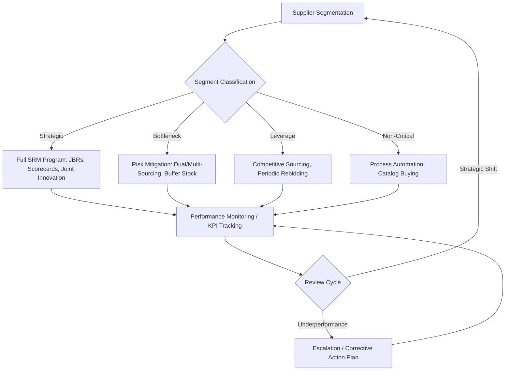

## Definition and Scope of SRM

### Definition

**Supplier Relationship Management (SRM)** is the systematic, enterprise-wide discipline of planning for and managing all interactions with third-party organizations that supply goods, materials, or services to a buying organization. It extends beyond transactional procurement into a structured approach for evaluating supplier contributions, segmenting the supplier base by strategic importance, and developing collaborative or arms-length strategies appropriate to each segment.

**Key Points**

- SRM treats suppliers as assets whose value can be actively managed and grown, not merely as vendors to be negotiated down on price
- It is bidirectional: it governs how the buying organization behaves toward suppliers, not only what suppliers must deliver
- SRM operates at both the strategic level (segmentation, governance frameworks, relationship investment decisions) and the operational level (day-to-day contract execution, performance tracking, issue resolution)
- The discipline sits at the intersection of procurement, supply chain management, legal/contract management, and risk management

### Scope

The scope of SRM spans the full lifecycle of a supplier relationship, distinct from the narrower transactional scope of purchasing.

**Scope — In:**

- Supplier segmentation (classifying suppliers by spend, risk, and strategic value)
- Relationship governance structures (executive sponsorship, joint business reviews, escalation paths)
- Performance management (scorecards, KPIs, SLAs)
- Risk management (financial health, geopolitical exposure, single-source dependency)
- Collaborative value creation (joint innovation, cost-reduction programs, co-development)
- Contract lifecycle management as it pertains to relationship terms
- Dual/multi-sourcing strategy as a risk-mitigation and leverage mechanism (see Related Topics)

**Scope — Out (typically handled by adjacent functions):**

- Day-to-day purchase order processing (transactional procurement/P2P)
- Raw logistics execution (handled by logistics/supply chain operations)
- Initial supplier discovery and onboarding mechanics (sourcing function, though SRM informs sourcing strategy)

### The SRM Segmentation Model

Most SRM frameworks segment suppliers along two axes: **spend/profit impact** and **supply risk/complexity**, commonly visualized via the Kraljic Matrix.

<svg xmlns="http://www.w3.org/2000/svg" viewBox="0 0 640 480">
<text x="320" y="24" font-size="16" font-weight="bold" text-anchor="middle" fill="#1a1a1a">Supplier Segmentation — Kraljic Matrix (svg_diagram)</text>

<line x1="100" y1="420" x2="580" y2="420" stroke="#333" stroke-width="2" />
<line x1="100" y1="420" x2="100" y2="60" stroke="#333" stroke-width="2" />

<text x="340" y="455" font-size="14" text-anchor="middle" fill="#333">Supply Risk / Complexity →</text>

<text x="60" y="240" font-size="14" text-anchor="middle" fill="#333" transform="rotate(-90 60 240)">Profit / Spend Impact →</text>

<line x1="340" y1="60" x2="340" y2="420" stroke="#999" stroke-width="1" stroke-dasharray="4,4" />
<line x1="100" y1="240" x2="580" y2="240" stroke="#999" stroke-width="1" stroke-dasharray="4,4" />

<rect x="100" y="240" width="240" height="180" fill="#e8f4ea" stroke="#4a7c59" stroke-width="1" />
<text x="220" y="330" font-size="13" font-weight="bold" text-anchor="middle" fill="#2d5238">Non-Critical</text>
<text x="220" y="348" font-size="11" text-anchor="middle" fill="#2d5238">(low risk, low spend)</text>
<text x="220" y="366" font-size="11" text-anchor="middle" fill="#2d5238">Strategy: Efficient process,</text>
<text x="220" y="380" font-size="11" text-anchor="middle" fill="#2d5238">automate / e-procurement</text>
<rect x="340" y="240" width="240" height="180" fill="#fdecea" stroke="#b3453b" stroke-width="1" />
<text x="460" y="330" font-size="13" font-weight="bold" text-anchor="middle" fill="#7a2e28">Bottleneck</text>
<text x="460" y="348" font-size="11" text-anchor="middle" fill="#7a2e28">(high risk, low spend)</text>
<text x="460" y="366" font-size="11" text-anchor="middle" fill="#7a2e28">Strategy: Secure supply,</text>
<text x="460" y="380" font-size="11" text-anchor="middle" fill="#7a2e28">dual/multi-source</text>
<rect x="100" y="60" width="240" height="180" fill="#eaf1fd" stroke="#3b5fb3" stroke-width="1" />
<text x="220" y="150" font-size="13" font-weight="bold" text-anchor="middle" fill="#28407a">Leverage</text>
<text x="220" y="168" font-size="11" text-anchor="middle" fill="#28407a">(low risk, high spend)</text>
<text x="220" y="186" font-size="11" text-anchor="middle" fill="#28407a">Strategy: Competitive bidding,</text>
<text x="220" y="200" font-size="11" text-anchor="middle" fill="#28407a">exploit market power</text>
<rect x="340" y="60" width="240" height="180" fill="#fdf3ea" stroke="#b3803b" stroke-width="1" />
<text x="460" y="150" font-size="13" font-weight="bold" text-anchor="middle" fill="#7a5228">Strategic</text>
<text x="460" y="168" font-size="11" text-anchor="middle" fill="#7a5228">(high risk, high spend)</text>
<text x="460" y="186" font-size="11" text-anchor="middle" fill="#7a5228">Strategy: Deep partnership,</text>
<text x="460" y="200" font-size="11" text-anchor="middle" fill="#7a5228">joint innovation, SRM-intensive</text>
</svg>

Full SRM programs (executive sponsorship, joint scorecards, innovation pipelines) are concentrated on **Strategic** suppliers. **Bottleneck** suppliers are where dual sourcing is most often justified — the risk of disruption from a single supplier is high even though spend is relatively small.

### SRM Process Flow

### Core SRM Components

1. **Supplier Segmentation** — classification framework (Kraljic-style or custom) driving differentiated treatment
2. **Governance Model** — defines cadence and forums (executive business reviews, operational reviews) and escalation authority
3. **Performance Management** — KPIs such as On-Time-In-Full (OTIF), quality defect rate (PPM), cost variance, responsiveness
4. **Risk Management** — continuous monitoring of financial stability, single-source exposure, geopolitical and compliance risk
5. **Relationship Development** — trust-building mechanisms, joint value creation, innovation-sharing agreements
6. **Contract & Commercial Management** — SLAs, pricing mechanisms, terms renewal cycles tied to performance outcomes

### Example

A manufacturer segments 500 suppliers by annual spend and criticality. Twelve are classified **Strategic** (custom semiconductor components, single-source, $50M+ combined annual spend). For these twelve, the manufacturer stands up quarterly joint business reviews, shares a rolling 18-month demand forecast, and co-invests in a supplier's capacity expansion. A separate group of eight **Bottleneck** suppliers (a specialty resin available from only two global producers) triggers a formal dual-sourcing initiative to qualify a second approved source and reduce single-point-of-failure risk — this bottleneck category is precisely where dual sourcing programs are typically scoped and funded.

### Distinguishing SRM from Related Disciplines

| Discipline | Primary Focus | Time Horizon |
| --- | --- | --- |
| Procurement / Purchasing | Transaction execution, PO processing | Short-term, per-transaction |
| Sourcing | Supplier selection, RFx, contract award | Project-based |
| SRM | Ongoing relationship value, risk, and performance across the supplier lifecycle | Long-term, continuous |
| Supply Chain Management | End-to-end flow of goods, logistics, inventory | Operational, continuous |

[Inference] Organizations with immature procurement functions often conflate SRM with sourcing because both involve supplier interaction; the distinguishing factor is that SRM persists after contract award and governs the relationship for its full duration, whereas sourcing concludes once a contract is signed.

**Next Steps / Related Topics**

- Strategic vs. Transactional Supplier Segmentation Frameworks
- The Kraljic Portfolio Purchasing Model (deep dive)
- Rationale and Triggers for Dual Sourcing Strategy
- Supplier Performance KPIs and Scorecard Design
- Supplier Risk Management and Business Continuity Planning
- SRM Governance Structures (Executive Sponsorship, JBR Cadence)
- Total Cost of Ownership (TCO) vs. Purchase Price in Supplier Evaluation
- SRM Technology Stack (SRM software, supplier portals, integration with ERP)