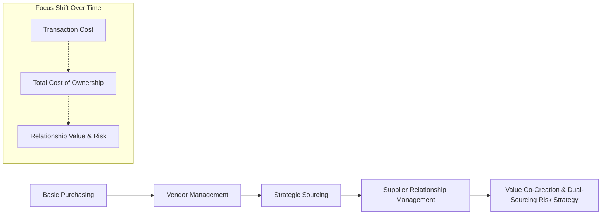

## SRM Versus Traditional Vendor Management

### Overview

Traditional Vendor Management and Supplier Relationship Management represent two distinct philosophies for handling external supply relationships. Vendor Management is transactional and price-centric, evolving historically from basic purchasing functions. SRM is strategic and value-centric, treating select suppliers as extensions of the enterprise's own capability base. The distinction is not merely terminological — it drives different organizational structures, metrics, contract designs, and technology investments.

**Key Points**

- Vendor Management optimizes each transaction independently; SRM optimizes the relationship's cumulative value over time
- Vendor Management is largely reactive (respond to price changes, process orders); SRM is proactive (forecast risk, co-develop capability)
- The two are not mutually exclusive — most organizations run a Vendor Management approach for commodity/non-critical spend and layer SRM on top for strategic and bottleneck suppliers
- SRM requires cross-functional involvement (engineering, quality, finance, legal); Vendor Management is typically procurement-owned in isolation

### Core Differences

| Dimension | Traditional Vendor Management | Supplier Relationship Management |
| --- | --- | --- |
| Primary objective | Lowest price per transaction | Total value and long-term risk-adjusted cost |
| Relationship posture | Arms-length, adversarial-leaning | Collaborative, partnership-oriented (for strategic tier) |
| Time horizon | Per-contract or per-PO | Multi-year, lifecycle-based |
| Metrics | Price variance, delivery compliance | OTIF, quality PPM, innovation contribution, TCO, risk exposure |
| Supplier count treated equally | Often flat/undifferentiated | Explicitly segmented (Kraljic-style tiers) |
| Information sharing | Minimal, need-to-know | Structured sharing (forecasts, roadmaps, cost breakdowns) |
| Organizational ownership | Procurement/purchasing department alone | Cross-functional (procurement, engineering, quality, finance, exec sponsors) |
| Risk management | Reactive (respond to disruption after it occurs) | Proactive (continuous monitoring, dual sourcing, contingency planning) |
| Contract structure | Fixed-price, transactional terms | Performance-linked terms, gain-sharing, joint SLAs |
| Technology | Basic PO/ERP systems | Dedicated SRM platforms, supplier portals, integrated analytics |

### Evolutionary Relationship

SRM did not replace vendor management; it emerged as a strategic layer built on top of it once organizations recognized that treating all suppliers identically left value on the table and risk unmanaged for critical suppliers.

### Why the Distinction Matters for Dual Sourcing

Traditional Vendor Management typically treats dual sourcing purely as a price-leverage tactic: maintain two vendors and play them against each other on cost per unit. SRM reframes dual sourcing as a **risk-and-value strategy**:

- Vendor Management lens: "Which of the two suppliers gives the lowest unit price this quarter?"
- SRM lens: "What is our single-source exposure on this component, what does business continuity require, and how do we structure the split (e.g., 70/30 volume allocation) to preserve competitive tension while incentivizing both suppliers to invest in capability?"

This reframing changes how the relationship is contractually and operationally managed — SRM-driven dual sourcing includes joint capacity planning and performance-linked volume allocation, not just periodic re-bidding.

### Example

**Vendor Management approach:** A company purchasing packaging materials issues an RFQ every 12 months to three vendors and awards 100% of volume to the lowest bidder, switching suppliers whenever price shifts by more than 2%. Minimal ongoing engagement between orders; no shared forecasting.

**SRM approach:** The same company designates packaging as a Bottleneck category (per Kraljic segmentation), qualifies two approved suppliers, and contractually allocates volume 60/40 based on a combined performance score (price, quality PPM, delivery reliability, responsiveness to demand spikes). Quarterly reviews adjust the allocation split and share a 6-month rolling demand forecast with both suppliers to support their capacity planning.

**Output**

| Metric | Vendor Management Outcome | SRM Outcome |
| --- | --- | --- |
| Price volatility exposure | High (annual re-bid cycles) | Moderate (locked structure with periodic rebalancing) |
| Supply continuity risk | High (single award, switching lag) | Lower (dual-source with defined allocation) |
| Supplier investment incentive | Low (no guaranteed volume) | Higher (performance-linked volume guarantees) |

[Inference] Organizations transitioning from Vendor Management to SRM commonly underestimate the internal coordination cost — shifting from a procurement-only function to a cross-functional governance model typically requires new roles (e.g., a Supplier Relationship Manager) and executive sponsorship that a pure vendor-management structure does not need.

### When Traditional Vendor Management Remains Appropriate

SRM's overhead (governance meetings, joint scorecards, relationship investment) is not justified for every supplier. Traditional vendor management remains the efficient default for:

- Non-Critical / Leverage segment suppliers (per Kraljic Matrix) with many substitutable alternatives
- Low-spend, low-risk commodity purchases
- One-off or short-duration contracts with no repeat-business intent

**Related Topics**

- Kraljic Portfolio Purchasing Model and Supplier Segmentation
- Total Cost of Ownership (TCO) vs. Unit Price Evaluation
- Organizational Design for SRM (Supplier Relationship Manager role, cross-functional governance)
- Contract Design for Performance-Linked Supplier Agreements
- Dual Sourcing Volume Allocation Models (e.g., 70/30, 60/40 splits)
- Supplier Scorecards and KPI Frameworks
- Transitioning from Transactional Procurement to Strategic SRM