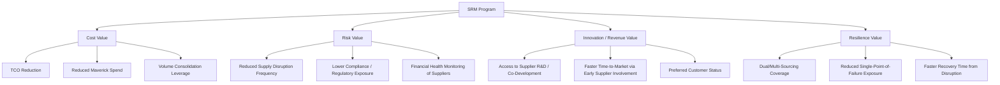

## Business Case and Value Proposition for SRM

### Overview

The business case for SRM rests on the argument that supplier spend represents one of the largest controllable cost bases in most organizations — frequently 50-80% of revenue in manufacturing and distribution sectors — and that the marginal return on actively managing key supplier relationships exceeds the return on managing them passively. The value proposition spans four categories: cost, risk, revenue/innovation, and resilience.

**Key Points**

- SRM shifts the evaluation frame from cost minimization to value maximization across the relationship lifecycle
- A credible business case quantifies value in at least two dimensions: hard savings (measurable cost reduction) and soft/strategic value (risk avoidance, innovation access)
- Dual sourcing is frequently the flagship initiative used to justify SRM investment because its ROI is comparatively easy to model (disruption cost avoided vs. program cost)
- Executive sponsorship is typically required because SRM value realization crosses procurement, engineering, quality, and finance boundaries

### The Four Value Pillars

### 1. Cost Value

- **Total Cost of Ownership (TCO) reduction** rather than unit-price reduction alone — capturing logistics, quality-failure cost, inventory carrying cost, and administrative overhead
- **Reduced maverick spend** — off-contract purchasing that bypasses negotiated terms, which structured SRM governance suppresses through consolidated contracts and preferred-supplier enforcement
- **Volume consolidation leverage** — segmenting and concentrating spend with fewer, better-managed suppliers to unlock pricing tiers unavailable to fragmented buying

### 2. Risk Value

- **Reduced disruption frequency** through proactive financial-health and capacity monitoring of critical suppliers, catching early-warning signals (late deliveries, quality drift, credit rating changes) before they cascade into stockouts
- **Compliance and regulatory exposure reduction** — SRM governance embeds supplier audits (labor practices, environmental compliance, cybersecurity posture) that ad-hoc vendor management typically skips
- **Concentration risk quantification** — SRM formally tracks single-source dependency as a metric, which is the direct precursor to justifying a dual-sourcing investment

### 3. Innovation / Revenue Value

- **Early Supplier Involvement (ESI)** in product design, giving access to supplier engineering expertise before specifications are frozen, often yielding design-for-manufacturability improvements unavailable through arms-length purchasing
- **Preferred customer status** — suppliers allocate scarce capacity, priority R&D attention, and favorable terms to customers who invest in the relationship, which matters disproportionately during industry-wide shortages
- **Joint cost-reduction programs** (value engineering workshops, shared productivity gains) that only function when both parties trust each other with cost-structure transparency

### 4. Resilience Value (Dual/Multi-Sourcing Specific)

This is the pillar most directly tied to dual sourcing and is often the easiest to build a quantifiable ROI model around.

$$\text{Expected Disruption Cost} = P(\text{disruption}) \times \text{Impact}(\text{revenue loss} + \text{expediting cost} + \text{reputational cost})$$

Dual sourcing reduces $P(\text{disruption})$ for a given component by distributing dependency across two qualified sources, at the cost of forfeiting some single-source volume leverage and incurring dual-qualification overhead.

### Building the ROI Model

A defensible SRM business case typically nets the program's cost against quantified benefit categories:

| Cost Side | Benefit Side |
| --- | --- |
| Program governance overhead (SRM manager, JBR cadence) | TCO reduction (%) on strategic/bottleneck spend |
| Second-source qualification cost (for dual sourcing) | Avoided disruption cost (expected value) |
| SRM technology/platform licensing | Reduced maverick spend recovered |
| Cross-functional time investment | Innovation value (new product revenue attributable to ESI) |

**Example**

A company spends $40M annually on a single-source electronic component classified as Bottleneck. Historical data shows a 15% annual probability of a disruption event costing $3M (expediting, line-down costs, lost sales). Expected annual disruption cost:

$$0.15 \times \$3{,}000{,}000 = \$450{,}000$$

Qualifying a second source costs $200,000 (one-time qualification, testing, audits) plus an estimated 3% price premium on the 30% of volume shifted to the new supplier ($40M × 30% × 3% = $360,000/year in that year's forgone leverage). If dual sourcing reduces disruption probability to 3%, expected annual disruption cost falls to $90,000 — a $360,000/year avoided-cost benefit, roughly offsetting the ongoing premium, with the one-time qualification cost recovered within the first year purely on risk reduction, before counting negotiating-leverage or resilience benefits that are harder to quantify.

[Inference] This style of expected-value calculation is standard practice for justifying dual-sourcing investment, but real-world models are frequently more sensitive to the disruption-impact estimate than the probability estimate, since impact figures (line-down cost, reputational cost) are harder to benchmark than historical disruption frequency.

### Common Objections and Counter-Arguments

| Objection | SRM Counter-Argument |
| --- | --- |
| "SRM adds administrative overhead we don't need" | Overhead is scoped to Strategic/Bottleneck tiers only (typically 10-20% of supplier count, 70-80% of spend/risk) |
| "Dual sourcing raises unit cost" | Model shows expected disruption cost avoided typically exceeds the price premium for genuinely critical/bottleneck items |
| "We've never had a major disruption" | Absence of past disruption is not evidence of low future risk, particularly under geopolitical or single-region supply concentration [Inference] |
| "Suppliers won't share cost/capacity data" | Preferred-customer positioning and long-term volume commitments are typically what earns that transparency — it is a program outcome, not a prerequisite |

### Presenting the Business Case

Effective SRM business cases to executive sponsors typically include:

1. Current-state spend and risk segmentation (Kraljic Matrix view)
2. Quantified exposure on top 3-5 single-source/bottleneck risks
3. Cost-benefit model for proposed interventions (dual sourcing, JBR governance, etc.)
4. Pilot scope (start with highest-risk category rather than enterprise-wide rollout)
5. Success metrics and review cadence

**Next Steps / Related Topics**

- Total Cost of Ownership (TCO) Modeling Methodology
- Quantifying Supply Disruption Risk (Expected Value Models)
- Kraljic Portfolio Purchasing Model and Supplier Segmentation
- Rationale and Triggers for Dual Sourcing Strategy
- Early Supplier Involvement (ESI) in Product Development
- SRM Pilot Program Design and Scoping
- Executive Sponsorship Models for Cross-Functional SRM Governance