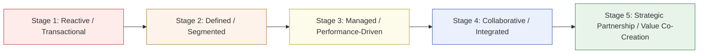

## SRM Maturity Model Stages

### Overview

An SRM Maturity Model describes the progressive stages an organization moves through as its supplier management capability evolves from purely transactional and reactive to fully strategic and collaborative. Maturity models are used diagnostically (to assess current-state capability) and prescriptively (to sequence investment priorities). Most published frameworks (including those from major consultancies and procurement research bodies) converge on a similar 4-to-5-stage structure, differing mainly in naming and granularity.

**Key Points**

- Maturity is not a single organization-wide state — most organizations sit at different maturity levels for different supplier segments simultaneously (e.g., mature SRM for Strategic suppliers, low maturity for Non-Critical suppliers)
- Progression through stages typically requires investment in three parallel dimensions: process/governance, technology/data, and organizational capability (people, roles, executive sponsorship)
- Skipping stages is uncommon in practice — attempting to run Stage 4 collaborative programs without Stage 2 data/process foundations tends to produce governance theater without substance [Inference]
- Dual sourcing as a formal, data-driven risk strategy typically only becomes systematic at mid-to-upper maturity stages, once supplier segmentation and risk visibility exist

### The Five-Stage Maturity Model

### Stage 1: Reactive / Transactional

**Characteristics**

- No formal supplier segmentation — all suppliers treated with roughly equal process rigor
- Procurement decisions driven by lowest price per transaction
- No systematic performance tracking beyond basic delivery/invoice matching
- Supplier interactions are ad hoc, typically limited to order placement and dispute resolution
- Risk management is reactive — issues addressed only after a disruption occurs

**Typical Technology**: Basic ERP/PO systems, spreadsheet-based tracking, no dedicated SRM tooling

**Dual Sourcing Posture**: Informal or accidental (multiple suppliers used for administrative convenience, not strategic risk mitigation)

### Stage 2: Defined / Segmented

**Characteristics**

- Formal supplier segmentation introduced (typically Kraljic Matrix or equivalent spend/risk framework)
- Supplier data centralized (master supplier list, basic spend categorization)
- Early-stage KPIs defined, though tracking may still be manual
- Recognition that Strategic and Bottleneck suppliers require different treatment than Leverage/Non-Critical

**Typical Technology**: Supplier master data management, spend analytics tools, spreadsheet-based scorecards

**Dual Sourcing Posture**: Segmentation identifies which categories carry single-source risk, but formal dual-sourcing programs are not yet systematized

### Stage 3: Managed / Performance-Driven

**Characteristics**

- Standardized scorecards and KPIs tracked consistently across the Strategic/Bottleneck tiers (OTIF, PPM, cost variance)
- Regular (typically quarterly) performance reviews with key suppliers
- Formal risk monitoring processes for top-tier suppliers (financial health checks, capacity audits)
- Contract terms begin incorporating performance clauses (SLAs, penalty/incentive structures)
- Dual sourcing becomes a deliberate, evaluated strategy for identified Bottleneck-category items, though execution may still be inconsistent across categories

**Typical Technology**: Dedicated SRM or supplier performance management software, integrated dashboards, automated KPI collection where source systems allow

**Dual Sourcing Posture**: Systematic identification of single-source risk exposure; second-source qualification initiated for highest-risk items, often reactively triggered by a near-miss disruption rather than proactively planned

### Stage 4: Collaborative / Integrated

**Characteristics**

- Joint Business Reviews (JBRs) with executive-level participation from both organizations
- Bidirectional information sharing: demand forecasts, capacity plans, cost breakdowns shared with trusted strategic suppliers
- Early Supplier Involvement (ESI) embedded into product development processes
- Cross-functional governance (engineering, quality, finance jointly own supplier relationships, not procurement alone)
- Dual/multi-sourcing formalized with defined volume-allocation models tied to performance, not just price

**Typical Technology**: Integrated SRM platforms with supplier portals, API-level data exchange (EDI/API integration for forecasts and inventory visibility), collaborative planning tools

**Dual Sourcing Posture**: Proactive, planned dual sourcing with contractually defined allocation splits (e.g., 70/30) and joint capacity planning with both sources — no longer purely reactive to disruption events

### Stage 5: Strategic Partnership / Value Co-Creation

**Characteristics**

- Selected top-tier suppliers treated as extensions of internal R&D and operations
- Joint innovation pipelines, co-investment in capacity or technology
- Gain-sharing commercial models (both parties share upside from joint cost/process improvements)
- Supplier input incorporated into long-term corporate strategy, not just product/component decisions
- Risk management is predictive/anticipatory (scenario planning, supply network mapping beyond Tier 1 suppliers)

**Typical Technology**: Advanced analytics/AI-assisted risk monitoring, multi-tier supply chain visibility platforms, integrated planning systems spanning both organizations

**Dual Sourcing Posture**: Dual/multi-sourcing is one lever within a broader resilience strategy that may also include strategic inventory buffers, supplier-held safety stock agreements, and joint contingency planning exercises — sourcing decisions are made with full visibility into sub-tier (Tier 2/3) supplier risk, not just the direct supplier relationship

### Maturity Assessment Dimensions

| Dimension | Stage 1 | Stage 3 | Stage 5 |
| --- | --- | --- | --- |
| Segmentation | None | Formal (Kraljic-style) | Dynamic, continuously refined |
| Performance tracking | Manual, ad hoc | Standardized scorecards | Predictive analytics |
| Governance | None | Periodic reviews | Executive JBRs, joint governance boards |
| Data sharing | None/minimal | One-directional (supplier reports to buyer) | Bidirectional, real-time |
| Risk posture | Reactive | Monitored | Predictive, multi-tier |
| Dual sourcing approach | Accidental | Reactive to risk identification | Proactive, integrated into resilience strategy |

### Example

An LGU-adjacent manufacturing firm assesses its own maturity: spend analysis exists and suppliers are informally grouped by category (Stage 2 characteristics), but no formal scorecards or review cadence exist for even its top five suppliers (Stage 1 characteristics for performance management). This mixed profile is typical — the firm is assessed as **early Stage 2**, with a clear next step being formalization of Kraljic-style segmentation *and* introduction of standardized scorecards for its top 10% of suppliers by spend, rather than attempting to leap to JBR-style collaboration (Stage 4) without that foundation.

### Progression Strategy

- **Stage 1 → 2**: Invest in supplier data centralization and formal segmentation methodology
- **Stage 2 → 3**: Introduce standardized KPIs and a review cadence for the Strategic/Bottleneck tiers specifically (not the full supplier base, to avoid overextending governance resources)
- **Stage 3 → 4**: Build cross-functional governance structures and pilot JBRs with the highest-value 2-3 strategic suppliers before scaling
- **Stage 4 → 5**: Formalize gain-sharing and co-investment mechanisms; extend risk visibility beyond Tier 1 suppliers

[Unverified] Exact stage counts and naming vary across published models (some vendors publish 3-stage or 6-stage variants); the five-stage structure presented here reflects a commonly used synthesis rather than a single universally standardized framework.

**Related Topics**

- Kraljic Portfolio Purchasing Model and Supplier Segmentation
- Supplier Scorecards and KPI Design
- Joint Business Review (JBR) Structure and Cadence
- Early Supplier Involvement (ESI) in Product Development
- Multi-Tier Supply Chain Risk Visibility (Tier 2/3 Mapping)
- SRM Technology Stack Selection by Maturity Stage
- Rationale and Triggers for Dual Sourcing Strategy