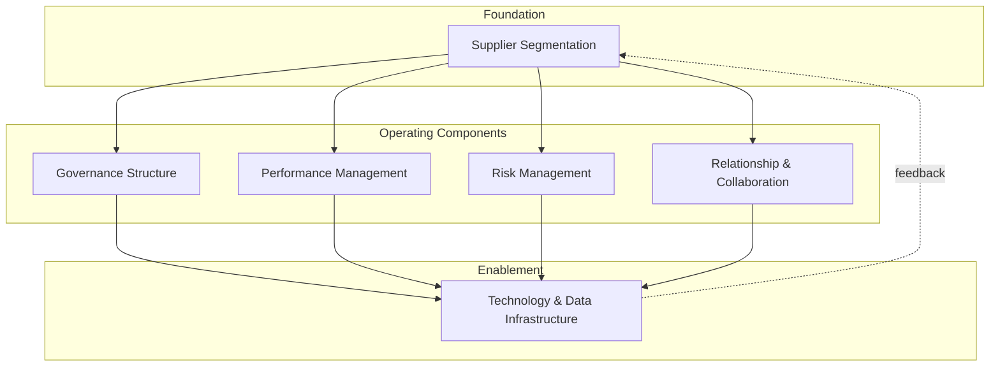

## Core Components of an SRM Framework

### Overview

An SRM framework is the structured set of building blocks — organizational, process, and technological — that operationalize the discipline across a supplier base. While specific implementations vary by industry and organizational maturity, most functioning SRM frameworks share a common architecture of six interlocking components: segmentation, governance, performance management, risk management, relationship/collaboration mechanisms, and enabling technology.

**Key Points**

- No single component functions in isolation — segmentation determines which suppliers receive which level of governance and collaboration investment
- The framework must be differentiated by supplier tier; applying full framework rigor uniformly across all suppliers is a common implementation failure that wastes governance capacity on low-risk, low-spend suppliers
- Components map directly to maturity stages — a Stage 1 organization may have rudimentary or absent versions of most components, while a Stage 5 organization has all six operating in an integrated, data-connected way
- Dual sourcing decisions draw on at least three components directly: segmentation (identifying bottleneck risk), risk management (quantifying exposure), and governance (allocating volume/managing the dual relationship)

### Framework Architecture

### Component 1: Supplier Segmentation

The foundational component — every other component's intensity is calibrated based on which segment a supplier falls into.

- **Methodology**: Typically the Kraljic Matrix (spend impact × supply risk) or a custom-weighted scoring model incorporating additional factors (switching cost, geographic concentration, sustainability criteria)
- **Output**: Tiered supplier categories (e.g., Strategic, Bottleneck, Leverage, Non-Critical) that determine resource allocation
- **Review cadence**: Segmentation is not static — supplier classification should be reassessed periodically (typically annually, or triggered by material spend/risk changes)

### Component 2: Governance Structure

Defines who is accountable for the relationship and through what forums decisions get made.

- **Executive sponsorship**: Strategic-tier suppliers typically require a named executive sponsor on the buying-organization side
- **Review cadence**: Structured meeting rhythm — Joint Business Reviews (JBRs) quarterly or semi-annually for strategic suppliers, operational reviews monthly for tactical issues
- **Escalation paths**: Defined authority levels for resolving disputes without defaulting to contract termination
- **RACI/ownership model**: Clarifies whether procurement, category management, or a dedicated Supplier Relationship Manager role owns day-to-day relationship management

### Component 3: Performance Management

The measurement backbone of the framework.

- **KPI categories**: Delivery (On-Time-In-Full/OTIF), Quality (defect rate/PPM), Cost (price variance, TCO trend), Responsiveness (lead time flexibility, issue resolution speed), Innovation (ideas contributed, co-development participation)
- **Scorecards**: Standardized, typically weighted composite scores enabling supplier ranking and trend tracking
- **Feedback loop**: Performance data feeds back into segmentation (a chronically underperforming Strategic supplier may be downgraded) and governance (triggers escalation or corrective action plans)

$$\text{Composite Score} = \sum_{i=1}^{n} w_i \cdot k_i$$

where $k_i$ is the normalized score on KPI $i$ and $w_i$ is its assigned weight, with $\sum w_i = 1$.

### Component 4: Risk Management

Proactive identification and mitigation of supply continuity threats.

- **Risk categories monitored**: Financial health (credit ratings, payment history trends), operational (capacity utilization, single-plant dependency), geopolitical (regional concentration, trade policy exposure), compliance (regulatory, labor, environmental), cybersecurity (for suppliers with system integration)
- **Concentration risk tracking**: Explicit measurement of single-source dependency by spend category — this is the direct trigger mechanism for dual-sourcing initiatives
- **Contingency planning**: Business continuity plans for top-risk suppliers, including pre-qualified alternate sources

**Dual Sourcing as a Risk Management Output**: When risk management identifies a Bottleneck-category supplier with unacceptable single-source exposure, the standard mitigation output is a dual-sourcing initiative — formally linking this framework component to the broader dual-sourcing strategy that spans governance (volume allocation), performance management (comparative supplier scorecards), and collaboration (joint capacity planning with both sources).

### Component 5: Relationship & Collaboration Mechanisms

The component that differentiates SRM from vendor management most sharply.

- **Information sharing protocols**: Structured sharing of demand forecasts, capacity plans, cost breakdowns — calibrated by trust level and segment
- **Early Supplier Involvement (ESI)**: Formal process for engaging suppliers during product/service design phases rather than after specifications are finalized
- **Joint improvement programs**: Value engineering workshops, gain-sharing arrangements, co-investment structures
- **Relationship health assessment**: Qualitative measures (trust, communication quality, mutual investment) supplementing quantitative scorecards — often gathered via structured relationship surveys from both sides

### Component 6: Technology & Data Infrastructure

The enabling layer that makes the other five components scalable and data-driven rather than manual and inconsistent.

- **Core capabilities needed**: Centralized supplier master data, automated KPI data collection (integration with ERP/quality systems), supplier portals for bidirectional document/data exchange, risk-monitoring feeds (financial health databases, news/geopolitical risk feeds)
- **Integration points**: SRM technology typically needs to interface with ERP (spend/transaction data), quality management systems (defect data), and increasingly with supply-chain risk intelligence platforms
- **Maturity dependency**: Technology sophistication should match process maturity — deploying an advanced SRM platform onto Stage 1 processes (undefined segmentation, no standardized KPIs) typically yields poor adoption because there is no consistent data or process to digitize [Inference]

### How Components Combine by Supplier Tier

| Supplier Tier | Segmentation | Governance | Performance Mgmt | Risk Mgmt | Collaboration | Technology |
| --- | --- | --- | --- | --- | --- | --- |
| Strategic | Formal, reviewed annually | Executive JBRs, quarterly | Full scorecard, all KPI categories | Continuous monitoring, contingency plans | ESI, joint innovation, gain-sharing | Full portal integration, real-time data |
| Bottleneck | Formal | Operational reviews | Focused on delivery/risk KPIs | Priority monitoring, dual-source qualification | Capacity planning coordination | Portal access, basic data exchange |
| Leverage | Formal | Periodic re-bid reviews | Price/delivery KPIs only | Standard monitoring | Minimal, transactional | Catalog/e-procurement systems |
| Non-Critical | Categorical only | None/automated | None or minimal | Low-priority monitoring | None | Automated purchasing only |

### Example

A mid-sized electronics assembler implements the framework for a single critical component category (power management ICs, classified Bottleneck due to two-supplier global market concentration). Segmentation flags the category; risk management quantifies 15% annual disruption probability given single-sourcing; governance stands up a monthly operational review with the incumbent supplier while a second source is qualified; performance management tracks both suppliers on identical scorecards once dual-sourced; collaboration mechanisms include sharing a 6-month rolling forecast with both suppliers to support their capacity planning; technology infrastructure is a shared spreadsheet-based scorecard initially, with a plan to migrate to a dedicated supplier portal once the dual-source relationship stabilizes.

**Next Steps / Related Topics**

- Kraljic Portfolio Purchasing Model and Supplier Segmentation
- Supplier Scorecards and KPI Design
- Joint Business Review (JBR) Structure and Cadence
- Supplier Risk Categories and Monitoring Methods
- Early Supplier Involvement (ESI) in Product Development
- SRM Technology Stack Selection and Integration Patterns
- Rationale and Triggers for Dual Sourcing Strategy
- Supplier Relationship Manager Role Design