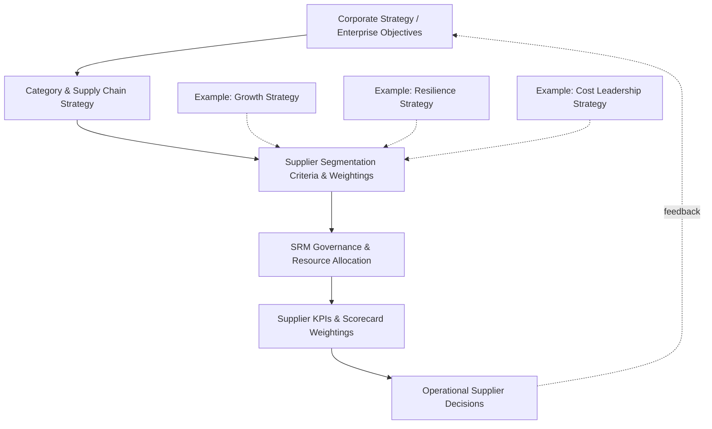

## Aligning SRM Strategy With Corporate Objectives

### Overview

An SRM strategy that is not explicitly linked to corporate-level objectives tends to drift toward procurement-only cost metrics and loses executive support over time. Alignment means translating enterprise strategic priorities — growth, cost discipline, resilience, sustainability, innovation — into concrete supplier segmentation criteria, KPI weightings, and governance investment decisions, so that supplier management activity demonstrably serves the same goals the rest of the organization is measured against.

**Key Points**

- Without explicit alignment, SRM defaults to a procurement-owned cost-reduction function, underrepresenting risk and innovation value that other executives care about
- Alignment is bidirectional: corporate strategy should shape supplier segmentation weightings, and supplier-derived intelligence (capacity constraints, innovation roadmaps) should feed back into corporate planning
- Different corporate strategic postures (growth vs. cost leadership vs. resilience-focused) justify different SRM emphases, including different appetites for dual/multi-sourcing
- Misalignment is a leading cause of SRM program failure — a program measured only on cost savings will systematically underinvest in risk mitigation like dual sourcing, even when the expected-value case for it is sound

### The Alignment Chain

### Mapping Corporate Objectives to SRM Emphasis

| Corporate Strategic Posture | SRM Segmentation Emphasis | KPI Weighting Shift | Dual Sourcing Implication |
| --- | --- | --- | --- |
| Growth / Market Expansion | Prioritize suppliers with scalable capacity | Weight capacity flexibility, lead-time performance higher | Dual sourcing to secure capacity headroom, not just risk mitigation |
| Cost Leadership | Prioritize spend concentration for leverage | Weight price/TCO higher | Dual sourcing limited to genuine Bottleneck risk (cost of redundancy scrutinized closely) |
| Resilience / Business Continuity | Prioritize single-source exposure identification | Weight risk/continuity metrics higher, even above short-term price | Dual/multi-sourcing treated as default policy for Bottleneck and select Strategic items |
| Innovation-Led Differentiation | Prioritize suppliers' R&D/technology capability | Weight innovation contribution, ESI participation higher | Dual sourcing evaluated partly on which supplier better supports co-development, not price alone |
| Sustainability / ESG Commitments | Prioritize supplier environmental/labor compliance | Weight ESG audit scores, carbon footprint data | Second-source qualification includes ESG vetting as a gating criterion |

### Translating Strategy Into Segmentation Weighting

A Kraljic-style segmentation model can be adapted so its risk and spend-impact axes are weighted according to corporate priorities rather than using generic default weightings.

$$\text{Risk Score} = w_1 \cdot \text{SingleSourceExposure} + w_2 \cdot \text{GeopoliticalRisk} + w_3 \cdot \text{FinancialInstability} + w_4 \cdot \text{ESGRisk}$$

An organization whose corporate strategy explicitly names supply chain resilience as a top-three priority would set $w_1$ (single-source exposure) and $w_2$ (geopolitical risk) higher than an organization prioritizing pure cost leadership, which shifts more Bottleneck-adjacent suppliers into formal dual-sourcing scope even at comparable absolute risk levels.

### Governance-Level Alignment Mechanisms

- **Shared scorecard visibility**: SRM performance dashboards presented in the same executive forums (quarterly business reviews, board risk committees) that review corporate KPIs, rather than siloed procurement reporting
- **Cross-functional steering committee**: Representation from finance, operations, and strategy — not procurement alone — in setting segmentation criteria and reviewing top-tier supplier decisions
- **Objective cascading**: Corporate OKRs/KPIs (e.g., "reduce single-source revenue exposure by 40% within 18 months") translated into specific, trackable SRM initiatives (e.g., named dual-sourcing qualification projects) rather than left as an abstract cost-reduction target
- **Budget ownership**: Resilience-driven SRM investments (like dual-source qualification premiums) should be justified and funded against the corporate risk-tolerance framework, not solely against procurement's annual cost-savings target — otherwise procurement is structurally incentivized to reject sound risk-mitigation spend

### Example

A hospital equipment manufacturer's board sets a corporate objective following a public supply disruption event: "reduce single-source dependency on safety-critical components to zero within 24 months," explicitly tying this to the company's business-continuity and regulatory-compliance risk posture, not framed as a cost-savings initiative. The SRM function responds by re-weighting its segmentation risk score to heavily penalize single-source status for any component classified as safety-critical, regardless of spend level (overriding the default Kraljic logic where low-spend items might otherwise be treated as Non-Critical). This reclassifies several previously "Non-Critical" low-spend components into a new "Safety-Critical" tier requiring mandatory dual-sourcing, funded from a corporate resilience budget rather than being evaluated against procurement's standard cost-reduction targets — because the corporate objective explicitly designated the initiative as strategic and risk-driven rather than as a savings program.

**Output**

| Before Alignment | After Alignment |
| --- | --- |
| Component X (low spend, single-source) classified Non-Critical, no dual-sourcing pressure | Component X reclassified Safety-Critical, mandatory second-source qualification |
| SRM measured solely on cost-savings-vs-target | SRM measured jointly on cost savings AND single-source exposure reduction |
| Dual-sourcing proposals compete against cost-savings target, often deprioritized | Dual-sourcing proposals funded from dedicated resilience budget, evaluated on risk-reduction criteria |

### Common Failure Modes

- **Metric mismatch**: SRM scorecards track only price/delivery while the board cares about resilience or ESG — creates a reporting gap that erodes executive confidence in the function
- **Orphaned strategy**: Corporate strategy sets ambitious resilience goals but SRM segmentation/governance criteria are never updated to reflect them, leaving the stated objective unimplemented
- **Procurement-only funding lens**: Dual-sourcing and other risk-driven initiatives evaluated purely against annual cost-savings targets, systematically undervaluing initiatives whose payoff is avoided low-probability, high-impact loss rather than guaranteed savings
- **Static alignment**: Corporate strategy shifts (e.g., from growth to cost discipline during a downturn) but segmentation weightings and governance investment are not re-evaluated, leaving the SRM program optimized for an outdated objective

[Inference] Because corporate strategic priorities shift more frequently than most SRM segmentation models are re-reviewed in practice, a formal periodic re-alignment checkpoint (e.g., annually, tied to corporate strategic planning cycles) is generally necessary to prevent the drift described above, though the specific cadence depends on how frequently a given organization's strategy itself changes.

**Related Topics**

- Kraljic Portfolio Purchasing Model and Weighted Segmentation Criteria
- Business Case and Value Proposition for SRM
- SRM Maturity Model Stages
- Executive Sponsorship and Cross-Functional Governance Models
- Rationale and Triggers for Dual Sourcing Strategy
- Supplier Risk Scoring Methodologies
- ESG Integration into Supplier Segmentation