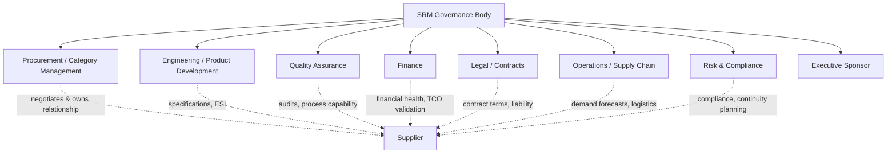

## Cross-Functional Stakeholders in SRM

### Overview

SRM cannot function as a procurement-only discipline once suppliers reach Strategic or Bottleneck classification — the decisions that matter (quality standards, engineering specifications, financial risk tolerance, legal exposure) live in other functions. A mature SRM program formally identifies which stakeholder groups must participate, at what stage, and with what authority, rather than leaving cross-functional input to informal, inconsistent engagement.

**Key Points**

- Stakeholder involvement should scale with supplier tier — Strategic suppliers require broad cross-functional governance, while Non-Critical suppliers may involve procurement alone
- Each stakeholder group brings a distinct risk/value lens that procurement typically cannot represent alone (e.g., only Quality can credibly assess a supplier's process capability; only Legal can assess contractual liability exposure)
- Dual sourcing decisions in particular require input from at least four stakeholder groups (Procurement, Engineering/Quality, Finance, and often Legal) because qualifying a second source touches technical validation, cost modeling, and contractual risk simultaneously
- Absence of a stakeholder group from governance is itself a risk signal — e.g., Finance's absence from strategic supplier reviews often correlates with SRM programs measured only on soft/qualitative value rather than validated financial impact [Inference]

### Core Stakeholder Map

### Stakeholder Roles and Contributions

**Procurement / Category Management**

- Owns the overall relationship and negotiation process
- Coordinates cross-functional input into a single supplier-facing position
- Maintains segmentation and governance cadence

**Engineering / Product Development**

- Defines technical specifications suppliers must meet
- Leads Early Supplier Involvement (ESI) — engaging suppliers during design phases for manufacturability and technical feasibility input
- Critical voice in dual-sourcing decisions: validates whether a candidate second source can actually meet technical requirements, not just commercial terms

**Quality Assurance**

- Conducts supplier process audits and capability assessments
- Owns defect-rate (PPM) tracking and corrective action processes
- For dual sourcing: performs qualification testing to certify a second source meets the same quality standards as the incumbent before volume is shifted

**Finance**

- Validates Total Cost of Ownership (TCO) models rather than relying on procurement's unit-price view alone
- Monitors supplier financial health (credit ratings, payment trends) as an input to risk scoring
- Builds and validates the business case / ROI model for major SRM investments, including dual-sourcing premium-vs-risk-avoidance calculations

**Legal / Contracts**

- Drafts and reviews contract terms, including performance clauses, SLAs, and termination conditions
- Assesses liability exposure, intellectual property protection (particularly relevant when sharing forecasts/specifications with suppliers under ESI), and regulatory compliance terms
- For dual sourcing: structures volume-allocation and exclusivity clauses so that qualifying a second source doesn't breach existing incumbent contract terms

**Operations / Supply Chain**

- Provides demand forecasts and capacity planning data shared with strategic suppliers
- Manages logistics and inventory implications of supplier decisions (e.g., dual-sourcing from geographically distant suppliers affecting lead times)
- Executes day-to-day operational coordination once governance decisions are made

**Risk & Compliance**

- Monitors geopolitical, regulatory, cybersecurity, and ESG risk factors specific to each supplier
- Owns business continuity and contingency planning for top-risk suppliers
- Often the function that formally triggers a dual-sourcing initiative when single-source exposure crosses a defined risk threshold

**Executive Sponsor**

- Provides authority to resolve cross-functional disagreements without escalation delay
- Represents the relationship at the supplier's equivalent executive level in Joint Business Reviews
- Ensures SRM initiatives remain aligned with corporate strategic objectives

### Stakeholder Involvement by Supplier Tier

| Stakeholder | Strategic Tier | Bottleneck Tier | Leverage Tier | Non-Critical Tier |
| --- | --- | --- | --- | --- |
| Procurement | Full ownership | Full ownership | Full ownership | Full ownership |
| Engineering | Deep, ongoing (ESI) | As-needed (qualification) | Minimal | None |
| Quality | Continuous audits | Qualification-focused | Periodic spot-checks | None/automated |
| Finance | TCO modeling, ROI validation | ROI validation for dual-source cases | Price variance tracking only | None |
| Legal | Full contract structuring | Contract review for new sources | Standard terms | Standard/template terms |
| Operations | Deep forecast sharing | Capacity coordination | Order-level coordination | Automated ordering |
| Risk & Compliance | Continuous monitoring | Priority monitoring | Standard monitoring | Low priority |
| Executive Sponsor | Named individual | Category-level oversight | None | None |

### Governance Forum Structure

### Example: Cross-Functional Involvement in a Dual-Sourcing Decision

A Bottleneck-category chemical input (single-sourced, 15% annual disruption probability) is flagged by **Risk & Compliance** during a routine concentration-risk review. **Procurement** initiates the second-source evaluation, identifying two candidate suppliers. **Engineering** validates that both candidates' material specifications meet process requirements — one candidate fails on a purity tolerance and is eliminated. **Quality** conducts on-site audits of the remaining candidate and runs qualification batches before certifying it as an approved source. **Finance** builds the expected-value model comparing the disruption-cost reduction against the price premium and one-time qualification cost, presenting the ROI case. **Legal** reviews the incumbent supplier's existing contract to confirm no exclusivity clause is breached by qualifying a second source, and drafts volume-allocation terms for both suppliers going forward. **Operations** updates demand forecasting and logistics planning to account for dual-source lead-time differences. The **Executive Sponsor** approves final budget allocation and communicates the decision to both suppliers' leadership.

**Output**

| Stakeholder | Decision Contributed |
| --- | --- |
| Risk & Compliance | Identified and quantified single-source exposure |
| Procurement | Sourced and shortlisted candidate second suppliers |
| Engineering | Technical qualification (eliminated non-conforming candidate) |
| Quality | Process/quality certification of approved second source |
| Finance | Validated ROI case, approved cost model |
| Legal | Contract structuring, confirmed no breach of existing terms |
| Operations | Logistics/forecast integration for dual-source model |
| Executive Sponsor | Final approval, relationship-level communication |

### Common Coordination Failures

- **Procurement-only decisions on Strategic suppliers**: Negotiating terms or qualifying sources without Engineering/Quality sign-off risks selecting a commercially attractive but technically non-conforming supplier
- **Finance excluded from ROI validation**: Business cases for dual sourcing built and approved without Finance review tend to understate true TCO impact of the price premium
- **Legal engaged too late**: Contract review happening after commercial terms are verbally agreed with a supplier creates renegotiation friction
- **No single accountable owner**: Diffusing cross-functional input without clear procurement ownership of final decision-making authority can stall time-sensitive risk-mitigation initiatives like dual sourcing

**Next Steps / Related Topics**

- SRM Governance Structures (Executive Sponsorship, JBR Cadence)
- Rationale and Triggers for Dual Sourcing Strategy
- Early Supplier Involvement (ESI) in Product Development
- Total Cost of Ownership (TCO) Modeling and Finance's Role
- Supplier Qualification and Audit Processes (Quality's Role)
- Contract Structuring for Multi-Source Supplier Agreements
- Business Case and Value Proposition for SRM