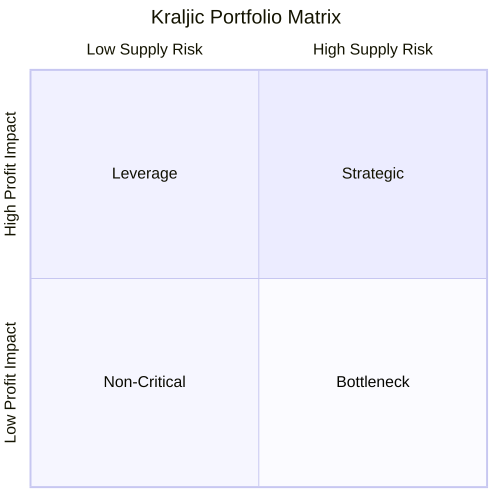
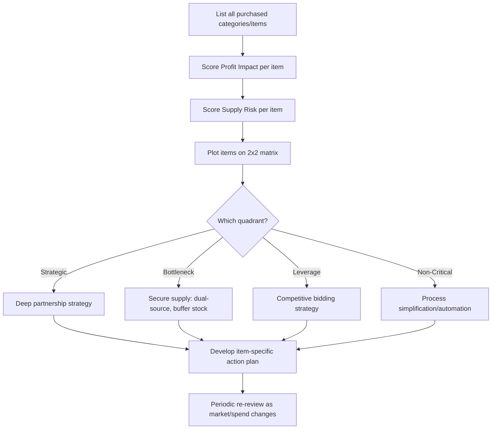

## Kraljic Portfolio Matrix Fundamentals

### Overview

The Kraljic Portfolio Matrix, introduced by Peter Kraljic in a 1983 Harvard Business Review article ("Purchasing Must Become Supply Management"), is the foundational framework for supplier/purchasing segmentation in SRM. It classifies purchased items (not suppliers directly, though the classification is often extended to the supplying relationship) along two axes — **profit impact** and **supply risk** — producing four quadrants that prescribe fundamentally different sourcing and relationship strategies.

**Key Points**

- The matrix classifies purchase *categories/items*, not suppliers directly; a single supplier may supply items falling into different quadrants
- The two axes are independent dimensions: profit impact is an internal/financial measure, supply risk is an external/market measure — a category can be high on one and low on the other
- The matrix is a diagnostic starting point, not an end state; Kraljic's original framework paired classification with a follow-on strategic positioning and action-planning phase
- Bottleneck-quadrant classification is the primary analytical trigger for dual/multi-sourcing strategy, since it explicitly identifies high supply risk regardless of spend size

### The Two Axes

**Profit Impact (Spend Impact)** — the significance of the purchased item to the organization's financial performance, typically operationalized via:

- Volume purchased / total spend
- Percentage of total procurement cost
- Impact on product quality or business growth

**Supply Risk (Supply Complexity)** — the difficulty and uncertainty involved in securing reliable supply, typically operationalized via:

- Number of available suppliers (market concentration)
- Availability of substitutes
- Entry barriers, lead times, logistical complexity
- Rate of technological/market change in the supply category

### The Four Quadrants

**Note**: The block above uses Mermaid `quadrantChart` syntax per the required raw-text formatting; a rendered equivalent SVG follows for direct visual reference in Obsidian.

<svg xmlns="http://www.w3.org/2000/svg" viewBox="0 0 640 480">
<text x="320" y="24" font-size="16" font-weight="bold" text-anchor="middle" fill="#1a1a1a">Kraljic Portfolio Matrix — Four Quadrants (svg_diagram)</text>
<line x1="100" y1="420" x2="580" y2="420" stroke="#333" stroke-width="2" />
<line x1="100" y1="420" x2="100" y2="60" stroke="#333" stroke-width="2" />

<text x="340" y="455" font-size="14" text-anchor="middle" fill="#333">Supply Risk →</text>

<text x="60" y="240" font-size="14" text-anchor="middle" fill="#333" transform="rotate(-90 60 240)">Profit Impact →</text>

<line x1="340" y1="60" x2="340" y2="420" stroke="#999" stroke-width="1" stroke-dasharray="4,4" />
<line x1="100" y1="240" x2="580" y2="240" stroke="#999" stroke-width="1" stroke-dasharray="4,4" />
<rect x="100" y="240" width="240" height="180" fill="#e8f4ea" stroke="#4a7c59" stroke-width="1" />
<text x="220" y="325" font-size="13" font-weight="bold" text-anchor="middle" fill="#2d5238">Non-Critical Items</text>
<text x="220" y="345" font-size="11" text-anchor="middle" fill="#2d5238">Many suppliers, low spend</text>
<text x="220" y="363" font-size="11" text-anchor="middle" fill="#2d5238">Strategy: Simplify &amp;</text>
<text x="220" y="379" font-size="11" text-anchor="middle" fill="#2d5238">automate procurement</text>
<rect x="340" y="240" width="240" height="180" fill="#fdecea" stroke="#b3453b" stroke-width="1" />
<text x="460" y="325" font-size="13" font-weight="bold" text-anchor="middle" fill="#7a2e28">Bottleneck Items</text>
<text x="460" y="345" font-size="11" text-anchor="middle" fill="#7a2e28">Few suppliers, low spend</text>
<text x="460" y="363" font-size="11" text-anchor="middle" fill="#7a2e28">Strategy: Secure volume,</text>
<text x="460" y="379" font-size="11" text-anchor="middle" fill="#7a2e28">dual/multi-source</text>
<rect x="100" y="60" width="240" height="180" fill="#eaf1fd" stroke="#3b5fb3" stroke-width="1" />
<text x="220" y="145" font-size="13" font-weight="bold" text-anchor="middle" fill="#28407a">Leverage Items</text>
<text x="220" y="165" font-size="11" text-anchor="middle" fill="#28407a">Many suppliers, high spend</text>
<text x="220" y="183" font-size="11" text-anchor="middle" fill="#28407a">Strategy: Competitive bidding,</text>
<text x="220" y="199" font-size="11" text-anchor="middle" fill="#28407a">exploit buying power</text>
<rect x="340" y="60" width="240" height="180" fill="#fdf3ea" stroke="#b3803b" stroke-width="1" />
<text x="460" y="145" font-size="13" font-weight="bold" text-anchor="middle" fill="#7a5228">Strategic Items</text>
<text x="460" y="165" font-size="11" text-anchor="middle" fill="#7a5228">Few suppliers, high spend</text>
<text x="460" y="183" font-size="11" text-anchor="middle" fill="#7a5228">Strategy: Deep partnership,</text>
<text x="460" y="199" font-size="11" text-anchor="middle" fill="#7a5228">joint planning, balance power</text>
</svg>

### Quadrant Definitions and Strategies

**Non-Critical Items** (Low Profit Impact, Low Supply Risk)

- Characteristics: Commodity items, many qualified suppliers, low individual transaction value, easily substitutable
- Strategy: Minimize administrative/process burden — automate via e-procurement/catalog buying, reduce number of transactions rather than negotiate hard on price
- Examples: Office supplies, standard MRO items

**Leverage Items** (High Profit Impact, Low Supply Risk)

- Characteristics: High spend, but many competing suppliers and low switching cost
- Strategy: Exploit purchasing power — competitive bidding, volume consolidation, periodic re-tendering to maintain price pressure
- Examples: Standard raw materials with multiple global producers, commodity packaging

**Bottleneck Items** (Low Profit Impact, High Supply Risk)

- Characteristics: Low spend but supplied by few sources, high switching cost, or specialized/proprietary nature
- Strategy: Secure supply continuity even at higher cost — this is the quadrant where **dual or multi-sourcing is most directly prescribed** as the standard mitigation, alongside safety stock and long-term contracts with volume guarantees
- Examples: Specialty chemicals available from only 1-2 global producers, single-source proprietary components

**Strategic Items** (High Profit Impact, High Supply Risk)

- Characteristics: High spend AND high supply risk — critical to the business and difficult to source
- Strategy: Deep, collaborative partnership — joint business planning, long-term contracts, co-investment, and often *deliberate* dual/multi-sourcing not purely for risk mitigation but to preserve negotiating balance while maintaining partnership depth with each source
- Examples: Custom semiconductor components, sole-design tooling, critical raw materials for core products

### Dual Sourcing Implications by Quadrant

| Quadrant | Typical Sourcing Approach | Dual Sourcing Rationale |
| --- | --- | --- |
| Non-Critical | Single or multiple ad hoc suppliers | Not a strategic concern — market has abundant substitutes |
| Leverage | Competitive multi-sourcing for price tension | Multi-sourcing driven by cost leverage, not risk |
| Bottleneck | Often starts single-source by market necessity | **Primary driver**: mitigate continuity risk from thin supplier market |
| Strategic | Deep single-source or managed dual-source | Dual-sourcing balances partnership depth against negotiating leverage and continuity risk |

[Inference] The Bottleneck quadrant is where dual sourcing decisions are most operationally clear-cut (a straightforward risk-mitigation case), while Strategic-quadrant dual sourcing is a more nuanced trade-off, because splitting volume across two strategic suppliers can dilute the depth of collaboration and co-investment each supplier is willing to commit to.

### Classification Process

### Scoring Methodology Example

Profit impact and supply risk are typically scored on a weighted multi-criteria basis rather than a single number, then normalized to plot position.

$$\text{Profit Impact Score} = w_1 \cdot (\%\text{ of total spend}) + w_2 \cdot (\text{impact on product quality}) + w_3 \cdot (\text{business growth linkage})$$

$$\text{Supply Risk Score} = w_1 \cdot (\text{number of qualified suppliers})^{-1} + w_2 \cdot (\text{lead time}) + w_3 \cdot (\text{market volatility})$$

**Example**

A furniture manufacturer scores "specialty upholstery foam" as: 4% of total spend (low profit impact) but only two qualified suppliers globally with 12-week lead times (high supply risk) → classified **Bottleneck**. In contrast, "standard steel fasteners" scores 6% of total spend but has over 50 qualified global suppliers with 2-week lead times → classified **Leverage**. The foam category triggers a dual-sourcing qualification project despite its small spend footprint, precisely because Bottleneck classification flags continuity risk independent of dollar value — while the fasteners category is managed instead through periodic competitive re-tendering.

**Output**

| Item | Spend % | Supplier Count | Lead Time | Quadrant | Sourcing Action |
| --- | --- | --- | --- | --- | --- |
| Specialty upholstery foam | 4% | 2 | 12 weeks | Bottleneck | Qualify second source |
| Standard steel fasteners | 6% | 50+ | 2 weeks | Leverage | Competitive re-tender |

### Limitations and Critiques

- **Static snapshot**: The matrix reflects a point-in-time assessment; supply risk in particular can shift rapidly (new market entrants, geopolitical disruption) requiring frequent re-review
- **Item-level, not supplier-level**: Classification is per purchased category, which can create complexity when a single supplier spans multiple quadrants for different items they supply
- **Subjectivity in scoring**: Profit impact and supply risk scoring weights are organization-defined, meaning classification consistency depends on rigor applied during the scoring exercise
- **Doesn't natively incorporate ESG/sustainability risk**: Many modern adaptations add a third dimension or additional weighted criteria (carbon footprint, labor practices) that the original 1983 framework did not address [Unverified — extension practices vary by organization and are not part of Kraljic's original published model]

**Related Topics**

- Weighted Multi-Criteria Segmentation Models (extending Kraljic)
- Rationale and Triggers for Dual Sourcing Strategy
- Strategic Quadrant Deep Dive: Partnership and Power Balance
- Bottleneck Quadrant Deep Dive: Supply Continuity Tactics
- Supplier-Level vs. Item-Level Segmentation Reconciliation
- Periodic Re-Segmentation Review Processes
- ESG Integration into Portfolio Segmentation