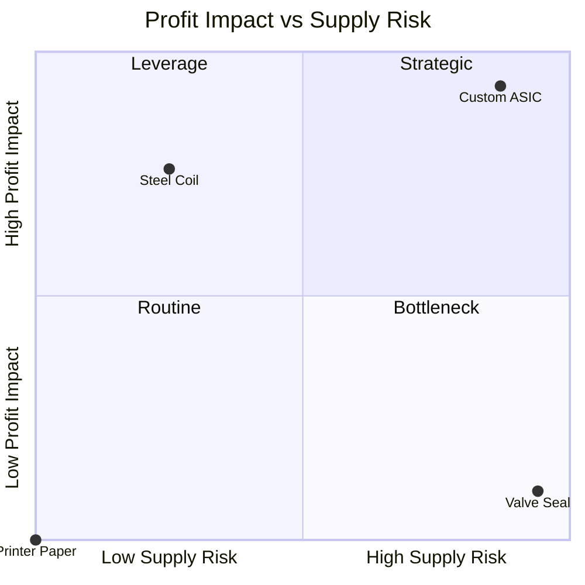

## Supply Risk Versus Profit Impact Axes


The two axes of the Kraljic portfolio matrix, **profit impact** (also called value at stake or importance of purchasing) and **supply risk** (also called supply complexity or supply market complexity), are the measurement backbone of supplier segmentation. Every quadrant assignment, sourcing strategy, and dual-sourcing decision inherits its quality from how these two axes are defined, scored, weighted, and validated. This reference covers what each axis measures, how to build defensible scoring models, how to handle data and calibration problems, how thresholds shape outcomes, and how to operationalize the scoring in code and governance processes.

### Foundations

**Key Points**

- **Profit impact** answers: *how much does this item matter to the organization's financial results, product quality, and revenue?* It is an **outcome-side** measure (consequence of the item's cost, quality, and availability performance).
- **Supply risk** answers: *how hard is it to secure this item reliably and how damaging is the market's structure?* It is a **market-side** measure (properties of the supply market and the buyer's position within it).
- The axes are deliberately **independent**: a high-spend item can be low risk (Leverage), and a low-spend item can be high risk (Bottleneck). If your scoring makes the two axes strongly correlated, the model is probably double-counting a shared driver such as spend.
- Both axes are **composite indices** built from several observable criteria, not single metrics.
- Scores are **judgment-assisted estimates**. Transparent criteria, documented weights, and stakeholder agreement matter more than numerical precision.
- Axis definitions and terminology vary across authors and organizations (Kraljic's original work, later adaptations, and internal corporate variants differ in criteria lists), so treat any specific criteria list as a template to calibrate rather than a standard.

### Axis 1: Profit Impact

**Definition:** the degree to which an item influences the organization's profitability, product performance, and competitive position.

**Common criteria**

| Criterion | What It Captures | Typical Data Source |
| --- | --- | --- |
| Annual spend / share of total spend | Direct cost exposure | ERP, spend cube |
| Share of cost of goods sold (COGS) or product cost | Influence on unit economics | Cost accounting, BOM |
| Effect on product quality or performance | Consequence of defects or specification changes | Quality data, engineering assessment |
| Effect on revenue or customer experience | Consequence of stock-outs or service failure | Sales, service-level data |
| Volume growth / strategic trajectory | Future importance | Demand plan, product roadmap |
| Value-add contribution / differentiation | Whether the item drives brand or features | Product management |

**Interpretation notes**

- Spend alone is a weak proxy: a low-cost component that determines product safety has high profit impact through failure cost, warranty, and brand exposure.
- Include **forward-looking** criteria (growth, product roadmap) so the score does not lag reality.
- Normalize spend consistently (same period, currency, and scope) or the score will reflect data artifacts.

### Axis 2: Supply Risk

**Definition:** the degree of difficulty and exposure in obtaining the item reliably, at acceptable cost, over the relevant time horizon.

**Common criteria**

| Criterion | What It Captures | Direction (higher = more risk) |
| --- | --- | --- |
| Number of qualified suppliers | Supply base breadth | Fewer suppliers = higher risk |
| Supplier concentration in the market | Market power of suppliers | More concentrated = higher risk |
| Entry barriers | Difficulty for new suppliers to appear | Higher barriers = higher risk |
| Switching cost and time | Cost of changing suppliers (qualification, tooling, testing) | Higher = higher risk |
| Substitutability | Availability of alternative materials or designs | Lower substitutability = higher risk |
| Lead time and logistics complexity | Exposure to delays | Longer/more complex = higher risk |
| Demand-supply balance / scarcity | Market tightness | Tighter = higher risk |
| Price and availability volatility | Market instability | More volatile = higher risk |
| Geopolitical / regulatory exposure | Country and policy risk | More exposed = higher risk |
| Supplier financial health | Risk of failure or exit | Weaker = higher risk |
| Sub-tier dependence | Hidden concentration upstream | More concentrated = higher risk |

**Interpretation notes**

- Supply risk is about the **market and the buyer's position**, not only a specific supplier's performance. A reliable supplier in a thin market still leaves the item high risk.
- Separate **inherent risk** (structure of the market) from **residual risk** (after mitigations such as inventory or a qualified second source). Portfolio classification typically uses inherent risk, because mitigations are the *response* to the classification. Mixing the two causes items to drift into lower-risk quadrants precisely because mitigation succeeded, which then invites the mitigation to be removed.
- The buyer's own position matters: a small buyer in a concentrated market faces higher effective risk than a large buyer for the same item.

### Scoring Model Design

**Step 1: Select criteria.** Choose 3 to 6 criteria per axis that are (a) relevant to the business, (b) observable with available data, and (c) not redundant with each other.

**Step 2: Define scoring scales.** Use anchored scales (for example 1 to 5) with explicit descriptions for each level, so different raters produce comparable scores.

| Score | Number of Qualified Suppliers (illustrative anchors) |
| --- | --- |
| 1 | More than 10 |
| 2 | 6 to 10 |
| 3 | 3 to 5 |
| 4 | 2 |
| 5 | 1 (sole or single source) |

Anchor thresholds are illustrative and should be adapted to the category; ten suppliers may be plenty for stationery but scarce for a specialized chemical.

**Step 3: Assign weights.** Weights reflect strategic priorities and must sum to 1 within each axis.

**Step 4: Aggregate.** The standard approach is a weighted linear composite:

$$P = \sum_{i=1}^{m} w_i \, p_i, \qquad R = \sum_{j=1}^{n} v_j \, r_j$$

with $\sum_i w_i = 1$ and $\sum_j v_j = 1$, where $p_i$ and $r_j$ are the criterion scores on the common scale.

**Step 5: Classify.** Compare each composite to a threshold (midpoint or calibrated cutoff) to assign a quadrant.

### Aggregation Alternatives

A weighted average is easy to explain but has known weaknesses. Alternatives address specific needs.

| Method | Formula / Idea | When Useful | Caveat |
| --- | --- | --- | --- |
| Weighted average | $\sum w_i s_i$ | Default; transparent | Compensatory: a very high score on one criterion can be masked by low scores on others |
| Maximum ("weakest link") | $\max_j r_j$ | Risk axis where any single severe factor should dominate (e.g., sole source) | Ignores accumulated moderate risks |
| Hybrid with override | Weighted average, but force high risk if any critical criterion $\ge$ cutoff | Avoids masking of critical risks | Requires defining critical criteria and cutoffs |
| Weighted geometric mean | $\prod s_i^{w_i}$ | Penalizes low scores on any criterion | Requires strictly positive scores; less intuitive |
| Analytic Hierarchy Process (AHP) | Pairwise comparison to derive weights | Formal, stakeholder-driven weighting | More workshop effort; consistency checks needed |

**Hybrid override formula**

$$R^{*} = \begin{cases} R_{\max} & \text{if } \exists\, j \in C : r_j \ge \theta \\ R & \text{otherwise} \end{cases}$$

where $C$ is the set of critical risk criteria (for example, single-source status, sanctions exposure), $\theta$ is the override cutoff, and $R_{\max}$ is the top-of-scale risk score. This is a design choice, not a universal standard; behavior should be validated against known cases.

### Worked Example

```python
from dataclasses import dataclass, field

# --- Configuration -----------------------------------------------------------
PROFIT_WEIGHTS = {
    "spend_share": 0.40,
    "cogs_impact": 0.20,
    "quality_impact": 0.25,
    "growth": 0.15,
}
RISK_WEIGHTS = {
    "supplier_scarcity": 0.30,
    "entry_barriers": 0.15,
    "switching_cost": 0.20,
    "lead_time": 0.10,
    "market_volatility": 0.10,
    "geopolitical": 0.15,
}
CRITICAL_RISK = {"supplier_scarcity"}   # criteria that can force a high-risk override
OVERRIDE_CUTOFF = 5                     # score at/above which override triggers
THRESHOLD_P = 3.0
THRESHOLD_R = 3.0

assert abs(sum(PROFIT_WEIGHTS.values()) - 1) < 1e-9
assert abs(sum(RISK_WEIGHTS.values()) - 1) < 1e-9

@dataclass
class Item:
    name: str
    profit_scores: dict = field(default_factory=dict)  # 1-5 per criterion
    risk_scores: dict = field(default_factory=dict)    # 1-5 per criterion

def weighted(scores: dict, weights: dict) -> float:
    return sum(weights[k] * scores[k] for k in weights)

def profit_impact(item: Item) -> float:
    return weighted(item.profit_scores, PROFIT_WEIGHTS)

def supply_risk(item: Item, use_override: bool = True) -> float:
    base = weighted(item.risk_scores, RISK_WEIGHTS)
    if use_override and any(item.risk_scores[c] >= OVERRIDE_CUTOFF for c in CRITICAL_RISK):
        return 5.0
    return base

def quadrant(p: float, r: float) -> str:
    if p >= THRESHOLD_P and r >= THRESHOLD_R:
        return "Strategic"
    if p >= THRESHOLD_P:
        return "Leverage"
    if r >= THRESHOLD_R:
        return "Bottleneck"
    return "Routine"

items = [
    Item(
        "Custom ASIC",
        profit_scores={"spend_share": 5, "cogs_impact": 4, "quality_impact": 5, "growth": 4},
        risk_scores={"supplier_scarcity": 5, "entry_barriers": 5, "switching_cost": 4,
                     "lead_time": 4, "market_volatility": 3, "geopolitical": 4},
    ),
    Item(
        "Standard Steel Coil",
        profit_scores={"spend_share": 5, "cogs_impact": 4, "quality_impact": 3, "growth": 2},
        risk_scores={"supplier_scarcity": 1, "entry_barriers": 2, "switching_cost": 2,
                     "lead_time": 2, "market_volatility": 4, "geopolitical": 2},
    ),
    Item(
        "Legacy Valve Seal",
        profit_scores={"spend_share": 1, "cogs_impact": 1, "quality_impact": 3, "growth": 1},
        risk_scores={"supplier_scarcity": 5, "entry_barriers": 4, "switching_cost": 4,
                     "lead_time": 3, "market_volatility": 2, "geopolitical": 2},
    ),
    Item(
        "Printer Paper",
        profit_scores={"spend_share": 1, "cogs_impact": 1, "quality_impact": 1, "growth": 1},
        risk_scores={"supplier_scarcity": 1, "entry_barriers": 1, "switching_cost": 1,
                     "lead_time": 1, "market_volatility": 1, "geopolitical": 1},
    ),
]

print(f"{'Item':22s}{'P':>6s}{'R(avg)':>9s}{'R(final)':>10s}  Quadrant")
for it in items:
    p = profit_impact(it)
    r_avg = supply_risk(it, use_override=False)
    r_fin = supply_risk(it, use_override=True)
    print(f"{it.name:22s}{p:6.2f}{r_avg:9.2f}{r_fin:10.2f}  {quadrant(p, r_fin)}")
```

**Output** (computed from the weights above)



```
Item                       P   R(avg)  R(final)  Quadrant
Custom ASIC             4.65     4.35      5.00  Strategic
Standard Steel Coil     4.05     2.25      2.25  Leverage
Legacy Valve Seal       1.50     3.75      5.00  Bottleneck
Printer Paper           1.00     1.00      1.00  Routine
```

In this example the override does not change any quadrant, but it would matter for an item with a sole source and otherwise benign market characteristics, where a plain average could fall below the threshold and hide a single point of failure.

### Threshold Selection and Sensitivity

The position of the dividing lines determines how many items fall into each quadrant.

**Threshold options**

| Approach | Description | Trade-off |
| --- | --- | --- |
| Fixed midpoint | Cutoff at the scale midpoint (e.g., 3 on 1 to 5) | Simple, but distribution may be skewed |
| Median / percentile | Cutoff at portfolio median or a chosen percentile | Guarantees a spread; relative rather than absolute |
| Value-based | Profit-impact cutoff set to capture a target share of spend (e.g., items covering the top 70-80% of spend qualify as high impact) | Aligns with Pareto thinking; cutoff chosen by convention |
| Management judgment | Cutoffs agreed in workshop | Flexible; can be biased |

**Sensitivity check:** shift weights and thresholds by a modest margin and observe which items change quadrant. Items that flip are **borderline** and deserve individual review rather than mechanical assignment.

```python
import itertools

def sensitivity(items, delta=0.5):
    """Report items whose quadrant changes when thresholds shift by ±delta."""
    global THRESHOLD_P, THRESHOLD_R
    base_p, base_r = THRESHOLD_P, THRESHOLD_R
    results = {}
    for it in items:
        p, r = profit_impact(it), supply_risk(it)
        base = quadrant(p, r)
        flips = set()
        for dp, dr in itertools.product((-delta, 0, delta), repeat=2):
            THRESHOLD_P, THRESHOLD_R = base_p + dp, base_r + dr
            q = quadrant(p, r)
            if q != base:
                flips.add(q)
        results[it.name] = (base, sorted(flips))
    THRESHOLD_P, THRESHOLD_R = base_p, base_r
    return results

for name, (base, flips) in sensitivity(items).items():
    status = f"borderline -> also {', '.join(flips)}" if flips else "stable"
    print(f"{name:22s} {base:10s} {status}")
```

Results depend on the score distribution; this routine flags candidates for review rather than proving a classification is wrong.

### Visualizing the Axes



Bubble charts extend the two-axis view by encoding a third variable (usually annual spend) as bubble size and optionally a fourth (such as supplier performance) as color.

### Data Sourcing and Governance

| Criterion Group | Typical Sources | Common Data Problems |
| --- | --- | --- |
| Spend and cost | ERP, AP, spend analytics, cost models | Inconsistent categorization, duplicate supplier records, missing indirect spend |
| Supplier base and market | Approved supplier lists, market intelligence, analyst reports | Stale lists, unverified "qualified" status |
| Quality and revenue impact | QA systems, engineering, sales | Not linked to purchased items |
| Logistics | Lead-time history, freight data | Averages hide variability |
| Geopolitical and financial | Risk-intelligence services, credit data | Cost, coverage gaps, lag |
| Sub-tier | Supplier disclosure, BOM mapping | Often unavailable; requires supplier cooperation |

**Governance practices**

- **Rater calibration:** run a workshop where raters score sample items and reconcile differences using anchored scales.
- **Cross-functional input:** procurement scores market criteria; engineering and finance score impact criteria.
- **Evidence log:** record the basis for each score so results can be audited and updated.
- **Review cycle:** re-score at least annually and on trigger events (supplier exit, regulation, design change).
- **Score ownership:** each category has a named owner accountable for accuracy.

### Common Pitfalls

- **Spend as the only profit-impact criterion:** understates critical low-cost items and defeats the purpose of the Bottleneck quadrant.
- **Correlated axes:** if spend enters both axes, the matrix collapses toward the diagonal.
- **Using residual risk:** scoring after mitigation makes successful protective measures look like reasons to remove them.
- **Buyer-blind supply risk:** ignoring the buyer's own size and leverage in the market.
- **False precision:** reporting scores to two decimals implies accuracy the inputs cannot support. Treat scores as ordinal guidance, especially near thresholds.
- **Compensatory masking:** averaging hides sole-source or sanctions exposure; use overrides for critical criteria.
- **Static scoring:** stale scores cause misaligned strategies.
- **Rater bias:** category managers tend to rate their own categories as more critical; cross-review reduces this.
- **Unit mismatch:** mixing item-level and supplier-level scoring without a clear rule leads to inconsistent placement.

### Extensions

- **Additional risk dimensions:** ESG, cyber, and regulatory risk can be added as separate sub-scores or overlays rather than folded silently into supply risk.
- **Probability-impact framing:** supply risk can be decomposed into likelihood of disruption and severity, giving $\text{Risk} = \text{Likelihood} \times \text{Impact}$, which links naturally to enterprise risk registers. This shifts the axis from a market-structure view toward an event-based view, so definitions must be kept consistent with the intended use.
- **Quantitative expected-loss estimates:** where data allows, replace ordinal scores with expected annual loss:

$$E[L] = \sum_{k} p_k \cdot d_k \cdot c_k$$

where $p_k$ is the annual probability of disruption scenario $k$, $d_k$ is its expected duration, and $c_k$ is the cost per period of disruption. Estimates are highly assumption-dependent and should be presented with ranges.

- **Dynamic and forward-looking scoring:** incorporate forecasts (demand growth, capacity additions, regulation) so the matrix anticipates rather than lags.
- **Supplier-level variants:** aggregate item scores to supplier level (for example, spend-weighted) when a single relationship strategy is needed per supplier.

**Conclusion**

The profit impact and supply risk axes convert qualitative sourcing judgment into a repeatable, auditable classification. Profit impact measures consequence to the organization; supply risk measures the difficulty and exposure of securing the item in its market. Robust implementations use anchored multi-criteria scales, explicit weights, an override for critical single-point risks, sensitivity testing near thresholds, and documented governance for data and rater calibration. The scores guide, but do not replace, category-level judgment, so borderline items and stakeholder context deserve explicit review. Well-defined axes ensure that downstream decisions, including relationship strategy and dual-sourcing investment, rest on defensible foundations.

**Related Topics**

- Criteria weighting techniques (AHP, pairwise comparison, stakeholder workshops)
- Spend analysis and category taxonomy design
- Supply market analysis and market structure assessment (Porter's forces applied to supply markets)
- Total Cost of Ownership (TCO) modeling as an input to profit impact
- Supplier risk assessment frameworks and early-warning indicators
- Sub-tier mapping and concentration risk analysis
- Segment-specific relationship strategies and dual-sourcing decision models
- Supplier preferencing and customer attractiveness (the supplier's view of the buyer)