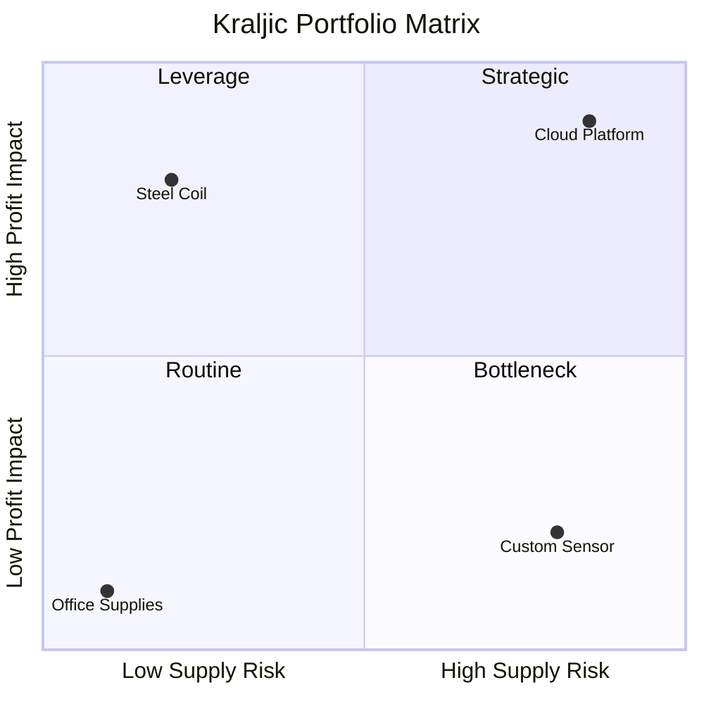
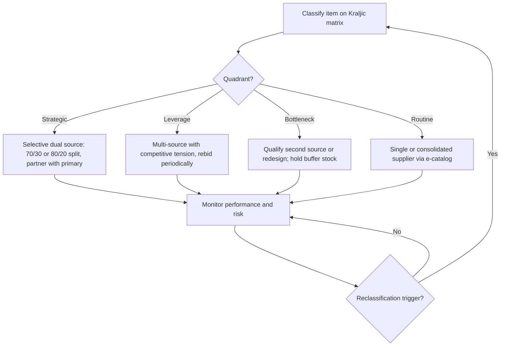

## Strategic, Leverage, Bottleneck, and Routine Categories


The four-category segmentation (popularized by Peter Kraljic's 1983 *Harvard Business Review* article "Purchasing Must Become Supply Management" and widely adapted since) classifies purchased items and their suppliers along two axes: **profit impact / value at stake** (how much the item affects cost, quality, or revenue) and **supply risk / complexity** (how difficult it is to secure the item reliably). Each quadrant calls for a distinct sourcing posture, and the category assigned directly determines how much dual-sourcing effort is justified.

### Foundations of the Matrix

**Key Points**

- Segmentation is applied to **items or categories first**, then mapped to the suppliers that provide them. A single supplier can appear in more than one quadrant across different items.
- The two axes are ratings, not measurements of the supplier's character: a supplier is not "bad" for being in the Bottleneck quadrant.
- Naming varies by source. Kraljic's original labels are *Strategic, Leverage, Bottleneck, Non-critical*; many practitioners write *Routine* (or *Non-critical/Acquisition*) for the low-low quadrant. Treat these as equivalent.
- Category placement is a point-in-time judgment. Markets, technology, and internal demand shift items between quadrants (see Reclassification below).

**Axis Definitions**

| Axis | Typical Drivers |
| --- | --- |
| Profit impact / value at stake | Annual spend, percentage of COGS, effect on product quality, effect on revenue or brand, volume growth |
| Supply risk / complexity | Number of qualified suppliers, entry barriers, geopolitical exposure, single-source dependence, switching cost, lead time, logistics complexity, substitutability |

### The Matrix Layout



|  | **Low Supply Risk** | **High Supply Risk** |
| --- | --- | --- |
| **High Profit Impact** | **Leverage** | **Strategic** |
| **Low Profit Impact** | **Routine** | **Bottleneck** |

### Strategic Items

**Definition:** High profit impact and high supply risk. These are critical to the product or service, difficult to replace, and available from few suppliers.

**Typical examples:** proprietary semiconductors or key components, specialty alloys, core software platforms, sole-qualified contract manufacturers, mission-critical logistics lanes.

**Objectives:** secure long-term supply, protect innovation and quality, and jointly manage risk.

**Recommended posture**

- Build **strategic partnerships**: joint roadmaps, executive sponsorship, co-investment, shared forecasting.
- Use **long-term contracts** with volume commitments balanced by capacity guarantees, price-adjustment clauses, and continuity obligations.
- Run **formal Supplier Relationship Management (SRM)**: quarterly business reviews, scorecards, joint improvement projects, escalation paths.
- Pursue **selective dual sourcing** where feasible (see the dual-sourcing section): even a small qualified second source (e.g., 10-20% share) reduces existential dependence.
- Invest in **risk mitigation**: safety stock, supplier financial monitoring, business continuity plans, escrow arrangements (for software/IP).

**Risks:** over-dependence, supplier complacency, lock-in, and cost creep if relationships become too comfortable.

### Leverage Items

**Definition:** High profit impact and low supply risk. Spend is significant, but many capable suppliers exist and switching is relatively easy.

**Typical examples:** commodity steel, standard packaging, common electronic components, general freight, standard IT hardware.

**Objectives:** maximize commercial advantage and cost efficiency.

**Recommended posture**

- **Exploit competition**: run competitive tenders, reverse auctions, and periodic re-bidding.
- **Consolidate volume** with fewer suppliers to earn volume discounts, or split volume among two to three suppliers to preserve competitive tension.
- Use **shorter contracts** or index-linked pricing to capture market movements.
- Apply **total cost of ownership (TCO)** analysis, not only unit price.
- Maintain a **credible switching threat** by keeping alternative suppliers qualified.

**Dual-sourcing fit:** natural and inexpensive. Multi-sourcing is often the default here because qualification cost is low and competitive tension delivers savings.

**Risks:** excessive price focus can erode quality or supplier goodwill, and repeated aggressive negotiation can push good suppliers to deprioritize the account in tight markets.

### Bottleneck Items

**Definition:** Low profit impact but high supply risk. The item represents a small share of spend, yet a shortage can halt production or operations.

**Typical examples:** a low-cost specialty part with one qualified source, a niche spare part for legacy equipment, a regulated ingredient with few approved suppliers, a small custom fastener.

**Objectives:** assure supply and reduce vulnerability, even at some cost premium.

**Recommended posture**

- **Secure availability first**, price second: buffer inventory, consignment stock, vendor-managed inventory (VMI), or longer-term supply agreements.
- **Seek alternatives**: redesign for standard parts, qualify substitutes, or develop new suppliers. The goal is to move the item leftward toward the Routine quadrant.
- **Standardize specifications** where possible to widen the supplier pool.
- Monitor lead times and supplier health closely, since the item is small in spend but large in disruption potential.

**Dual-sourcing fit:** high value relative to cost. Qualifying a second source often has a strong return because the disruption cost of a stock-out far exceeds the qualification cost. Where a second source does not exist, consider design changes or strategic stock.

**Risks:** neglect. Because spend is small, bottleneck items are often ignored until a shortage occurs.

### Routine Items

**Definition:** Low profit impact and low supply risk. Easily sourced, low-value, and non-critical.

**Typical examples:** office supplies, cleaning products, standard MRO consumables, low-value tail-spend items.

**Objectives:** minimize administrative effort and transaction cost.

**Recommended posture**

- **Simplify and automate**: catalogs, e-procurement, purchasing cards, blanket orders, punch-out catalogs.
- **Consolidate the supplier base** to reduce the number of transactions and invoices.
- Use **standardized terms** and minimal negotiation effort.
- Delegate ordering to end users within policy controls.

**Dual-sourcing fit:** generally unnecessary. Because alternatives are abundant, supply disruption is easily managed by switching suppliers ad hoc.

**Risks:** hidden maverick spend and uncontrolled tail spend, which is addressed through process control rather than relationship investment.

### Summary Comparison

| Attribute | Strategic | Leverage | Bottleneck | Routine |
| --- | --- | --- | --- | --- |
| Profit impact | High | High | Low | Low |
| Supply risk | High | Low | High | Low |
| Core goal | Partnership and security | Cost optimization | Supply assurance | Efficiency |
| Relationship type | Collaborative, long-term | Transactional-competitive | Managed dependency | Arm's length, automated |
| Contract length | Long | Short to medium | Medium to long | Short or blanket |
| Dual sourcing | Selective, strategic | Common, competitive | High priority when feasible | Rarely needed |
| Management level | Executive and cross-functional | Category manager | Category manager plus supply risk | Buyer or automated |

### Scoring Items Into Quadrants

A practical implementation scores each axis on a scale (commonly 1-5), then places the item using a threshold (often the midpoint).

**Example scoring model**

Profit impact score:

$$P = w_1 \cdot S + w_2 \cdot Q + w_3 \cdot G$$

where $S$ is the normalized spend share, $Q$ is the quality/product impact rating, $G$ is the growth or revenue-criticality rating, and $w_1 + w_2 + w_3 = 1$.

Supply risk score:

$$R = v_1 \cdot N + v_2 \cdot B + v_3 \cdot T + v_4 \cdot L$$

where $N$ is the scarcity of qualified suppliers (inverted count), $B$ is entry barriers, $T$ is the switching cost, $L$ is lead-time or logistics complexity, and the weights $v_i$ sum to 1.

**Quadrant assignment (threshold $\tau = 3$ on a 1-5 scale):**

- $P \ge \tau$ and $R \ge \tau$: Strategic
- $P \ge \tau$ and $R < \tau$: Leverage
- $P < \tau$ and $R \ge \tau$: Bottleneck
- $P < \tau$ and $R < \tau$: Routine

**Example**

```python
from dataclasses import dataclass

@dataclass
class Item:
    name: str
    spend_share: float      # 1-5
    quality_impact: float   # 1-5
    growth_criticality: float  # 1-5
    supplier_scarcity: float   # 1-5 (5 = very few suppliers)
    entry_barriers: float      # 1-5
    switching_cost: float      # 1-5
    lead_time_complexity: float  # 1-5

W_PROFIT = (0.5, 0.3, 0.2)
W_RISK = (0.35, 0.25, 0.25, 0.15)
THRESHOLD = 3.0

def profit_impact(i: Item) -> float:
    w1, w2, w3 = W_PROFIT
    return w1 * i.spend_share + w2 * i.quality_impact + w3 * i.growth_criticality

def supply_risk(i: Item) -> float:
    v1, v2, v3, v4 = W_RISK
    return (v1 * i.supplier_scarcity + v2 * i.entry_barriers
            + v3 * i.switching_cost + v4 * i.lead_time_complexity)

def classify(i: Item) -> str:
    p, r = profit_impact(i), supply_risk(i)
    if p >= THRESHOLD and r >= THRESHOLD:
        return "Strategic"
    if p >= THRESHOLD:
        return "Leverage"
    if r >= THRESHOLD:
        return "Bottleneck"
    return "Routine"

items = [
    Item("Custom ASIC", 4.5, 5, 4, 5, 5, 4, 4),
    Item("Corrugated Boxes", 4.0, 2, 2, 1.5, 1.5, 1.5, 1.5),
    Item("Legacy Valve Seal", 1.5, 3, 2, 5, 4, 4, 3),
    Item("Printer Paper", 1.0, 1, 1, 1, 1, 1, 1),
]

for it in items:
    print(f"{it.name:20s} P={profit_impact(it):.2f} R={supply_risk(it):.2f} -> {classify(it)}")
```

**Output** (values computed from the weights above)



```
Custom ASIC          P=4.60 R=4.75 -> Strategic
Corrugated Boxes     P=2.70 R=1.50 -> Routine
Legacy Valve Seal    P=2.15 R=4.30 -> Bottleneck
Printer Paper        P=1.00 R=1.00 -> Routine
```

Note that "Corrugated Boxes" lands in Routine rather than Leverage under this particular weighting because the blended profit score falls below the threshold. This illustrates that **weights and thresholds materially affect classification** and should be calibrated with stakeholders (for example, by raising the spend weight or lowering the threshold for high-volume categories). Results will vary with the chosen weights.

### Dual Sourcing Across the Categories

Dual sourcing (qualifying and actively using two suppliers for the same item) is a risk and leverage tool whose value depends on the quadrant.

**Decision logic**



**Cost-benefit view.** A second source is worthwhile when the expected avoided disruption loss exceeds the incremental cost of maintaining it:

$$E[\text{avoided loss}] = p_d \cdot L_d \cdot \rho \;>\; C_q + C_m + \Delta C_{\text{price}}$$

where $p_d$ is the probability of a disruption per period, $L_d$ is the loss if it occurs with a single source, $\rho$ is the fraction of that loss the second source would prevent, $C_q$ is the amortized qualification cost, $C_m$ is the ongoing management overhead, and $\Delta C_{\text{price}}$ is any price premium from splitting volume. This is a simplified model; real decisions should also consider correlated risks (both suppliers depending on the same sub-tier source), which can reduce $\rho$ substantially.

**Split patterns**

| Pattern | Typical Split | Best Fit |
| --- | --- | --- |
| Primary / secondary | 70-80% / 20-30% | Strategic, Bottleneck |
| Balanced competitive | 50/50 or 60/40 | Leverage |
| Qualified backup (dormant) | 100% / 0% with ready qualification | Bottleneck with low volume |
| Regional split | Volume by geography | Strategic with geopolitical risk |

Percentages are illustrative conventions, not standards; choose based on volume commitments, supplier minimums, and capacity.

### Movement Between Quadrants

Strategy should aim to **shift items toward more favorable positions**, not just manage them where they sit.

- **Bottleneck to Routine or Leverage:** standardize specs, qualify new suppliers, redesign the product.
- **Strategic to Leverage:** develop alternative suppliers or technologies to reduce risk.
- **Leverage to Strategic:** occurs when the supplier base consolidates or a technology becomes proprietary.
- **Routine to Bottleneck:** an ordinarily easy item becomes scarce (for example, during market shortages).

**Reclassification triggers**

- Supplier exit, merger, or insolvency
- New regulations or trade restrictions
- Technology change or design change
- Sustained lead-time increases or price volatility
- Changes in spend share or strategic importance

### Implementation in SRM Practice

1. **Data gathering:** extract spend data, supplier counts per category, lead times, and performance history from ERP and procurement systems.
2. **Scoring workshop:** cross-functional team (procurement, engineering, operations, finance) agrees on criteria, weights, and thresholds.
3. **Plot and validate:** place items on the matrix and sanity-check outliers with category owners.
4. **Assign strategies:** map each quadrant to a sourcing strategy, relationship model, and contract approach.
5. **Assign owners and cadence:** Strategic suppliers receive executive sponsors and quarterly reviews; Routine items are handled by automated processes.
6. **Review periodically:** re-run at least annually, or on trigger events.

**Example: sample supplier-management cadence**

| Quadrant | Review Cadence | Owner | KPIs |
| --- | --- | --- | --- |
| Strategic | Quarterly (plus continuous monitoring) | Senior category manager plus executive sponsor | Innovation contribution, delivery reliability, joint cost reduction, risk indicators |
| Leverage | Semiannual or per tender | Category manager | Price vs. index, savings achieved, on-time delivery |
| Bottleneck | Quarterly | Category manager plus supply risk analyst | Stock coverage, lead time, second-source progress |
| Routine | Annual or automated | Buyer or system | Process cost per order, catalog compliance |

### Common Pitfalls and Limitations

- **Static snapshots:** a matrix that is never refreshed becomes misleading.
- **Subjective scoring:** without agreed criteria, placement reflects opinion or negotiation power within the organization.
- **Item vs. supplier confusion:** classifying suppliers instead of items hides differences across what they supply.
- **Ignoring the supply-side view:** the model is buyer-centric. A supplier may regard the buyer as unimportant (a "nuisance customer"), which changes the achievable relationship; complementary models such as the supplier's view of customer attractiveness address this.
- **Over-simplification:** two axes omit factors such as sustainability, ESG risk, and geopolitical exposure. Many organizations layer additional risk overlays or extend the matrix.
- **One-size-fits-all tactics:** treating every Leverage item with aggressive rebidding can damage relationships critical for resilience.

**Conclusion**

The Strategic, Leverage, Bottleneck, and Routine categories give procurement teams a structured way to allocate finite relationship and risk-management effort. Strategic items warrant deep partnership with selective redundancy, Leverage items reward competitive tension, Bottleneck items demand supply assurance and second-source development, and Routine items call for efficiency through automation. Dual sourcing is a tool whose payoff is highest in the Bottleneck and Strategic quadrants and easiest to execute in Leverage. The classification is a living judgment that should be scored transparently and revisited as markets and internal needs change.

**Related Topics**

- Kraljic matrix scoring criteria and weighting calibration
- Supplier preferencing and customer attractiveness (supplier's view of the buyer)
- Total Cost of Ownership (TCO) modeling for sourcing decisions
- Dual-sourcing split optimization and qualification planning
- Supply risk assessment and sub-tier visibility
- Category strategy development and category management lifecycle
- Supplier performance scorecards and QBR design
- Extensions and alternatives to the Kraljic matrix (e.g., purchasing chessboard, portfolio overlays)