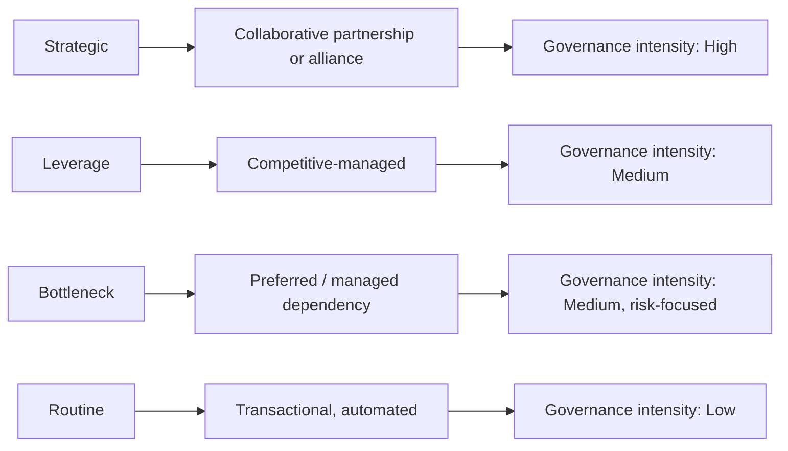
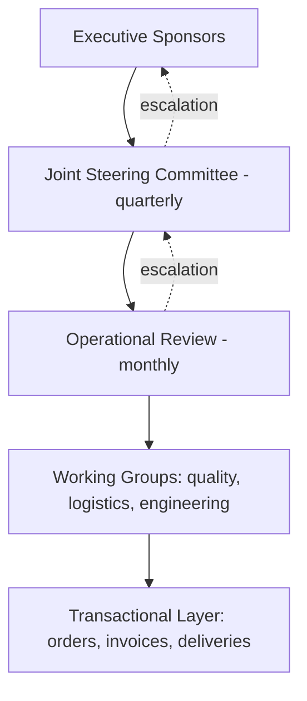

## Segment-Specific Relationship Strategies


Segment-specific relationship strategies translate the outcome of supplier segmentation (typically the Strategic, Leverage, Bottleneck, and Routine quadrants of the Kraljic matrix, or a supplier-level variant of it) into differentiated behaviors: how much management attention a supplier receives, what governance surrounds the relationship, how contracts are structured, how performance is measured, and how much redundancy (including dual sourcing) is maintained. The underlying principle is **differentiation of effort**: relationship investment is finite, so it should be allocated where it generates the greatest value or risk reduction.

### Foundations

**Key Points**

- A relationship strategy is a bundle of choices across six dimensions: relationship model, governance and cadence, commercial and contract structure, performance management, risk and redundancy, and information sharing.
- Strategies attach to **segments**, but are executed **per supplier**. A supplier that sits in multiple segments (for example, Strategic for one component and Routine for another) may need a blended approach with a single relationship owner.
- Relationship intensity is a cost. Over-investing in Routine suppliers wastes scarce management capacity; under-investing in Strategic or Bottleneck suppliers exposes the organization to disruption and forfeits joint value.
- Segment assignment is a hypothesis about how the relationship should be managed. Strategies must be revisited when segment membership changes.
- The buyer's view is only half the picture. Relationship outcomes also depend on how the supplier perceives the buyer (customer attractiveness and share of wallet), which can constrain what any strategy can achieve.

**The Relationship Continuum**

Relationship models span a continuum from purely transactional to deeply collaborative.

| Model | Description | Typical Time Horizon | Information Sharing |
| --- | --- | --- | --- |
| Transactional (arm's length) | Price-driven, standardized terms, easily switched | Days to months | Minimal (orders, invoices) |
| Competitive-managed | Structured competition among approved suppliers | Months to a few years | Specifications and forecasts |
| Preferred / managed dependency | Ongoing commitment with risk safeguards | 1 to 3 years | Forecasts, capacity, lead times |
| Collaborative partnership | Joint planning, shared metrics, coordinated improvement | 3 to 5+ years | Roadmaps, cost data (selectively), capacity plans |
| Strategic alliance / co-development | Shared investment, co-innovation, possibly shared risk and reward | 5+ years | Deep, including IP-adjacent information under agreements |

### Strategy-to-Segment Mapping



### Strategic Suppliers: Collaborative Partnership

**Objective:** secure long-term supply, co-create value, and protect against existential dependence.

**Relationship model:** collaborative partnership, escalating to alliance or co-development where innovation is central.

**Governance**

- **Executive sponsor** on each side, with a named day-to-day relationship manager.
- **Joint steering committee** meeting quarterly (or semiannually for stable relationships) to review strategy, roadmap, and investments.
- **Operational reviews** monthly, covering delivery, quality, and engineering changes.
- A documented **escalation ladder** with response-time expectations.
- Cross-functional participation: procurement, engineering, quality, finance, and supply planning.

**Commercial and contract structure**

- Long-term agreements (commonly multi-year) with **volume bands** rather than hard commitments where demand is uncertain.
- **Open-book or should-cost** collaboration on selected cost elements, subject to confidentiality.
- **Gain-share and pain-share** mechanisms for joint cost reduction or innovation.
- Price mechanisms tied to indices or cost drivers, with defined review windows.
- Continuity clauses: capacity reservation, last-time-buy rights, step-in rights, escrow for software or tooling, and end-of-life notification periods.

**Performance management**

- Balanced scorecard covering delivery, quality, cost, innovation, responsiveness, and risk.
- **Joint improvement plans** with shared targets and owners.
- Supplier development investment where capability gaps threaten the relationship.

**Risk and redundancy**

- Selective dual sourcing or secondary qualification (a common convention is a primary/secondary volume split such as 70-80% / 20-30%; percentages are illustrative, not a standard).
- Sub-tier mapping to detect concentration risks that both primary and secondary suppliers share.
- Financial health monitoring and business continuity plan review.

**Information sharing:** shared demand forecasts, technology roadmaps, capacity plans, and, where trust and legal protections allow, cost structure data.

**Risks:** lock-in, complacency, cost creep, and dependence on a few individuals. Mitigate with periodic market benchmarking, defined performance triggers, and succession planning on both sides.

### Leverage Suppliers: Competitive-Managed

**Objective:** capture value through competition and scale while maintaining reliable supply.

**Relationship model:** competitive-managed; professional and firm, with respect for the supplier's need for a fair return.

**Governance**

- Category manager as primary owner.
- Semiannual or per-tender performance reviews.
- Standardized onboarding and qualification.

**Commercial and contract structure**

- Shorter contracts (often 1 to 3 years) or framework agreements with call-off orders.
- **Index-linked or formula pricing** for commodity-driven items.
- Regular **competitive tendering** and reverse auctions, sized to keep the threat of switching credible.
- Volume-tiered pricing and rebates.
- Multi-sourcing with **volume allocation rules** (for example, share shifts based on price and performance scores).

**Performance management**

- Price and total cost of ownership (TCO) analysis, not unit price alone.
- Service-level agreements on delivery, quality, and responsiveness.
- Transparent scoring so suppliers understand how share is allocated.

**Risk and redundancy**

- Natural multi-sourcing; maintain two to three qualified suppliers.
- Keep at least one alternative pre-qualified so switching is credible.
- Watch for excessive aggression: repeated hard rebidding can lead suppliers to deprioritize the account when capacity is tight.

**Information sharing:** specifications, forecasts, and tender data; limited strategic disclosure.

### Bottleneck Suppliers: Managed Dependency

**Objective:** assure supply and reduce vulnerability, even at some cost premium, while working to move the item out of the quadrant.

**Relationship model:** preferred or managed dependency; cooperative but risk-focused.

**Governance**

- Category manager plus a supply risk analyst.
- Quarterly reviews centered on lead times, capacity, stock coverage, and supplier health.
- Clear contact points for urgent shortages.

**Commercial and contract structure**

- Medium- to long-term supply agreements that guarantee availability (capacity reservation, allocation priority).
- **Buffer inventory, consignment stock, or vendor-managed inventory (VMI)** to absorb disruption.
- Willingness to accept a **price premium** for reliability.
- Last-time-buy and end-of-life notification terms for legacy parts.

**Performance management**

- Availability, lead-time stability, and fill rate as primary KPIs.
- Early-warning indicators (supplier financial signals, allocation notices, capacity utilization).

**Risk and redundancy**

- Highest return on **second-source qualification**, because the cost of qualification is small relative to the cost of a stock-out.
- **Design and specification standardization** to widen the supplier pool.
- Substitution and re-design projects to shift items toward Routine or Leverage.
- Where no second source exists, hold strategic stock sized to the replenishment lead time.

**Information sharing:** forecasts and inventory positions to help the supplier plan capacity.

**Risks:** neglect (low spend attracts low attention) and under-communication until a shortage appears. Mitigate with explicit ownership and a watch list.

### Routine Suppliers: Transactional and Automated

**Objective:** minimize transaction cost and administrative effort.

**Relationship model:** transactional, arm's length.

**Governance**

- Buyer-level or automated ownership.
- Annual or exception-based review.

**Commercial and contract structure**

- Blanket purchase orders, catalog contracts, and purchasing cards.
- **E-procurement and punch-out catalogs** with compliance controls.
- Standard terms and conditions; minimal negotiation.
- Supplier base consolidation to reduce invoice and order volume.

**Performance management**

- Process metrics: cost per purchase order, catalog compliance, and maverick spend rate.
- Exception-based supplier review (only when problems occur).

**Risk and redundancy**

- Ad hoc switching is usually sufficient; formal dual sourcing is rarely warranted.

**Information sharing:** minimal; orders and invoices through automated channels.

### Consolidated Strategy Matrix

| Dimension | Strategic | Leverage | Bottleneck | Routine |
| --- | --- | --- | --- | --- |
| Relationship model | Collaborative partnership or alliance | Competitive-managed | Managed dependency | Transactional |
| Primary objective | Security, innovation, joint value | Cost and value capture | Supply assurance | Efficiency |
| Executive involvement | High | Low | Low to medium (on escalation) | None |
| Review cadence | Quarterly steering, monthly operations | Semiannual or per tender | Quarterly | Annual or exception-based |
| Contract horizon | Long (multi-year) | Short to medium | Medium to long | Short or blanket |
| Pricing approach | Cost-based, gain-share, indexed | Competitive, index-linked | Premium accepted for availability | Catalog or standard |
| Dual sourcing | Selective (primary/secondary) | Common (competitive split) | High priority when feasible | Rare |
| Inventory posture | Joint planning, safety stock | Lean, supplier-held where possible | Buffer or consignment stock | Minimal |
| Information sharing | Deep | Moderate | Forecast-centric | Minimal |
| Key KPIs | Scorecard, innovation, joint savings | Price vs. index, TCO, savings | Availability, lead time | Process cost, compliance |

### Allocating Relationship Effort

Because management capacity is limited, effort can be allocated in proportion to the value and risk at stake. A simple prioritization score:

$$E_i = \alpha \cdot V_i + \beta \cdot R_i$$

where $E_i$ is the relative effort weight for supplier $i$, $V_i$ is a normalized value-at-stake measure (for example, spend share and quality/revenue impact), $R_i$ is a normalized supply-risk measure, and $\alpha + \beta = 1$. The weights are a management judgment; a risk-averse organization sets a higher $\beta$. This formula is a heuristic for capacity planning rather than a standard.

**Example: capacity-based cadence**

```python
from dataclasses import dataclass

@dataclass
class Supplier:
    name: str
    segment: str
    value: float   # 0-1 normalized value at stake
    risk: float    # 0-1 normalized supply risk

ALPHA, BETA = 0.5, 0.5
HOURS_PER_QUARTER = 200  # available relationship-management hours

def effort_weight(s: Supplier) -> float:
    return ALPHA * s.value + BETA * s.risk

def allocate(suppliers, total_hours):
    weights = {s.name: effort_weight(s) for s in suppliers}
    total = sum(weights.values())
    return {name: round(total_hours * w / total, 1) for name, w in weights.items()}

suppliers = [
    Supplier("Acme Semiconductors", "Strategic", 0.95, 0.90),
    Supplier("SteelCo", "Leverage", 0.80, 0.25),
    Supplier("SealWorks", "Bottleneck", 0.20, 0.85),
    Supplier("OfficeMart", "Routine", 0.05, 0.05),
]

for name, hours in allocate(suppliers, HOURS_PER_QUARTER).items():
    print(f"{name:22s} {hours:6.1f} h/quarter")
```

**Output** (computed from the weights above)



```
Acme Semiconductors     74.0 h/quarter
SteelCo                 42.7 h/quarter
SealWorks               42.7 h/quarter
OfficeMart               4.0 h/quarter
```

The output shows differentiated allocation: Strategic receives the most attention, Leverage and Bottleneck receive comparable attention for different reasons (value capture vs. risk control), and Routine receives minimal effort.

### Governance Structure



Strategic suppliers use all four layers; Leverage and Bottleneck suppliers typically use the operational and transactional layers; Routine suppliers use only the transactional layer.

### Relationship Development and Movement Between Segments

Strategies are not fixed. Common transitions and their implications:

- **Leverage to Strategic:** the supplier base consolidates or a technology becomes proprietary. Shift from competitive tendering to partnership, and add continuity protections.
- **Strategic to Leverage:** alternatives mature. Introduce competition, shorten commitments, and reduce governance intensity.
- **Bottleneck to Routine/Leverage:** standardization or re-design widens the supplier pool. Reduce buffer stock and governance cost.
- **Routine to Bottleneck:** market shortage or supplier exit. Add monitoring, buffer stock, and a second-source project.

**Reclassification triggers:** supplier merger, exit, or insolvency; regulatory or trade changes; design or technology changes; sustained lead-time or price shifts; and material changes in spend or strategic importance.

### Aligning With the Supplier's Perspective

A strategy is only achievable if the supplier is willing to participate. Buyers can assess **customer attractiveness** from the supplier's view.

| Buyer's View of Supplier | Supplier's View of Buyer | Likely Dynamic |
| --- | --- | --- |
| Strategic | Buyer is a key account | Mutual dependence; partnership is feasible |
| Strategic | Buyer is a minor account | Buyer is exposed; invest in attractiveness or reduce dependence |
| Leverage | Buyer is a key account | Buyer holds power; avoid over-exploitation |
| Bottleneck | Buyer is a minor account | Supplier has power; secure supply, seek alternatives |

Ways to improve attractiveness include prompt payment, reliable forecasts, early engagement on design, respectful conduct, growth potential, and status as a reference customer. Outcomes depend on the specific market and supplier; these levers are commonly cited but not guaranteed.

### Implementation Roadmap

1. **Confirm the segmentation:** validate segment assignments with category owners and stakeholders.
2. **Define the strategy playbook:** document the standard approach for each segment (governance, contracts, KPIs, redundancy rules).
3. **Assign owners:** name a relationship manager per supplier and an executive sponsor for Strategic suppliers.
4. **Set cadences and calendars:** schedule reviews and tie them to data availability.
5. **Align contracts:** update or renegotiate agreements at renewal to match the segment strategy.
6. **Instrument performance:** build scorecards and dashboards, integrating ERP, quality, and logistics data.
7. **Review and adapt:** re-run segmentation at least annually and after trigger events; update strategies accordingly.

### Common Pitfalls

- **Uniform treatment:** applying the same review cadence and contract terms across all suppliers wastes effort and misses risk.
- **Partnership label without substance:** calling a supplier a "partner" without governance, shared goals, or reciprocal commitments produces no collaborative benefit.
- **Over-optimizing Leverage relationships:** aggressive rebidding may reduce resilience and supplier willingness to prioritize the account during shortages.
- **Neglecting Bottleneck items:** low spend leads to low attention until a shortage occurs.
- **Ignoring supplier segmentation refresh:** stale segment assignments produce misaligned strategies.
- **Single-threaded relationships:** dependence on one individual on either side creates fragility; build multiple relationship links.
- **Confusing supplier and item segmentation:** a supplier's overall strategy should reflect the mix of items it supplies and the largest risk or value at stake.

**Conclusion**

Segment-specific relationship strategies make segmentation actionable. Strategic suppliers warrant collaborative partnerships with deep governance and selective redundancy; Leverage suppliers respond to competitive management and TCO focus; Bottleneck suppliers require managed dependency, supply assurance, and active second-source development; Routine suppliers are best served through automation and minimal effort. Effective execution depends on clear ownership, calibrated governance cadence, aligned contracts, meaningful scorecards, and regular re-evaluation as suppliers and markets change. Outcomes vary with market conditions and supplier behavior, so strategies should be treated as adaptive plans rather than fixed prescriptions.

**Related Topics**

- Supplier relationship management governance frameworks and steering committee design
- Supplier scorecards and balanced performance measurement
- Supplier development and capability-building programs
- Customer attractiveness and preferred-customer status
- Contract design for long-term supply (gain-share, indexation, continuity clauses)
- Dual-sourcing allocation models and second-source qualification
- Supplier risk monitoring and early-warning systems
- Supplier innovation management and co-development models