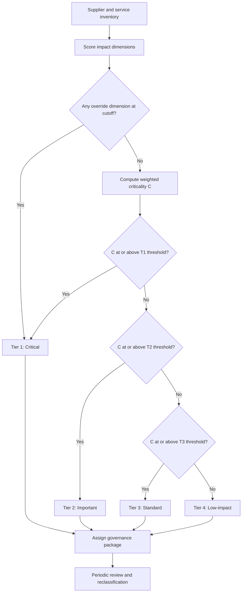

## Supplier Tiering and Criticality Assessment


Supplier tiering and criticality assessment answer a question that the Kraljic matrix only partly addresses: **which suppliers, as organizations, deserve how much management attention, monitoring, and contingency planning?** Tiering groups suppliers into ranked management tiers (for example Tier 1 through Tier 4) that determine governance intensity. Criticality assessment measures how severely the loss or degradation of a supplier would harm the business. Together they produce a defensible, repeatable basis for allocating relationship effort, due diligence depth, monitoring frequency, and dual-sourcing investment.

### Foundations

**Key Points**

- **Two different meanings of "tier" exist and must not be confused.**
  - **Management tiering (supplier classification tiers):** ranking suppliers by importance to decide management intensity (for example "Tier 1 = critical, Tier 4 = low-touch"). This is the subject of this reference.
  - **Supply chain tiering (supply network position):** Tier 1 suppliers sell directly to the buyer, Tier 2 suppliers sell to Tier 1, and so on upstream. This matters for sub-tier risk visibility and is covered as a separate dimension below.
- **Segmentation vs. tiering vs. criticality.** Segmentation (Kraljic) classifies *items or categories* by profit impact and supply risk. Tiering classifies *suppliers* into management levels. Criticality scores the *consequence of supplier failure*. They inform each other but are not interchangeable: a supplier can supply Routine items yet be critical because it provides a single indispensable service.
- **Criticality is a consequence measure; risk is a likelihood-plus-consequence measure.** A supplier can be highly critical yet currently low risk (stable and reliable) or noncritical yet high risk (unstable but easily replaced). Effective programs assess both and avoid conflating them.
- **Tier assignment drives obligations:** onboarding depth, contract clauses, audit rights, monitoring frequency, business continuity requirements, and executive involvement.
- **Regulated industries formalize criticality.** Financial services, for example, use "critical or important functions" concepts in third-party and outsourcing risk rules (regulation names and thresholds vary by jurisdiction and change over time, so consult current requirements). This reference describes general practice rather than any specific regulation.

### Tiering vs. Segmentation vs. Criticality

| Concept | Unit of Analysis | Core Question | Typical Output |
| --- | --- | --- | --- |
| Kraljic segmentation | Item / category | How should we source this? | Strategic, Leverage, Bottleneck, Routine |
| Criticality assessment | Supplier (and its services) | How bad is it if this supplier fails? | Criticality score or rating |
| Risk assessment | Supplier | How likely and how severe is a problem? | Risk rating |
| Management tiering | Supplier | How much management effort does it get? | Tier 1 to Tier N |
| Supply chain tier position | Network node | How far upstream is this supplier? | Tier 1, 2, 3 (network depth) |

### Criticality Assessment Dimensions

Criticality is typically built from several impact dimensions. Organizations choose the set relevant to their business.

| Dimension | Question | Example Indicators |
| --- | --- | --- |
| Operational impact | What stops or degrades if the supplier fails? | Production line stoppage, service outage, order fulfillment failure |
| Financial impact | What does failure cost? | Revenue at risk per day, spend share, expedite and re-sourcing costs |
| Substitutability / replaceability | How hard and slow is replacement? | Number of qualified alternatives, qualification time, switching cost |
| Time to recover | How long until normal operations resume? | Lead time to qualify an alternative, inventory coverage days |
| Customer and brand impact | Does failure reach customers? | SLA breaches, safety exposure, reputational effect |
| Regulatory and compliance impact | Does failure create legal exposure? | Regulated data handling, product safety, licensing obligations |
| Data and cyber exposure | What sensitive data or system access does the supplier have? | Access to personal data, network connectivity, code or IP handling |
| Strategic and innovation importance | Does the supplier enable differentiation? | Proprietary technology, co-development role, unique capability |
| Dependency concentration | How concentrated is our reliance? | Share of category volume, single-source status |

**Interpretation notes**

- Assess criticality for the **worst credible failure scenario**, not average conditions.
- Evaluate criticality **per service or product line** where a supplier provides several, then roll up (typically taking the maximum), because a single critical service should determine the supplier's classification.
- Separate **inherent criticality** (before mitigations such as safety stock or a qualified backup) from **residual criticality** (after mitigations). Tiering typically uses inherent criticality; mitigations are the response, and using residual values causes tiers to fall precisely because protections exist, inviting their removal.

### Scoring Model

**Step 1: Define impact dimensions and scales.** Use anchored 1 to 5 scales with explicit descriptions.

| Score | Time to Replace / Recover (illustrative anchors) |
| --- | --- |
| 1 | Less than 1 week, alternatives readily available |
| 2 | 1 to 4 weeks |
| 3 | 1 to 3 months |
| 4 | 3 to 12 months |
| 5 | More than 12 months or no alternative exists |

Anchor values are illustrative and should be calibrated to the industry and product.

**Step 2: Weight the dimensions.** A weighted composite:

$$C = \sum_{k=1}^{n} w_k \, c_k, \qquad \sum_{k} w_k = 1$$

**Step 3: Apply overrides.** Weighted averages let a low score on one dimension mask a severe score on another. A common safeguard is a **critical-dimension override** that forces a high tier if any designated dimension reaches a cutoff:

$$C^{*} = \begin{cases} C_{\max} & \text{if } \exists\, k \in K : c_k \ge \theta \\ C & \text{otherwise} \end{cases}$$

where $K$ is the set of override-eligible dimensions (for example, regulated data access, sole-source status, safety impact), $\theta$ is the cutoff, and $C_{\max}$ is the top-of-scale score. This is a design choice rather than a universal standard.

**Step 4: Optionally combine with a risk score.** Where a program wants a single prioritization figure, criticality and risk can be combined:

$$P_{\text{priority}} = C^{*} \times R$$

where $R$ is a normalized risk-likelihood rating. Use this cautiously: multiplication compresses ranges and can make very different situations look equal, so many programs keep the two ratings separate and place suppliers on a criticality-versus-risk grid instead.

### Tier Definitions

The number of tiers and their names vary. A four-tier model is common; the table below is illustrative.

| Tier | Typical Name | Typical Criteria | Typical Share of Supplier Base* |
| --- | --- | --- | --- |
| Tier 1 | Critical / Strategic | High criticality (override triggered or $C^{*}$ high); failure causes major operational, safety, regulatory, or revenue impact | A small fraction (commonly single-digit percent) |
| Tier 2 | Important / Key | Substantial impact, but with viable alternatives or mitigation | Roughly 10 to 20 percent |
| Tier 3 | Standard / Managed | Moderate impact; replaceable with moderate effort | Roughly 20 to 30 percent |
| Tier 4 | Low-impact / Transactional | Minimal impact; readily replaceable | The majority by count, minority by spend |

*Shares are rough conventions, not standards; actual distributions depend on the business and the scoring calibration.

**Tier assignment logic**



### Worked Example

```python
from dataclasses import dataclass, field

# --- Configuration -----------------------------------------------------------
WEIGHTS = {
    "operational": 0.25,
    "financial": 0.15,
    "replaceability": 0.20,
    "recovery_time": 0.10,
    "regulatory": 0.10,
    "data_cyber": 0.10,
    "customer_brand": 0.10,
}
OVERRIDE_DIMS = {"regulatory", "data_cyber"}   # dimensions that can force Tier 1
OVERRIDE_CUTOFF = 5
TIER_THRESHOLDS = [(4.0, "Tier 1"), (3.0, "Tier 2"), (2.0, "Tier 3")]  # else Tier 4

assert abs(sum(WEIGHTS.values()) - 1) < 1e-9

@dataclass
class Supplier:
    name: str
    scores: dict = field(default_factory=dict)   # 1-5 per dimension

def criticality(s: Supplier):
    base = sum(WEIGHTS[d] * s.scores[d] for d in WEIGHTS)
    overridden = any(s.scores[d] >= OVERRIDE_CUTOFF for d in OVERRIDE_DIMS)
    return base, overridden

def assign_tier(s: Supplier):
    base, overridden = criticality(s)
    if overridden:
        return base, "Tier 1 (override)"
    for cutoff, tier in TIER_THRESHOLDS:
        if base >= cutoff:
            return base, tier
    return base, "Tier 4"

suppliers = [
    Supplier("CloudHost Inc", {"operational": 5, "financial": 4, "replaceability": 4,
                               "recovery_time": 4, "regulatory": 3, "data_cyber": 5,
                               "customer_brand": 4}),
    Supplier("Precision Castings", {"operational": 4, "financial": 3, "replaceability": 4,
                                    "recovery_time": 4, "regulatory": 2, "data_cyber": 1,
                                    "customer_brand": 3}),
    Supplier("Pack & Ship Co", {"operational": 2, "financial": 3, "replaceability": 2,
                                "recovery_time": 2, "regulatory": 1, "data_cyber": 1,
                                "customer_brand": 2}),
    Supplier("OfficeMart", {"operational": 1, "financial": 1, "replaceability": 1,
                            "recovery_time": 1, "regulatory": 1, "data_cyber": 1,
                            "customer_brand": 1}),
]

print(f"{'Supplier':22s}{'C':>6s}  Tier")
for s in suppliers:
    c, tier = assign_tier(s)
    print(f"{s.name:22s}{c:6.2f}  {tier}")
```

**Output** (computed from the weights and thresholds above)



```
Supplier                  C  Tier
CloudHost Inc          4.30  Tier 1 (override)
Precision Castings     3.25  Tier 2
Pack & Ship Co         2.15  Tier 3
OfficeMart             1.00  Tier 4
```

Here CloudHost triggers the override because of its data and cyber exposure, and would have reached Tier 1 by weighted score anyway. The override matters most for a supplier with severe exposure on a single dimension whose weighted average would otherwise land in a lower tier.

### Governance Packages by Tier

Tier assignment is only useful if it triggers differentiated obligations.

| Element | Tier 1 | Tier 2 | Tier 3 | Tier 4 |
| --- | --- | --- | --- | --- |
| Executive sponsor | Yes | Optional | No | No |
| Relationship owner | Senior category manager | Category manager | Buyer | Automated / shared |
| Due diligence at onboarding | Deep (financial, security, compliance, site audit) | Standard plus targeted audit | Standard questionnaire | Basic verification |
| Contract protections | Continuity clauses, audit rights, step-in, exit assistance, subcontracting controls | Audit and SLA clauses | Standard terms with SLAs | Standard terms |
| Performance reviews | Monthly ops, quarterly strategic | Quarterly | Semiannual or annual | Exception-based |
| Risk monitoring | Continuous (financial, geopolitical, cyber alerts) | Periodic (quarterly) | Annual | Event-triggered |
| Business continuity plan | Required, tested | Required, reviewed | Requested | Not required |
| Contingency / exit plan | Documented and rehearsed | Documented | Outline | None |
| Redundancy | Dual sourcing or qualified backup evaluated | Backup evaluated for key items | Ad hoc | None |
| Reassessment cadence | At least annual and on triggers | Annual | Every 2 to 3 years | On trigger only |

Specific cadences are conventions; adapt to the risk appetite and regulatory context.

### Criticality vs. Risk Grid

Placing suppliers on a two-dimensional grid preserves information that a single score loses.

```mermaid
quadrantChart
    title Supplier Criticality vs Risk Likelihood
    x-axis Low Risk Likelihood --> High Risk Likelihood
    y-axis Low Criticality --> High Criticality
    quadrant-1 Act now: mitigate and diversify
    quadrant-2 Protect: monitor and maintain
    quadrant-3 Observe: low priority
    quadrant-4 Watch: replace if needed
    CloudHost Inc: [0.55, 0.92]
    Precision Castings: [0.75, 0.65]
    Pack and Ship Co: [0.35, 0.35]
    OfficeMart: [0.10, 0.05]
```

**Reading the grid**

- **High criticality, high risk:** immediate mitigation (second source, safety stock, contingency plan, contract renegotiation).
- **High criticality, low risk:** protect the relationship, keep monitoring, and maintain continuity provisions, because risk can rise quickly.
- **Low criticality, high risk:** consider replacing the supplier or accepting the risk consciously.
- **Low criticality, low risk:** minimal effort.

### Supply Chain Tier Position and Sub-Tier Visibility

Management tiers describe importance; **network tiers** describe position. A Tier 1 (direct) supplier may itself depend on a single Tier 2 or Tier 3 source, creating hidden concentration.

**Sub-tier assessment practices**

- **Map** critical parts and services to sub-tier suppliers using bills of materials and supplier disclosure.
- **Identify shared dependencies:** two apparently independent suppliers relying on the same sub-tier source or same region provide less redundancy than they appear to (correlated risk).
- **Prioritize depth by criticality:** deep mapping for Tier 1 management-tier suppliers; lighter mapping for lower tiers.
- **Flow down requirements:** contractual obligations for disclosure, compliance, and continuity to sub-tier suppliers.

**Effective redundancy adjustment**

For $m$ nominally independent suppliers whose disruption probabilities are $p_1, \dots, p_m$, independence would give a joint failure probability

$$P_{\text{fail}} = \prod_{i=1}^{m} p_i$$

but shared sub-tier dependence adds a common-cause term, so actual failure probability is closer to

$$P_{\text{fail}} \approx p_{\text{common}} + (1 - p_{\text{common}}) \prod_{i=1}^{m} p_i$$

where $p_{\text{common}}$ is the probability of a shared upstream disruption. This is a simplified model; real correlations are hard to estimate and should be presented as ranges.

### Assessment Process

1. **Build the supplier and service inventory.** Consolidate data from ERP, AP, contract repositories, and IT asset lists; deduplicate suppliers and identify parent-subsidiary relationships.
2. **Define dimensions, scales, weights, and overrides.** Agree with procurement, operations, risk, finance, IT security, legal, and compliance.
3. **Score suppliers.** Combine data-driven inputs (spend, lead time, supplier count) with structured stakeholder input from business owners.
4. **Calibrate and challenge.** Review borderline cases and outliers in a cross-functional session; require evidence for high and low scores.
5. **Assign tiers and governance packages.** Communicate obligations to relationship owners and, where relevant, to suppliers.
6. **Record rationale.** Keep an evidence log so tiers can be audited and defended.
7. **Monitor and reassess.** Refresh scores on schedule and on triggers.

**Reassessment triggers**

- Supplier merger, acquisition, or financial deterioration
- Change in scope, volume, or data access
- Design or technology change altering replaceability
- Regulatory change
- A disruption or near miss
- Change in the availability of alternatives

### Data Sources and Quality

| Input | Source | Common Problems |
| --- | --- | --- |
| Spend and volume | ERP, AP, spend analytics | Duplicate vendor records, uncategorized spend |
| Service and dependency mapping | Business owners, architecture and BOM data, IT asset inventory | Shadow suppliers not in procurement systems |
| Replaceability | Category managers, market intelligence | Optimistic "qualified alternative" claims that were never tested |
| Financial health | Credit and financial-data services, public filings | Coverage gaps for private companies; lag |
| Cyber and data exposure | Security questionnaires, access reviews | Self-reported answers; stale attestations |
| Geopolitical and sub-tier | Risk-intelligence services, supplier disclosure | Cost, opacity, delay |

### Common Pitfalls

- **Spend-based tiering only:** ranks by money and misses low-spend critical suppliers (for example, a small vendor with privileged system access or a sole-source component).
- **Confusing criticality with risk:** produces either complacency about stable critical suppliers or over-management of unstable but replaceable ones.
- **Using residual criticality:** mitigations lower the score, which then justifies removing the mitigations.
- **Averaging away critical exposures:** compensatory weighted averages hide single severe dimensions; use overrides.
- **Tier inflation:** when too many suppliers are placed in Tier 1, governance resources are diluted and the label loses meaning. Set a capacity check on Tier 1 population.
- **Static tiers:** infrequent reassessment leaves classifications out of date.
- **Ignoring sub-tier concentration:** dual sourcing at Tier 1 that shares an upstream source provides false assurance.
- **Business-owner bias:** owners tend to overrate their own suppliers' criticality; independent review and evidence requirements reduce this.
- **Shadow IT and non-procured suppliers:** suppliers engaged outside procurement often escape the inventory yet carry data and operational exposure.
- **Governance without follow-through:** assigning a tier without enforcing the corresponding obligations produces paper compliance.

### Metrics for the Program

| Metric | Purpose |
| --- | --- |
| Percentage of spend and of suppliers covered by tier assessment | Coverage |
| Share of Tier 1 suppliers with current continuity plans and completed reviews | Compliance with governance |
| Age of last assessment by tier | Currency |
| Number of tier changes per period and their triggers | Stability and responsiveness |
| Share of Tier 1 items with a qualified alternative or tested contingency | Resilience |
| Incidents or near misses by tier | Validation of tier logic |

**Conclusion**

Supplier tiering and criticality assessment convert supplier-level consequence analysis into differentiated management obligations. Criticality measures how severely a supplier's failure would harm the business across operational, financial, regulatory, data, and customer dimensions, ideally scored on inherent (pre-mitigation) terms with overrides for severe single-dimension exposure. Tiers then bundle governance, due diligence, monitoring, and contingency requirements so effort follows importance. Robust programs keep criticality distinct from risk likelihood, consider sub-tier concentration, guard against tier inflation and stale data, and reassess on both schedule and trigger events. Because scores rely on judgment and imperfect data, borderline classifications warrant explicit review, and results should be treated as decision support rather than exact measurement.

**Related Topics**

- Third-party and vendor risk management frameworks
- Sub-tier mapping and multi-tier supply chain visibility
- Business continuity planning and supplier exit strategies
- Supplier financial health monitoring and early-warning indicators
- Cyber and data-protection due diligence for suppliers
- Dual-sourcing qualification and correlated-risk analysis
- Supplier performance scorecards and review cadence design
- Supplier risk quantification and expected-loss modeling