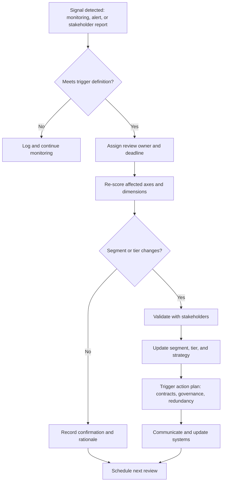

## Reviewing and Re-Segmenting Suppliers Over Time


Supplier segmentation is a **point-in-time judgment** about a moving system. Markets consolidate, technologies mature, regulations change, suppliers grow or fail, and internal demand shifts. A segmentation that is accurate on the day it is built becomes progressively misleading unless it is deliberately reviewed and updated. Reviewing and re-segmenting suppliers over time is the discipline of keeping segment assignments, tiers, and the strategies attached to them aligned with current reality, without creating instability, review fatigue, or constant strategy churn.

### Foundations

**Key Points**

- **Segmentation decays.** Every input to the Kraljic axes (spend, supplier count, lead time, market concentration, switching cost) and to tiering and criticality scores changes over time. The matrix is a snapshot, not a permanent label.
- **Two review mechanisms are needed.** **Scheduled reviews** (calendar-driven, catching slow drift) and **event-triggered reviews** (catching sudden change). Relying on only one leaves gaps: scheduled-only reviews miss shocks; trigger-only reviews miss gradual drift and depend on someone noticing.
- **Re-segmentation is not the goal; better decisions are.** A review is successful when it confirms a correct classification as readily as when it changes one. Programs that measure success by the number of changes create pressure to invent movement.
- **Segment changes must cascade.** Moving a supplier or item to another segment is only meaningful if governance, contract approach, monitoring, and redundancy posture change with it. A reclassification without a corresponding action plan is paperwork.
- **Stability matters.** Suppliers, and the internal teams managing them, need consistent treatment. Hysteresis (requiring a stronger signal to change a segment than to keep it) prevents flip-flopping around thresholds.
- **Deliberate movement is a strategic tool.** Sourcing strategy often aims to shift items toward more favorable positions (for example Bottleneck toward Routine through standardization), so re-segmentation also measures whether strategies are working.

### Why Segmentation Changes

| Change Driver | Example | Typical Effect on Position |
| --- | --- | --- |
| Supply market structure | Supplier merger, exit, new entrant, capacity addition | Supply risk rises or falls |
| Technology and design | Redesign to a standard part; a component becomes proprietary | Risk and profit impact shift |
| Demand and spend | Volume growth, new product launch, product discontinuation | Profit impact rises or falls |
| Regulation and trade policy | Tariffs, sanctions, new compliance obligations | Supply risk (geopolitical, compliance) rises |
| Supplier condition | Financial distress, quality deterioration, capacity constraint | Supply risk and criticality shift |
| Buyer position | Company acquisition, expansion into a new region, change in bargaining power | Effective risk changes |
| Strategy outcomes | Successful second-source qualification or standardization | Risk falls (intended movement) |
| Market cycles | Commodity shortage or glut | Temporary shifts in risk and price volatility |

### Review Types

| Review Type | Purpose | Typical Frequency | Scope |
| --- | --- | --- | --- |
| Full portfolio refresh | Re-score all items or suppliers, recalibrate weights and thresholds | Annually (or aligned to the budget and planning cycle) | Entire portfolio |
| Category-level review | Validate category segments and strategies with category owners | Semiannual or aligned with category strategy cycles | Per category |
| Tier-based cadence review | Review suppliers at a frequency proportional to their tier | Tier 1 quarterly or continuously; Tier 2 annually; lower tiers less often | Per supplier |
| Event-triggered review | Reassess promptly after a defined event | On event | Affected suppliers and items |
| Contract-lifecycle review | Reassess before renewal or re-tender | 6 to 12 months before expiry (a common convention) | Per contract |
| Post-incident review | Reassess after a disruption or near miss | After incident | Affected suppliers and dependent items |

Frequencies are conventions, not standards; align them with the volatility of the categories and the organization's risk appetite.

### Trigger Design

Triggers convert change signals into review actions. Well-designed triggers are **specific, measurable, and owned**.

| Trigger Category | Example Trigger Conditions | Suggested Action |
| --- | --- | --- |
| Financial | Credit rating downgrade; covenant breach; late payments to sub-tier | Immediate risk and criticality review for the supplier |
| Operational | On-time delivery below threshold for consecutive periods; lead time increase beyond a set percentage | Review supply risk score of affected items |
| Quality | Repeated nonconformances; recall involvement | Reassess criticality and supplier tier |
| Market | Supplier count drops; new entrant qualified; price volatility above threshold | Recalculate supply risk |
| Ownership | Merger, acquisition, divestiture | Reassess concentration, risk, and relationship strategy |
| Regulatory / geopolitical | Sanctions, tariffs, export controls, regional instability | Reassess geopolitical exposure and redundancy posture |
| Internal demand | Spend change beyond a set percentage; new product launch or end-of-life | Recalculate profit impact |
| Cyber | Security incident; expired attestations; increased data access | Reassess criticality and due diligence |
| Strategic | New sourcing strategy delivered (second source qualified, redesign completed) | Confirm intended segment movement |

**Trigger-to-action flow**



### Quantitative Change Detection

A rules-based approach flags meaningful score movement while ignoring noise.

**Score drift.** For a supplier or item $i$ with score $s_{i,t}$ at time $t$, the change is

$$\Delta s_{i,t} = s_{i,t} - s_{i,t-1}$$

A review flag is raised when $|\Delta s_{i,t}| \ge \delta$, where $\delta$ is a materiality threshold chosen to exceed normal scoring noise.

**Hysteresis to prevent flip-flopping.** Instead of a single threshold $\tau$, use a higher promotion threshold and a lower demotion threshold:

$$\text{segment}_{t} = \begin{cases} \text{high} & \text{if } s_t \ge \tau + h \\ \text{low} & \text{if } s_t \le \tau - h \\ \text{segment}_{t-1} & \text{otherwise} \end{cases}$$

where $h$ is the hysteresis margin. Items whose scores sit within $\tau \pm h$ remain in their previous segment, which avoids repeated reclassification of borderline items caused by small fluctuations. The value of $h$ is a design choice and should be tested against historical score movement.

**Smoothing volatile inputs.** For inputs prone to short-term spikes (for example price volatility), an exponentially weighted moving average reduces reactions to transient noise:

$$\tilde{x}_t = \lambda x_t + (1 - \lambda)\, \tilde{x}_{t-1}, \qquad 0 < \lambda \le 1$$

A smaller $\lambda$ smooths more but responds more slowly; a real disruption may warrant an override that bypasses smoothing.

### Worked Example

```python
from dataclasses import dataclass
from typing import Optional

THRESHOLD_P = 3.0
THRESHOLD_R = 3.0
HYSTERESIS = 0.3          # margin around thresholds
MATERIALITY = 0.5         # minimum score change that flags a review

@dataclass
class Snapshot:
    period: str
    profit: float   # composite profit impact, 1-5
    risk: float     # composite supply risk, 1-5

def side(value: float, threshold: float, previous_high: Optional[bool]) -> bool:
    """Return True for 'high' using hysteresis; previous_high=None means first assessment."""
    if previous_high is None:
        return value >= threshold
    if value >= threshold + HYSTERESIS:
        return True
    if value <= threshold - HYSTERESIS:
        return False
    return previous_high

def quadrant(p_high: bool, r_high: bool) -> str:
    if p_high and r_high:
        return "Strategic"
    if p_high:
        return "Leverage"
    if r_high:
        return "Bottleneck"
    return "Routine"

def review_history(name: str, history: list[Snapshot]):
    print(f"--- {name} ---")
    p_high = r_high = None
    prev: Optional[Snapshot] = None
    prev_quadrant = None
    for snap in history:
        p_high = side(snap.profit, THRESHOLD_P, p_high)
        r_high = side(snap.risk, THRESHOLD_R, r_high)
        q = quadrant(p_high, r_high)
        flags = []
        if prev is not None:
            if abs(snap.profit - prev.profit) >= MATERIALITY:
                flags.append("profit drift")
            if abs(snap.risk - prev.risk) >= MATERIALITY:
                flags.append("risk drift")
        change = "" if q == prev_quadrant else (f"  <- moved from {prev_quadrant}" if prev_quadrant else "")
        flag_txt = f"  [review: {', '.join(flags)}]" if flags else ""
        print(f"{snap.period}  P={snap.profit:.1f} R={snap.risk:.1f}  {q}{change}{flag_txt}")
        prev, prev_quadrant = snap, q

review_history("Legacy Valve Seal", [
    Snapshot("2024-Q1", 1.5, 3.8),
    Snapshot("2024-Q3", 1.6, 3.7),
    Snapshot("2025-Q1", 1.6, 2.9),   # second source qualified; inside hysteresis band
    Snapshot("2025-Q3", 1.7, 2.4),   # clearly below lower bound
])

review_history("Specialty Resin", [
    Snapshot("2024-Q1", 3.6, 2.4),
    Snapshot("2024-Q3", 3.8, 2.9),   # inside band; remains Leverage
    Snapshot("2025-Q1", 3.9, 3.4),   # above upper bound
    Snapshot("2025-Q3", 4.1, 3.5),
])
```

**Output** (computed from the thresholds and hysteresis above)



```
--- Legacy Valve Seal ---
2024-Q1  P=1.5 R=3.8  Bottleneck
2024-Q3  P=1.6 R=3.7  Bottleneck
2025-Q1  P=1.6 R=2.9  Bottleneck  [review: risk drift]
2025-Q3  P=1.7 R=2.4  Routine  <- moved from Bottleneck  [review: risk drift]
--- Specialty Resin ---
2024-Q1  P=3.6 R=2.4  Leverage
2024-Q3  P=3.8 R=2.9  Leverage
2025-Q1  P=3.9 R=3.4  Strategic  <- moved from Leverage  [review: risk drift]
2025-Q3  P=4.1 R=3.5  Strategic
```

The Legacy Valve Seal shows hysteresis at work: at $R = 2.9$ the score is below the nominal threshold of 3.0 but inside the hysteresis band, so the item stays Bottleneck while the risk drift flag prompts a human review. It only moves to Routine once the score clearly falls below $\tau - h = 2.7$. The resin shows the reverse: it becomes Strategic only after crossing $\tau + h = 3.3$.

### Guarding Against Premature De-Risking

A subtle failure occurs when a successful mitigation lowers the measured risk, the item moves to a lower-risk quadrant, and the mitigation is then withdrawn.

**Safeguards**

- Score **inherent** risk for segmentation and track **residual** risk separately for risk management.
- When an item moves to a lower-risk segment because of a mitigation, **retain mitigation obligations for a defined period** or until the underlying market structure changes.
- Require **evidence** for downward moves (for example, second source fully qualified and production-approved, not just identified).
- Use **asymmetric review rigor**: downward moves in risk or criticality require stronger evidence than upward moves, since the cost of wrongly relaxing controls typically exceeds the cost of wrongly maintaining them.

### Re-Segmentation Impact Cascade

A segment or tier change should systematically update the following:

| Area | What Changes | Example |
| --- | --- | --- |
| Relationship model | Move along the transactional-to-partnership continuum | Leverage to Strategic: shift from tender-driven to partnership governance |
| Governance | Review cadence, owner seniority, executive sponsorship | Add executive sponsor when moving to Strategic |
| Contracts | Term length, pricing mechanism, continuity clauses | Add capacity reservation and step-in rights for a new Strategic supplier |
| Sourcing structure | Single, dual, or multi-source posture | Bottleneck: qualify a second source; Strategic to Leverage: introduce competition |
| Inventory policy | Buffer stock, consignment, VMI | Reduce buffer stock after a Bottleneck moves to Routine |
| Monitoring | Alert sources, frequency, KPIs | Add continuous financial monitoring for Tier 1 |
| Supplier communication | Explaining the changed relationship | Inform the supplier of new expectations and reviews |
| Systems and data | Master data, dashboards, workflow rules | Update segment fields in ERP and SRM tools |

**Transition planning.** Abrupt strategic changes can damage relationships or expose supply. Use a **transition plan** with timing, contract alignment (changes often best made at renewal), and communication. For downward moves (for example reducing partnership intensity), plan a graceful wind-down of governance, not a sudden withdrawal.

### Governance of the Review Process

**Roles**

- **Segmentation owner (process owner):** maintains methodology, weights, thresholds, and the calendar.
- **Category managers:** score items, propose changes, and own action plans.
- **Cross-functional reviewers:** engineering, finance, operations, risk, and IT security validate scores in their domains.
- **Review board or steering group:** approves changes to Tier 1 and Strategic segments and resolves disputes.
- **Data steward:** maintains data quality and the evidence log.

**Artifacts**

- **Segmentation register:** current and historical segment, tier, scores, and rationale per item and supplier.
- **Change log:** date, trigger, old and new segment, evidence, approver, and resulting actions.
- **Trigger register:** definitions, thresholds, owners, and data sources.
- **Action plans:** linked to each segment change with owners and due dates.

**Example change log record**

| Field | Example Value |
| --- | --- |
| Item / supplier | Legacy Valve Seal / SealWorks |
| Review date | 2025-09 |
| Trigger | Strategy outcome: second source approved |
| Previous segment | Bottleneck |
| New segment | Routine |
| Evidence | Qualification report; two production lots accepted; stock coverage restored |
| Approver | Category steering group |
| Follow-up actions | Reduce buffer stock over two quarters; remove watch-list status; consolidate to catalog ordering |
| Retained safeguards | Maintain second-source approval for 12 months |

### Data and Automation

Manual annual scoring is labor-intensive and slow to catch change. Partial automation improves timeliness.

| Capability | Approach |
| --- | --- |
| Automated score inputs | Pull spend, lead times, delivery performance, and quality data from ERP and quality systems on a schedule |
| Continuous monitoring | Integrate external feeds for supplier financial health, news, sanctions, and cyber ratings |
| Threshold alerts | Generate review tasks when triggers fire or scores drift beyond materiality |
| Workflow and audit trail | Route re-scoring and approvals through a workflow tool with a stored change log |
| Dashboards | Show segment distribution over time, migration matrices, overdue reviews, and open action plans |

**Migration matrix.** A table counting items that moved between segments between two review dates reveals structural change.

| From \ To | Strategic | Leverage | Bottleneck | Routine |
| --- | --- | --- | --- | --- |
| Strategic | 42 | 3 | 1 | 0 |
| Leverage | 5 | 118 | 0 | 6 |
| Bottleneck | 2 | 0 | 27 | 9 |
| Routine | 0 | 4 | 3 | 310 |

The counts are illustrative. Large off-diagonal counts indicate either genuine market change, strategy success (for example Bottleneck to Routine), or unstable scoring; the interpretation requires reviewing the underlying causes.

Automated scores support but do not replace expert judgment, especially for qualitative criteria such as strategic importance and market outlook. Model outputs and data feeds can be incomplete or delayed, so validate high-impact reclassifications manually.

### Aligning the Review Calendar

Align reviews with existing business rhythms to reduce burden and increase relevance.

- **Annual planning and budgeting:** refresh profit impact using updated demand forecasts.
- **Category strategy cycles:** integrate segment reviews into category strategy updates.
- **Contract renewal windows:** start reviews 6 to 12 months before expiry so any change can be reflected in the renewal.
- **Supplier business reviews:** use quarterly Tier 1 reviews to capture qualitative signals.
- **Risk reporting cycles:** feed criticality and risk changes into enterprise risk reporting.

### Common Pitfalls

- **One-and-done segmentation:** the initial exercise is treated as a project with an end date, and the matrix becomes stale.
- **Flip-flopping:** small score changes near thresholds cause repeated reclassification and strategy churn; use hysteresis and materiality thresholds.
- **Change without cascade:** segments update in a spreadsheet, but contracts, governance, and inventory policy do not.
- **Premature de-risking:** relaxing controls because mitigations lowered measured risk.
- **Review fatigue:** overly frequent full re-scoring exhausts stakeholders and degrades score quality; tie effort to tier and volatility.
- **Trigger blindness:** triggers exist on paper but no one monitors the data or owns the response.
- **Score inflation or deflation:** category managers gradually drift scores to justify preferred strategies; periodic cross-review and calibration workshops counter this.
- **Ignoring the supplier's perspective:** a supplier's view of the buyer (customer attractiveness) changes over time and can make a planned strategy unachievable.
- **Incomplete history:** without a change log, the organization cannot learn why segments changed or whether strategies worked.
- **Confusing temporary and structural change:** a short-lived shortage may not justify a permanent segment change; distinguish transient spikes from structural shifts, using smoothing and a defined observation window.

### Program Metrics

| Metric | Purpose |
| --- | --- |
| Percentage of portfolio reviewed on schedule, by tier | Process discipline |
| Average age of last assessment | Currency of data |
| Number of trigger events and time to complete reviews | Responsiveness |
| Segment migration rate and reasons | Market and strategy dynamics |
| Percentage of segment changes with completed action plans | Cascade effectiveness |
| Reclassification reversals within a set period | Stability and scoring quality |
| Share of Bottleneck items with an active mitigation or shift plan | Strategy follow-through |
| Incidents in segments rated low risk | Validation of segmentation accuracy |

**Conclusion**

Reviewing and re-segmenting suppliers over time keeps the portfolio matrix, tiering, and criticality assessments faithful to a changing environment. Effective programs combine scheduled reviews with event-driven triggers, use materiality thresholds and hysteresis to separate signal from noise, and require evidence for downward risk moves to avoid premature de-risking. Each segment or tier change must cascade into contracts, governance, sourcing structure, inventory policy, and monitoring, and every review should be recorded so the organization can learn from movement patterns. Because scores rely on imperfect data and judgment, borderline and high-impact changes deserve explicit human review, and thresholds, cadences, and trigger definitions should themselves be revisited periodically.

**Related Topics**

- Supplier performance measurement and scorecard evolution
- Continuous supplier risk monitoring and early-warning systems
- Contract lifecycle management and renewal-driven strategy changes
- Category strategy development and refresh cycles
- Supplier development and improvement planning
- Transition management for changing supplier relationships
- Dual-sourcing qualification and exit planning
- Master data governance for supplier segmentation attributes