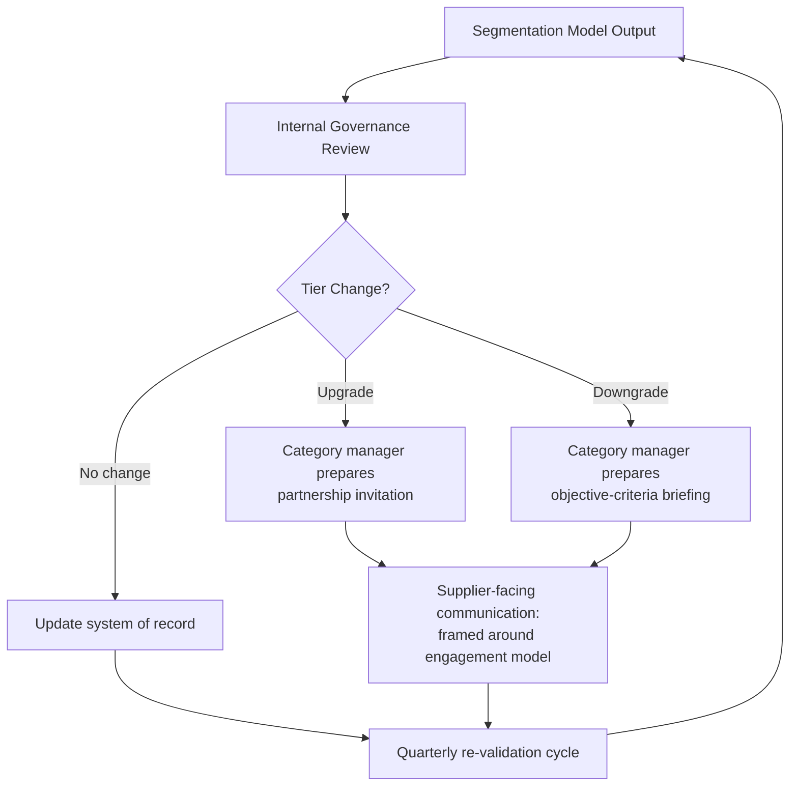

## Communicating Segmentation Internally and to Suppliers

### Overview

Supplier segmentation only creates value when the resulting classifications change behavior — how buyers allocate time, how suppliers understand what is expected of them, and how the organization directs risk-management effort. A segmentation model that lives only in a spreadsheet or a procurement analyst's dashboard fails at this. This topic covers how to translate internal segmentation frameworks (e.g., Kraljic-derived quadrants, strategic/preferred/transactional tiers) into communication artifacts, governance structures, and supplier-facing messaging that are accurate, defensible, and non-disruptive to commercial relationships.

### Why Communication Is a Distinct Discipline From Segmentation Itself

Segmentation is an analytical exercise (spend concentration, risk exposure, substitutability, market complexity). Communication is a change-management and relationship-management exercise. Two failure modes dominate:

- **Internal failure**: stakeholders (engineering, finance, category managers) disagree with or ignore the segmentation because they were not consulted or the rationale wasn't transparent.
- **External failure**: suppliers learn of their tier informally, inconsistently, or in a way that damages trust — particularly when a supplier is moved to a lower tier ("de-prioritized" or "transactional") without context.

Both failures stem from treating segmentation as a one-time analytical output rather than an ongoing communication process with distinct internal and external tracks.

---

### Internal Communication

#### Audiences and Their Concerns

| Audience | Primary Concern | What They Need From the Communication |
| --- | --- | --- |
| Executive sponsors | Strategic alignment, risk exposure | Summary view: how many suppliers per tier, concentration of spend/risk |
| Category managers | Day-to-day supplier engagement | Clear behavioral guidance per tier (contact cadence, escalation paths) |
| Finance/Procurement Ops | Contractual and payment implications | Which tier drives which contract terms, payment terms, audit frequency |
| Engineering/Quality | Technical dependency risk | Which suppliers are single-source or hold critical IP, regardless of spend tier |
| Legal/Compliance | Contractual and regulatory exposure | Tier-linked due diligence requirements (e.g., enhanced KYC for strategic tier) |

A single communication artifact rarely serves all these audiences well. The common pattern is a **tiered documentation set**:

1. **Executive one-pager**: segmentation methodology in one paragraph, a quadrant or tier chart, headline metrics (spend %, supplier count %, risk flags).
2. **Category manager playbook**: per-tier operating rules — meeting cadence, KPI review frequency, escalation matrix, negotiation posture guidance.
3. **Systems-of-record update**: the segmentation tier becomes a field in the ERP/SRM/procurement system (not a static document), so it's queryable and drives workflow automation (e.g., auto-routing high-risk-tier contracts to legal review).

#### Governance: Making the Segmentation Durable

A segmentation exercise decays if it isn't re-validated. Internal communication should include a **governance cadence**, typically:

- Quarterly or semi-annual re-segmentation review (spend data refresh, risk re-scoring)
- A defined **owner** (typically a category management lead or SRM function) accountable for the tier assignment
- A **change log**: when a supplier moves tiers, why, and who approved it — this is critical both for audit purposes and for answering supplier questions consistently

**[Inference]** Organizations without a documented change-approval process for tier movements tend to experience "tier drift," where category managers informally treat suppliers as strategic (extra attention, concessions) without the classification being updated, creating a gap between the system of record and actual behavior. This is a common but not universally observed pattern.

#### Internal Communication Anti-Patterns

- **Broadcasting raw scores**: sharing the underlying weighted-scoring model (e.g., "Supplier X scored 3.2/5 on innovation capability") outside the analytical team invites disputes over methodology rather than action. Communicate the *tier and its implications*, not the scoring mechanics, to broad audiences.
- **Static PDF distribution**: a one-time slide deck sent via email is not discoverable later and cannot reflect tier changes. Segmentation should live in a system that is the single source of truth.
- **Omitting the "why"**: category managers who don't understand the segmentation logic will not trust or apply it. A brief methodology appendix (even one paragraph) dramatically increases adoption.

---

### External Communication (to Suppliers)

This is the higher-risk half of the topic. Suppliers should generally **not** receive a literal export of an internal tiering document, but the *implications* of segmentation are frequently — and often should be — communicated, framed around partnership expectations rather than internal classification labels.

#### Core Principle: Translate Tiers Into Behavior, Not Labels

Internal Label → External Framing:

- "Strategic supplier" → invited into a formal **Strategic Partnership Program**, business reviews, joint innovation initiatives
- "Preferred/Leverage supplier" → included in **Preferred Supplier Program**, competitive but structured engagement, periodic performance reviews
- "Transactional/Non-critical supplier" → managed via **standard procurement terms**, typically no dedicated relationship communication beyond standard contracting and PO processes
- "Bottleneck supplier" (Kraljic quadrant — low spend, high risk) → engaged around **supply continuity and risk mitigation**, not spend leverage, since these suppliers often hold disproportionate power despite low commercial value

**Key Points**

- Never use internal quadrant or tier terminology verbatim with suppliers (e.g., avoid telling a supplier "you are classified as transactional" — this is demoralizing and can damage the relationship even when accurate).
- Frame communication around **what the relationship will look like going forward** (meeting cadence, scorecards, joint planning, contract structure) rather than the classification label itself.
- Segmentation-driven differentiation must remain consistent with **procurement ethics and, where applicable, anti-discrimination/antitrust considerations** — differentiate based on documented, defensible criteria (spend, risk, strategic fit), not informal or personal preference.

#### Communicating Upgrades (Moving a Supplier to a Higher Tier)

This is generally the easier conversation. Typical content:

- Acknowledgment of performance/strategic value (backed by scorecard data)
- Invitation into enhanced engagement structures (QBRs/joint business reviews, executive sponsorship, early involvement in NPD/roadmap discussions)
- Any change in commercial terms (volume commitments, payment terms, exclusivity discussions) — should be handled as a **contractual conversation**, separate from but informed by the relationship-tier conversation

#### Communicating Downgrades or Non-Strategic Status

This requires more care, particularly in dual-sourcing contexts where a supplier may be moved from sole-source to a secondary/backup role.

**Recommended approach:**

1. **Lead with objective criteria**: performance data, market changes, strategic shifts — not subjective judgments.
2. **Separate relationship framing from commercial consequence**: a supplier can be told their strategic engagement cadence is changing without necessarily learning "you scored low" — especially where the driver is portfolio rebalancing (e.g., deliberate dual-sourcing) rather than supplier fault.
3. **Preserve the relationship where future re-engagement is plausible**: markets shift; a transactional supplier today may need to become strategic again. Burning the relationship in the communication is a common, avoidable error.
4. **Time the message deliberately** — avoid combining a tier-downgrade conversation with an unrelated contract renewal or price negotiation, which conflates two separate discussions and creates unnecessary adversarial framing.

**[Inference]** In dual-sourcing programs specifically, communicating a shift from sole-source to secondary-source status is often more delicate than a straightforward "tier downgrade," because the supplier may reasonably interpret it as a precursor to full exit. Being explicit that dual-sourcing is a resilience strategy — not a performance verdict — is a commonly recommended practice, though its effectiveness varies by supplier relationship maturity and is not something that can be guaranteed to prevent friction.

#### Supplier-Facing Artifacts

- **Supplier scorecards**: quantitative, criteria-based, and should map transparently to how tier/engagement decisions are made — this is one of the most effective tools for making segmentation-driven decisions feel earned rather than arbitrary.
- **Partnership program charters**: for top-tier suppliers, a formal document describing the mutual expectations of the enhanced relationship (joint KPIs, meeting cadence, escalation contacts, innovation-sharing terms).
- **Standard supplier communications/onboarding packets**: for transactional-tier suppliers, standardized terms communicated via procurement policy documents rather than relationship-management artifacts, since the cost of bespoke relationship communication isn't justified at this tier.

---

### Governance and Consistency Diagram

### Segmentation Communication Flow (svg_diagram)

<svg xmlns="http://www.w3.org/2000/svg" viewBox="0 0 720 300">
<text x="360" y="24" text-anchor="middle" font-size="15" font-weight="bold" fill="#1a1a1a">Segmentation Communication Flow (svg_diagram)</text>
<rect x="20" y="60" width="160" height="60" rx="6" fill="#e8f0fe" stroke="#4a6fa5" />
<text x="100" y="85" text-anchor="middle" font-size="12" fill="#1a1a1a">Analytical Tier</text>
<text x="100" y="102" text-anchor="middle" font-size="12" fill="#1a1a1a">(internal only)</text>
<rect x="280" y="60" width="160" height="60" rx="6" fill="#fff3cd" stroke="#a5854a" />
<text x="360" y="85" text-anchor="middle" font-size="12" fill="#1a1a1a">Internal Playbook</text>
<text x="360" y="102" text-anchor="middle" font-size="12" fill="#1a1a1a">(category managers)</text>
<rect x="540" y="60" width="160" height="60" rx="6" fill="#d4edda" stroke="#4a a5 6f" />
<text x="620" y="85" text-anchor="middle" font-size="12" fill="#1a1a1a">Engagement Model</text>
<text x="620" y="102" text-anchor="middle" font-size="12" fill="#1a1a1a">(supplier-facing)</text>
<line x1="180" y1="90" x2="278" y2="90" stroke="#666" stroke-width="2" marker-end="url(#arrow)" />
<line x1="440" y1="90" x2="538" y2="90" stroke="#666" stroke-width="2" marker-end="url(#arrow)" />
<rect x="140" y="180" width="440" height="90" rx="6" fill="#f8f9fa" stroke="#999" />
<text x="360" y="203" text-anchor="middle" font-size="12" font-weight="bold" fill="#1a1a1a">Translation Rule</text>
<text x="360" y="225" text-anchor="middle" font-size="11" fill="#1a1a1a">Never expose raw tier labels or scores externally.</text>
<text x="360" y="243" text-anchor="middle" font-size="11" fill="#1a1a1a">Communicate cadence, program inclusion, and expectations —</text>
<text x="360" y="261" text-anchor="middle" font-size="11" fill="#1a1a1a">not the internal classification itself.</text>
</svg>

---

### Related Topics

- Kraljic Matrix methodology and scoring criteria design
- Supplier scorecard design and KPI selection
- Joint Business Review (JBR) / Quarterly Business Review structuring for strategic suppliers
- Dual-sourcing transition communication (sole-source to multi-source announcements)
- Change management for tier re-classification (approval workflows, audit trails)
- Anti-discrimination and antitrust considerations in differentiated supplier treatment
- Contract term differentiation by supplier tier (SLAs, payment terms, audit rights)