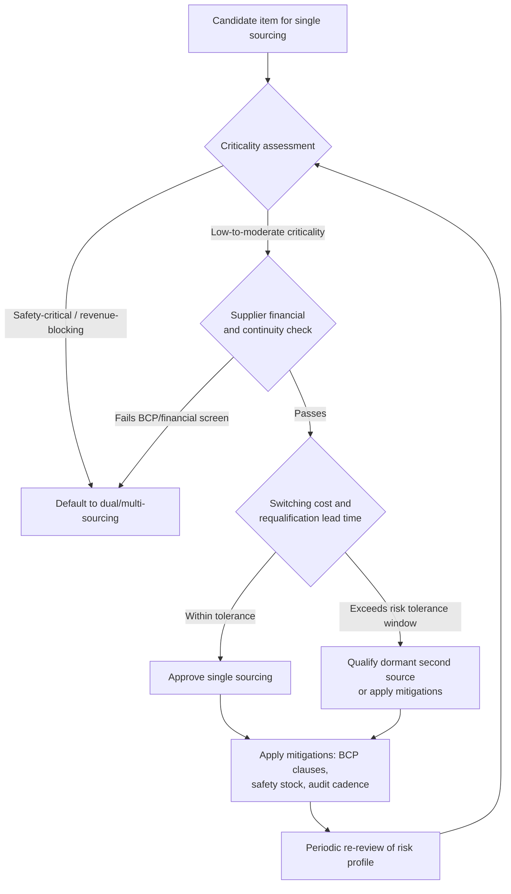

## Single Sourcing Rationale and Risk Profile

### Overview

Single sourcing is the deliberate decision to procure a good, service, or component from exactly one supplier, even when alternative suppliers exist in the market (this distinguishes it from **sole sourcing**, where only one supplier is technically or legally capable of supplying the item at all). Single sourcing is a strategic choice made because expected benefits — cost, quality, innovation partnership, simplified management — outweigh the concentration risk of depending on a single supply point. This topic covers the business rationale for choosing single sourcing, the risk categories it introduces, and the frameworks used to decide when it is and isn't appropriate.

### Single Sourcing vs. Sole Sourcing vs. Dual/Multi-Sourcing

| Term | Definition | Choice Involved? |
| --- | --- | --- |
| Single sourcing | One supplier chosen deliberately from a field of qualified alternatives | Yes — strategic decision |
| Sole sourcing | Only one supplier exists/is capable (patent-protected component, unique certification, monopoly) | No — market constraint |
| Dual sourcing | Two qualified suppliers maintained concurrently for the same item | Yes — strategic decision |
| Multi-sourcing | Three or more qualified suppliers maintained concurrently | Yes — strategic decision |

**Key Points**

- Sole sourcing is often mistaken for single sourcing in casual usage, but the risk-mitigation options differ fundamentally: single-sourcing risk can be reduced by *qualifying a second supplier*; sole-sourcing risk typically requires *substitution, redesign, or supplier development* since no alternative currently exists.
- A supplier categorized as "sole source" in engineering documentation (e.g., a BOM) should trigger a different risk-treatment pathway than one that is merely "currently single-sourced by choice."

---

### Rationale for Choosing Single Sourcing

#### 1. Volume Leverage and Cost Efficiency

Consolidating full demand volume with one supplier increases the buyer's negotiating leverage for that supplier's capacity, typically producing better unit pricing, priority scheduling, and more favorable payment terms than splitting volume would achieve. Splitting volume across two suppliers to preserve competition usually sacrifices some volume-discount tier on both sides.

#### 2. Quality Consistency

A single production line, tooling set, and quality system reduces part-to-part and batch-to-batch variability. This matters most for tightly toleranced components, regulated products (pharmaceuticals, medical devices), or items where inter-supplier variation would itself become a quality risk (e.g., color-matched materials, calibrated sensors).

#### 3. Relationship Depth and Innovation Access

Suppliers invest disproportionately in relationships where they hold 100% of the volume and can justify dedicated engineering resources, capacity reservation, or co-development investment. Strategic/innovation-partnership dynamics (joint R&D, early access to supplier roadmaps, custom tooling) are generally easier to sustain with a single, deeply integrated supplier than a split relationship.

#### 4. Lower Transaction and Management Overhead

Each additional qualified supplier adds fixed administrative cost: separate audits, separate quality agreements, separate systems integration, separate relationship management cadence. For lower-value or lower-risk categories, this overhead can exceed the risk-mitigation benefit of maintaining a second source.

#### 5. Tooling, Certification, or Switching-Cost Economics

Where qualification requires expensive tooling (injection molds, custom fixtures) or lengthy certification (aerospace, pharma, automotive PPAP), the fixed cost of qualifying and maintaining a second supplier can be prohibitive relative to the item's risk exposure — particularly for low-criticality items.

**[Inference]** Organizations frequently underestimate the *ongoing* (not just initial) cost of maintaining a qualified second source — requalification after process changes, minimum order commitments to keep the backup supplier "warm," and periodic audits — which is a common reason dual-sourcing programs quietly degrade back into single-sourcing in practice. This pattern is commonly discussed in procurement literature but its prevalence isn't something that can be quantified generally.

---

### Risk Profile of Single Sourcing

#### Concentration/Continuity Risk

The core risk: any disruption at the single supplier (fire, financial insolvency, labor action, natural disaster, cyberattack, quality escape, geopolitical event) has no immediate alternative supply path. Recovery time is bounded by how quickly an alternative can be qualified — which, for complex or certified components, can be months to years.

#### Negotiating Leverage Erosion Over Time

Volume leverage that justified single sourcing can invert: once a supplier recognizes it holds irreplaceable status (due to switching costs, tooling ownership, or qualification lead time), it gains leverage over the buyer in pricing and terms negotiations. This is sometimes called **switching-cost lock-in** or, in extreme cases, **hostage pricing**.

#### Innovation and Complacency Risk

Without competitive pressure from an alternate supplier, a single source may under-invest in continuous improvement, delay technology refresh, or deprioritize the account relative to newer or more contested customers.

#### Capacity Constraint Risk

Even a financially healthy, well-performing single source can become a bottleneck if its own capacity is constrained (e.g., by other customers' demand growth, raw material shortages, or its own capital investment cycle) — the buyer has no ability to shift volume elsewhere during a shortfall.

#### Geopolitical and Regulatory Risk

Single-sourcing from a supplier in a politically volatile region, or one subject to export controls/sanctions risk, concentrates macro-level risk that is often outside either party's direct control.

#### Quality Escape Amplification

A quality defect at a single source propagates to 100% of the affected volume, with no unaffected supply stream to fall back on during containment and root-cause investigation — unlike a dual-sourced item where the unaffected supplier's stream can continue.

---

### Risk Assessment Framework

A structured single-sourcing risk decision typically evaluates the following dimensions (often scored and weighted similarly to Kraljic-style segmentation):

$$R_{total} = w_1 \cdot R_{supply} + w_2 \cdot R_{financial} + w_3 \cdot R_{quality} + w_4 \cdot R_{geopolitical} + w_5 \cdot R_{switching}$$

Where each $R_i$ is typically scored on a normalized scale (e.g., 1–5) and $w_i$ reflects the relative weight the organization assigns to that risk category for the specific spend category. This is a common structural pattern for such scoring models; the specific weights and scales vary significantly by organization and industry, so this formula should be treated as illustrative rather than a fixed standard.

**Typical qualifying conditions for accepting single-source risk:**

- Item is low-to-moderate criticality (not a safety-critical or revenue-blocking component)
- Supplier has demonstrated financial stability and business continuity planning (BCP/DR capability)
- Switching cost/lead time to qualify an alternate is well understood and within acceptable recovery-time objectives
- Category has stable, low-volatility demand (reduces capacity-constraint exposure)
- Contractual protections exist (inventory buffer requirements, capacity guarantees, penalty clauses for supply failure)

**Conditions that typically argue against single sourcing:**

- Component is safety-critical, revenue-blocking, or has no substitute in the short term
- Supplier is financially fragile or has documented continuity concerns
- Category demand is volatile or growing faster than supplier's stated capacity roadmap
- Geopolitical/regulatory exposure is elevated (single region, sanctions-adjacent jurisdiction)
- Lead time to qualify an alternate supplier exceeds the organization's risk tolerance window

---

### Risk Mitigation Without Abandoning Single Sourcing

Organizations frequently retain single sourcing for its commercial benefits while mitigating the continuity risk through means short of dual sourcing:

- **Qualified-but-dormant second source**: a backup supplier is qualified and periodically audited/re-certified but receives no or minimal ongoing volume ("warm" backup) — balances readiness against dual-sourcing's full overhead.
- **Strategic inventory buffers**: holding safety stock calibrated to the supplier's demonstrated lead time plus a contingency margin.
- **Contractual continuity clauses**: business continuity plan (BCP) requirements written into the supply agreement, right-to-audit clauses, and financial health monitoring covenants.
- **Multi-site single sourcing**: the same supplier produces from two or more geographically separate facilities, mitigating site-specific (but not company-wide financial or organizational) risk while retaining single-supplier commercial terms.
- **Consignment or vendor-managed inventory (VMI)**: shifts some inventory risk to the supplier while preserving single-source commercial structure.

### Single Sourcing Risk-Decision Flow

**Example**

A city government document-management or records-digitization contract sourcing specialized long-term archival storage media from a single vendor: rationale would typically cite format/quality consistency and integration simplicity with the existing records system, while the risk profile would need to weigh vendor financial stability and the multi-year requalification lead time for archival-grade media against the (likely low) volume volatility of government record-keeping demand.

### Risk Category Comparison (svg_diagram)

<svg xmlns="http://www.w3.org/2000/svg" viewBox="0 0 720 260">
<text x="360" y="24" text-anchor="middle" font-size="15" font-weight="bold" fill="#1a1a1a">Single Sourcing: Benefit vs Risk Balance (svg_diagram)</text>
<line x1="60" y1="220" x2="660" y2="220" stroke="#333" stroke-width="1.5" />
<line x1="60" y1="220" x2="60" y2="50" stroke="#333" stroke-width="1.5" />
<text x="360" y="245" text-anchor="middle" font-size="11" fill="#1a1a1a">Item Criticality (low to high)</text>
<text x="30" y="140" text-anchor="middle" font-size="11" fill="#1a1a1a" transform="rotate(-90 30 140)">Concentration Risk</text>
<rect x="70" y="180" width="180" height="35" fill="#c8e6c9" stroke="#4caf50" />
<text x="160" y="202" text-anchor="middle" font-size="11" fill="#1a1a1a">Favorable for single-source</text>
<rect x="270" y="120" width="180" height="90" fill="#fff9c4" stroke="#fbc02d" />
<text x="360" y="168" text-anchor="middle" font-size="11" fill="#1a1a1a">Evaluate with mitigations</text>
<rect x="470" y="55" width="180" height="150" fill="#ffcdd2" stroke="#e53935" />
<text x="560" y="132" text-anchor="middle" font-size="11" fill="#1a1a1a">Favor dual/multi-source</text>
</svg>

---

### Related Topics

- Dual Sourcing Rationale and Implementation Models (comparison counterpart to this topic)
- Supplier Business Continuity Planning (BCP) evaluation criteria
- Kraljic Matrix and criticality-based sourcing strategy
- Requalification lead-time estimation for alternate suppliers
- Safety stock and buffer inventory calculation methods
- Contractual continuity clauses (capacity guarantees, penalty structures)
- Multi-site manufacturing risk diversification