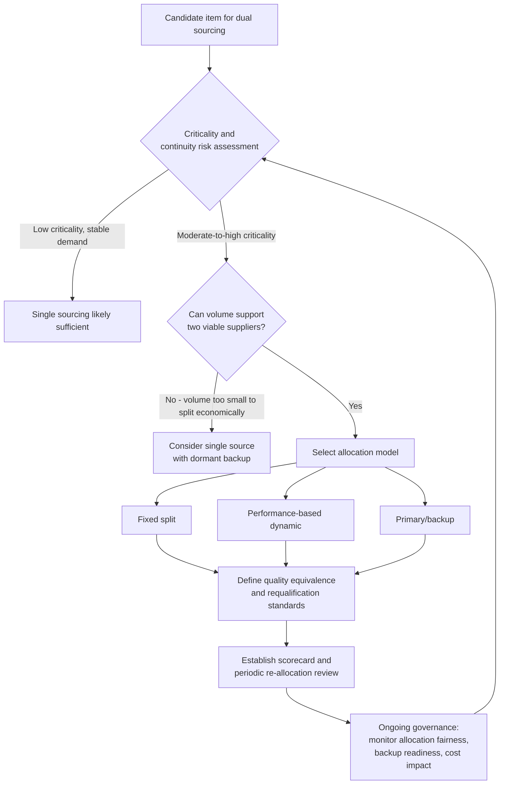

## Dual Sourcing Rationale and Risk Profile

### Overview

Dual sourcing is the deliberate maintenance of two qualified, active suppliers for the same item, component, or service, with demand allocated between them according to a defined split rather than concentrated in one relationship. It sits between single sourcing (one supplier, maximum leverage and simplicity, maximum concentration risk) and multi-sourcing (three or more suppliers, maximum resilience, maximum overhead). This topic covers why organizations choose dual sourcing, the risk categories it mitigates and introduces, and the operational models used to implement it.

### Positioning Within the Sourcing Spectrum

| Attribute | Single Sourcing | Dual Sourcing | Multi-Sourcing |
| --- | --- | --- | --- |
| Continuity risk | Highest | Moderate | Lowest |
| Volume leverage per supplier | Highest | Moderate (typically split) | Lowest per supplier |
| Management overhead | Lowest | Moderate | Highest |
| Relationship depth per supplier | Deepest | Split but sustainable | Shallowest |
| Typical use case | Low-criticality, stable-demand items | Moderate-to-high criticality items | Highly volatile, commoditized, or extremely high-risk items |

---

### Rationale for Choosing Dual Sourcing

#### 1. Supply Continuity and Business Continuity Planning

The primary driver: if one supplier experiences a disruption (fire, insolvency, natural disaster, labor action, quality escape, cyberattack, geopolitical event), the second supplier can absorb some or all of the affected volume without a full production or fulfillment stoppage. Recovery is bounded by the standby supplier's *spare capacity*, not by a full requalification cycle, which is the key structural advantage over single sourcing with a dormant backup.

#### 2. Competitive Tension and Pricing Discipline

Maintaining two live suppliers who know they are competing for ongoing volume allocation creates continuous pricing and performance pressure that a single-sourced relationship — even a well-managed one — cannot replicate. This is distinct from a one-time competitive bid; the tension is sustained because volume share can shift between suppliers based on performance.

#### 3. Capacity Risk Mitigation

Where category demand is volatile or growing faster than any single supplier's committed capacity, a second qualified source provides a release valve during demand spikes without requiring emergency spot-buying or premium-priced short-term contracts.

#### 4. Geopolitical and Regional Diversification

Sourcing the same item from suppliers in different regions or jurisdictions mitigates concentrated exposure to a single country's tariff regime, export controls, currency risk, or political instability — a risk category that multi-site single sourcing (same company, different plants) does not fully address if the company itself is domiciled in one jurisdiction.

#### 5. Benchmarking and Innovation Comparison

Two active suppliers provide an ongoing basis for comparing cost structures, process improvements, and technology roadmaps — informing negotiation and signaling to both suppliers that continuous improvement is expected, not optional.

#### 6. Regulatory or Customer-Mandated Requirements

Some industries (aerospace, defense, automotive, government contracting) mandate dual or multi-sourcing for designated critical components as a matter of policy or contractual requirement, independent of the buying organization's own risk calculus.

---

### Risk Profile Introduced by Dual Sourcing

Dual sourcing mitigates concentration risk but is not risk-free — it trades one risk profile for a different one.

#### Diluted Volume Leverage

Splitting volume across two suppliers reduces the total volume each can claim, which can push both suppliers into a less favorable pricing tier than a single consolidated volume would achieve. The net cost impact depends on the specific volume-discount curve and the competitive tension gained — this trade-off is central to the dual-sourcing decision and does not resolve in one consistent direction across categories.

#### Doubled Management and Qualification Overhead

Two full supplier relationships require two audits, two quality agreements, two systems integrations, two relationship-management cadences, and (for engineered components) two full qualification/PPAP-style approval cycles. This overhead is frequently underweighted when the decision is framed purely around continuity benefit.

#### Quality and Specification Consistency Risk

Two independent manufacturing processes producing a "same" part introduces the risk of part-to-part variation — dimensional tolerances, material batch differences, or process-specific defects — that does not exist with a single production line. This is particularly material for tightly toleranced mechanical parts, calibrated electronics, or regulated products where inter-supplier variance itself becomes a compliance concern.

#### Allocation and Fairness Disputes

Both suppliers are aware of the other's existence and are typically sensitive to how volume is allocated. Poorly communicated or inconsistently applied allocation criteria can damage trust with both suppliers simultaneously, and in extreme cases invite scrutiny under fair-dealing or, in specific regulated sectors, competition-law considerations if allocation criteria aren't objective and consistently applied.

#### IP and Confidentiality Exposure

Where the component involves proprietary design elements, sharing specifications with two independent suppliers doubles the surface area for IP leakage, requiring more careful NDA structuring and design-information partitioning (e.g., withholding certain process-critical details from both suppliers, or from the losing bidder in a benchmarking exercise).

#### Underutilized Backup Capacity Cost

If the allocation split is heavily skewed (e.g., 90/10) to preserve most of the leverage benefit of near-single-sourcing, the "backup" supplier's 10% share may be insufficient to keep their process current, their tooling maintained, or their staff proficient — degrading their actual readiness to absorb volume in a real disruption. This is sometimes called the **"warm backup" paradox**: the smaller the backup allocation, the lower both the cost and the *real* readiness.

**[Inference]** The allocation split that best preserves volume leverage (e.g., 95/5) is often the split least effective at maintaining genuine backup readiness, while the split that best preserves readiness (e.g., 50/50) sacrifices the most leverage — meaning the "optimal" split is a genuine trade-off rather than a value that can be maximized on both dimensions simultaneously. This is a structural observation about the trade-off rather than a fixed rule, and the right balance point depends on the specific category's risk tolerance and cost sensitivity.

---

### Common Dual Sourcing Allocation Models

| Model | Description | Typical Use Case |
| --- | --- | --- |
| Fixed split (e.g., 70/30) | Predetermined, stable allocation regardless of short-term performance | Stable categories where predictability matters more than dynamic tension |
| Performance-based dynamic allocation | Split shifts period-to-period based on scorecard performance (quality, delivery, cost) | Categories where ongoing competitive pressure is a primary goal |
| Primary/backup (e.g., 90/10) | One supplier carries most volume; second exists primarily for continuity, not competition | High switching cost items where full dual-sourcing overhead isn't justified |
| Geographic/regional split | Allocation follows regional demand or regulatory requirements (e.g., supplier A serves APAC, supplier B serves EMEA) | Global operations with regional risk or tariff considerations |
| Category/SKU split | Each supplier owns distinct SKUs or product variants within the same category rather than splitting volume on identical items | Where full interchangeability isn't feasible but portfolio-level dual sourcing is still desired |

### Risk-Benefit Decision Flow

**Example**

For a government legislative-document platform's specialized long-term archival storage media (contrasting with the single-sourcing example for the same category in a prior topic): if volume is high enough and the organization's risk tolerance for records-continuity failure is low, dual sourcing two certified archival-media vendors — allocated, for instance, on a primary/backup split — would trade some unit-cost efficiency for protection against a single vendor's discontinuation or supply disruption affecting statutory records-retention obligations.

### Allocation Trade-off (svg_diagram)

<svg xmlns="http://www.w3.org/2000/svg" viewBox="0 0 720 260">
<text x="360" y="24" text-anchor="middle" font-size="15" font-weight="bold" fill="#1a1a1a">Dual Sourcing: Leverage vs Backup Readiness (svg_diagram)</text>
<line x1="60" y1="220" x2="660" y2="220" stroke="#333" stroke-width="1.5" />
<line x1="60" y1="220" x2="60" y2="50" stroke="#333" stroke-width="1.5" />
<text x="360" y="245" text-anchor="middle" font-size="11" fill="#1a1a1a">Allocation Split (skewed → balanced)</text>
<text x="30" y="140" text-anchor="middle" font-size="11" fill="#1a1a1a" transform="rotate(-90 30 140)">Value</text>
<polyline points="70,80 300,110 590,190" fill="none" stroke="#4a6fa5" stroke-width="2.5" />
<text x="590" y="205" font-size="10" fill="#4a6fa5">Volume leverage</text>
<polyline points="70,200 300,140 590,70" fill="none" stroke="#c0392b" stroke-width="2.5" />
<text x="420" y="65" font-size="10" fill="#c0392b">Backup readiness</text>

<text x="90" y="235" font-size="10" fill="`#1a1a1a`">90/10</text>

<text x="290" y="235" font-size="10" fill="`#1a1a1a`">70/30</text>

<text x="570" y="235" font-size="10" fill="`#1a1a1a`">50/50</text>

</svg>

---

### Related Topics

- Single Sourcing Rationale and Risk Profile (comparison counterpart to this topic)
- Supplier scorecard design for dynamic allocation models
- Requalification and PPAP-equivalent approval cycles for second sources
- IP protection and NDA structuring across multiple suppliers
- Geographic risk diversification and tariff/export-control exposure
- Multi-sourcing strategies for highly volatile or commoditized categories
- Competition-law considerations in structured volume allocation