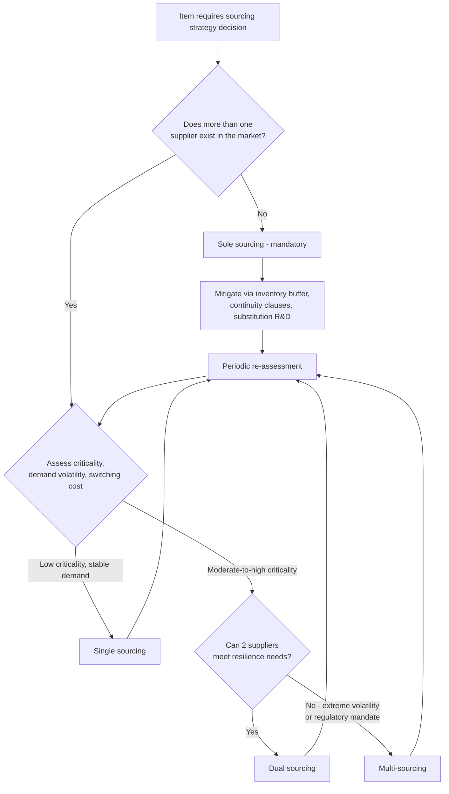

## Multi-Sourcing and Sole Sourcing Distinctions

### Overview

Multi-sourcing and sole sourcing sit at opposite ends of the sourcing-strategy spectrum, and are frequently confused with the terms covered in adjacent topics (single sourcing and dual sourcing) because the vocabulary is inconsistently used across organizations and literature. This topic establishes precise definitions, clarifies the critical distinction between *sole sourcing* (a market constraint) and *single sourcing* (a strategic choice — covered in depth in a prior topic), and covers the rationale, risk profile, and management approach specific to multi-sourcing (three-or-more supplier) and sole-sourcing (no-alternative) scenarios.

### Terminology Clarification

This is the single most common point of confusion in sourcing strategy discussions, including in procurement job postings, RFPs, and even ERP system field labels, where "sole source justification" forms are sometimes used interchangeably for what is actually a single-source decision.

| Term | Number of Qualified Suppliers | Is There a Choice? | Driven By |
| --- | --- | --- | --- |
| Sole sourcing | Exactly one — **no alternative exists or is feasible** | No | Market structure (patent, monopoly, unique certification, regulatory restriction) |
| Single sourcing | One chosen from a field of multiple qualified alternatives | Yes | Strategic decision (leverage, quality consistency, relationship depth — see prior topic) |
| Dual sourcing | Exactly two, maintained concurrently | Yes | Strategic decision (continuity, competitive tension — see prior topic) |
| Multi-sourcing | Three or more, maintained concurrently | Yes | Strategic decision (maximum resilience, commoditized-category management) |

**Key Points**

- The practical consequence of the sole-vs-single distinction is *what risk-mitigation options are available*. A single-sourced item can be de-risked by qualifying a second supplier from the existing field of alternatives. A sole-sourced item cannot — mitigation requires substitution, redesign, licensing negotiation, or supplier development, since no qualified alternative currently exists in the market.
- Internal procurement documentation should distinguish these explicitly (e.g., a "Sole Source Justification" form should require evidence that no alternative supplier is *capable*, not merely that none is *currently qualified* — the latter is a single-sourcing situation with an unaddressed qualification gap, not a true sole-source constraint).

---

### Sole Sourcing

#### Common Causes

- **Patent or IP protection**: the supplier holds exclusive legal rights to produce the item (common in pharmaceuticals, specialty chemicals, and proprietary technology components).
- **Regulatory or certification exclusivity**: only one supplier holds a required certification (e.g., a specific aerospace or medical-device approval) within a feasible lead time or region.
- **Natural monopoly or extreme market concentration**: the supplier is the only viable producer due to resource access (e.g., a specific mineral deposit), extreme capital-intensity barriers to entry, or historical market consolidation.
- **OEM-mandated sourcing**: a customer or original equipment manufacturer requires use of a specific approved supplier as a contractual condition (common in aerospace and automotive supply chains).
- **Legacy or proprietary system dependency**: a component is compatible only with a discontinued or proprietary system that only its original manufacturer still supports.

#### Risk Profile Specific to Sole Sourcing

Sole sourcing carries all the concentration risks of single sourcing (see prior topic: continuity, quality-escape amplification, capacity constraint) *without the option to qualify a second source as mitigation*. This materially changes the risk-management approach:

- **Mitigation must target substitution, not diversification**: since a second supplier cannot be qualified, risk reduction focuses on inventory buffering, supplier financial-health monitoring, licensing/technology-transfer negotiations, or engineering redesign to remove the dependency.
- **Negotiating leverage is structurally weaker**: the buyer has essentially no credible alternative-supplier threat in negotiations, which can result in less favorable pricing and terms over time — this is a structural feature of sole sourcing, not a negotiation failure.
- **Elevated priority for business-continuity due diligence**: financial-health monitoring, disaster-recovery planning review, and succession-risk assessment (e.g., key-person or key-facility dependency at the supplier) are typically weighted more heavily than for single- or dual-sourced items, given the absence of a fallback path.

**[Inference]** Because sole-source relationships lack the leverage dynamic present in choice-driven sourcing strategies, they are commonly cited as candidates for deeper *supplier development* or *joint continuity planning* investment (e.g., co-funding a second production line, cross-training, or negotiating technology-transfer rights as a contingency) — though whether an organization pursues this depends heavily on the item's criticality and the cost of such investment relative to the risk it addresses.

---

### Multi-Sourcing

#### Rationale

Multi-sourcing (three or more concurrent qualified suppliers) is typically reserved for categories where:

1. **Commoditization is high**: the item is standardized enough that qualification and switching costs are low, making the overhead of managing three-plus suppliers proportionate to the risk/benefit.
2. **Demand volatility is extreme**: no single supplier's capacity roadmap can reliably absorb peak demand, requiring a broader base to flex against.
3. **Criticality and risk tolerance are both very low for disruption**: typically for items where even dual-sourcing's residual concentration (two points of failure rather than one) is judged insufficient — often in regulated, defense, or life-safety-adjacent categories.
4. **Geographic/regulatory diversification requirements are broad**: operations spanning many regions may require region-specific suppliers for tariff, localization, or content-requirement reasons (e.g., local-content mandates in government contracting) rather than for risk-mitigation reasons alone.
5. **Continuous competitive benchmarking is a strategic priority**: for large, strategically important spend categories, maintaining three-plus suppliers can sustain sharper pricing and innovation competition than two suppliers, which can settle into a stable duopoly-like dynamic over time.

#### Risk Profile Specific to Multi-Sourcing

- **Overhead scales roughly linearly (or worse) with supplier count**: audits, quality agreements, systems integration, and relationship management multiply, while the *marginal* risk-reduction benefit of each additional supplier beyond the second is typically smaller than the benefit of going from one to two.
- **Volume dilution is most severe**: with volume split three or more ways, no single supplier may receive enough allocation to justify its most favorable pricing tier, and if any supplier's allocation is too small, that supplier's process may not stay current — echoing the "warm backup" readiness concern discussed for dual sourcing, but compounded across more relationships.
- **Consistency risk increases with supplier count**: more independent manufacturing processes producing a "same" item increases the surface area for part-to-part variation, requiring more rigorous cross-supplier quality equivalence standards.
- **Allocation governance complexity increases**: with three-plus suppliers, allocation-fairness disputes, performance-based reallocation rules, and communication consistency (see the prior topic on segmentation communication) become materially harder to manage than with two.

#### When Multi-Sourcing Is Usually Not Justified

- Low-criticality, low-volume items where even dual-sourcing overhead exceeds the risk being mitigated
- Items requiring deep co-development or IP-sensitive collaboration, where spreading design information across three-plus suppliers meaningfully increases leakage risk without proportionate benefit
- Categories with high per-supplier qualification cost (e.g., expensive tooling, lengthy certification) where the fixed cost of qualifying a third or fourth supplier is not offset by demand volatility or criticality

---

### Decision Framework: Choosing Among the Four Models

**Example**

In a legislative document-management context: the underlying database engine or a proprietary e-signature/certification module tied to a specific vendor's patented workflow would typically be a **sole-source** situation (no functionally equivalent alternative exists without a costly system redesign), whereas general-purpose office hardware or standard cloud-hosting capacity for the same platform would more likely be suited to **multi-sourcing**, given the commoditized nature of the market and the availability of many qualified vendors.

### Sourcing Model Spectrum (svg_diagram)

<svg xmlns="http://www.w3.org/2000/svg" viewBox="0 0 740 220">
<text x="370" y="24" text-anchor="middle" font-size="15" font-weight="bold" fill="#1a1a1a">Sourcing Model Spectrum (svg_diagram)</text>
<line x1="60" y1="120" x2="680" y2="120" stroke="#333" stroke-width="2" />
<circle cx="100" cy="120" r="8" fill="#e53935" />
<text x="100" y="145" text-anchor="middle" font-size="11" fill="#1a1a1a">Sole Source</text>
<text x="100" y="160" text-anchor="middle" font-size="9" fill="#666">(no choice)</text>
<circle cx="280" cy="120" r="8" fill="#fb8c00" />
<text x="280" y="145" text-anchor="middle" font-size="11" fill="#1a1a1a">Single Source</text>
<text x="280" y="160" text-anchor="middle" font-size="9" fill="#666">(chosen)</text>
<circle cx="460" cy="120" r="8" fill="#43a047" />
<text x="460" y="145" text-anchor="middle" font-size="11" fill="#1a1a1a">Dual Source</text>
<text x="460" y="160" text-anchor="middle" font-size="9" fill="#666">(2 active)</text>
<circle cx="640" cy="120" r="8" fill="#1e88e5" />
<text x="640" y="145" text-anchor="middle" font-size="11" fill="#1a1a1a">Multi-Source</text>
<text x="640" y="160" text-anchor="middle" font-size="9" fill="#666">(3+ active)</text>

<text x="100" y="90" text-anchor="middle" font-size="9" fill="`#c62828`">Max concentration risk</text>

<text x="640" y="90" text-anchor="middle" font-size="9" fill="`#1565c0`">Max resilience, max overhead</text>

</svg>

---

### Related Topics

- Single Sourcing Rationale and Risk Profile
- Dual Sourcing Rationale and Implementation Models
- Supplier development and technology-transfer contingency planning for sole-source relationships
- Cross-supplier quality equivalence standards for multi-sourced items
- Local-content and regulatory-driven multi-sourcing requirements
- Sourcing strategy re-evaluation triggers (demand volatility, supplier financial-health changes)