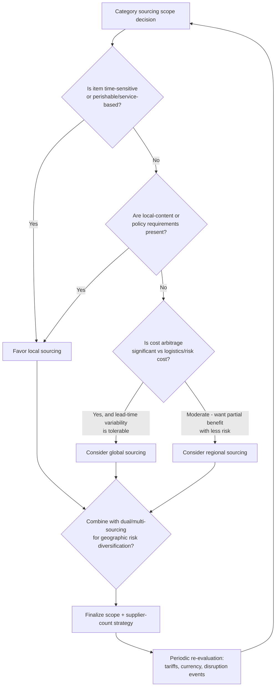

## Global Versus Regional Versus Local Sourcing

### Overview

Global, regional, and local sourcing describe the *geographic scope* dimension of sourcing strategy — a dimension that is largely independent of, but frequently interacts with, the supplier-count decisions covered in prior topics (single/dual/multi/sole sourcing). An organization can be single-sourced globally, dual-sourced regionally, or multi-sourced locally; the geographic and supplier-count dimensions are separate design choices that must be evaluated together. This topic covers the rationale, trade-offs, and risk profile of each geographic sourcing scope, and how they interact with dual-sourcing strategy design specifically.

### Defining the Three Scopes

| Scope | Definition | Typical Characteristics |
| --- | --- | --- |
| Global sourcing | Suppliers selected worldwide based on best total cost/capability, regardless of buyer's location | Longest lead times/lead-time variability, currency exposure, complex logistics, often lowest unit cost |
| Regional sourcing | Suppliers selected within a defined multi-country region (e.g., ASEAN, EU, North America) serving demand within that region | Balances cost and responsiveness; mitigates some cross-continental logistics risk while retaining some cost arbitrage |
| Local sourcing | Suppliers selected within the buyer's own country or a tight geographic radius | Shortest lead times, lowest logistics/customs complexity, typically highest unit cost, easiest relationship management |

**Key Points**

- These are points on a continuum, not strictly discrete categories — "regional" can mean a trade bloc, a continent, or a same-time-zone cluster depending on the organization's operating footprint.
- The right scope is category-specific, not organization-wide: a single company may deliberately source commodity raw materials globally while sourcing perishable or time-sensitive services locally.

---

### Rationale for Global Sourcing

- **Cost arbitrage**: access to lower labor costs, raw material availability, or manufacturing scale economies unavailable domestically.
- **Capability access**: some manufacturing capabilities, specialized skills, or technologies are concentrated in specific global regions (e.g., certain semiconductor fabrication, specialty textiles, rare-earth processing).
- **Capacity scale**: global suppliers often operate at a scale that smaller regional or local suppliers cannot match, useful for high-volume standardized components.
- **24/7 operational coverage**: for services (e.g., software development, customer support), global sourcing across time zones can enable continuous operational coverage ("follow-the-sun" models).

#### Risk Profile of Global Sourcing

- **Extended and variable lead times**: ocean freight, customs clearance, and multi-leg logistics introduce both longer baseline lead times and higher lead-time variability than regional or local alternatives.
- **Currency exposure**: transactions in foreign currencies introduce exchange-rate risk unless hedged contractually or financially.
- **Geopolitical and trade-policy risk**: tariffs, export controls, sanctions, and diplomatic relations can materially and rapidly change the cost or feasibility of a global sourcing arrangement — a risk category discussed in the single/dual sourcing risk-profile topics as well, but typically most acute for global-scope relationships.
- **Quality and communication friction**: language barriers, differing quality standards/certifications, and time-zone-driven communication delays can complicate issue resolution and joint problem-solving.
- **Longer disruption-recovery windows**: a supply disruption at a global source generally takes longer to work around than a regional or local disruption, both because of physical distance and because alternate qualification (if needed) may itself require cross-border logistics.
- **Higher inventory carrying requirements**: to buffer against longer and more variable lead times, organizations sourcing globally often carry more safety stock, increasing working-capital requirements.

**[Inference]** The total landed cost of global sourcing — including freight, customs, inventory carrying cost, and quality-risk contingency — is sometimes higher than headline unit-price comparisons suggest, which is why total cost of ownership (TCO) analysis rather than unit price alone is commonly recommended for global-vs-local sourcing decisions. The magnitude of this gap varies substantially by category and cannot be generalized as a fixed percentage.

---

### Rationale for Regional Sourcing

- **Balanced cost-responsiveness trade-off**: often captures much of global sourcing's cost advantage while reducing lead-time and logistics complexity relative to full global scope.
- **Trade-bloc and regulatory alignment**: sourcing within a free-trade area (e.g., EU single market, USMCA region, ASEAN) can reduce or eliminate tariffs and simplify customs compliance compared to cross-bloc sourcing.
- **Nearshoring and reshoring trends**: many organizations have shifted from global to regional sourcing to reduce exposure to long-distance supply-chain disruption (a pattern that gained prominence following widely reported global supply-chain disruptions in the early 2020s), trading some unit-cost advantage for resilience and responsiveness.
- **Cultural and regulatory proximity**: regional suppliers often share more similar regulatory frameworks, business practices, and (depending on the region) language, reducing communication and compliance friction relative to fully global sourcing.

#### Risk Profile of Regional Sourcing

- Retains some of global sourcing's currency and cross-border logistics risk, though typically at reduced magnitude.
- Regional concentration can itself become a risk if the entire region experiences a correlated disruption (e.g., a region-wide natural disaster, regional political instability, or a regional trade dispute) — this is a variant of the concentration risk discussed for single/dual sourcing, but at a geographic rather than supplier-count level.
- May not fully capture the cost advantages available from lowest-cost global regions.

---

### Rationale for Local Sourcing

- **Minimized lead time and logistics risk**: shortest, most predictable delivery times; simplest customs/logistics chain (often none, if fully domestic).
- **Easiest relationship management and quality oversight**: proximity enables more frequent in-person visits, faster issue resolution, and easier joint problem-solving.
- **Support for local economic development or policy requirements**: government contracts (directly relevant in a city/LGU context) frequently include local-content or local-supplier preference requirements as a matter of public policy, separate from pure cost/risk optimization.
- **Reduced currency and trade-policy exposure**: transactions in a single domestic currency eliminate exchange-rate risk, and domestic sourcing is insulated from tariff and export-control changes affecting cross-border trade.
- **Faster response to demand changes**: shorter lead times allow tighter alignment between production/procurement and actual demand, reducing the safety-stock buffer needed.

#### Risk Profile of Local Sourcing

- **Typically higher unit cost**: local suppliers may lack the scale economies of global suppliers, particularly for standardized, high-volume commodity items.
- **Narrower supplier pool**: fewer qualified local suppliers may exist for specialized capabilities, increasing single/sole-sourcing risk exposure at the geographic level even if the organizational sourcing strategy nominally calls for dual or multi-sourcing.
- **Correlated local disruption risk**: a local disaster, labor action, or infrastructure failure (e.g., a regional power outage) can affect all local suppliers simultaneously if they share the same local infrastructure dependencies.

---

### Interaction With Dual Sourcing Strategy

Since this chapter is specifically about sourcing strategy design, the geographic and supplier-count dimensions are often combined explicitly:

| Combined Strategy | Description | Typical Rationale |
| --- | --- | --- |
| Global + Dual sourcing | Two suppliers in different countries/continents | Maximizes both cost arbitrage and geopolitical/disaster diversification |
| Regional + Dual sourcing | Two suppliers within the same region but different countries | Balances trade-bloc tariff benefits with some geographic risk diversification |
| Local + Dual sourcing | Two suppliers within the same country/city area | Prioritizes responsiveness and relationship depth while still mitigating single-supplier concentration risk |
| Global-Regional hybrid | Global supplier for cost-sensitive base volume, regional/local supplier for responsive/surge volume | Combines cost efficiency with demand-flexibility (sometimes structured as the primary/backup allocation model discussed in the dual-sourcing topic) |

**[Inference]** Global-plus-local hybrid dual sourcing (a global primary supplier for base-load cost efficiency, paired with a local or regional secondary supplier for surge capacity or business continuity) is a commonly cited best-practice pattern for balancing cost against resilience, though whether this specific combination outperforms alternatives depends heavily on category-specific cost structures and cannot be treated as universally optimal.

### Geographic Scope Decision Flow

**Example**

For a city government's document-management platform: general-purpose IT hardware and standard cloud infrastructure might reasonably be sourced globally (or via a global cloud provider's regional data center) for cost efficiency, while services requiring on-site presence — scanning/digitization labor for physical archives, installation and training support, or compliance with local government procurement preference rules — would typically be sourced locally, both for practical responsiveness and to satisfy local-government procurement policy requirements common in LGU (local government unit) contracting.

### Geographic Sourcing Trade-off (svg_diagram)

<svg xmlns="http://www.w3.org/2000/svg" viewBox="0 0 740 260">
<text x="370" y="24" text-anchor="middle" font-size="15" font-weight="bold" fill="#1a1a1a">Geographic Sourcing Trade-off (svg_diagram)</text>
<line x1="70" y1="220" x2="670" y2="220" stroke="#333" stroke-width="1.5" />
<line x1="70" y1="220" x2="70" y2="50" stroke="#333" stroke-width="1.5" />
<text x="370" y="245" text-anchor="middle" font-size="11" fill="#1a1a1a">Geographic Scope: Local → Regional → Global</text>
<text x="35" y="140" text-anchor="middle" font-size="11" fill="#1a1a1a" transform="rotate(-90 35 140)">Relative Level</text>
<polyline points="90,190 370,150 650,90" fill="none" stroke="#c0392b" stroke-width="2.5" />
<text x="650" y="80" font-size="10" fill="#c0392b" text-anchor="end">Cost arbitrage potential</text>
<polyline points="90,80 370,140 650,195" fill="none" stroke="#4a6fa5" stroke-width="2.5" />
<text x="650" y="210" font-size="10" fill="#4a6fa5" text-anchor="end">Responsiveness / lead-time predictability</text>

<text x="90" y="235" font-size="10" fill="`#1a1a1a`">Local</text>

<text x="370" y="235" text-anchor="middle" font-size="10" fill="`#1a1a1a`">Regional</text>

<text x="650" y="235" text-anchor="end" font-size="10" fill="`#1a1a1a`">Global</text>

</svg>

---

### Related Topics

- Dual Sourcing Rationale and Implementation Models
- Total Cost of Ownership (TCO) analysis methodology
- Nearshoring and reshoring strategic drivers
- Currency and trade-policy risk hedging in procurement contracts
- Local-content requirements in government/public-sector procurement
- Safety stock calculation under variable lead-time conditions
- Supplier disruption recovery time estimation by geographic scope