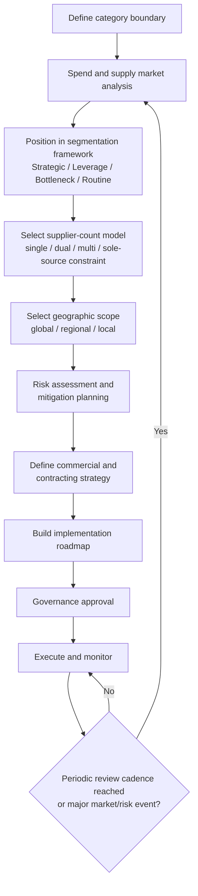

## Category-Level Sourcing Strategy Development

### Overview

Category-level sourcing strategy development is the process of synthesizing the individual sourcing decisions covered in prior topics — supplier count (single/dual/multi/sole), geographic scope (global/regional/local), and segmentation tier (from the Supplier Segmentation chapter) — into a coherent, documented strategy for a defined spend category, rather than making these decisions ad hoc on a supplier-by-supplier or transaction-by-transaction basis. A category strategy is the operational bridge between high-level sourcing philosophy and day-to-day procurement execution.

### What Defines a "Category"

A category is a grouping of spend based on shared characteristics that make it sensible to strategize collectively — typically shared supply markets, similar risk profiles, or shared internal stakeholders, rather than simply shared GL codes or org-chart boundaries. Common category definitions include:

- **By spend nature**: direct materials (inputs to production/service delivery) vs. indirect spend (facilities, IT, professional services)
- **By supply market**: categories sharing the same supplier base or market dynamics (e.g., "cloud infrastructure," "archival media," "legal services")
- **By risk profile**: categories grouped because they share similar criticality or supply-risk characteristics, even if the underlying items differ

**Key Points**

- Category boundaries should reflect *how the supply market actually behaves*, not internal organizational convenience — a category defined too broadly (e.g., "IT") mixes items with very different sourcing needs (commodity hardware vs. specialized proprietary software), diluting the value of a unified strategy.
- Category granularity should be revisited periodically; markets consolidate, fragment, or shift in ways that can make a previously sensible category boundary stale.

---

### Category Strategy Development Process

#### 1. Spend and Supply Market Analysis

Before any sourcing-model decision, the category team typically establishes:

- **Spend baseline**: current spend volume, growth trajectory, and internal demand drivers
- **Supply market structure**: number of viable suppliers, market concentration (e.g., approximated via a Herfindahl-Hirschman-style concentration view), barriers to entry, and substitute availability
- **Cost structure understanding**: should-cost modeling or cost-driver analysis to understand what portion of supplier pricing is material, labor, overhead, and margin

#### 2. Positioning Within the Segmentation Framework

The category is positioned using the organization's segmentation methodology (Kraljic-style quadrants or tiering, covered in the Supplier Segmentation chapter) — typically assessed on **profit/business impact** and **supply risk/market complexity** — which materially constrains which sourcing models are appropriate:

| Segmentation Quadrant | Typical Sourcing Model Implications |
| --- | --- |
| Strategic (high impact, high risk) | Favor single or dual sourcing with deep relationship investment; global scope acceptable if paired with strong continuity mitigation |
| Leverage (high impact, low risk) | Favor competitive multi-sourcing or periodic re-bidding to maximize price competition; global sourcing often favorable given low switching risk |
| Bottleneck (low impact, high risk) | Favor dual sourcing or qualified backup sourcing despite low spend, since risk—not spend—drives the strategy; local/regional scope may reduce risk further |
| Non-critical/Routine (low impact, low risk) | Favor simplification: single sourcing or even informal/catalog purchasing to minimize management overhead; local sourcing often sufficient |

This table synthesizes standard Kraljic-derived category-strategy guidance found broadly across procurement/SRM literature; specific organizational frameworks vary in quadrant naming and precise recommendations.

#### 3. Sourcing Model Selection

Drawing on the frameworks from the prior topics in this chapter, the category team selects:

- **Supplier count model**: single, dual, or multi-sourcing (or accepts a sole-source constraint if one exists)
- **Geographic scope**: global, regional, or local, potentially varying across sub-segments of the category (e.g., base-load vs. surge volume)
- **Relationship model**: transactional/competitive-bid vs. strategic-partnership approach, consistent with the segmentation-communication framing covered earlier in this course

#### 4. Risk Assessment and Mitigation Planning

Applying the risk frameworks from the single/dual/sole/multi-sourcing topics to the specific category:

- Identify category-specific risk drivers (financial, geopolitical, quality, capacity)
- Define mitigation approaches (safety stock policy, dormant backup qualification, contractual continuity clauses)
- Set risk-monitoring cadence (e.g., quarterly supplier financial-health review for strategic categories)

#### 5. Commercial and Contracting Strategy

- Target contract structure (framework agreement vs. transactional PO, contract duration, volume commitment level)
- Pricing mechanism (fixed, indexed, cost-plus, competitive re-bid cadence)
- Performance management structure (KPIs, scorecards, review cadence — consistent with the segmentation-tier engagement models from the earlier chapter)

#### 6. Implementation Roadmap and Governance

- Sequencing: which actions happen first (e.g., qualify a second source before renegotiating the primary contract, or vice versa)
- Ownership: which role/function is accountable for executing and maintaining the strategy
- Review cadence: when the strategy itself will be revisited (annually for most categories; more frequently for volatile or strategic categories)

---

### Category Strategy Document Structure (Typical Contents)

A category strategy document typically synthesizes the above into a structured artifact used for internal alignment and governance approval:

1. Category definition and scope boundary
2. Spend and market analysis summary
3. Segmentation position and rationale
4. Current-state sourcing model (as-is) vs. target sourcing model (to-be)
5. Gap analysis and risk assessment
6. Sourcing model recommendation (supplier count + geographic scope + relationship model)
7. Implementation roadmap with milestones
8. Governance and review cadence

**[Inference]** Organizations that treat category strategy documents as living artifacts (updated on a defined cadence and tied to the segmentation governance process described in the earlier chapter) tend to maintain closer alignment between documented strategy and actual sourcing behavior than those treating the document as a one-time planning exercise; however, the degree of this benefit is not something that can be quantified in general terms and depends on organizational discipline in maintaining the cadence.

---

### Category Strategy Development Flow

**Example**

For a city LGU document-management platform's spend categories: "archival storage media" might be positioned as **Bottleneck** (low spend, but high supply risk due to certification requirements and few qualified vendors) — driving a dual-sourcing, locally-or-regionally-scoped strategy despite low dollar volume — while "general office IT hardware" might be positioned as **Leverage** (moderate spend, low risk, many qualified vendors) — driving a competitively re-bid, potentially global-sourced, single- or short-list-based strategy optimized for price.

### Category Strategy Synthesis (svg_diagram)

<svg xmlns="http://www.w3.org/2000/svg" viewBox="0 0 740 300">
<text x="370" y="24" text-anchor="middle" font-size="15" font-weight="bold" fill="#1a1a1a">Category Strategy: Three Dimensions Combined (svg_diagram)</text>
<rect x="40" y="60" width="200" height="70" rx="6" fill="#e8f0fe" stroke="#4a6fa5" />
<text x="140" y="90" text-anchor="middle" font-size="12" fill="#1a1a1a">Segmentation Position</text>
<text x="140" y="108" text-anchor="middle" font-size="11" fill="#1a1a1a">Strategic / Leverage /</text>
<text x="140" y="122" text-anchor="middle" font-size="11" fill="#1a1a1a">Bottleneck / Routine</text>
<rect x="270" y="60" width="200" height="70" rx="6" fill="#fff3cd" stroke="#a5854a" />
<text x="370" y="90" text-anchor="middle" font-size="12" fill="#1a1a1a">Supplier Count Model</text>
<text x="370" y="108" text-anchor="middle" font-size="11" fill="#1a1a1a">Single / Dual / Multi /</text>
<text x="370" y="122" text-anchor="middle" font-size="11" fill="#1a1a1a">Sole-source constraint</text>
<rect x="500" y="60" width="200" height="70" rx="6" fill="#d4edda" stroke="#4a9d6f" />
<text x="600" y="90" text-anchor="middle" font-size="12" fill="#1a1a1a">Geographic Scope</text>
<text x="600" y="108" text-anchor="middle" font-size="11" fill="#1a1a1a">Global / Regional /</text>
<text x="600" y="122" text-anchor="middle" font-size="11" fill="#1a1a1a">Local</text>
<line x1="140" y1="130" x2="370" y2="220" stroke="#666" stroke-width="1.5" />
<line x1="370" y1="130" x2="370" y2="220" stroke="#666" stroke-width="1.5" />
<line x1="600" y1="130" x2="370" y2="220" stroke="#666" stroke-width="1.5" />
<rect x="220" y="220" width="300" height="60" rx="6" fill="#f8f9fa" stroke="#999" />
<text x="370" y="245" text-anchor="middle" font-size="12" font-weight="bold" fill="#1a1a1a">Category Strategy</text>
<text x="370" y="263" text-anchor="middle" font-size="11" fill="#1a1a1a">Documented, governed, periodically reviewed</text>
</svg>

---

### Related Topics

- Kraljic Matrix and supplier segmentation methodology (prerequisite framework)
- Should-cost modeling and cost-driver analysis
- Framework agreements vs. transactional contracting structures
- Supplier scorecard design and performance governance
- Category management organizational models (centralized vs. category-manager-led)
- Strategy governance cadence and change-log documentation practices