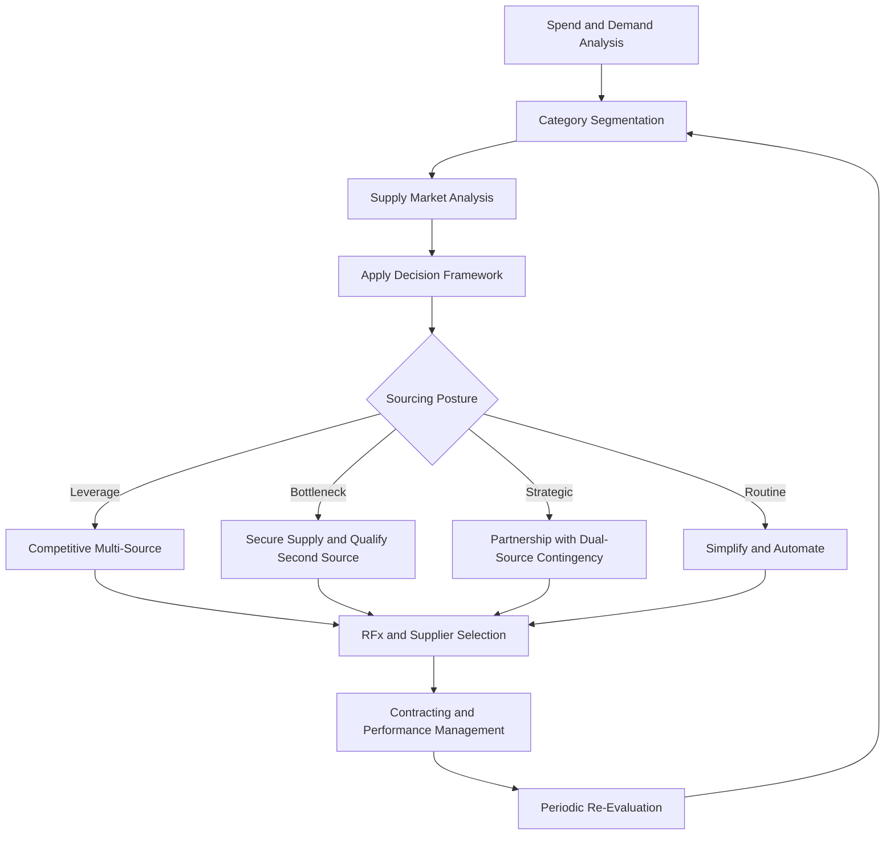
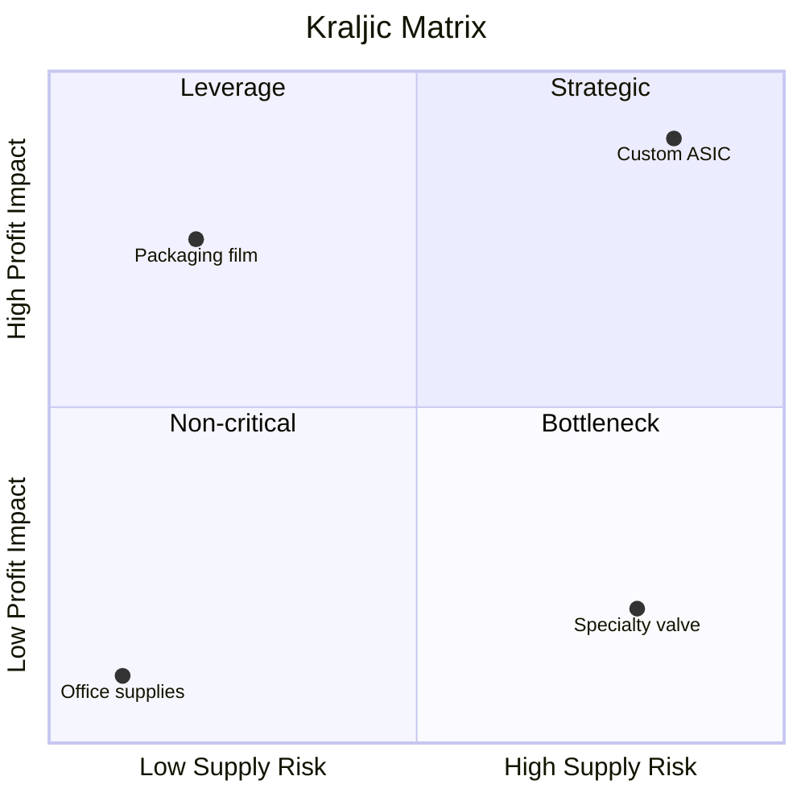
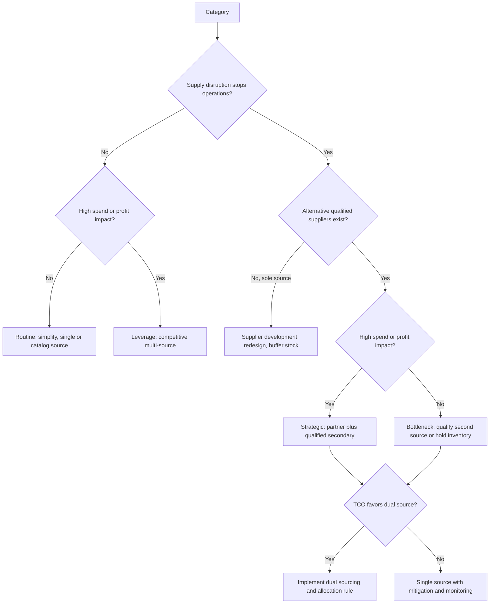

## Sourcing Strategy Decision Frameworks


### Overview

A sourcing strategy decision framework is a structured method for deciding *how* an organization procures each category of goods or services: which suppliers, how many, under what commercial model, and with what level of relationship investment. In Supplier Relationship Management (SRM), these frameworks translate business objectives (cost, continuity, quality, innovation, compliance) into repeatable, defensible sourcing decisions. In a dual-sourcing context, they answer the central question: **for which categories is a second qualified source worth its cost, and how should volume be split?**

Frameworks do not replace judgment. They impose consistent criteria so that decisions are comparable across categories, auditable, and revisitable when conditions change.

**Key Points**

- A framework converts qualitative concerns (risk, criticality, market power) into explicit scoring or classification steps.
- Most frameworks combine two dimensions (a 2x2 or 3x3 matrix) with a third layer of quantitative validation (total cost, risk exposure).
- The output is a **sourcing posture per category** (e.g., single-source partnership, dual-source, competitive multi-source, consolidate, exit), not a supplier award.
- Frameworks must be re-run periodically; category positions drift as markets, suppliers, and internal demand change.

---

### Where Frameworks Sit in the Sourcing Process

Sourcing strategy design follows a typical flow. Decision frameworks operate at the *category strategy* stage, after spend analysis and before supplier selection and negotiation.



---

### Framework 1: The Kraljic Portfolio Matrix

The Kraljic matrix (Peter Kraljic, *Harvard Business Review*, 1983) is the most widely used sourcing segmentation framework. It classifies purchased items on two axes:

- **Profit impact (vertical):** how much the item affects cost, revenue, or quality of the finished product. Typical proxies: share of total spend, contribution to product cost, effect on product quality.
- **Supply risk (horizontal):** how difficult or dangerous it is to secure supply. Typical proxies: number of qualified suppliers, entry barriers, logistics complexity, geopolitical exposure, substitutability.

**The four quadrants**

| Quadrant | Profit Impact | Supply Risk | Core Objective | Typical Posture |
| --- | --- | --- | --- | --- |
| Non-critical (Routine) | Low | Low | Efficiency | Standardize, consolidate, automate, catalog buying |
| Leverage | High | Low | Cost optimization | Competitive bidding, multi-sourcing, volume consolidation |
| Bottleneck | Low | High | Continuity of supply | Secure supply, buffer stock, qualify alternates, spec change |
| Strategic | High | High | Long-term advantage | Partnership, joint planning, dual-source contingency |



#### Scoring Procedure

A practical implementation scores each category on weighted factors, then maps the composite scores onto the matrix.

1. Define factors for each axis and assign weights that sum to 1.
2. Score each category 1 (low) to 5 (high) per factor.
3. Compute weighted composite scores.
4. Plot and assign quadrant (a common threshold is 3.0 on each axis; adjust to your score distribution).

$$S_{axis} = \sum_{i=1}^{n} w_i \cdot s_i, \quad \sum_{i=1}^{n} w_i = 1$$

**Example**

Scoring three categories on supply risk with weights: supplier count (0.4), switching difficulty (0.35), geopolitical exposure (0.25).

```python
from dataclasses import dataclass

@dataclass
class Category:
    name: str
    risk_scores: dict      # factor -> 1..5
    impact_scores: dict    # factor -> 1..5

RISK_WEIGHTS = {"supplier_scarcity": 0.40, "switching_difficulty": 0.35, "geo_exposure": 0.25}
IMPACT_WEIGHTS = {"spend_share": 0.50, "quality_effect": 0.30, "revenue_link": 0.20}

def weighted(scores: dict, weights: dict) -> float:
    assert abs(sum(weights.values()) - 1.0) < 1e-9, "weights must sum to 1"
    return sum(scores[k] * w for k, w in weights.items())

def quadrant(risk: float, impact: float, threshold: float = 3.0) -> str:
    if impact >= threshold and risk >= threshold: return "Strategic"
    if impact >= threshold: return "Leverage"
    if risk >= threshold: return "Bottleneck"
    return "Non-critical"

categories = [
    Category("Custom ASIC",
             {"supplier_scarcity": 5, "switching_difficulty": 5, "geo_exposure": 4},
             {"spend_share": 5, "quality_effect": 5, "revenue_link": 5}),
    Category("Packaging film",
             {"supplier_scarcity": 1, "switching_difficulty": 2, "geo_exposure": 2},
             {"spend_share": 4, "quality_effect": 3, "revenue_link": 3}),
    Category("Specialty valve",
             {"supplier_scarcity": 5, "switching_difficulty": 4, "geo_exposure": 3},
             {"spend_share": 1, "quality_effect": 2, "revenue_link": 2}),
]

for c in categories:
    r = weighted(c.risk_scores, RISK_WEIGHTS)
    i = weighted(c.impact_scores, IMPACT_WEIGHTS)
    print(f"{c.name:16s} risk={r:.2f} impact={i:.2f} -> {quadrant(r, i)}")
```

**Output**

```plaintext
Custom ASIC      risk=4.75 impact=5.00 -> Strategic
Packaging film   risk=1.60 impact=3.50 -> Leverage
Specialty valve  risk=4.25 impact=1.60 -> Bottleneck
```

#### Strategy by Quadrant, Including Dual Sourcing

- **Non-critical:** Dual sourcing rarely pays off. Administrative cost of maintaining two suppliers exceeds the benefit. Reduce transaction cost instead (P-cards, catalogs, blanket orders).
- **Leverage:** Dual or multi-sourcing is the natural fit because substitutes are available and competition drives price. Split volume to keep suppliers competitive; use periodic re-tendering.
- **Bottleneck:** The main threat is supply disruption. Dual sourcing is valuable here even at low spend, because a stockout can halt production. Options include qualifying a second source, holding safety stock, or redesigning the part to widen the supplier pool.
- **Strategic:** Typically a preferred-supplier partnership, with a **qualified secondary source** held as a contingency (for example a 70/30 or 80/20 split, or a secondary that receives only qualification volume).

**Limitations of Kraljic**

- The matrix is static; it captures a point in time and needs periodic refresh.
- Axis scoring is subjective unless factors and weights are agreed in advance.
- It does not by itself quantify the *cost* of dual sourcing or the *probability* of disruption. Those require the quantitative frameworks below.

---

### Framework 2: Supplier Preferencing and Relationship Positioning

Kraljic classifies *what you buy*. **Supplier preferencing** (Steele and Court, 1996) classifies *the buyer-supplier relationship power balance*, and is used to pick a relationship strategy once the category posture is known.

Two dimensions:

- **Attractiveness of the account to the supplier** (from the supplier's view: spend size, growth potential, prestige, ease of doing business).
- **Attractiveness of the supplier to the buyer** (from the buyer's view: value, criticality, capability, uniqueness).

| Buyer Attractiveness to Supplier | Supplier Attractiveness to Buyer | Position | Implication |
| --- | --- | --- | --- |
| High | High | Core/Development | Joint development, shared roadmaps |
| High | Low | Exploit | Push for price, terms, service |
| Low | High | Nuisance risk | Improve attractiveness or find alternatives |
| Low | Low | Neutral/Maintain | Minimize effort |

The framework informs dual-sourcing decisions directly: if you are an unattractive customer to a critical sole supplier, you risk being deprioritized during shortages, which strengthens the case for qualifying a second source or increasing your attractiveness (consolidated volume, longer commitments, easier processes).

---

### Framework 3: Total Cost of Ownership (TCO) Decision Model

Matrix frameworks classify; **TCO** quantifies. A TCO comparison tests whether a sourcing option (single, dual, or multi) is cheaper once all costs are counted, not just unit price.

**Typical cost components**

- Acquisition: unit price, tooling, NRE (non-recurring engineering), qualification.
- Operating: freight, duties, inventory carrying cost, quality inspection, expediting.
- Risk-related: expected cost of disruption, warranty, rework, compliance failures.
- Administrative: contract management, supplier audits, dual-system overhead.

$$TCO = C_{acq} + C_{op} + C_{admin} + E[C_{risk}]$$

For a two-supplier split with share $\alpha$ to supplier A and $(1-\alpha)$ to supplier B, annual volume $V$:

$$TCO_{dual} = V\left[\alpha\, p_A + (1-\alpha)\, p_B\right] + F_A + F_B + E[C_{risk}]_{dual}$$

where $p_A, p_B$ are landed unit costs and $F_A, F_B$ are fixed supplier-management and qualification costs. The decision rule for dual sourcing is:

$$TCO_{single} - TCO_{dual} > 0$$

Dual sourcing wins when the reduction in expected disruption cost exceeds the price premium and added fixed cost.

**Example**

Compare single-sourcing supplier A against an 80/20 dual-source split. Annual volume 100,000 units. Supplier A landed price $10.00, supplier B $10.80. Extra fixed cost for the second source $40,000 per year. Assume a 6% annual probability of a supplier A disruption costing $1,500,000 for single sourcing; with a qualified second source, a disruption costs $400,000 because production can be re-routed.

```python
V = 100_000
pA, pB = 10.00, 10.80
extra_fixed = 40_000

# Single source
p_disruption = 0.06
loss_single = 1_500_000
tco_single = V * pA + p_disruption * loss_single

# Dual source, 80/20
alpha = 0.80
loss_dual = 400_000
tco_dual = V * (alpha * pA + (1 - alpha) * pB) + extra_fixed + p_disruption * loss_dual

print(f"Single: {tco_single:,.0f}")
print(f"Dual:   {tco_dual:,.0f}")
print(f"Delta (single - dual): {tco_single - tco_dual:,.0f}")
```

**Output**

```plaintext
Single: 1,090,000
Dual:   1,040,000
Delta (single - dual): 50,000
```

Here the dual-source option is cheaper by $50,000 per year despite the price premium, because the expected-loss reduction ($66,000) exceeds the added price and fixed costs ($16,000 + $40,000). Note that the result is highly sensitive to the disruption probability and loss estimates, which are inputs you must justify (see Uncertainty below).

---

### Framework 4: Risk-Adjusted Decision Analysis

Risk-based frameworks explicitly quantify disruption exposure per category and supplier.

**Risk score (FMEA-style)**

$$RPN = S \times O \times D$$

- $S$: severity of a supply failure (1 to 10)
- $O$: likelihood of occurrence (1 to 10)
- $D$: detectability, i.e. how late you would notice (1 to 10, where 10 means hard to detect)

Categories or suppliers with high RPN are candidates for dual sourcing, buffer stock, or redesign.

**Expected loss**

$$E[L] = P(\text{disruption}) \times \text{Impact}$$

where impact typically combines lost margin per day, expected disruption duration (time to recover or time-to-survive), and penalty or reputational costs.

**Time-to-Recover (TTR) vs Time-to-Survive (TTS)**

A practical decision test from supply-chain resilience practice:

- If **TTR** (how long a supplier takes to restore supply) exceeds **TTS** (how long your operations can continue on inventory and alternates), the category is exposed and a second source or buffer is warranted.
- If TTR is below TTS, the risk is tolerable without dual sourcing.

**Example**

```python
def exposure(ttr_days: float, tts_days: float) -> str:
    gap = ttr_days - tts_days
    if gap > 0:
        return f"EXPOSED (gap {gap:.0f} days): qualify second source or add buffer"
    return "TOLERABLE"

print(exposure(ttr_days=45, tts_days=20))
print(exposure(ttr_days=10, tts_days=30))
```

**Output**

```plaintext
EXPOSED (gap 25 days): qualify second source or add buffer
TOLERABLE
```

---

### Framework 5: Make, Buy, or Partner and Sourcing Model Selection

Before choosing suppliers, a framework should decide the **sourcing model**. Common options:

| Model | Description | Dual-Sourcing Relevance |
| --- | --- | --- |
| Insource | Produce internally | Removes external dependency; may serve as the "second source" |
| Single source (by choice) | One supplier by design | Efficient but concentrates risk |
| Sole source (by necessity) | Only one capable supplier exists | Dual sourcing impossible without development effort |
| Dual source | Two qualified suppliers, split volume | Balances cost, continuity, leverage |
| Multi-source | Three or more suppliers | Maximizes competition; higher admin cost |
| Strategic alliance / JV | Shared investment and governance | Deep integration; usually paired with contingency source |

**Single vs sole sourcing:** A *single source* is a choice (other suppliers exist); a *sole source* is a constraint (no alternatives). Confusing the two leads to wrong remedies. Single-source risk can be fixed by qualifying another supplier. Sole-source risk requires supplier development, spec redesign, or inventory strategy.

---

### Framework 6: Dual-Sourcing Decision Criteria and Volume Allocation

Once dual sourcing is chosen, a framework must define *whether the split is worth it* and *how to allocate*.

#### Decision checklist

- **Criticality:** Would loss of supply stop production or breach customer commitments?
- **Qualification burden:** Cost and lead time to qualify a second source (first-article inspection, PPAP or equivalent, validation runs).
- **Scale economics:** Does splitting volume push either supplier above its volume-discount thresholds?
- **Technical fit:** Are specifications and processes reproducible across suppliers, or is the part proprietary?
- **Market structure:** Are there truly independent alternatives (different geographies, ownership, sub-tier suppliers)?
- **Administrative capacity:** Can you manage two relationships, two quality systems, two sets of logistics?

#### Common allocation patterns

| Pattern | Split | Use Case |
| --- | --- | --- |
| Primary/secondary | 70/30 to 90/10 | Strategic parts; keeps second source warm |
| Balanced | 50/50 | Leverage categories; strong competition |
| Qualification-only | 95/5 or trial volume | Bottleneck parts; maintain validated capacity |
| Regional split | By geography | Tariff, logistics, or geopolitical hedging |
| Performance-based | Dynamic shifts | Reallocate share based on scorecard results |

#### Volume allocation as an optimization problem

A simple linear program minimizes total cost subject to capacity, minimum-share, and maximum-share constraints.

$$\min_{x_i} \sum_{i} p_i x_i \quad \text{s.t.} \quad \sum_i x_i = D,\; x_i \le K_i,\; m_i D \le x_i \le M_i D$$

- $x_i$: volume allocated to supplier $i$
- $D$: total demand
- $K_i$: capacity of supplier $i$
- $m_i, M_i$: minimum and maximum allowed share (e.g., cap any supplier at 80% to preserve resilience)

**Example**

```python
from scipy.optimize import linprog

D = 100_000
prices = [10.00, 10.80]          # supplier A, B
capacity = [95_000, 60_000]
min_share = [0.0, 0.20]          # force at least 20% to supplier B
max_share = [0.80, 1.0]          # cap supplier A at 80%

bounds = []
for i in range(2):
    lo = min_share[i] * D
    hi = min(capacity[i], max_share[i] * D)
    bounds.append((lo, hi))

res = linprog(c=prices, A_eq=[[1, 1]], b_eq=[D], bounds=bounds, method="highs")
print(res.x, res.fun)
```

**Output**

```plaintext
[80000. 20000.] 1016000.0
```

The solver pushes as much volume as allowed to the cheaper supplier while respecting the resilience constraints (minimum 20% to B, maximum 80% to A). Exact solver output formatting may vary by SciPy version.

---

### Framework 7: Weighted Scoring for Supplier Comparison

Once a category posture is set, a weighted decision matrix compares candidate suppliers on multiple criteria.

$$Score_j = \sum_{i=1}^{n} w_i \cdot r_{ij}$$

where $r_{ij}$ is the rating of supplier $j$ on criterion $i$.

**Typical criteria and example weights**

| Criterion | Weight |
| --- | --- |
| Total cost | 0.30 |
| Quality and conformance | 0.25 |
| Delivery reliability | 0.15 |
| Financial stability | 0.10 |
| Capacity and scalability | 0.10 |
| Risk and compliance (ESG, sanctions, cyber) | 0.10 |

**Practical guidance**

- Use **must-have gates** (pass/fail) before scoring, e.g., regulatory certification or sanctions clearance. A high total score should not compensate for a failed gate.
- Fix weights *before* receiving bids to avoid bias.
- Run a **sensitivity analysis**: vary weights by plus or minus 10 to 20 percent and check whether the ranking flips. Rankings that flip easily indicate the suppliers are close and the decision rests on judgment or negotiation rather than the model.

---

### Framework 8: Decision Tree for Choosing a Sourcing Posture

A simplified decision flow combining the frameworks above:



---

### Integrating the Frameworks: A Layered Approach

No single framework is sufficient. A mature SRM function layers them:

1. **Segment** categories with Kraljic (what posture is plausible).
2. **Assess power and relationship** with supplier preferencing (what relationship strategy is feasible).
3. **Quantify** with TCO and risk-adjusted analysis (is the posture worth its cost).
4. **Decide the model** (single, dual, multi, partner) and allocation rule.
5. **Select suppliers** with gated weighted scoring.
6. **Monitor and re-evaluate** on a fixed cadence and on trigger events.

**Re-evaluation triggers** include: supplier financial distress, M&A among suppliers, new tariffs or sanctions, sustained quality escapes, demand shifts of more than a set threshold, technology change, or a disruption event.

---

### Illustration: Framework Layering (svg_diagram)

<svg xmlns="http://www.w3.org/2000/svg" viewBox="0 0 640 360" role="img" aria-label="Sourcing decision framework layers (svg_diagram)">
<title>Sourcing Decision Framework Layers (svg_diagram)</title>
<rect x="20" y="20" width="600" height="50" rx="8" fill="#e8f0fe" stroke="#3367d6" />
<text x="320" y="50" text-anchor="middle" font-family="sans-serif" font-size="15" fill="#1a237e">1. Segment: Kraljic Matrix (svg_diagram)</text>
<rect x="20" y="85" width="600" height="50" rx="8" fill="#e6f4ea" stroke="#188038" />
<text x="320" y="115" text-anchor="middle" font-family="sans-serif" font-size="15" fill="#0b3d1c">2. Position: Supplier Preferencing</text>
<rect x="20" y="150" width="600" height="50" rx="8" fill="#fef7e0" stroke="#f9ab00" />
<text x="320" y="180" text-anchor="middle" font-family="sans-serif" font-size="15" fill="#5f4300">3. Quantify: TCO and Risk-Adjusted Analysis</text>
<rect x="20" y="215" width="600" height="50" rx="8" fill="#fce8e6" stroke="#d93025" />
<text x="320" y="245" text-anchor="middle" font-family="sans-serif" font-size="15" fill="#5c1410">4. Decide: Model and Volume Allocation</text>
<rect x="20" y="280" width="600" height="50" rx="8" fill="#f3e8fd" stroke="#8430ce" />
<text x="320" y="310" text-anchor="middle" font-family="sans-serif" font-size="15" fill="#3c1361">5. Select and Monitor: Scoring and Re-evaluation</text>
</svg>

---

### Implementation Considerations

**Data requirements**

- Clean, categorized spend data (a taxonomy such as UNSPSC is commonly used).
- Supplier master data with ownership, location, and sub-tier visibility.
- Historical performance data (OTIF, defect rates, lead-time variance).
- Demand forecasts and bill-of-materials linkages to identify single points of failure.

**Governance**

- Assign a **category owner** accountable for strategy and refresh.
- Require cross-functional sign-off (procurement, engineering, quality, finance, risk).
- Document assumptions (weights, probabilities, impact estimates) so decisions are auditable.

**Common pitfalls**

- Treating scoring output as objective truth; inputs are judgments.
- Dual sourcing in name only: two suppliers that share the same sub-tier supplier or facility region do not diversify risk.
- Ignoring qualification lead time; a "contingency" second source that needs 9 months to qualify does not protect against a 3-month disruption.
- Splitting volume so thinly that neither supplier is motivated or achieves scale pricing.
- Never refreshing the matrix after the market changes.

**Uncertainty and behavior caveats**

Probability and impact figures used in TCO and risk models (such as the 6% disruption probability above) are illustrative assumptions, not benchmarks. [Inference] Real disruption frequencies vary widely by category, geography, and supplier, and results from these models will differ accordingly. Solver output formats and behavior may vary by library version.

---

### Summary Comparison of Frameworks

| Framework | Primary Question Answered | Inputs | Output | Strength | Weakness |
| --- | --- | --- | --- | --- | --- |
| Kraljic Matrix | What posture fits this category? | Profit impact, supply risk | Quadrant strategy | Simple, widely understood | Static, subjective scoring |
| Supplier Preferencing | Who has the power in this relationship? | Mutual attractiveness | Relationship stance | Captures leverage dynamics | Harder to score objectively |
| TCO Model | Is this option cheaper overall? | Cost components, risk estimates | Cost comparison | Quantitative, defensible | Sensitive to assumptions |
| Risk-Adjusted (RPN, TTR/TTS) | How exposed are we? | Severity, likelihood, recovery times | Risk ranking, exposure gap | Focuses on continuity | Requires estimating probabilities |
| Sourcing Model Selection | Single, dual, multi, or partner? | Market structure, criticality | Model choice | Clarifies sole vs single | Needs market intelligence |
| Volume Allocation (LP) | How to split volume? | Prices, capacity, share limits | Allocation | Optimal under constraints | Depends on constraint design |
| Weighted Scoring | Which supplier is best? | Criteria, weights, ratings | Ranked suppliers | Transparent, comparable | Weight bias, false precision |

---

**Conclusion**

Sourcing strategy decision frameworks give SRM teams a disciplined path from category data to sourcing posture. The Kraljic matrix segments, supplier preferencing frames the relationship, TCO and risk analysis test the economics of dual sourcing, allocation models set the split, and weighted scoring selects the suppliers. Used together and refreshed regularly, they make dual-sourcing decisions explicit trade-offs between cost, continuity, and complexity rather than reactions to the last disruption.

**Related Topics**

- Category Management and Category Strategy Development
- Spend Analysis and Category Segmentation
- Supply Market Analysis (Porter's Five Forces for Procurement)
- Supplier Qualification and Onboarding (PPAP, First Article Inspection)
- Supplier Risk Assessment and Monitoring
- Total Cost of Ownership Modeling in Depth
- Supplier Performance Scorecards and Volume Reallocation
- Supply Chain Resilience Metrics (TTR, TTS, Risk Exposure Index)
- Negotiation Strategy by Kraljic Quadrant
- Contract Structures for Dual Sourcing (Minimum Commitments, Share-of-Wallet Clauses)