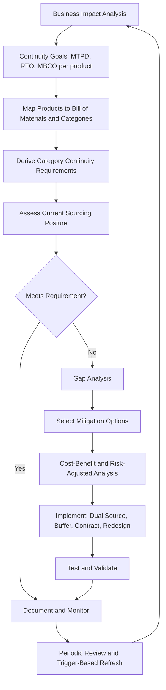

## Aligning Sourcing Strategy With Continuity Goals


### Overview

Continuity goals define how much disruption an organization can tolerate and how quickly it must recover. Sourcing strategy determines *where* supply comes from, *how many* sources exist, and *under what terms*. Alignment means the sourcing posture chosen for each category is demonstrably sufficient to meet the continuity objectives set for the products and services that depend on it.

In Supplier Relationship Management (SRM), misalignment is common: procurement optimizes for price while business continuity management (BCM) sets recovery targets that the supply base cannot physically meet. A single-source contract may be cost-optimal yet incompatible with a requirement to restore output within 48 hours of a supplier outage. Alignment closes this gap by translating continuity goals into **quantified sourcing requirements**, testing the current supply base against them, and selecting mitigations (dual sourcing, buffers, contractual levers, redesign) that close any shortfall at acceptable cost.

**Key Points**

- Continuity goals must be expressed in terms that sourcing can act on: time, volume, and service level per category.
- Every category's sourcing posture should be traceable to a continuity requirement, and every critical requirement should be traceable to a sourcing control.
- Dual sourcing is one of several levers; the right mix depends on recovery targets, qualification lead time, and cost.
- Alignment is verified by testing (exercises, capacity audits, failover drills), not by documentation alone.
- The process is cyclical: goals change, supply markets shift, and the alignment must be re-validated.

---

### Core Concepts and Terminology

| Term | Definition | Sourcing Relevance |
| --- | --- | --- |
| **MTPD** (Maximum Tolerable Period of Disruption) | Longest time a product or service can be unavailable before the organization suffers unacceptable harm | Upper bound on how long any supply gap may last |
| **RTO** (Recovery Time Objective) | Target time to restore a function after disruption | Drives the required speed of supplier recovery or failover |
| **RPO** (Recovery Point Objective) | Acceptable data or work loss, mainly relevant to information services | Applies to outsourced IT and data-dependent suppliers |
| **MBCO** (Minimum Business Continuity Objective) | Minimum output level acceptable during disruption | Defines the volume the alternate source must be able to deliver |
| **TTR** (Time-to-Recover) | Time a supplier or site needs to restore supply | Compared against TTS |
| **TTS** (Time-to-Survive) | Time operations can continue on inventory and alternates | Compared against TTR |
| **Qualification lead time** | Time to bring a new source to production-ready status | Determines whether a contingency source is *actually* protective |
| **Surge capacity** | Extra volume a supplier can deliver on short notice | Determines whether the surviving source can absorb redirected demand |

Note the distinction between MTPD and RTO: RTO must always be shorter than MTPD, and the gap between them is a safety margin. Sourcing designs should target RTO, not MTPD.

---

### Alignment Process



#### Step 1: Establish continuity goals from Business Impact Analysis

A Business Impact Analysis (BIA) identifies which products and services matter most and what an outage costs per unit time. Outputs used by sourcing:

- Revenue or margin lost per day of stoppage.
- Contractual penalties and customer-loss exposure.
- Regulatory or safety obligations that set hard limits.
- MTPD, RTO, and MBCO per product line.

#### Step 2: Cascade goals to categories and parts

Continuity goals are stated at the product level; sourcing acts at the category and part level. Use the bill of materials (BOM) to map each product to its inputs and identify **single points of failure (SPOFs)**: inputs with one qualified source, one manufacturing site, or one shared sub-tier supplier.

$$\text{Category requirement}_c = \max_{p \in P_c} \left( RTO_p \right)^{-1}$$

Read informally: the *most demanding* recovery target among all products that use category $c$ sets the requirement for that category. If one input feeds both a low-priority and a critical product, it inherits the critical product's requirement.

#### Step 3: Assess current sourcing posture against requirements

For each critical category, capture:

- Number of qualified suppliers and their share of volume.
- Geographic and ownership independence of those suppliers.
- Sub-tier concentration (shared raw material or component sources).
- Supplier TTR estimates and demonstrated surge capacity.
- Inventory on hand and safety stock policy.
- Contractual protections (allocation priority, business continuity plan requirements).

#### Step 4: Gap analysis

A category is **misaligned** if any of the following hold:

$$TTR_{supplier} > TTS_{operations}$$


$$Vol_{alternate} < MBCO \times D$$


$$T_{qualify} > MTPD$$

The first condition means the supplier cannot recover before stock runs out. The second means the alternate cannot deliver the minimum required volume. The third means a planned second source would take longer to qualify than the organization can survive without supply.

**Example**

```python
from dataclasses import dataclass

@dataclass
class CategoryProfile:
    name: str
    ttr_days: float            # supplier time-to-recover (estimate)
    tts_days: float            # time-to-survive on inventory + alternates
    mtpd_days: float           # max tolerable period of disruption
    qualify_days: float        # time to qualify a new source (0 if already qualified)
    alt_capacity_share: float  # share of demand alternate can deliver (0..1)
    mbco_share: float          # minimum share of demand that must be maintained (0..1)

def gap_report(c: CategoryProfile) -> list[str]:
    gaps = []
    if c.ttr_days > c.tts_days:
        gaps.append(f"TTR {c.ttr_days}d exceeds TTS {c.tts_days}d")
    if c.alt_capacity_share < c.mbco_share:
        gaps.append(f"Alternate covers {c.alt_capacity_share:.0%} < MBCO {c.mbco_share:.0%}")
    if c.qualify_days > c.mtpd_days:
        gaps.append(f"Qualification {c.qualify_days}d exceeds MTPD {c.mtpd_days}d")
    return gaps or ["ALIGNED"]

portfolio = [
    CategoryProfile("Custom ASIC",     ttr_days=90, tts_days=21, mtpd_days=30, qualify_days=270, alt_capacity_share=0.0, mbco_share=0.6),
    CategoryProfile("Packaging film",  ttr_days=7,  tts_days=14, mtpd_days=21, qualify_days=0,   alt_capacity_share=0.9, mbco_share=0.8),
    CategoryProfile("Specialty valve", ttr_days=40, tts_days=10, mtpd_days=25, qualify_days=60,  alt_capacity_share=0.3, mbco_share=0.5),
]

for c in portfolio:
    print(c.name)
    for g in gap_report(c):
        print("  -", g)
```

**Output**

```plaintext
Custom ASIC
  - TTR 90d exceeds TTS 21d
  - Alternate covers 0% < MBCO 60%
  - Qualification 270d exceeds MTPD 30d
Packaging film
  - ALIGNED
Specialty valve
  - TTR 40d exceeds TTS 10d
  - Alternate covers 30% < MBCO 50%
  - Qualification 60d exceeds MTPD 25d
```

The report shows that *having* a planned second source is not sufficient. For the custom ASIC, qualification time alone exceeds the tolerable disruption period by an order of magnitude, so dual sourcing on its own cannot meet the goal; a buffer or design-level mitigation is also needed.

---

### Mitigation Levers

Sourcing strategy offers several levers. Each addresses a different failure mode, and they are often combined.

| Lever | What It Addresses | Strength | Limitation |
| --- | --- | --- | --- |
| **Dual sourcing (active)** | Supplier failure; keeps second source warm with real volume | Fast failover; ongoing price tension | Higher admin cost; split volume may reduce discounts |
| **Dual sourcing (qualified standby)** | Same, with minimal volume | Lower cost than active split | Standby may lack capacity or process currency when needed |
| **Multi-sourcing** | Concentration and market shocks | Maximum flexibility | High complexity; less leverage per supplier |
| **Safety stock / buffer inventory** | Short disruptions, lead-time variability | Immediate protection | Carrying cost, obsolescence, does not cover long outages |
| **Vendor-managed or consignment inventory** | Inbound variability | Shifts holding cost, improves visibility | Depends on supplier solvency |
| **Geographic diversification** | Regional events, tariffs, geopolitics | Hedges location risk | Freight, duty, and coordination cost |
| **Design for substitutability** | Sole-source components | Removes root dependency | Engineering effort, requalification |
| **Contractual continuity terms** | Allocation during shortages, notification | Low cost; formalizes priority | Enforcement limited if supplier is insolvent or force majeure applies |
| **Supplier development** | Capability gaps in the supply base | Grows alternatives over time | Slow; investment risk |
| **Insourcing or last-time buys** | Long-term lock-in or end-of-life parts | Full control | Capital and capability needs |

#### Matching levers to gap type

| Gap Detected | Preferred Levers |
| --- | --- |
| TTR > TTS (short survival window) | Safety stock, active dual source, consignment |
| Alternate volume < MBCO | Increase alternate's share, capacity reservation, add third source |
| Qualification time > MTPD | Start qualification now, buffer to bridge, design change, dual source at low active volume |
| Sub-tier concentration | Sub-tier mapping, mandate multi-sourcing of raw material, second source with independent sub-tier |
| Sole source by necessity | Supplier development, redesign, strategic buffer, long-term supply agreement with continuity clauses |

---

### Sizing Buffers and Dual-Source Splits to Continuity Targets

#### Safety stock sized to a recovery target

If the goal is to survive a supplier outage of expected duration $T_{out}$ at daily demand $d$, with a fraction $f$ of demand that must be maintained (from MBCO):

$$SS = f \cdot d \cdot (T_{out} - T_{alt})$$

where $T_{alt}$ is the time until an alternate source begins delivering. If an alternate is already active, $T_{alt} \approx 0$ and buffer needs shrink dramatically. Dual sourcing and buffers are substitutes to a degree.

**Example**

```python
def safety_stock(daily_demand: float, mbco_fraction: float,
                 outage_days: float, alt_ramp_days: float) -> float:
    exposure_days = max(outage_days - alt_ramp_days, 0)
    return mbco_fraction * daily_demand * exposure_days

d = 500  # units/day

# Single source, no alternate: must cover entire outage
print("Single source:", safety_stock(d, 0.6, outage_days=45, alt_ramp_days=45))
# NOTE: alt_ramp = outage means no alternate arrives within the window -> use 0 ramp benefit
print("Single source (no alt):", 0.6 * d * 45)

# Qualified standby, ramps in 10 days
print("Standby source:", safety_stock(d, 0.6, outage_days=45, alt_ramp_days=10))

# Active dual source, effectively immediate
print("Active dual source:", safety_stock(d, 0.6, outage_days=45, alt_ramp_days=0))
```

**Output**

```plaintext
Single source: 0.0
Single source (no alt): 13500.0
Standby source: 10500.0
Active dual source: 13500.0
```

Note the output above is deliberately instructive: the first call shows a modeling mistake. Setting `alt_ramp_days` equal to `outage_days` yields zero exposure, which is wrong for a single-source case with no alternate. The correct single-source figure is 13,500 units (line two). The final line, "Active dual source," also returns 13,500 under this simplified formula because the function treats a zero-ramp alternate as still requiring coverage of the full outage; a correct model for an active dual source should also subtract the alternate's *delivered volume* from the required buffer. The lesson: buffer formulas must model the alternate's capacity, not only its ramp time.

A corrected formulation that accounts for alternate capacity share $a$ (fraction of demand the alternate can supply once active):

$$SS = d \cdot \max\left(0,\; f \cdot T_{alt} + \max(0, f - a) \cdot (T_{out} - T_{alt})\right)$$

```python
def safety_stock_v2(d, f, outage, ramp, alt_share):
    ramp = min(ramp, outage)
    before_ramp = f * d * ramp                       # nothing arrives yet
    after_ramp = max(0.0, f - alt_share) * d * (outage - ramp)  # shortfall after alternate is live
    return before_ramp + after_ramp

d, f, outage = 500, 0.6, 45
print("Single source:      ", safety_stock_v2(d, f, outage, ramp=outage, alt_share=0.0))
print("Standby (30% cap):  ", safety_stock_v2(d, f, outage, ramp=10,     alt_share=0.30))
print("Active dual (70%):  ", safety_stock_v2(d, f, outage, ramp=0,      alt_share=0.70))
```

**Output**

```plaintext
Single source:       13500.0
Standby (30% cap):   7500.0
Active dual (70%):   0.0
```

With an active dual source able to cover 70% of demand (above the 60% MBCO), the required buffer falls to zero under this model. The standby source with only 30% capacity still needs 7,500 units of buffer. These figures are illustrative; real sizing should also include lead-time variability and demand uncertainty.

#### Choosing the split so the survivor can carry the load

For a two-supplier arrangement with shares $s_A$ and $s_B = 1 - s_A$, if supplier A fails, supplier B must deliver at least $f \cdot D$. Feasibility requires:

$$K_B^{surge} \ge f \cdot D \quad \text{and} \quad K_A^{surge} \ge f \cdot D$$

where $K^{surge}$ is each supplier's short-term deliverable capacity. If the required $f$ is 0.6 and supplier B's surge capacity is only 0.4 of demand, a 70/30 split provides an illusion of protection: the second source exists but cannot carry the load.

---

### Cost-Benefit Framing

Continuity mitigations cost money every year; disruptions are rare. The decision rests on comparing expected loss avoided against annual cost.

$$\Delta E[L] = E[L]_{before} - E[L]_{after}$$


$$\text{Net benefit} = \Delta E[L] - C_{mitigation}$$


$$E[L] = \sum_{k} P_k \cdot (Loss\_per\_day \times Days\_of\_shortfall_k)$$

**Example**

```python
def expected_loss(scenarios, loss_per_day):
    # scenarios: list of (annual_probability, days_of_unmet_demand)
    return sum(p * days * loss_per_day for p, days in scenarios)

loss_per_day = 80_000

before = [(0.05, 45), (0.02, 90)]      # single source: 45- and 90-day outages, unmitigated
after  = [(0.05, 5),  (0.02, 20)]      # with qualified second source + buffer

e_before = expected_loss(before, loss_per_day)
e_after  = expected_loss(after, loss_per_day)
mitigation_cost = 260_000              # annual: buffer carrying, second-source overhead, price premium

print(f"E[L] before: {e_before:,.0f}")
print(f"E[L] after:  {e_after:,.0f}")
print(f"Net benefit: {e_before - e_after - mitigation_cost:,.0f}")
```

**Output**

```plaintext
E[L] before: 288,000
E[L] after:  52,000
Net benefit: -24,000
```

Under these assumptions the mitigation costs slightly more than the expected loss it avoids. This does not automatically mean the mitigation should be rejected. Reasons to proceed despite a negative expected value include: regulatory or safety mandates, catastrophic tail risk not captured by the mean (high severity, low probability), customer contractual requirements, and reputational effects. [Inference] Many organizations apply a risk-appetite threshold in addition to expected-value analysis, so that high-severity scenarios are mitigated even when the average-case math is unfavorable. Probabilities and loss figures here are illustrative assumptions, not benchmarks.

---

### Ensuring the Second Source Is Real

A frequent failure is a contingency source that exists on paper but fails when needed. Validate the following:

- **Independence:** Different facility, region, ownership group, and, ideally, different sub-tier suppliers and logistics routes. Two suppliers drawing from one raw-material plant share a hidden SPOF.
- **Qualification currency:** Approvals lapse. Confirm that first-article approval, certifications, and process validation are current, and refresh them on a cadence.
- **Warm volume:** A source receiving no volume may lose tooling readiness, staff familiarity, and material stock. Even 5 to 10 percent active share can keep it operational.
- **Capacity commitment:** Obtain written surge capacity or capacity reservation, ideally with a fee, so the volume is not promised to other customers.
- **Specification parity:** Both sources must build to the same drawing, tolerances, and test protocol, or the failover introduces quality escapes.
- **Commercial readiness:** Pre-negotiated prices, terms, and purchase-order templates so activation is not delayed by contracting.
- **Data and tooling ownership:** For tooled or software-defined parts, confirm you can move tooling, molds, or data to the alternate.

---

### Contractual Mechanisms Supporting Continuity

Contracts turn intent into enforceable obligations. Common continuity clauses:

| Clause | Purpose |
| --- | --- |
| Business continuity plan (BCP) requirement | Supplier must maintain and share a tested plan; audit rights |
| Allocation priority | Preferential supply during shortages |
| Capacity reservation | Guarantees surge volume at defined price or fee |
| Notification obligations | Supplier must alert you promptly (for example within 24 hours) of events that may affect supply |
| Safety stock or consignment commitments | Supplier-held buffer near your site |
| Step-in and transition assistance | Rights to move tooling, data, and know-how to an alternate |
| Financial distress triggers | Rights to renegotiate or accelerate audits when financial indicators worsen |
| Sub-tier transparency | Disclosure of critical sub-suppliers and changes |
| Force majeure definition | Narrow, explicit definition to avoid supplier excusing routine failures |
| Service credits and termination rights | Remedies tied to missed continuity metrics |

Enforceability depends on jurisdiction and the counterparty's solvency. [Unverified] Contract language should be reviewed by legal counsel, since enforceability of allocation and step-in clauses varies by governing law and circumstances.

---

### Metrics and Monitoring

Alignment must be measurable. Suggested indicators:

| Metric | Definition | Use |
| --- | --- | --- |
| **Coverage ratio** | Share of critical categories meeting their continuity requirement | Headline alignment measure |
| **SPOF count** | Number of critical parts with a single source or shared sub-tier | Concentration risk |
| **Recovery gap** | $TTR - TTS$ per category | Prioritizing mitigation |
| **Qualification currency** | Percentage of second sources with valid approvals | Readiness |
| **Alternate volume ratio** | Alternate surge capacity divided by MBCO volume | Load-bearing ability |
| **Days of supply** | Inventory divided by daily demand | Buffer adequacy |
| **Supplier risk score trend** | Composite of financial, operational, geopolitical, cyber indicators | Early warning |
| **Exercise pass rate** | Share of failover tests that meet RTO | Real-world validation |

$$\text{Coverage ratio} = \frac{N_{aligned}}{N_{critical}}$$

**Trigger events for re-evaluation:** supplier financial deterioration, M&A among suppliers, plant incidents, new tariffs or sanctions, sustained quality escapes, demand shifts above a defined threshold, changes to BIA goals, and completion of any disruption event (post-incident review).

---

### Testing and Validation

Plans that are never exercised tend to fail. Testing approaches, from lightest to most rigorous:

1. **Tabletop exercise:** Walk through a scenario (for example a two-month outage at the primary supplier) and check that roles, contacts, and decisions are clear.
2. **Data and document audit:** Verify qualification records, capacity letters, and contract terms are current.
3. **Supplier capacity confirmation:** Ask the secondary supplier to demonstrate surge output for a limited run.
4. **Live failover drill:** Redirect a real order to the alternate and measure lead time, quality, and cost against the RTO.
5. **Stress test of the supply network:** Model multi-node failures (for example a regional event affecting both suppliers or a common sub-tier).

Record results, compare against RTO and MBCO, and feed failures back into gap analysis.

---

### Illustration: Continuity-to-Sourcing Traceability (svg_diagram)

<svg xmlns="http://www.w3.org/2000/svg" viewBox="0 0 700 300" role="img" aria-label="Continuity to sourcing traceability (svg_diagram)">
<title>Continuity-to-Sourcing Traceability (svg_diagram)</title>
<rect x="20" y="110" width="140" height="80" rx="8" fill="#e8f0fe" stroke="#3367d6" />
<text x="90" y="145" text-anchor="middle" font-family="sans-serif" font-size="13" fill="#1a237e">Continuity Goals</text>
<text x="90" y="165" text-anchor="middle" font-family="sans-serif" font-size="11" fill="#1a237e">MTPD, RTO, MBCO</text>
<rect x="200" y="110" width="140" height="80" rx="8" fill="#e6f4ea" stroke="#188038" />
<text x="270" y="145" text-anchor="middle" font-family="sans-serif" font-size="13" fill="#0b3d1c">Category</text>
<text x="270" y="165" text-anchor="middle" font-family="sans-serif" font-size="13" fill="#0b3d1c">Requirements</text>
<rect x="380" y="110" width="140" height="80" rx="8" fill="#fef7e0" stroke="#f9ab00" />
<text x="450" y="145" text-anchor="middle" font-family="sans-serif" font-size="13" fill="#5f4300">Gap Analysis</text>
<text x="450" y="165" text-anchor="middle" font-family="sans-serif" font-size="11" fill="#5f4300">TTR vs TTS</text>
<rect x="560" y="30" width="120" height="60" rx="8" fill="#fce8e6" stroke="#d93025" />
<text x="620" y="65" text-anchor="middle" font-family="sans-serif" font-size="12" fill="#5c1410">Dual Source</text>
<rect x="560" y="120" width="120" height="60" rx="8" fill="#fce8e6" stroke="#d93025" />
<text x="620" y="155" text-anchor="middle" font-family="sans-serif" font-size="12" fill="#5c1410">Buffer Stock</text>
<rect x="560" y="210" width="120" height="60" rx="8" fill="#fce8e6" stroke="#d93025" />
<text x="620" y="245" text-anchor="middle" font-family="sans-serif" font-size="12" fill="#5c1410">Contract / Design</text>
<line x1="160" y1="150" x2="200" y2="150" stroke="#444" stroke-width="2" marker-end="url(#arr)" />
<line x1="340" y1="150" x2="380" y2="150" stroke="#444" stroke-width="2" marker-end="url(#arr)" />
<line x1="520" y1="140" x2="560" y2="60" stroke="#444" stroke-width="2" marker-end="url(#arr)" />
<line x1="520" y1="150" x2="560" y2="150" stroke="#444" stroke-width="2" marker-end="url(#arr)" />
<line x1="520" y1="160" x2="560" y2="240" stroke="#444" stroke-width="2" marker-end="url(#arr)" />
</svg>

---

### Worked Scenario

**Situation:** A manufacturer sources a precision sensor module from a single supplier in one region. The BIA sets MTPD at 30 days, RTO at 14 days, and MBCO at 60% of demand for the flagship product line. Qualification of a second source takes about 120 days.

**Assessment:**

- TTR estimate for the supplier after a plant incident: 60 days. TTS on current inventory: 12 days. Recovery gap: 48 days.
- No alternate exists, so alternate volume is 0%, below the 60% MBCO.
- Qualification lead time (120 days) exceeds MTPD (30 days).

**Decision (layered response):**

1. **Immediate (0 to 30 days):** Raise safety stock toward 30 days of supply for the MBCO volume; negotiate capacity reservation and notification clauses with the incumbent.
2. **Near term (1 to 6 months):** Launch qualification of a second source in a different region with an independent sub-tier; award 10 to 15 percent active volume to keep it warm.
3. **Medium term (6 to 18 months):** Scale the secondary to a 60/40 or 70/30 split once it demonstrates surge capacity above 60% of demand; reduce the extra buffer as the alternate proves capable.
4. **Structural:** Evaluate a design change to accept a functionally equivalent module from a broader supplier set.

**Validation:** Run a failover drill after the secondary reaches its target split; measure achieved lead time and quality against the 14-day RTO.

**Conclusion of the scenario:** Dual sourcing alone could not meet the goal on day one (qualification time exceeded MTPD), so a buffer bridges the gap until the second source matures. This layering pattern (buffer now, qualify in parallel, scale the split, redesign for long-term relief) is common when qualification lead time exceeds the tolerable disruption period.

---

### Common Pitfalls

- **Paper redundancy:** Listing a second supplier that has never been qualified, has no capacity commitment, or shares a sub-tier with the primary.
- **Goal mismatch:** Continuity goals expressed as vague statements ("high availability") that cannot be translated into supplier requirements.
- **Ignoring lead time:** Treating qualification time as an implementation detail rather than a hard constraint.
- **Single-metric fixation:** Optimizing unit price while leaving recovery gaps unmeasured.
- **Over-diversification:** Splitting volume among too many sources, raising cost and weakening supplier commitment without a matching resilience gain.
- **Static assessment:** Aligning once and never refreshing as suppliers, markets, and goals change.
- **Untested plans:** Assuming contractual rights and failover procedures work without exercising them.
- **Siloed ownership:** Procurement, BCM, engineering, and finance working from different assumptions about criticality and recovery targets.

---

### Governance and Roles

| Role | Responsibility in Alignment |
| --- | --- |
| Business continuity manager | Owns BIA, MTPD/RTO/MBCO definitions, exercise program |
| Category manager | Owns category strategy, sourcing posture, and supplier portfolio |
| Supplier relationship manager | Maintains supplier engagement, monitors performance and risk signals |
| Engineering / quality | Owns specification parity, qualification, and design-for-substitutability |
| Finance / risk | Validates loss estimates, cost-benefit, and risk appetite |
| Legal | Drafts and reviews continuity clauses |
| Executive sponsor | Arbitrates trade-offs between cost and resilience; approves risk acceptance |

A **risk acceptance register** should record any case where a gap is knowingly left open, with the accountable owner, rationale, and review date.

---

**Conclusion**

Aligning sourcing strategy with continuity goals turns abstract resilience targets into concrete, testable sourcing decisions. The process moves from BIA-derived goals to category requirements, measures the supply base against them using TTR, TTS, qualification lead time, and alternate capacity, then closes gaps with a calibrated mix of dual sourcing, buffers, contractual terms, and design changes. Dual sourcing is effective only when the second source is independent, qualified, capacity-committed, and exercised. Ongoing measurement, testing, and trigger-based refresh keep the alignment valid as conditions change.

**Related Topics**

- Business Impact Analysis Methods for Procurement
- Supplier Risk Assessment and Monitoring
- Sub-Tier Supply Chain Mapping and Visibility
- Supplier Qualification, PPAP, and First Article Inspection
- Inventory Buffer Policy and Safety Stock Modeling
- Capacity Reservation and Surge Agreements
- Contract Clauses for Supply Continuity
- Failover Testing and Supply Chain Stress Testing
- Geographic Diversification and Nearshoring Trade-offs
- Design for Supply Chain Resilience and Component Substitutability