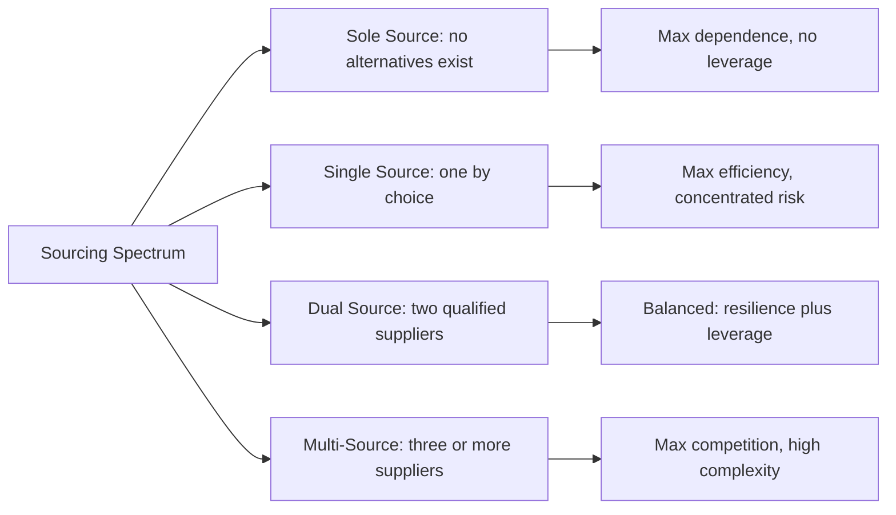
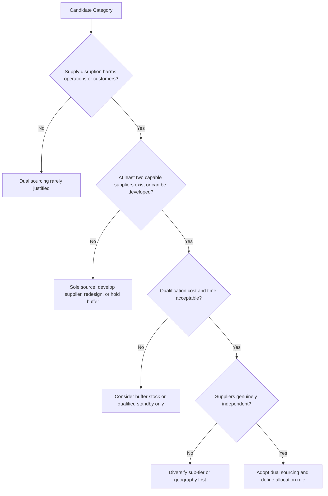

## Definition and Purpose of Dual Sourcing

### Overview

**Dual sourcing** is a procurement strategy in which an organization deliberately qualifies and uses two independent suppliers for the same item, component, material, or service. Both suppliers are capable of meeting the specification, and demand is allocated between them according to a defined rule (a fixed split, a primary/secondary arrangement, or a performance-based share).

Dual sourcing sits between two extremes on the sourcing spectrum:

- **Single sourcing:** one supplier by choice, with maximum efficiency and dependence.
- **Multi-sourcing:** three or more suppliers, with maximum competition and complexity.

Within Supplier Relationship Management (SRM), dual sourcing is a *risk and leverage management* mechanism. It trades a modest increase in administrative cost, and sometimes unit price, for resilience against supplier failure, stronger negotiating position, and greater flexibility.

**Key Points**

- Dual sourcing means **two qualified, independent, actively managed sources** for the same requirement, not merely two names on an approved vendor list.
- Its purposes fall into four groups: supply continuity, commercial leverage, performance improvement, and flexibility.
- It is a **deliberate design choice**, distinct from sole sourcing (a market constraint) and from ad hoc use of a backup vendor.
- The strategy is worthwhile only when the benefit (expected disruption loss avoided, price and service tension) exceeds the added cost (qualification, duplicated management, lost scale).
- The value of dual sourcing depends on true independence; two suppliers that share a sub-tier supplier, facility region, or owner provide little protection.

---

### Formal Definition and Boundaries

A sourcing arrangement is dual sourcing when all of the following hold:

1. **Two suppliers** are qualified to supply the same specification.
2. **Both are commercially active or contractually ready**, meaning purchase terms, pricing, and quality agreements exist for each.
3. **Allocation is intentional**, with a documented rule for how demand is divided.
4. **Independence is assessed**, covering facility, geography, ownership, and critical sub-tier inputs.

#### What dual sourcing is not

| Arrangement | Description | Why It Differs |
| --- | --- | --- |
| **Single sourcing** | One supplier chosen although alternatives exist | Concentrates risk by choice |
| **Sole sourcing** | Only one supplier is capable (proprietary, patented, unique) | A market constraint; dual sourcing requires supplier development or redesign first |
| **Multi-sourcing** | Three or more active suppliers | Greater competition but higher administrative burden |
| **Spot or ad hoc buying** | Occasional purchases from a non-qualified vendor | No qualification or allocation rule; unreliable in a crisis |
| **Approved vendor list only** | Second supplier approved on paper but never used | Risk of lapsed qualification and unproven capacity |
| **Second-tier "backup"** | Standby source given no volume | Can be a valid variant (qualified standby), but only if kept current and capacity-committed |
| **Cross-sourcing across sites of one supplier** | Two plants owned by the same company | Diversifies site risk only; does not diversify supplier or ownership risk |



---

### Core Purposes

Dual sourcing serves several distinct objectives. Organizations rarely pursue only one; the emphasis varies by category.

#### 1. Supply continuity and risk mitigation

The primary purpose. If one supplier fails, the second can continue supply, reducing the duration and severity of disruption. Sources of failure include:

- Plant fires, equipment failure, labor disputes, and natural disasters.
- Supplier insolvency or financial distress.
- Quality escapes that trigger a shipment hold.
- Geopolitical events, sanctions, tariffs, or export controls.
- Cyber incidents affecting a supplier's operations.
- Capacity shortages during demand surges or industry-wide allocation.

The protective effect can be expressed as a reduction in expected disruption loss:

$$E[L]_{single} = P_A \cdot L_A$$

For two independent suppliers where a full stoppage requires *both* to fail simultaneously:

$$P(\text{both fail}) = P_A \cdot P_B$$

Because probabilities are below one, the joint probability is much smaller than either individual probability. For example, with $P_A = P_B = 0.05$, the joint failure probability is $0.0025$, a twenty-fold reduction. This calculation assumes true independence; correlated risks (a shared sub-tier, a regional event, a common raw material) raise the joint probability toward the individual figure. [Inference] In practice, correlation is often underestimated, so the theoretical benefit is an upper bound.

#### 2. Commercial leverage and price tension

With two credible suppliers, neither can assume it holds the business permanently. This creates:

- Competitive pressure on price, since volume can be shifted toward the better offer.
- Bargaining power in contract renewals and change-order negotiations.
- Benchmark information: comparing two suppliers' cost structures and quality reveals inefficiency.
- Reduced supplier opportunism in category where switching costs would otherwise lock the buyer in.

#### 3. Performance improvement

Sharing volume across two suppliers with transparent scorecards creates ongoing incentive to improve quality, delivery reliability, responsiveness, and innovation. A performance-based allocation (rewarding the better performer with more volume) turns this into a standing mechanism.

#### 4. Capacity and flexibility

- **Surge absorption:** one supplier's capacity limit does not cap total supply.
- **Ramp flexibility:** new product launches or demand spikes can be spread across two sources.
- **Lead-time hedging:** if one supplier's lead times lengthen, orders can shift.

#### 5. Geographic and regulatory hedging

Placing suppliers in different countries or regions hedges against tariffs, trade restrictions, currency swings, logistics disruption, and local regulatory changes. Some customers and regulated industries also require a demonstrated second source as a condition of contract or certification. [Unverified] Specific requirements vary by industry and jurisdiction and should be confirmed against the applicable standards or customer contracts.

#### 6. Reduced dependency and improved negotiating posture toward the incumbent

Maintaining an active alternative weakens the incumbent's ability to impose unfavorable terms, deprioritize your orders during shortages, or exploit switching costs.

| Purpose | Primary Benefit | Typical Metric |
| --- | --- | --- |
| Continuity | Fewer or shorter stockouts | Time-to-recover vs time-to-survive; disruption days avoided |
| Commercial leverage | Better price and terms | Price variance vs benchmark; savings achieved |
| Performance | Higher quality and delivery | OTIF, defect rate, scorecard trend |
| Flexibility | Surge and ramp capability | Fill rate during demand spikes |
| Geographic hedging | Resilience to regional shocks | Share of volume outside single region |

---

### Common Dual-Sourcing Configurations

The allocation rule determines how well the arrangement achieves its purposes.

| Configuration | Typical Split | Best Suited For | Trade-off |
| --- | --- | --- | --- |
| **Primary / secondary** | 70/30 to 90/10 | Strategic parts where the primary offers scale or fit | Secondary may lack scale and attention |
| **Balanced split** | 50/50 | Leverage categories with substitutable suppliers | Loses volume-discount depth with each |
| **Qualified standby** | 95/5 or trial volume | Bottleneck parts, high qualification cost | Standby readiness can decay without real volume |
| **Product or SKU split** | Each supplier owns different items | Portfolios with distinct part families | Each SKU remains effectively single-sourced |
| **Regional split** | By geography or plant | Tariff, logistics, and geopolitical hedging | Lower fungibility between regions |
| **Performance-based** | Dynamic share shifts | Categories with measurable quality and delivery | Requires strong scorecards and governance |
| **Time-phased** | Alternate by contract period | Rotating competitive bids | Transitions add switching cost |

**A note on SKU-level splits:** if supplier A makes part 1 and supplier B makes part 2, no individual part has two sources. This is portfolio diversification, not dual sourcing in the strict sense, and it does not provide item-level failover.

---

### Quantifying the Value

#### Expected-loss reduction

$$\Delta E[L] = E[L]_{single} - E[L]_{dual}$$

Dual sourcing is justified on continuity grounds when:

$$\Delta E[L] > \Delta C_{price} + C_{qualification} + C_{admin}$$

where the right-hand terms are, respectively, any price premium from splitting volume, the qualification and onboarding cost of the second source, and ongoing duplicated administrative overhead.

**Example**

```python
def dual_source_value(
    p_disruption: float,        # annual probability of a disruption at the primary
    loss_single: float,         # loss if it occurs with a single source
    loss_dual: float,           # loss if it occurs with a qualified second source
    annual_volume: float,       # units per year
    price_premium_per_unit: float,  # avg premium from splitting volume
    fixed_extra_cost: float,    # extra annual admin + qualification amortization
):
    expected_loss_single = p_disruption * loss_single
    expected_loss_dual = p_disruption * loss_dual
    benefit = expected_loss_single - expected_loss_dual
    cost = annual_volume * price_premium_per_unit + fixed_extra_cost
    return benefit, cost, benefit - cost

benefit, cost, net = dual_source_value(
    p_disruption=0.06,
    loss_single=1_500_000,
    loss_dual=300_000,
    annual_volume=100_000,
    price_premium_per_unit=0.15,
    fixed_extra_cost=40_000,
)

print(f"Annual benefit (expected loss avoided): {benefit:,.0f}")
print(f"Annual cost of dual sourcing:           {cost:,.0f}")
print(f"Net annual value:                       {net:,.0f}")
```

**Output**

```plaintext
Annual benefit (expected loss avoided): 72,000
Annual cost of dual sourcing:           55,000
Net annual value:                       17,000
```

The net value is positive but modest. The result is sensitive to the disruption probability and loss estimates, which are assumptions and not benchmarks. Because the probability of a large disruption is small and the loss can be very large, a mean-based calculation understates tail risk. Many organizations therefore apply a risk-appetite threshold in addition to expected value.

#### Independence and correlation

For two suppliers with individual failure probabilities $P_A$ and $P_B$ and a correlation-driven common-cause probability $P_C$ (a shared event that disables both), a simple approximation of the probability that *both* are unavailable is:

$$P(\text{both}) \approx P_C + (1 - P_C)\, P_A' P_B'$$

where $P_A'$ and $P_B'$ are the independent failure probabilities excluding the common cause. Increasing $P_C$ (shared sub-tier supplier, same region, same owner) erodes the benefit of having two sources.

```python
def prob_both_unavailable(p_a: float, p_b: float, p_common: float) -> float:
    return p_common + (1 - p_common) * p_a * p_b

for pc in (0.0, 0.01, 0.03, 0.05):
    print(f"common-cause={pc:.2f} -> P(both)={prob_both_unavailable(0.05, 0.05, pc):.4f}")
```

**Output**

```plaintext
common-cause=0.00 -> P(both)=0.0025
common-cause=0.01 -> P(both)=0.0125
common-cause=0.03 -> P(both)=0.0324
common-cause=0.05 -> P(both)=0.0524
```

With a 5% common-cause probability the protective effect essentially vanishes: the joint failure probability (0.0524) is about the same as a single supplier's (0.05). This illustrates why independence checks are central to the definition.

---

### Costs and Trade-offs

Dual sourcing is not free. Costs must be weighed against benefits.

| Cost Category | Description |
| --- | --- |
| **Qualification and onboarding** | First-article inspection, process validation, audits, tooling, testing |
| **Loss of scale economies** | Splitting volume can push each supplier below discount thresholds |
| **Administrative duplication** | Two contracts, two scorecards, two sets of audits and reviews |
| **Quality variation** | Differences between suppliers can produce inconsistency in the finished product |
| **Tooling and NRE duplication** | Second set of molds, dies, fixtures, or software integration |
| **Reduced supplier commitment** | A supplier with a smaller share may invest less in your account |
| **Logistics complexity** | Two inbound flows, possibly different lead times and packaging |
| **Coordination and information leakage risk** | More parties holding your specifications and forecasts |

The unit price effect can be modeled by blending prices under an allocation share $\alpha$:

$$p_{blend} = \alpha\, p_A + (1 - \alpha)\, p_B$$

plus any volume-tier penalty if $\alpha D$ or $(1-\alpha) D$ falls below a discount threshold.

---

### When Dual Sourcing Is Appropriate



#### Conditions that favor dual sourcing

- Items whose absence stops production or breaches customer commitments (high criticality).
- Categories with high spend and available substitutes (leverage categories), where competition delivers savings.
- Low-spend but high-risk parts (bottleneck items) where a second source is cheap insurance.
- Suppliers with weak financial health or concentration risk.
- Markets with volatile capacity, geopolitical exposure, or tariff risk.
- Products where the specification is standard or easily replicated across suppliers.

#### Conditions that argue against it

- Truly non-critical, low-value items (administrative cost exceeds benefit).
- Proprietary or patented items with a single capable supplier.
- Very high qualification cost or tooling investment with little volume to amortize it.
- Strong scale economies where splitting volume destroys unit-price advantage.
- Highly integrated co-development relationships where a second source would undermine partnership commitments and intellectual property boundaries.
- Categories where quality consistency is tightly coupled to a single process and small variation is unacceptable.

**Relation to the Kraljic matrix:** dual sourcing is most natural for *Leverage* items (to sustain competition) and *Bottleneck* items (to secure continuity), and is used as a contingency overlay for *Strategic* items. It is generally unnecessary for *Non-critical* items.

---

### Illustration: Single vs Dual Sourcing Risk Profile (svg_diagram)

<svg xmlns="http://www.w3.org/2000/svg" viewBox="0 0 680 320" role="img" aria-label="Single versus dual sourcing (svg_diagram)">
<title>Single vs Dual Sourcing (svg_diagram)</title>
<text x="170" y="28" text-anchor="middle" font-family="sans-serif" font-size="15" font-weight="bold" fill="#222">Single Source (svg_diagram)</text>
<rect x="100" y="50" width="140" height="50" rx="8" fill="#fce8e6" stroke="#d93025" />
<text x="170" y="80" text-anchor="middle" font-family="sans-serif" font-size="13" fill="#5c1410">Supplier A (100%)</text>
<rect x="100" y="210" width="140" height="50" rx="8" fill="#e8f0fe" stroke="#3367d6" />
<text x="170" y="240" text-anchor="middle" font-family="sans-serif" font-size="13" fill="#1a237e">Buyer</text>
<line x1="170" y1="100" x2="170" y2="210" stroke="#444" stroke-width="2" marker-end="url(#a1)" />
<text x="170" y="290" text-anchor="middle" font-family="sans-serif" font-size="12" fill="#555">One failure stops supply</text>
<text x="510" y="28" text-anchor="middle" font-family="sans-serif" font-size="15" font-weight="bold" fill="#222">Dual Source</text>
<rect x="400" y="50" width="120" height="50" rx="8" fill="#e6f4ea" stroke="#188038" />
<text x="460" y="80" text-anchor="middle" font-family="sans-serif" font-size="13" fill="#0b3d1c">Supplier A (70%)</text>
<rect x="540" y="50" width="120" height="50" rx="8" fill="#e6f4ea" stroke="#188038" />
<text x="600" y="80" text-anchor="middle" font-family="sans-serif" font-size="13" fill="#0b3d1c">Supplier B (30%)</text>
<rect x="440" y="210" width="180" height="50" rx="8" fill="#e8f0fe" stroke="#3367d6" />
<text x="530" y="240" text-anchor="middle" font-family="sans-serif" font-size="13" fill="#1a237e">Buyer</text>
<line x1="460" y1="100" x2="500" y2="210" stroke="#444" stroke-width="2" marker-end="url(#a1)" />
<line x1="600" y1="100" x2="560" y2="210" stroke="#444" stroke-width="2" marker-end="url(#a1)" />
<text x="530" y="290" text-anchor="middle" font-family="sans-serif" font-size="12" fill="#555">Failover path if either supplier fails</text>
</svg>

---

### Illustrative Examples Across Industries

Behavior and specifics vary by company and market; the following are representative patterns and not claims about any particular organization.

- **Electronics manufacturing:** Two semiconductor foundries or two contract assemblers qualified for a standard component, with volume shifted during allocation events. Custom silicon may be sole-sourced by necessity, requiring a design-level second source or buffer.
- **Automotive:** Two Tier-1 suppliers for a commodity subsystem (for example wiring harnesses), often split by plant or region to hedge logistics and labor risk.
- **Pharmaceuticals and medical devices:** Two qualified sources for an active ingredient or critical excipient; regulatory filings may need to list both, so change control matters. [Unverified] Regulatory requirements differ by market and product class.
- **Food and consumer goods:** Two co-packers or two ingredient suppliers to protect against crop failure, recalls, or a facility shutdown.
- **IT and cloud services:** Two cloud, connectivity, or managed-service providers to reduce outage and vendor lock-in exposure (often called multi-vendor or multi-cloud strategy, which is a form of dual sourcing for services).
- **Logistics:** Two carriers or freight forwarders on a lane to preserve capacity and rate competition.

---

### Design Considerations for Effective Dual Sourcing

1. **Define the objective per category.** Continuity, leverage, and flexibility imply different splits and supplier profiles.
2. **Verify independence.** Check ownership, facility location, sub-tier inputs, logistics routes, and shared utilities.
3. **Standardize the specification.** Common drawings, tolerances, test protocols, and acceptance criteria so either supplier's output is interchangeable.
4. **Qualify and keep qualification current.** Schedule re-audits and periodic production runs.
5. **Set an allocation rule and review cadence.** Document the split, the conditions for changing it, and the review period.
6. **Secure capacity commitments.** Ensure each supplier can absorb the other's volume up to the required minimum continuity level.
7. **Align contracts.** Include quality agreements, continuity plans, notification duties, and price mechanisms that work at split volumes.
8. **Measure both suppliers on the same scorecard.** Transparent comparison sustains competitive tension and informs allocation.
9. **Test failover.** Periodically redirect real volume to confirm lead times and quality hold up.

---

### Common Misconceptions and Pitfalls

- **"Two suppliers means two sources."** Not if they share a sub-tier, location, or owner.
- **"A qualified backup is enough."** Without volume, capacity commitments, and current qualification, the backup may not perform when needed.
- **"Dual sourcing always lowers price."** Splitting volume can raise unit prices if scale discounts are lost; savings come from competition and avoided disruption, not automatically.
- **"More suppliers is always safer."** Beyond a point, complexity, quality variation, and supplier disengagement outweigh incremental resilience.
- **"Sole sourcing and single sourcing are the same."** Single sourcing is a choice; sole sourcing is a constraint, and the remedies differ.
- **"The second source can be added on demand."** Qualification lead time may exceed the time the business can survive without supply.
- **Ignoring intellectual property.** Sharing specifications with two suppliers widens exposure; use NDAs and access controls.

---

### Metrics for Dual-Sourcing Effectiveness

| Metric | Definition | Purpose |
| --- | --- | --- |
| **Share split actual vs target** | Realized allocation compared with the planned rule | Confirms the design is operating |
| **Coverage of critical parts** | Share of critical items with two qualified independent sources | Headline resilience indicator |
| **Alternate volume ratio** | Surge capacity of the surviving supplier divided by required continuity volume | Tests load-bearing ability |
| **Qualification currency** | Percentage of second sources with valid, current approvals | Readiness |
| **Price variance between sources** | Landed cost difference | Tracks leverage and cost of splitting |
| **Quality and delivery differential** | Defect and OTIF gap between suppliers | Feeds performance-based allocation |
| **Failover test pass rate** | Share of drills meeting recovery time targets | Validates the arrangement |

$$\text{Coverage ratio} = \frac{N_{\text{critical parts with two independent qualified sources}}}{N_{\text{critical parts}}}$$


---

**Conclusion**

Dual sourcing is the deliberate use of two qualified, independent suppliers for the same requirement. Its purposes are supply continuity, commercial leverage, performance improvement, capacity flexibility, and geographic hedging. Its value depends on genuine supplier independence, current qualification, committed capacity, and a sensible allocation rule, and it must be weighed against qualification cost, lost scale, and administrative overhead. Understood correctly, dual sourcing is a targeted risk-and-leverage tool applied to the categories where disruption or dependence would hurt most, not a blanket policy.

**Next Steps**

- Sourcing Strategy Design: Single, Dual, and Multi-Sourcing Compared
- Sole Sourcing vs Single Sourcing: Causes and Remedies
- Kraljic Matrix Positioning and Dual-Sourcing Suitability
- Supplier Independence Assessment (Ownership, Geography, Sub-Tier)
- Supplier Qualification and Onboarding for Second Sources
- Volume Allocation Models and Split Ratios
- Total Cost of Ownership for Dual-Sourcing Decisions
- Contract Structures for Dual Sourcing
- Supplier Performance Scorecards and Dynamic Allocation
- Failover Testing and Continuity Validation