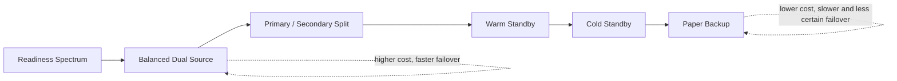
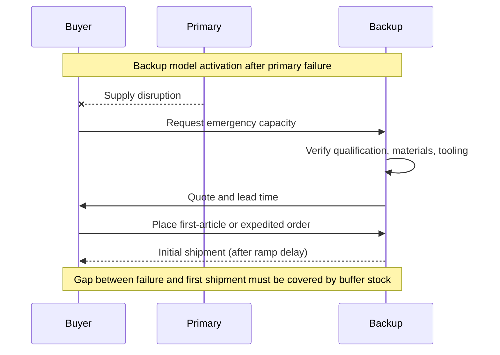
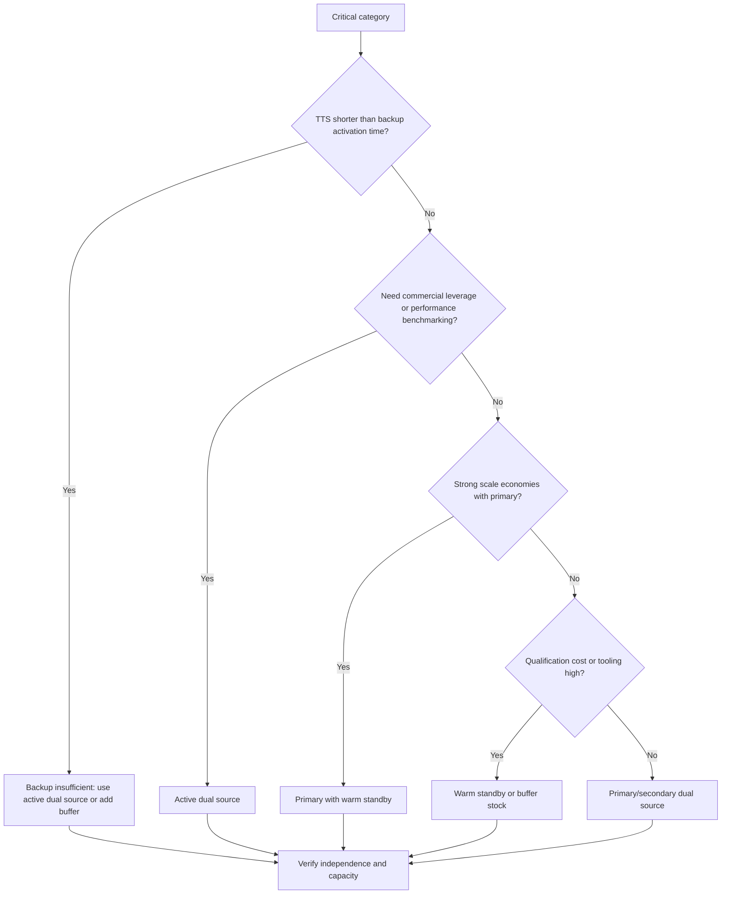

## Dual Sourcing Versus Backup Supplier Models

### Overview

Dual sourcing and backup supplier models are both continuity-oriented sourcing designs, and they are frequently confused. The difference is one of **activity level and readiness**:

- **Dual sourcing** keeps two suppliers *actively engaged*, each receiving a meaningful share of ongoing volume under live commercial terms.
- **A backup supplier model** keeps one *primary* supplier carrying essentially all demand, with a second supplier held in reserve to be activated only when the primary fails or underperforms.

Between the two lies a spectrum: primary/secondary splits (for example 90/10), qualified standby with trial volume, and cold or paper-only backups. Choosing a point on that spectrum is a trade-off among **failover speed, ongoing cost, commercial leverage, and the reliability of the reserve source**.

In SRM terms, the decision is about how much to pay, continuously, for the option to switch. A backup model pays little and switches slowly and uncertainly. A dual-sourcing model pays more and switches quickly and reliably.

**Key Points**

- The defining variable is **share of active volume** given to the second supplier, and along with it, whether that supplier's readiness is continuously proven.
- Backup models are cheaper to run but carry **readiness decay risk**: qualification lapses, tooling goes stale, capacity gets sold to other customers, and knowledge fades.
- Dual sourcing provides commercial leverage and performance data as a byproduct; backup models generally do not, because the backup has no volume at stake and no comparable performance record.
- The right model depends on **recovery time targets (RTO), tolerable disruption period (MTPD), qualification lead time, volume scale economics, and category criticality**.
- A backup supplier that has never shipped production volume to you should be treated as an unproven source, not as protection.

---

### Definitions and Model Spectrum

| Model | Volume to Second Source | Second Source Status | Failover Speed | Ongoing Cost |
| --- | --- | --- | --- | --- |
| **Active dual sourcing (balanced)** | 40 to 50 percent | Fully active | Immediate to days | Highest |
| **Active dual sourcing (primary/secondary)** | 10 to 30 percent | Active, smaller share | Days | Moderate to high |
| **Warm standby (qualified, trial volume)** | 1 to 10 percent | Qualified, small recurring orders | Days to weeks | Low to moderate |
| **Cold standby (qualified, no volume)** | 0 percent | Approved, dormant | Weeks to months | Low |
| **Paper backup (listed only)** | 0 percent | Identified or contacted, not qualified | Months, uncertain | Minimal |
| **Insourced fallback** | 0 percent external | Internal capability held in reserve | Varies | Capital and capability upkeep |

The percentages are common illustrative ranges and not standards; organizations set thresholds according to their own risk appetite and supplier economics.



---

### Detailed Comparison

#### Dual sourcing

Two suppliers are commercially active. Purchase orders flow to both under the allocation rule. Performance is compared continuously.

**Advantages**

- **Fast, proven failover:** the surviving supplier is already producing, shipping, and integrated into your planning and quality systems.
- **Continuous qualification:** regular production keeps processes, tooling, and staff current.
- **Commercial leverage:** credible competition on price, service, and terms.
- **Benchmarking:** side-by-side data on quality, delivery, and cost.
- **Capacity insight:** demonstrated output rather than claimed output.

**Disadvantages**

- **Duplicated management:** two contracts, audits, scorecards, and relationships.
- **Scale dilution:** splitting volume may forfeit tier discounts.
- **Quality variation:** differences between suppliers may need controlling.
- **Reduced supplier commitment:** a smaller share can mean less supplier investment in your account.
- **Higher information exposure:** specifications and forecasts shared with two parties.

#### Backup supplier

One primary supplier carries the load. A second is designated, and possibly qualified, to step in if needed.

**Advantages**

- **Lower ongoing cost:** minimal duplication; full scale economies with the primary.
- **Stronger primary relationship:** concentrated volume supports partnership, joint improvement, and investment.
- **Simpler operations:** one main flow of orders, quality data, and logistics.
- **Reduced information exposure** relative to running two active sources.

**Disadvantages**

- **Readiness decay:** without production, qualification, certifications, tooling, and personnel proficiency may lapse.
- **Capacity uncertainty:** the backup's stated capacity may be committed elsewhere when a crisis hits, particularly in industry-wide shortages where all buyers try to activate backups simultaneously.
- **Slow and uncertain ramp:** first-order lead times, expedite costs, and quality escapes are common during activation.
- **Little leverage:** the backup has no volume to lose, so price tension is limited.
- **Untested performance:** you cannot judge a backup's real quality and delivery record without production experience.
- **Adverse selection in a crisis:** the backup may quote high prices or impose conditions, knowing you are desperate.



---

### Timing Logic: Why Readiness Matters

The core question is whether the second source can deliver *before* inventory runs out. Define:

- $T_{TTS}$: time-to-survive on inventory and other cover.
- $T_{act}$: time from failure to first usable shipment from the second source (activation time).
- $f$: fraction of demand that must be maintained (minimum continuity level).
- $a$: fraction of demand the second source can deliver once active.

The model is protective only if:

$$T_{act} \le T_{TTS} \quad \text{and} \quad a \ge f$$

For an active dual source, $T_{act}$ is close to the ordering and freight time for an already-flowing lane. For a backup, $T_{act}$ includes verification, material procurement, scheduling, first-article approval, and ramp time, and can be substantially longer.

$$T_{act}^{backup} = T_{notify} + T_{verify} + T_{material} + T_{produce} + T_{ship} + T_{approve}$$

**Example**

```python
from dataclasses import dataclass

@dataclass
class SecondSource:
    name: str
    notify_days: float
    verify_days: float
    material_days: float
    produce_days: float
    ship_days: float
    approve_days: float
    capacity_share: float   # fraction of demand deliverable once active

    @property
    def activation_days(self) -> float:
        return (self.notify_days + self.verify_days + self.material_days
                + self.produce_days + self.ship_days + self.approve_days)

def evaluate(src: SecondSource, tts_days: float, required_share: float):
    ok_time = src.activation_days <= tts_days
    ok_cap = src.capacity_share >= required_share
    verdict = "PROTECTIVE" if (ok_time and ok_cap) else "NOT PROTECTIVE"
    return src.activation_days, ok_time, ok_cap, verdict

tts, required = 21, 0.6

candidates = [
    SecondSource("Active dual (30% share)",  0, 0,  0,  4, 5, 0, 0.75),
    SecondSource("Warm standby (5% volume)", 1, 2,  7,  7, 5, 3, 0.50),
    SecondSource("Cold standby",             1, 5, 21, 10, 5, 7, 0.60),
]

for c in candidates:
    days, ok_t, ok_c, verdict = evaluate(c, tts, required)
    print(f"{c.name:26s} activation={days:4.0f}d  time_ok={ok_t}  cap_ok={ok_c}  -> {verdict}")
```

**Output**

```plaintext
Active dual (30% share)    activation=   9d  time_ok=True  cap_ok=True  -> PROTECTIVE
Warm standby (5% volume)   activation=  25d  time_ok=False  cap_ok=False  -> NOT PROTECTIVE
Cold standby               activation=  49d  time_ok=False  cap_ok=True  -> NOT PROTECTIVE
```

Under a 21-day time-to-survive and a 60% continuity requirement, only the active dual source protects. The warm standby is too slow and too small; the cold standby has enough capacity but takes too long. All figures are illustrative assumptions, not benchmarks, and real activation times vary widely by category and supplier.

---

### Readiness Decay and the "Paper Redundancy" Trap

A backup supplier's value is a function of how *current* its readiness is. Typical decay mechanisms:

| Decay Mechanism | Effect |
| --- | --- |
| Lapsed certifications or approvals | Cannot ship without re-approval |
| Tooling or fixture obsolescence | Production delay or quality drift |
| Personnel turnover | Loss of process knowledge |
| Specification drift | Backup builds to an outdated revision |
| Capacity reallocation | Reserved capacity sold to other customers |
| Material availability | No stock of your specific inputs |
| Financial change | Backup's health deteriorates unnoticed |
| Commercial lapse | Expired pricing and terms; renegotiation delays activation |

A simple model treats readiness as decaying with time since last production run:

$$R(t) = R_0 \, e^{-\lambda t}$$

where $R_0$ is initial readiness (1.0 when freshly qualified) and $\lambda$ is a decay rate reflecting how quickly qualifications, tooling, and knowledge become stale. [Inference] Real readiness rarely decays smoothly; loss often occurs in discrete steps (a certification expires, a key engineer leaves), so the exponential form is an intuitive aid and not an empirical law.

```python
import math

def readiness(months_since_last_run: float, decay_per_month: float) -> float:
    return math.exp(-decay_per_month * months_since_last_run)

for m in (0, 6, 12, 24):
    print(f"{m:2d} months idle -> readiness {readiness(m, 0.05):.2f}")
```

**Output**

```plaintext
 0 months idle -> readiness 1.00
 6 months idle -> readiness 0.74
12 months idle -> readiness 0.55
24 months idle -> readiness 0.30
```

The decay rate of 0.05 per month is an arbitrary illustration. The practical lesson is that periodic real production, even small, resets readiness and is the main reason to prefer warm standby over cold standby.

---

### Cost Comparison Framework

Total cost includes ongoing running cost, expected disruption loss, and any activation cost.

$$TCO_{model} = C_{unit} + C_{admin} + C_{readiness} + E[L_{disruption}] + P_{fail}\cdot C_{activation}$$

- $C_{unit}$: purchase cost at model-specific pricing (scale effects included).
- $C_{admin}$: contract, audit, and relationship management.
- $C_{readiness}$: cost of keeping the second source ready (trial orders, re-audits, capacity fees, inventory).
- $E[L_{disruption}]$: expected loss from shortfall, dependent on activation time and capacity.
- $C_{activation}$: expedite, air freight, first-article, and premium pricing costs incurred when a backup is activated.

**Example**

```python
def tco(volume, price_primary, price_second, share_second,
        admin, readiness_cost, p_disruption, loss_if_disrupted, activation_cost=0.0):
    blended = (1 - share_second) * price_primary + share_second * price_second
    running = volume * blended + admin + readiness_cost
    expected_loss = p_disruption * loss_if_disrupted
    expected_activation = p_disruption * activation_cost
    return running + expected_loss + expected_activation

V = 100_000
pA, pB = 10.00, 10.60
p_dis = 0.06

models = {
    "Single source":       tco(V, pA, pB, 0.00, 0,       0,      p_dis, 1_500_000),
    "Cold/warm backup":    tco(V, pA, pB, 0.03, 10_000,  15_000, p_dis,   900_000, activation_cost=120_000),
    "Dual (80/20)":        tco(V, pA, pB, 0.20, 40_000,  0,      p_dis,   300_000),
    "Dual (60/40)":        tco(V, pA, pB, 0.40, 55_000,  0,      p_dis,   200_000),
}

for name, cost in models.items():
    print(f"{name:20s} {cost:,.0f}")
```

**Output**

```plaintext
Single source        1,090,000
Cold/warm backup     1,066,400
Dual (80/20)         1,070,000
Dual (60/40)         1,101,000
```

Under these assumptions, the backup model and the 80/20 dual source are close in expected total cost, and the 60/40 split costs more because of the larger price premium and administrative load. The ranking is sensitive to the disruption probability, loss estimates, and assumed reduction in loss for each model. Because the expected-cost differences are small, the decision often turns on non-modeled factors: tail risk tolerance, need for commercial leverage, and confidence in the reserve source's actual readiness. These inputs are illustrative assumptions and not benchmarks.

---

### Decision Framework: Choosing Between Models



#### Criteria matrix

| Criterion | Favors Dual Sourcing | Favors Backup Model |
| --- | --- | --- |
| Recovery time target (RTO) | Short (days) | Long (weeks or months tolerable) |
| Qualification lead time | Long (start early, keep active) | Short (fast to qualify on demand) |
| Scale economies | Weak | Strong |
| Category criticality | Very high | Moderate |
| Need for price tension | High | Low |
| Supplier relationship depth with primary | Transactional | Partnership-oriented |
| Specification complexity | Standard, reproducible | Highly customized, costly to replicate |
| Administrative capacity | Adequate | Constrained |
| Risk of industry-wide shortage | High (backups may be unavailable) | Low |
| Tooling and NRE cost | Low or shareable | High per source |

---

### Hybrid and Intermediate Designs

Many organizations use combinations rather than a pure model.

- **Primary/secondary with a minimum-share floor.** The secondary always receives at least 10 to 20 percent, keeping it warm while preserving primary scale.
- **Warm standby with periodic exercise.** The backup produces a scheduled small lot each quarter, refreshing qualification and testing lead times.
- **Buffer plus backup.** Safety stock covers the activation time of a backup, so the buffer bridges the gap the backup cannot.
- **Tiered by SKU criticality.** Active dual sourcing for critical parts, warm standby for mid-tier parts, and single sourcing for non-critical parts.
- **Trigger-based escalation.** A backup is promoted to active share when risk indicators cross thresholds (supplier financial distress, quality escapes, geopolitical developments).
- **Regional active/active.** Suppliers in different regions each serve local plants, with cross-region failover capability.

#### Trigger-based promotion logic

```python
def target_share_for_second_source(risk_score: float, base_share: float = 0.05) -> float:
    """
    risk_score: composite 0..1 of primary-supplier risk indicators.
    Returns the share of volume to allocate to the second source.
    Thresholds are illustrative.
    """
    if risk_score < 0.3:
        return base_share            # warm standby
    if risk_score < 0.6:
        return 0.20                  # primary/secondary split
    return 0.40                      # near-balanced dual source

for r in (0.1, 0.45, 0.8):
    print(f"risk={r:.2f} -> second-source share {target_share_for_second_source(r):.0%}")
```

**Output**

```plaintext
risk=0.10 -> second-source share 5%
risk=0.45 -> second-source share 20%
risk=0.80 -> second-source share 40%
```

Escalation rules like this let cost scale with observed risk, but they require early-warning data and the discipline to act on it; shifting volume also takes time, so promotion should be triggered before a crisis, not during one.

---

### Illustration: Volume Flow by Model (svg_diagram)

<svg xmlns="http://www.w3.org/2000/svg" viewBox="0 0 700 340" role="img" aria-label="Volume flow under dual sourcing and backup models (svg_diagram)">
<title>Volume Flow by Model (svg_diagram)</title>
<text x="170" y="26" text-anchor="middle" font-family="sans-serif" font-size="15" font-weight="bold" fill="#222">Dual Sourcing (svg_diagram)</text>
<rect x="40" y="50" width="110" height="48" rx="8" fill="#e6f4ea" stroke="#188038" />
<text x="95" y="79" text-anchor="middle" font-family="sans-serif" font-size="12" fill="#0b3d1c">Supplier A 70%</text>
<rect x="190" y="50" width="110" height="48" rx="8" fill="#e6f4ea" stroke="#188038" />
<text x="245" y="79" text-anchor="middle" font-family="sans-serif" font-size="12" fill="#0b3d1c">Supplier B 30%</text>
<rect x="100" y="230" width="140" height="48" rx="8" fill="#e8f0fe" stroke="#3367d6" />
<text x="170" y="259" text-anchor="middle" font-family="sans-serif" font-size="13" fill="#1a237e">Buyer</text>
<line x1="95" y1="98" x2="140" y2="230" stroke="#444" stroke-width="3" marker-end="url(#arw)" />
<line x1="245" y1="98" x2="200" y2="230" stroke="#444" stroke-width="2" marker-end="url(#arw)" />
<text x="170" y="318" text-anchor="middle" font-family="sans-serif" font-size="12" fill="#555">Both flows live; failover is a share shift</text>
<text x="520" y="26" text-anchor="middle" font-family="sans-serif" font-size="15" font-weight="bold" fill="#222">Backup Model</text>
<rect x="390" y="50" width="110" height="48" rx="8" fill="#e6f4ea" stroke="#188038" />
<text x="445" y="79" text-anchor="middle" font-family="sans-serif" font-size="12" fill="#0b3d1c">Primary 100%</text>
<rect x="540" y="50" width="110" height="48" rx="8" fill="#fef7e0" stroke="#f9ab00" stroke-dasharray="6 4" />
<text x="595" y="79" text-anchor="middle" font-family="sans-serif" font-size="12" fill="#5f4300">Backup (idle)</text>
<rect x="440" y="230" width="140" height="48" rx="8" fill="#e8f0fe" stroke="#3367d6" />
<text x="510" y="259" text-anchor="middle" font-family="sans-serif" font-size="13" fill="#1a237e">Buyer</text>
<line x1="445" y1="98" x2="490" y2="230" stroke="#444" stroke-width="3" marker-end="url(#arw)" />
<line x1="595" y1="98" x2="545" y2="230" stroke="#999" stroke-width="2" stroke-dasharray="6 4" marker-end="url(#arw)" />
<text x="520" y="318" text-anchor="middle" font-family="sans-serif" font-size="12" fill="#555">Backup flow starts only after activation</text>
</svg>

---

### Contractual Differences

| Contract Element | Dual Sourcing | Backup Model |
| --- | --- | --- |
| Volume commitment | Share-based or minimum purchase for both suppliers | Primary carries commitment; backup has none or a token commitment |
| Pricing | Live, competitive prices for both | Backup pricing often pre-negotiated but untested; may include activation premium |
| Capacity | Demonstrated by ongoing output; surge terms | Reservation fee or right-of-first-call; must be explicitly secured |
| Quality agreement | Both under active quality systems | Backup's agreement must stay current despite low activity |
| Activation terms | Not needed (already active) | Defined lead time, notice period, first-article process, price validity |
| Exclusivity | Typically none | Primary may request exclusivity; conflicts with backup design |
| Review cadence | Regular business reviews with both | Periodic readiness reviews and exercises |
| Exit and step-in | Standard | Tooling and data transfer rights are especially important |

Enforceability of capacity reservations and activation clauses depends on jurisdiction and the counterparty's solvency. [Unverified] Contract language should be reviewed by legal counsel.

---

### Validation and Testing Differences

- **Dual sourcing:** performance is validated continuously by production data; formal tests focus on surge capacity (can the survivor carry the other's share?) and independence checks.
- **Backup model:** validation requires deliberate action because production data is absent. Recommended practices:
  - Scheduled small production lots to refresh qualification and measure real lead time.
  - Annual document audit of certifications, approvals, and specification revision alignment.
  - Capacity confirmation in writing, ideally backed by a reservation fee.
  - Tabletop and live activation drills measuring time-to-first-shipment against the RTO.
  - Financial and risk monitoring of the backup supplier at the same standard as the primary.

A backup that fails its own drill is a finding to act on: either upgrade it to warm standby or dual source, or add buffer to cover the demonstrated gap.

---

### Worked Scenario

**Situation:** A manufacturer buys a machined housing used in two product lines. The BIA sets an RTO of 14 days and a continuity requirement of 60% of demand. Inventory covers 18 days ($T_{TTS} = 18$). The primary supplier offers a 5% price advantage at full volume. A second machine shop is qualified but has never received a production order.

**Analysis:**

1. The second shop's estimated activation time: 4 days to verify, 14 days for material and tooling setup, 8 days to produce and ship, 5 days for first-article approval, about 31 days total.
2. $T_{act} = 31 > T_{TTS} = 18$, so the current backup does not protect against a prolonged outage.
3. Splitting volume 80/20 costs roughly 1% in blended price (lost scale) plus added administration, but brings activation time to a few days because the second shop is already shipping.
4. Alternative: keep the backup model but raise inventory to cover 35 days. Carrying cost of the extra buffer is compared with the dual-sourcing premium.

**Decision:** Move to a 85/15 primary/secondary arrangement for the critical housing, with a quarterly capacity check and an annual failover drill. For a related low-criticality bracket, retain a warm-standby backup with a small annual trial lot, because a longer outage is tolerable and scale economies with the primary are strong.

**Takeaway:** The same organization can use different models for different parts, matched to each part's recovery target, qualification burden, and scale economics.

---

### Common Pitfalls

- **Treating a listed backup as protection.** Without demonstrated activation time and capacity, a backup is a hypothesis.
- **Ignoring correlated shortages.** In industry-wide events, every buyer activates backups at once; backups with no volume history are typically last in line.
- **Assuming the backup will quote fairly during a crisis.** Pre-negotiate activation pricing and terms.
- **Starving the second source.** A share too small to matter leaves it neither competitive nor ready.
- **Over-splitting.** Balanced splits on every category inflate cost and dilute supplier commitment.
- **Failing to reconcile specifications.** The backup builds to an older revision, causing quality escapes at activation.
- **No owner for readiness.** Nobody is accountable for keeping the backup current.
- **Neglecting independence.** A backup sharing a sub-tier or region with the primary fails in the same events.
- **Measuring only price.** The decision should weigh activation time, capacity, readiness, and leverage, not just unit cost.

---

### Metrics for Comparing and Monitoring

| Metric | Definition | Applies To |
| --- | --- | --- |
| **Activation time (measured)** | Time from trigger to first usable shipment | Backup and dual |
| **Capacity ratio** | Second-source deliverable volume divided by required continuity volume | Both |
| **Qualification currency** | Share of second sources with valid, current approvals | Both, critical for backup |
| **Days since last production run** | Recency of real output at the second source | Backup, warm standby |
| **Drill pass rate** | Share of failover tests meeting RTO | Both |
| **Share split actual vs target** | Realized allocation compared with plan | Dual |
| **Price differential** | Landed cost gap between primary and second source | Both |
| **Readiness cost** | Annual spend to keep the second source ready | Backup, warm standby |

$$\text{Capacity ratio} = \frac{K_{second}^{surge}}{f \cdot D}$$

A capacity ratio below 1.0 means the second source cannot carry the required minimum continuity volume alone.

---

**Conclusion**

Dual sourcing and backup supplier models differ mainly in how actively the second supplier is used, and that difference determines failover speed, reliability of the reserve, and commercial leverage. Backup models are cheaper to maintain and preserve primary-supplier scale, but they suffer from readiness decay, uncertain capacity, and slow, expensive activation. Dual sourcing costs more in administration and scale dilution but delivers proven, fast failover and ongoing competitive pressure. The right choice comes from comparing activation time against time-to-survive, verifying capacity against the required continuity level, and weighing total cost including tail risk. Intermediate designs such as warm standby, minimum-share floors, and trigger-based promotion let organizations tune cost against protection category by category.

**Next Steps**

- Volume Allocation Models and Split Ratios for Dual Sourcing
- Qualified Standby and Warm Standby Program Design
- Supplier Qualification and Requalification Cycles
- Capacity Reservation Agreements and Surge Clauses
- Time-to-Recover and Time-to-Survive Analysis
- Safety Stock Sizing to Bridge Backup Activation Time
- Supplier Independence and Sub-Tier Risk Assessment
- Failover Drills and Supply Continuity Testing
- Trigger-Based Escalation and Early-Warning Indicators
- Total Cost of Ownership Modeling for Continuity Options