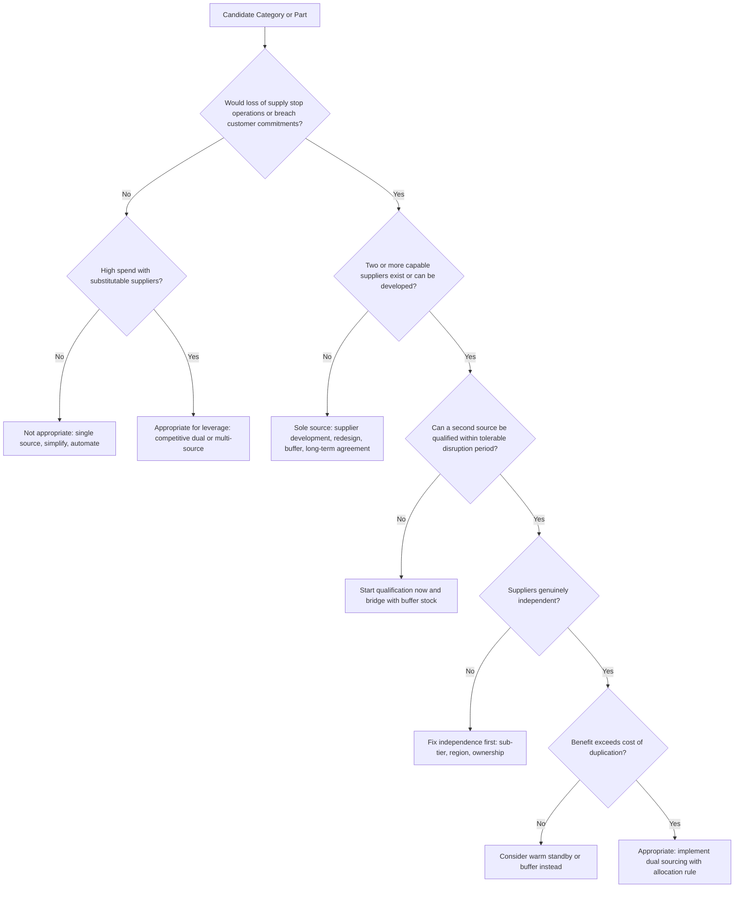

## When Dual Sourcing Is and Is Not Appropriate


### Overview

Dual sourcing is a targeted tool, not a default policy. Applied to the wrong category, it adds qualification cost, administrative burden, and quality variation without a matching gain in resilience or leverage. Withheld from the right category, it leaves the organization exposed to a single point of failure and a weak negotiating position.

Deciding when dual sourcing is appropriate means testing each category against a consistent set of questions:

- **Consequence:** What happens if supply stops?
- **Feasibility:** Are two capable, independent suppliers available or developable?
- **Economics:** Does the benefit exceed the cost of duplication and lost scale?
- **Timing:** Can a second source be qualified and ramped inside the time the business can survive without supply?
- **Fit:** Do the specification, relationship model, and intellectual property position tolerate two sources?

The answer differs by category, and often by part within a category. A single organization will typically run dual sourcing, backup arrangements, single sourcing, and sole sourcing side by side.

**Key Points**

- Dual sourcing is most valuable where **disruption impact is high**, **substitutes exist**, and **the cost of duplication is tolerable**.
- It is least valuable for **low-impact, low-risk items**, for **genuinely sole-source items**, and where **scale economies or tooling costs dominate**.
- Feasibility conditions (independence, qualification lead time, specification portability) are as important as desirability conditions (criticality, leverage).
- Where dual sourcing is inappropriate, alternatives exist: buffer stock, qualified standby, design changes, contractual protections, or insourcing.
- The decision should be documented, reviewed on a fixed cadence, and re-opened when conditions change.

---

### The Decision Logic



The flow separates *desirability* (consequence and economics) from *feasibility* (availability, independence, qualification time). Passing one without the other does not justify the strategy.

---

### Conditions Where Dual Sourcing Is Appropriate

#### 1. High criticality and severe disruption impact

If a shortfall stops production, breaches customer contracts, or creates safety or regulatory exposure, the value of continuity is high. Typical signals:

- Item appears on the bill of materials of a flagship or revenue-critical product.
- Loss per day of shortage is large relative to the annual cost of a second source.
- No alternate material or workaround exists at short notice.
- Time-to-recover for the supplier exceeds the organization's time-to-survive.

$$TTR_{supplier} > TTS_{operations} \;\Rightarrow\; \text{exposure that dual sourcing can address}$$

#### 2. Leverage categories with credible alternatives

High-spend categories with many capable suppliers benefit from commercial tension. Splitting volume keeps both suppliers competitive and provides benchmarking data. In Kraljic terms this is the *Leverage* quadrant.

#### 3. Bottleneck items where a stockout is disproportionately costly

Low-spend but high-risk parts (specialty fasteners, seals, valves, small electronic components) can halt an entire line. The second source is inexpensive insurance relative to the consequence.

#### 4. Elevated supplier risk

Dual sourcing is warranted when the incumbent shows warning signs:

- Financial distress or thin liquidity.
- Repeated quality escapes or delivery misses.
- Capacity constraints or dependence on a stressed sub-tier.
- Location in a high-hazard, high-tariff, or politically unstable region.
- Ownership changes or M&A uncertainty.

#### 5. Standardized, portable specifications

Where drawings, tolerances, materials, and test methods are standard or easily transferable, either supplier can build to the same requirement, making the two sources interchangeable.

#### 6. Volume large enough to sustain two suppliers

If each supplier's share still clears meaningful volume-discount thresholds and justifies their attention, splitting does not destroy economics.

#### 7. Regulatory, customer, or contractual requirements

Some customers, programs, or regulated industries require or strongly prefer a demonstrated second source. [Unverified] Specific requirements vary by industry, jurisdiction, and contract, and should be confirmed against the applicable standards.

#### 8. Geographic and geopolitical hedging needs

Tariff exposure, export controls, currency volatility, and regional logistics risks can justify placing suppliers in different countries or regions.

#### 9. Demand volatility or ramp requirements

Two suppliers absorb surges and product-launch ramps better than one, provided both have the capacity headroom.

---

### Conditions Where Dual Sourcing Is Not Appropriate

#### 1. Low criticality and low value

For non-critical, low-spend items (office supplies, generic consumables, commodity MRO), the added administration exceeds any plausible benefit. The better strategy is simplification: catalog buying, blanket purchase orders, purchasing cards, or consolidation to reduce transaction cost.

#### 2. Sole-source items

If only one supplier can make the item (patented technology, proprietary process, unique raw material), dual sourcing is impossible without first changing the underlying condition. Options:

- Supplier development to create a second capable source.
- Design changes to allow substitute parts.
- License or technology-transfer arrangements.
- Strategic buffer stock and long-term supply agreements with continuity clauses.

Confusing *sole* sourcing (a market constraint) with *single* sourcing (a choice) leads to wrong remedies.

#### 3. Dominant scale economies

If unit cost falls steeply with volume, splitting can erase savings. A supplier receiving 50 percent of volume may price meaningfully higher than one receiving 100 percent.

$$p_{blend}(\alpha) = \alpha \, p_A(\alpha D) + (1-\alpha)\, p_B((1-\alpha) D)$$

When price curves $p(V)$ are steep, the blended price can exceed the single-source price by more than the risk reduction is worth.

#### 4. High tooling, NRE, or qualification cost relative to volume

If a second source requires a duplicate tool costing hundreds of thousands and the annual volume is small, the payback period may exceed the product life. Alternatives include shared tooling with transfer rights, qualified standby with minimal investment, or inventory.

#### 5. Tightly integrated co-development or strategic partnerships

Where the supplier co-designs the product, holds joint intellectual property, or invests in dedicated capacity for your account, introducing a second source can undermine commitment, expose IP, and complicate governance. A partnership with strong contingency arrangements (buffer, step-in rights, tooling ownership) may be better.

#### 6. Processes where variation between suppliers is unacceptable

For highly sensitive processes (tight tolerances, delicate chemistry, biological materials, certain software-defined components), differences between suppliers may cause quality variation that outweighs supply resilience. Where feasible, mitigate through specification detail and requalification; where not, a single controlled source with buffer may be safer.

#### 3. Insufficient administrative capacity

Running two suppliers requires quality audits, scorecards, logistics coordination, and relationship management. Thin procurement or quality staffing can turn dual sourcing into two poorly managed relationships.

#### 8. Correlated risk between the two suppliers

If both suppliers draw on the same sub-tier supplier, occupy the same industrial region, share ownership, or depend on the same critical input, the second source does not diversify risk. The strategy is inappropriate until independence is achieved; otherwise the cost is paid without the benefit.

#### 9. Qualification lead time exceeds any realistic protective window

If qualifying a second source would take longer than the item's remaining product life, or the time to the next disruption is unknowable but the qualification is multi-year, the investment may not pay off. Buffer stock or design-level changes may be the better answer.

#### 10. Very small or declining volume

For end-of-life parts or very low-volume items, suppliers may decline to participate, or the volume may not justify qualification. Last-time buys, redesign, or substitution may be preferable.

---

### Structured Appropriateness Scoring

A weighted scorecard makes the decision comparable across categories. Score each factor from 1 (unfavorable) to 5 (favorable) and combine.

| Factor | Weight | Favorable Signal (score 5) | Unfavorable Signal (score 1) |
| --- | --- | --- | --- |
| Disruption impact | 0.25 | Stops production or breaches contracts | Negligible operational effect |
| Supplier availability | 0.15 | Several capable suppliers | Only one capable supplier |
| Independence achievable | 0.10 | Independent regions, owners, sub-tiers | Shared sub-tier and region |
| Qualification burden | 0.10 | Low cost, short lead time | High cost, long lead time |
| Scale-economy penalty | 0.10 | Flat price curve | Steep volume discounts |
| Specification portability | 0.10 | Standard, easily replicated | Proprietary, hard to replicate |
| Supplier risk on incumbent | 0.10 | Elevated risk | Very stable |
| Administrative capacity | 0.05 | Adequate | Constrained |
| Leverage opportunity | 0.05 | High spend, competitive market | Low spend, few players |

$$A = \sum_{i} w_i \cdot s_i, \qquad \sum_i w_i = 1$$

Interpretation thresholds are organization-specific; a common approach is to treat $A \ge 3.5$ as a candidate for dual sourcing, $2.5 \le A < 3.5$ as a candidate for warm standby or buffer, and $A < 2.5$ as single sourcing with monitoring. Also apply **hard gates** (for example, if only one capable supplier exists, dual sourcing is infeasible regardless of score).

**Example**

```python
WEIGHTS = {
    "disruption_impact": 0.25,
    "supplier_availability": 0.15,
    "independence": 0.10,
    "qualification_burden": 0.10,
    "scale_penalty": 0.10,
    "spec_portability": 0.10,
    "incumbent_risk": 0.10,
    "admin_capacity": 0.05,
    "leverage": 0.05,
}
assert abs(sum(WEIGHTS.values()) - 1.0) < 1e-9

def appropriateness(scores: dict, sole_source: bool = False):
    if sole_source:
        return None, "INFEASIBLE (sole source): develop supplier, redesign, or buffer"
    a = sum(WEIGHTS[k] * scores[k] for k in WEIGHTS)
    if a >= 3.5:
        verdict = "DUAL SOURCE"
    elif a >= 2.5:
        verdict = "WARM STANDBY OR BUFFER"
    else:
        verdict = "SINGLE SOURCE + MONITOR"
    return a, verdict

cases = {
    "Precision sensor module": dict(disruption_impact=5, supplier_availability=4, independence=4,
        qualification_burden=2, scale_penalty=3, spec_portability=3, incumbent_risk=4,
        admin_capacity=4, leverage=3),
    "Office paper": dict(disruption_impact=1, supplier_availability=5, independence=5,
        qualification_burden=5, scale_penalty=3, spec_portability=5, incumbent_risk=1,
        admin_capacity=3, leverage=2),
    "Machined housing": dict(disruption_impact=4, supplier_availability=4, independence=3,
        qualification_burden=3, scale_penalty=2, spec_portability=4, incumbent_risk=3,
        admin_capacity=3, leverage=4),
}

for name, s in cases.items():
    a, v = appropriateness(s)
    print(f"{name:26s} score={a:.2f} -> {v}")

a, v = appropriateness({}, sole_source=True)
print(f"{'Patented alloy (sole)':26s} score=n/a  -> {v}")
```

**Output**

```plaintext
Precision sensor module    score=3.70 -> DUAL SOURCE
Office paper               score=2.65 -> WARM STANDBY OR BUFFER
Machined housing           score=3.40 -> WARM STANDBY OR BUFFER
Patented alloy (sole)      score=n/a  -> INFEASIBLE (sole source): develop supplier, redesign, or buffer
```

The office paper result illustrates a limitation of purely additive scoring: favorable availability and portability scores lift the total even though disruption impact is negligible. In practice, a **minimum-impact gate** should override the score (for example, if disruption impact is below 2, cap the verdict at single sourcing). Weights, thresholds, and gates are illustrative and should be calibrated to the organization; the scoring supports judgment and does not replace it.

---

### Quantitative Test: Does the Benefit Exceed the Cost?

Dual sourcing is economically appropriate when expected benefits exceed the incremental cost.

$$\Delta E[L] + B_{leverage} > C_{qual} + C_{admin} + \Delta C_{price}$$

- $\Delta E[L]$: reduction in expected disruption loss.
- $B_{leverage}$: annual value of price tension and performance gains.
- $C_{qual}$: annualized qualification and tooling cost.
- $C_{admin}$: extra management cost.
- $\Delta C_{price}$: price penalty from lost scale.

**Example**

```python
def annualize(one_time_cost: float, years: float, rate: float = 0.08) -> float:
    # Capital recovery factor: converts a one-time cost into an equivalent annual cost
    crf = rate * (1 + rate) ** years / ((1 + rate) ** years - 1)
    return one_time_cost * crf

def dual_source_test(p_disruption, loss_single, loss_dual,
                     leverage_benefit, qual_cost, product_life_years,
                     admin_cost, volume, price_penalty_per_unit):
    d_loss = p_disruption * (loss_single - loss_dual)
    benefit = d_loss + leverage_benefit
    cost = annualize(qual_cost, product_life_years) + admin_cost + volume * price_penalty_per_unit
    return benefit, cost, benefit - cost

scenarios = {
    "Critical part, 5-year life":  dict(p_disruption=0.06, loss_single=2_000_000, loss_dual=400_000,
                                        leverage_benefit=20_000, qual_cost=250_000, product_life_years=5,
                                        admin_cost=30_000, volume=80_000, price_penalty_per_unit=0.25),
    "Minor part, 5-year life":     dict(p_disruption=0.02, loss_single=60_000, loss_dual=20_000,
                                        leverage_benefit=2_000, qual_cost=90_000, product_life_years=5,
                                        admin_cost=25_000, volume=200_000, price_penalty_per_unit=0.02),
    "Critical part, 1-year life":  dict(p_disruption=0.06, loss_single=2_000_000, loss_dual=400_000,
                                        leverage_benefit=20_000, qual_cost=250_000, product_life_years=1,
                                        admin_cost=30_000, volume=80_000, price_penalty_per_unit=0.25),
}

for name, kw in scenarios.items():
    b, c, n = dual_source_test(**kw)
    print(f"{name:28s} benefit={b:>9,.0f} cost={c:>9,.0f} net={n:>10,.0f}")
```

**Output**

```plaintext
Critical part, 5-year life    benefit=  116,000 cost=  112,663 net=     3,337
Minor part, 5-year life       benefit=    3,600 cost=   51,533 net=   -47,933
Critical part, 1-year life    benefit=  116,000 cost=  305,000 net=  -189,000
```

Three lessons follow. The critical part barely clears the bar on expected value; the minor part fails clearly; and a short remaining product life turns the same critical part into a poor investment because the qualification cost cannot be amortized. Expected-value results are sensitive to the disruption probability and loss inputs, which are assumptions and not benchmarks. [Inference] Because rare, severe events are poorly captured by averages, organizations often apply a risk-appetite override so that catastrophic-tail categories are protected even when the expected-value margin is thin.

---

### Feasibility Conditions

Desirability alone is insufficient. The following must also hold.

| Feasibility Condition | Test | If Not Met |
| --- | --- | --- |
| **Capable suppliers exist** | At least two suppliers can meet the specification | Supplier development, redesign |
| **Genuine independence** | Different facility, region, ownership, critical sub-tier | Diversify sub-tier or region first |
| **Qualification fits the window** | $T_{qualify} \le$ tolerable lead window | Start early; bridge with buffer |
| **Capacity headroom** | Each source can carry the required continuity share alone | Capacity reservation, third source |
| **Specification portability** | Common drawings, tolerances, and tests usable by both | Standardize spec; invest in transfer packages |
| **IP and confidentiality controls** | NDAs, access limits, and tooling ownership defined | Strengthen contracts before sharing |
| **Commercial willingness** | Suppliers accept split volumes under viable terms | Adjust minimums, pricing tiers, or share floors |

The independence condition is the most commonly failed. For two suppliers with individual failure probabilities and a common-cause probability $P_C$, the probability both are unavailable is approximately:

$$P(\text{both}) \approx P_C + (1-P_C)\,P_A' P_B'$$

As $P_C$ rises, the benefit of a second source falls toward zero, because a shared event disables both.

---

### Category-by-Category Guidance

| Category Type | Kraljic Quadrant | Dual Sourcing Appropriateness | Typical Approach |
| --- | --- | --- | --- |
| Commodity MRO, office supplies | Non-critical | Rarely appropriate | Consolidate, catalog, automate |
| Bulk raw materials with many suppliers | Leverage | Often appropriate | Competitive dual or multi-source with periodic re-tender |
| Standard electronic components | Leverage or Bottleneck | Appropriate when allocation risk exists | Dual source; monitor market allocation |
| Small specialty parts with few suppliers | Bottleneck | Appropriate when a second supplier can be qualified | Qualify a second source; hold buffer |
| Custom-engineered components | Strategic | Conditional | Partnership with qualified secondary or buffer; watch IP and tooling |
| Proprietary or patented items | Strategic (sole) | Not feasible initially | Supplier development, redesign, strategic stock |
| Logistics lanes and carriers | Leverage | Usually appropriate | Two carriers per critical lane |
| Cloud, connectivity, managed services | Varies | Appropriate for critical services | Multi-vendor or multi-region architecture (watch integration cost) |
| Contract manufacturing of complex assemblies | Strategic | Conditional | Primary/secondary split with tooling transfer rights |
| End-of-life or very low volume parts | Varies | Rarely appropriate | Last-time buy, substitution, redesign |

The table is a starting heuristic; individual circumstances can shift a category to a different treatment.

---

### Alternatives When Dual Sourcing Is Not Appropriate

| Alternative | When It Fits | Limitation |
| --- | --- | --- |
| **Safety stock / buffer inventory** | Short disruptions; high cost of second source | Carrying cost, obsolescence; does not cover long outages |
| **Qualified standby (warm or cold)** | Moderate criticality; high scale economies with primary | Readiness decay; slower activation |
| **Design for substitutability** | Sole-source components; long product life | Engineering effort and requalification |
| **Contractual continuity terms** | Strategic partnerships | Enforcement limits under insolvency or force majeure |
| **Supplier development** | Sole-source or thin markets | Slow, investment risk |
| **Vendor-managed or consignment inventory** | Inbound variability | Depends on supplier solvency |
| **Geographic diversification within one supplier's network** | Site-level risk only | Does not address supplier-level failure |
| **Insourcing or last-time buy** | Long-term lock-in, end-of-life | Capital and capability needs |
| **Risk acceptance** | Low impact or very low probability | Requires documented approval and review date |

Where a gap is knowingly left open, record it in a **risk acceptance register** with owner, rationale, and review date.

---

### Illustration: Appropriateness Zones (svg_diagram)

<svg xmlns="http://www.w3.org/2000/svg" viewBox="0 0 660 380" role="img" aria-label="Dual sourcing appropriateness zones (svg_diagram)">
<title>Dual Sourcing Appropriateness Zones (svg_diagram)</title>
<text x="330" y="26" text-anchor="middle" font-family="sans-serif" font-size="15" font-weight="bold" fill="#222">Disruption Impact vs Feasibility (svg_diagram)</text>
<rect x="80" y="50" width="240" height="140" fill="#fef7e0" stroke="#f9ab00" />
<rect x="320" y="50" width="240" height="140" fill="#e6f4ea" stroke="#188038" />
<rect x="80" y="190" width="240" height="140" fill="#f1f3f4" stroke="#9aa0a6" />
<rect x="320" y="190" width="240" height="140" fill="#e8f0fe" stroke="#3367d6" />
<text x="200" y="110" text-anchor="middle" font-family="sans-serif" font-size="13" fill="#5f4300">High impact, low feasibility</text>
<text x="200" y="130" text-anchor="middle" font-family="sans-serif" font-size="12" fill="#5f4300">Develop supplier, redesign, buffer</text>
<text x="440" y="110" text-anchor="middle" font-family="sans-serif" font-size="13" fill="#0b3d1c">High impact, high feasibility</text>
<text x="440" y="130" text-anchor="middle" font-family="sans-serif" font-size="12" fill="#0b3d1c">Dual sourcing appropriate</text>
<text x="200" y="250" text-anchor="middle" font-family="sans-serif" font-size="13" fill="#3c4043">Low impact, low feasibility</text>
<text x="200" y="270" text-anchor="middle" font-family="sans-serif" font-size="12" fill="#3c4043">Single source, accept risk</text>
<text x="440" y="250" text-anchor="middle" font-family="sans-serif" font-size="13" fill="#1a237e">Low impact, high feasibility</text>
<text x="440" y="270" text-anchor="middle" font-family="sans-serif" font-size="12" fill="#1a237e">Dual only if leverage justifies</text>
<text x="200" y="352" text-anchor="middle" font-family="sans-serif" font-size="12" fill="#555">Low feasibility</text>
<text x="440" y="352" text-anchor="middle" font-family="sans-serif" font-size="12" fill="#555">High feasibility</text>
<text x="40" y="125" text-anchor="middle" font-family="sans-serif" font-size="12" fill="#555" transform="rotate(-90 40 125)">High impact</text>
<text x="40" y="270" text-anchor="middle" font-family="sans-serif" font-size="12" fill="#555" transform="rotate(-90 40 270)">Low impact</text>
</svg>

---

### Worked Scenarios

#### Scenario 1: Appropriate

A manufacturer buys a precision sensor module used in its flagship product. A stockout halts final assembly, costing about $80,000 per day. The incumbent is financially stable but located in a region with elevated natural-hazard risk. Two other suppliers can build to the standard drawing in different regions. Qualification takes about 120 days, and the module has a five-year remaining life.

**Assessment:** high impact, feasible alternatives, independence achievable, qualification fits the product life, moderate scale penalty. **Decision:** dual sourcing with a 70/30 primary/secondary split, buffer stock to bridge the qualification period, and a capacity commitment from the secondary.

#### Scenario 2: Not appropriate (low criticality)

A company buys generic cleaning supplies. Many suppliers exist, disruption has negligible operational effect, and spend is small. **Assessment:** dual sourcing adds administration without benefit. **Decision:** consolidate to one distributor under a blanket order with a catalog, and rely on the market for substitution if needed.

#### Scenario 3: Not appropriate (sole source)

A device uses a patented sensor chip made by one vendor. **Assessment:** no second capable supplier exists. **Decision:** negotiate a long-term supply agreement with allocation priority and last-time-buy rights, hold strategic inventory, and evaluate a design change to accept an alternate chip in the next revision.

#### Scenario 4: Not yet appropriate (independence)

Two suppliers are qualified for a molded component, but both buy resin from the same compounder and operate in the same industrial park. **Assessment:** the second source adds little protection because a resin shortage or local event affects both. **Decision:** require one supplier to qualify a second resin source or add a third supplier in another region before counting the arrangement as dual sourcing.

#### Scenario 5: Not appropriate (economics)

A high-volume commodity part has steep tiered pricing, and splitting volume 50/50 raises the blended unit price by 4 percent (about $320,000 per year). Disruption risk is low and substitute suppliers can be qualified in weeks. **Assessment:** price penalty exceeds the expected-loss benefit. **Decision:** single source with a pre-qualified standby and a modest buffer.

---

### Common Pitfalls

- **Applying dual sourcing as a blanket policy.** It should be category-specific and evidence-based.
- **Counting paper redundancy.** A second supplier without qualification, capacity, or independence provides little protection.
- **Ignoring qualification lead time.** A second source that arrives after the disruption offers no help.
- **Underestimating scale penalties.** Splitting volume can raise prices more than the risk reduction is worth.
- **Overlooking administrative capacity.** Two poorly managed suppliers can be worse than one well-managed supplier.
- **Neglecting IP exposure.** Sharing specifications and know-how with two suppliers widens leakage risk.
- **Confusing sole and single sourcing.** Single-source risk is solved by qualifying another supplier; sole-source risk requires development, redesign, or inventory.
- **Deciding once and never revisiting.** Supplier health, markets, and product lifecycles change; the decision should be re-run on a schedule and on trigger events.
- **Relying only on averages.** Expected-value math can hide tail risk; apply risk-appetite thresholds for severe scenarios.

---

### Governance and Review

| Element | Practice |
| --- | --- |
| **Decision owner** | Category manager, with sign-off from quality, engineering, finance, and risk |
| **Documentation** | Record criteria, scores, assumptions, and the resulting model per category |
| **Review cadence** | At least annually, plus trigger-based reviews |
| **Re-evaluation triggers** | Supplier financial distress, M&A, quality escapes, new tariffs or sanctions, demand shifts, product lifecycle changes, post-disruption reviews |
| **Risk acceptance** | Formal register for gaps knowingly left open |
| **Metrics** | Coverage ratio of critical parts with two independent qualified sources, alternate capacity ratio, qualification currency, price differential, drill pass rate |

$$\text{Coverage ratio} = \frac{N_{\text{critical parts with two independent qualified sources}}}{N_{\text{critical parts}}}$$


---

**Conclusion**

Dual sourcing is appropriate when consequence, feasibility, and economics line up: a disruption would hurt, two capable and genuinely independent suppliers can be qualified within the available window, and the benefit in avoided loss and commercial leverage exceeds the cost of duplication and lost scale. It is inappropriate for low-impact items, sole-source items, categories dominated by scale economies or high tooling cost, tightly integrated partnerships, and any case where the two suppliers share the same underlying risks. Where it does not fit, buffer stock, qualified standby, design changes, contractual protections, and documented risk acceptance provide alternatives. Regular review keeps each decision aligned with changing conditions.

**Next Steps**

- Dual Sourcing Versus Backup Supplier Models
- Supplier Independence Assessment (Ownership, Geography, Sub-Tier)
- Kraljic Matrix Positioning and Dual-Sourcing Suitability
- Total Cost of Ownership Modeling for Dual-Sourcing Decisions
- Qualification Lead Time and Cost Estimation
- Volume Allocation Models and Split Ratios
- Supplier Development for Sole-Source Categories
- Design for Substitutability and Second-Source Enablement
- Risk Acceptance Registers and Risk Appetite Thresholds
- Trigger-Based Reassessment of Sourcing Decisions