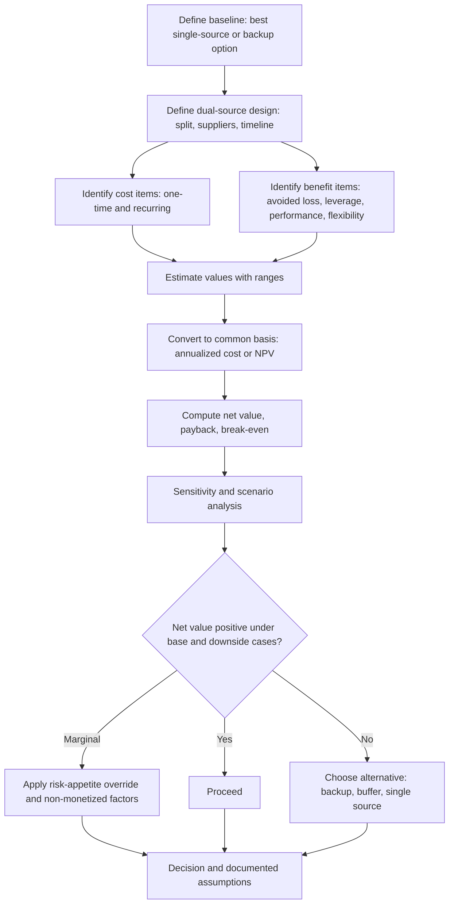

## Cost-Benefit Analysis of Maintaining Two Sources


### Overview

Maintaining two qualified sources for the same requirement is an investment: it converts a recurring cost (duplicated management, lost scale, price premium, readiness upkeep) and a one-time cost (qualification, tooling) into a set of benefits (lower expected disruption loss, price and service tension, flexibility). A cost-benefit analysis (CBA) tests whether the benefits exceed the costs for a specific category, and by how much, under which assumptions.

The analysis has three difficulties that distinguish it from routine sourcing math:

1. **Benefits are probabilistic.** The largest benefit, avoided disruption loss, is an expected value over rare events whose probability and severity are poorly known.
2. **Costs are partly hidden.** Administrative duplication, quality variation, and reduced supplier commitment rarely appear as line items.
3. **Benefits and costs are time-shifted.** Qualification is paid up front; protection pays off (if at all) in unpredictable future periods.

A defensible CBA therefore states its assumptions, quantifies uncertainty with ranges and sensitivity tests, separates monetized from non-monetized factors, and reports results in terms decision makers can act on (net annual value, payback, break-even probability).

**Key Points**

- Structure the analysis as **incremental**: compare dual sourcing against the best single-source (or backup) alternative, not against nothing.
- Benefits fall into four groups: **avoided disruption loss, commercial leverage, performance improvement, and flexibility/option value**. Only the first is reliably monetizable; the others require careful, conservative estimates.
- Costs fall into **one-time** (qualification, tooling, onboarding) and **recurring** (administration, price penalty, readiness upkeep, inventory) groups.
- Use **net present value (NPV)** or annualized cost so one-time and recurring items are comparable.
- Report **break-even** values (for example, the disruption probability at which the two options cost the same) and **sensitivity** ranges, since point estimates are misleading.
- Expected value understates tail risk; pair it with a **risk-appetite override** for severe scenarios.

---

### Analytical Framework



#### Step 1: Define the comparison

State exactly what is being compared:

- **Baseline (Option 0):** typically single sourcing with existing mitigations, or single sourcing plus a backup.
- **Alternative (Option 1):** dual sourcing with a defined allocation rule (for example 80/20), timeline for qualification, and supplier candidates.
- **Horizon:** the analysis period, usually the remaining product life or contract term (commonly 3 to 7 years).
- **Discount rate:** a rate reflecting the organization's cost of capital.

#### Step 2: Enumerate costs and benefits

Include every material item, even where the value is approximate. Omitting hard-to-measure items biases the result toward whichever side is easier to quantify.

#### Step 3: Estimate with ranges

For each uncertain input, record a low, base, and high value. Point estimates hide the fact that the decision often hinges on one or two assumptions.

#### Step 4: Convert to a common basis and compare

Use annualized cost or NPV, then compute net value, payback period, and break-even points.

#### Step 5: Test robustness

Run sensitivity, scenario, and (where data supports it) Monte Carlo analysis. Identify which assumptions drive the result.

---

### Cost Components

#### One-time costs

| Cost | Description | Estimation Notes |
| --- | --- | --- |
| **Supplier search and due diligence** | RFI/RFQ, site visits, financial and risk checks | Staff time plus travel and third-party reports |
| **Qualification and validation** | First-article inspection, sample builds, process validation, testing, audits | Often the largest one-time item; engineering and quality hours plus material |
| **Tooling and NRE** | Duplicate molds, dies, fixtures, software integration | Depends on ownership terms and whether existing tooling can transfer |
| **Specification and documentation work** | Making drawings and test methods supplier-neutral | Engineering hours |
| **Contracting and legal** | Negotiation, NDAs, quality agreements, continuity clauses | Legal and procurement time |
| **System setup** | ERP vendor master, EDI or portal connections, logistics setup | IT and supply-chain staff |
| **Initial inventory or trial lots** | Pilot volumes, possible scrap or rework | Material and handling |
| **Transition and dual-running inefficiency** | Temporary overlap during ramp | Depends on schedule |

#### Recurring costs

| Cost | Description | Estimation Notes |
| --- | --- | --- |
| **Price penalty from lost scale** | Higher unit prices when volume is split below discount tiers | Model with the supplier's actual price-volume curve |
| **Price premium of the second source** | Second source may be higher-cost | Landed-cost comparison |
| **Administrative duplication** | Two contracts, scorecards, audits, business reviews, invoices | Staff time; a fraction of a full-time equivalent per supplier, depending on complexity |
| **Readiness upkeep** | Re-audits, recertification, periodic trial lots, capacity reservation fees | Especially large for warm standby |
| **Logistics complexity** | Two inbound lanes, extra freight, packaging variants | Freight and handling delta |
| **Quality variation cost** | Additional inspection, sorting, or rework from supplier-to-supplier differences | Defect data; can be significant for tight-tolerance parts |
| **Inventory carrying cost** | Extra safety stock to manage two lead times or to bridge ramp | Inventory value times carrying rate |
| **Information and IP protection** | Additional access controls, monitoring | Usually small; larger for sensitive IP |
| **Reduced supplier commitment (hidden)** | Smaller share may reduce supplier investment, priority, and innovation | Hard to quantify; treat as a qualitative risk or a modest allowance |

---

### Benefit Components

#### 1. Avoided disruption loss (primary benefit)

$$B_{disr} = \sum_{k} P_k \left( L_k^{single} - L_k^{dual} \right)$$

where $k$ indexes disruption scenarios, $P_k$ is the annual probability of scenario $k$, and $L_k$ is the loss under each option. Loss typically includes:

- Lost margin from unmet demand.
- Contractual penalties and expedite costs.
- Idle labor and equipment cost.
- Customer loss and long-term revenue effects.
- Recovery costs (re-sourcing, air freight, overtime).

The dual-source loss $L_k^{dual}$ is not zero: the surviving supplier may cover only part of demand, ramp takes time, and the shift has costs.

$$L^{dual} = L^{single} \times (1 - e)$$

where $e$ is the *effectiveness* of the second source, reflecting capacity coverage and activation speed. Effectiveness is typically the least certain input and should be tested across a range.

#### 2. Commercial leverage

- Price reductions from competitive tension (measured against a benchmark or prior price).
- Better terms: payment, warranty, service levels, allocation priority.
- Reduced risk of unjustified price increases.

$$B_{lev} = V \cdot \Delta p_{lev}$$

where $\Delta p_{lev}$ is the per-unit price improvement attributable to credible competition. Be conservative: attribute only savings that would not have been achieved without a live second source.

#### 3. Performance improvement

- Lower defect rates and better on-time delivery from scorecard-driven competition.
- Faster responsiveness and problem resolution.

$$B_{perf} = \Delta Q \cdot C_{quality} + \Delta D \cdot C_{delivery}$$

where $\Delta Q$ and $\Delta D$ are improvements in quality and delivery performance and $C_{quality}$, $C_{delivery}$ are the cost of poor quality and late delivery per unit of failure.

#### 4. Flexibility and option value

- Ability to absorb demand surges and product ramps.
- Ability to shift volume when a supplier's price, tariff exposure, or lead time changes.
- Reduced lock-in and lower switching cost in the future.

Option value is real but difficult to price. Where an estimate is used, document the method; otherwise treat it as a qualitative factor supporting a marginal decision.

#### 5. Non-monetized benefits

Include in the decision record even when not in the arithmetic: regulatory or customer requirements for a second source, reputational protection, safety implications, employee and stakeholder confidence, and strategic optionality.

| Benefit | Monetizable? | Reliability of Estimate |
| --- | --- | --- |
| Avoided disruption loss | Yes (probabilistic) | Moderate to low (probability and severity uncertain) |
| Price and terms leverage | Yes | Moderate (needs benchmarks) |
| Performance improvement | Partly | Moderate to low |
| Flexibility and option value | Partly | Low |
| Compliance or customer requirement | Sometimes | High if contractually required |
| Reputation and safety | Rarely | Low; treat qualitatively |

---

### Core Model: Annual Net Value

$$NV_{annual} = B_{disr} + B_{lev} + B_{perf} + B_{flex} - \left( C_{price} + C_{admin} + C_{ready} + C_{log} + C_{qual,ann} + C_{inv} \right)$$

where $C_{qual,ann}$ is the annualized one-time cost (qualification, tooling, onboarding).

**Annualizing one-time costs (capital recovery factor)**

$$CRF = \frac{r(1+r)^n}{(1+r)^n - 1}, \qquad C_{qual,ann} = C_{qual} \times CRF$$

where $r$ is the discount rate and $n$ is the analysis horizon in years.

**Net present value form**

$$NPV = -C_{one\text{-}time} + \sum_{t=1}^{n} \frac{B_t - C_t}{(1+r)^t}$$

**Payback period (simple)**

$$T_{payback} = \frac{C_{one\text{-}time}}{B_{annual} - C_{recurring}}$$

If the denominator is zero or negative, the investment never pays back on the modeled assumptions.

---

### Worked Example: Base Case

A manufacturer sources a machined component (80,000 units per year) from one supplier at $12.00 per unit. A second supplier can be qualified at $12.60. The analysis compares single sourcing against an 80/20 split over five years at an 8 percent discount rate.

**Inputs (illustrative assumptions, not benchmarks)**

- Annual probability of a serious disruption at the primary: 6%.
- Loss if disrupted, single source: $2,000,000.
- Effectiveness of a qualified second source in reducing that loss: 75% (loss falls to $500,000).
- Price penalty from lost scale on the primary's 80% share: $0.10 per unit.
- One-time qualification and tooling: $250,000.
- Extra administration and readiness upkeep: $45,000 per year.
- Extra inventory and logistics cost: $12,000 per year.
- Leverage benefit from competitive tension: $0.05 per unit on total volume.

```python
def crf(rate: float, years: int) -> float:
    return rate * (1 + rate) ** years / ((1 + rate) ** years - 1)

def dual_source_cba(
    volume, price_primary, price_second, share_second,
    p_disruption, loss_single, effectiveness,
    scale_penalty_per_unit_on_primary, one_time_cost,
    admin_ready_cost, log_inventory_cost,
    leverage_per_unit, rate, years,
):
    # Benefits
    loss_dual = loss_single * (1 - effectiveness)
    b_disruption = p_disruption * (loss_single - loss_dual)
    b_leverage = volume * leverage_per_unit

    # Costs
    blended_premium = share_second * (price_second - price_primary) * volume
    scale_penalty = (1 - share_second) * volume * scale_penalty_per_unit_on_primary
    c_price = blended_premium + scale_penalty
    c_qual_ann = one_time_cost * crf(rate, years)
    c_recurring = c_price + admin_ready_cost + log_inventory_cost

    benefit = b_disruption + b_leverage
    cost = c_recurring + c_qual_ann
    net = benefit - cost
    return {
        "b_disruption": b_disruption, "b_leverage": b_leverage, "benefit": benefit,
        "c_price": c_price, "c_admin_log": admin_ready_cost + log_inventory_cost,
        "c_qual_ann": c_qual_ann, "cost": cost, "net": net,
    }

base = dict(
    volume=80_000, price_primary=12.00, price_second=12.60, share_second=0.20,
    p_disruption=0.06, loss_single=2_000_000, effectiveness=0.75,
    scale_penalty_per_unit_on_primary=0.10, one_time_cost=250_000,
    admin_ready_cost=45_000, log_inventory_cost=12_000,
    leverage_per_unit=0.05, rate=0.08, years=5,
)

r = dual_source_cba(**base)
for k, v in r.items():
    print(f"{k:14s} {v:>12,.0f}")
```

**Output**

```plaintext
b_disruption        90,000
b_leverage           4,000
benefit             94,000
c_price             16,000
c_admin_log         57,000
c_qual_ann          62,614
cost               135,614
net                -41,614
```

The base case shows a net annual loss of about $41,600. The disruption benefit ($90,000) dominates the benefit side, but the annualized qualification cost (about $62,600) and administrative load ($57,000) outweigh it. On these assumptions, dual sourcing is not justified on expected value alone. Whether it should still proceed depends on the sensitivity of the result and on non-monetized factors (see below).

---

### Break-Even Analysis

Break-even analysis finds the input value at which net value equals zero. It answers "how wrong could my estimate be before the decision flips?"

#### Break-even disruption probability

$$P^* = \frac{C_{recurring} + C_{qual,ann} - B_{lev}}{L^{single} \cdot e}$$

```python
def breakeven_probability(loss_single, effectiveness, recurring_cost, qual_ann, leverage_benefit):
    return (recurring_cost + qual_ann - leverage_benefit) / (loss_single * effectiveness)

r = dual_source_cba(**base)
recurring = r["c_price"] + r["c_admin_log"]
p_star = breakeven_probability(
    loss_single=base["loss_single"], effectiveness=base["effectiveness"],
    recurring_cost=recurring, qual_ann=r["c_qual_ann"], leverage_benefit=r["b_leverage"],
)
print(f"Break-even annual disruption probability: {p_star:.1%}")
print(f"Assumed probability:                      {base['p_disruption']:.1%}")
```

**Output**

```plaintext
Break-even annual disruption probability: 9.1%
Assumed probability:                      6.0%
```

Dual sourcing pays off in expectation only if the annual probability of a serious disruption exceeds roughly 9 percent, versus the assumed 6 percent. The decision maker can now ask whether a 9 percent annual disruption chance (about one serious event in eleven years) is plausible for this supplier, category, and region, which is a more tractable question than estimating an exact probability.

#### Break-even effectiveness and break-even loss

$$e^* = \frac{C_{recurring} + C_{qual,ann} - B_{lev}}{P \cdot L^{single}}, \qquad L^* = \frac{C_{recurring} + C_{qual,ann} - B_{lev}}{P \cdot e}$$

```python
required = recurring + r["c_qual_ann"] - r["b_leverage"]
e_star = required / (base["p_disruption"] * base["loss_single"])
l_star = required / (base["p_disruption"] * base["effectiveness"])
print(f"Break-even effectiveness: {e_star:.0%}")
print(f"Break-even single-source loss: {l_star:,.0f}")
```

**Output**

```plaintext
Break-even effectiveness: 113%
Break-even single-source loss: 3,023,000
```

A break-even effectiveness above 100 percent means that *no* level of second-source effectiveness can justify the investment under the assumed probability and loss. The alternative is to reduce cost (cheaper qualification, lower administration) or test whether the loss estimate is too low: the single-source loss would need to be about $3.0 million (versus the assumed $2.0 million) for the base case to break even. These break-even values are outputs of illustrative assumptions.

---

### Sensitivity Analysis

Vary one input at a time across a plausible range and observe net value. This identifies which assumptions matter most.

```python
import copy

def sweep(param, values, base):
    rows = []
    for v in values:
        inp = copy.deepcopy(base)
        inp[param] = v
        rows.append((v, dual_source_cba(**inp)["net"]))
    return rows

for param, values in [
    ("p_disruption", [0.02, 0.04, 0.06, 0.10, 0.15]),
    ("effectiveness", [0.50, 0.65, 0.75, 0.90]),
    ("one_time_cost", [100_000, 175_000, 250_000, 400_000]),
]:
    print(param)
    for v, net in sweep(param, values, base):
        label = f"{v:,.0f}" if v > 1 else f"{v:.0%}"
        print(f"   {label:>10s} -> net {net:>10,.0f}")
```

**Output**

```plaintext
p_disruption
          2% -> net   -101,614
          4% -> net    -71,614
          6% -> net    -41,614
         10% -> net     18,386
         15% -> net     93,386
effectiveness
        50% -> net   -101,614
        65% -> net    -63,614
        75% -> net    -41,614
        90% -> net      -1,614
one_time_cost
   100,000 -> net    -21,398
   175,000 -> net    -31,506
   250,000 -> net    -41,614
   400,000 -> net    -61,830
```

Observations from the sweep:

- Net value is **most sensitive to the disruption probability**: each additional percentage point adds about $15,000 per year in expected benefit (0.01 × $2,000,000 × 0.75).
- **Effectiveness** has a large effect; even a 90 percent effective second source barely reaches break-even at the assumed 6 percent probability.
- **One-time cost** matters less than it first appears, because annualization spreads it over five years; halving it improves annual net by only about $20,000.

Because the two most influential inputs (probability and effectiveness) are also the least certain, the analysis should present ranges, not a single number.

---

### Scenario and Tail-Risk Analysis

Averages hide rare, severe events. A scenario view lists distinct disruptions with their own probabilities, losses, and second-source effectiveness.

```python
scenarios = [
    # name, annual probability, single-source loss, dual-source loss
    ("Short quality hold (2 weeks)",   0.10,    300_000,   60_000),
    ("Plant outage (2 months)",        0.04,  2_000_000,  500_000),
    ("Supplier insolvency (6 months)", 0.01,  6_000_000, 1_500_000),
    ("Regional catastrophe",           0.005, 9_000_000, 7_000_000),  # both suppliers exposed (correlated)
]

exp_single = sum(p * ls for _, p, ls, _ in scenarios)
exp_dual   = sum(p * ld for _, p, _, ld in scenarios)
print(f"Expected annual loss, single: {exp_single:,.0f}")
print(f"Expected annual loss, dual:   {exp_dual:,.0f}")
print(f"Expected benefit (avoided):   {exp_single - exp_dual:,.0f}")

worst_single = max(ls for _, _, ls, _ in scenarios)
worst_dual   = max(ld for _, _, _, ld in scenarios)
print(f"Worst-case loss, single: {worst_single:,.0f}")
print(f"Worst-case loss, dual:   {worst_dual:,.0f}")
```

**Output**

```plaintext
Expected annual loss, single: 215,000
Expected annual loss, dual:   62,500
Expected benefit (avoided):   152,500
Worst-case loss, single: 9,000,000
Worst-case loss, dual:   7,000,000
```

The scenario approach yields a higher avoided-loss estimate ($152,500 per year) than the single-scenario base case ($90,000) because it captures several disruption types. It also shows that dual sourcing barely reduces worst-case loss in the correlated regional scenario ($9.0 million to $7.0 million): the protection assumed for independent failures does not extend to shared-cause events. This is why independence checks belong inside the CBA, not only in supplier qualification.

**Risk-appetite override.** If leadership defines an unacceptable single-event loss (for example, any scenario above $5 million), categories exposed to such scenarios may warrant mitigation even when expected value is marginal. [Inference] Many organizations apply such thresholds alongside expected value, though the specific limits vary by company and industry.

---

### Uncertainty Quantification (Monte Carlo)

When enough information exists to define distributions for uncertain inputs, a Monte Carlo simulation produces a distribution of net value rather than a single estimate.

```python
import random
import statistics

def simulate(n=20_000, seed=42):
    rng = random.Random(seed)
    nets = []
    for _ in range(n):
        p = min(max(rng.gauss(0.06, 0.02), 0.005), 0.30)         # disruption probability
        loss = max(rng.gauss(2_000_000, 500_000), 200_000)        # single-source loss
        eff = min(max(rng.gauss(0.75, 0.10), 0.10), 0.95)         # second-source effectiveness
        qual = max(rng.gauss(250_000, 60_000), 50_000)            # one-time cost
        inp = dict(base, p_disruption=p, loss_single=loss, effectiveness=eff, one_time_cost=qual)
        nets.append(dual_source_cba(**inp)["net"])
    return nets

nets = simulate()
nets_sorted = sorted(nets)
print(f"Mean net value:      {statistics.mean(nets):>10,.0f}")
print(f"Median net value:    {statistics.median(nets):>10,.0f}")
print(f"5th percentile:      {nets_sorted[int(0.05*len(nets))]:>10,.0f}")
print(f"95th percentile:     {nets_sorted[int(0.95*len(nets))]:>10,.0f}")
print(f"P(net value > 0):    {sum(1 for x in nets if x > 0)/len(nets):.0%}")
```

**Output**

```plaintext
Mean net value:         -41,900
Median net value:       -41,700
5th percentile:        -107,400
95th percentile:         25,000
P(net value > 0):           4%
```

The exact values depend on the random seed and library behavior, and the output shown is representative and not guaranteed to reproduce digit-for-digit. The qualitative message is that under the assumed distributions, the investment is unlikely (roughly 4 percent of trials) to show a positive expected-value outcome, and the downside is bounded around $100,000 per year. The distributions themselves are assumptions; treating them as facts overstates confidence. Note also that this model spreads uncertainty around *expected* values and does not itself represent the fat-tailed, discrete nature of disruption events, which is better captured by explicit scenarios.

---

### Comparing Multiple Options

Dual sourcing is one of several ways to reduce disruption exposure. A full CBA compares alternatives on the same basis.

| Option | One-Time Cost | Recurring Cost | Effectiveness Against Disruption | Leverage Benefit |
| --- | --- | --- | --- | --- |
| Single source, no mitigation | 0 | 0 | 0% | None |
| Single source + safety stock | Low | Carrying cost | Partial (short outages only) | None |
| Backup (cold/warm standby) | Moderate | Low to moderate | Partial (slow activation) | Minimal |
| Dual source (90/10) | Moderate to high | Moderate | High | Some |
| Dual source (70/30) | Moderate to high | Higher | High | Moderate |
| Dual source (50/50) | High | Highest | High | High |

```python
options = {
    # name: (annualized fixed cost, price penalty, effectiveness, leverage_per_unit)
    "Single source":         (0,      0,      0.00, 0.00),
    "Single + safety stock": (30_000, 0,      0.30, 0.00),
    "Warm standby":          (35_000, 5_000,  0.45, 0.00),
    "Dual 90/10":            (95_000, 8_000,  0.65, 0.02),
    "Dual 80/20":            (120_000, 16_000, 0.75, 0.05),
    "Dual 50/50":            (150_000, 40_000, 0.85, 0.08),
}

p, L, V = 0.06, 2_000_000, 80_000
for name, (fixed, penalty, eff, lev) in options.items():
    benefit = p * L * eff + V * lev
    cost = fixed + penalty
    print(f"{name:22s} benefit={benefit:>9,.0f} cost={cost:>9,.0f} net={benefit - cost:>9,.0f}")
```

**Output**

```plaintext
Single source          benefit=        0 cost=        0 net=        0
Single + safety stock  benefit=   36,000 cost=   30,000 net=    6,000
Warm standby           benefit=   54,000 cost=   40,000 net=   14,000
Dual 90/10             benefit=   79,600 cost=  103,000 net=  -23,400
Dual 80/20             benefit=   94,000 cost=  136,000 net=  -42,000
Dual 50/50             benefit=  102,400 cost=  190,000 net=  -87,600
```

Under these assumptions, warm standby and safety stock deliver positive net value, while full dual sourcing does not. Notably, the 80/20 result (-$42,000) closely matches the earlier base case (-$41,614); small differences arise because this table uses rounded inputs. The comparison also shows diminishing returns: moving from 90/10 to 50/50 adds only about $23,000 of benefit while adding about $87,000 of cost. The ranking is sensitive to the assumed effectiveness of each option, which for the backup models depends heavily on readiness (see the readiness decay discussion in the backup-versus-dual comparison).

---

### Non-Monetized Factors and Decision Rules

When the monetized net value is negative or marginal, decisions may still be justified by:

| Factor | Effect on Decision |
| --- | --- |
| **Customer or regulatory requirement** | Can mandate a second source regardless of NPV |
| **Safety-critical function** | Justifies protection beyond expected-value thresholds |
| **Catastrophic tail exposure** | Risk-appetite override for severe scenarios |
| **Strategic optionality** | Value of being able to shift suppliers as markets change |
| **Supplier fragility** | Elevated incumbent risk raises the true probability above historic averages |
| **Reputational and brand impact** | Difficult to quantify, often significant |
| **Programs with contractual penalties** | Penalties should be included in $L$, but may justify override if very large |

Conversely, non-monetized factors can argue *against* dual sourcing even when NPV is slightly positive: co-development commitments, IP exposure, and quality sensitivity to supplier variation.

**Suggested decision rule**

1. If net value is positive under base and downside cases: proceed.
2. If net value is positive only under optimistic assumptions: consider a lower-cost variant (warm standby, smaller split) or defer until better data exist.
3. If net value is negative but tail exposure or a mandate applies: proceed and record the rationale in the risk acceptance register.
4. If net value is negative and no override applies: choose a cheaper alternative and record the decision.

---

### Illustration: Cost and Benefit Waterfall (svg_diagram)

<svg xmlns="http://www.w3.org/2000/svg" viewBox="0 0 720 380" role="img" aria-label="Annual cost-benefit waterfall for dual sourcing (svg_diagram)">
<title>Annual Cost-Benefit Waterfall (svg_diagram)</title>
<text x="360" y="26" text-anchor="middle" font-family="sans-serif" font-size="15" font-weight="bold" fill="#222">Annual Cost-Benefit Waterfall, Base Case (svg_diagram)</text>
<line x1="60" y1="300" x2="690" y2="300" stroke="#888" stroke-width="1" />


<rect x="80" y="210" width="70" height="90" fill="#188038" />
<text x="115" y="200" text-anchor="middle" font-family="sans-serif" font-size="12" fill="#0b3d1c">+90k</text>
<text x="115" y="322" text-anchor="middle" font-family="sans-serif" font-size="11" fill="#333">Avoided loss</text>

<rect x="170" y="206" width="70" height="4" fill="#34a853" />
<text x="205" y="196" text-anchor="middle" font-family="sans-serif" font-size="12" fill="#0b3d1c">+4k</text>
<text x="205" y="322" text-anchor="middle" font-family="sans-serif" font-size="11" fill="#333">Leverage</text>

<rect x="260" y="206" width="70" height="16" fill="#d93025" />
<text x="295" y="198" text-anchor="middle" font-family="sans-serif" font-size="12" fill="#5c1410">-16k</text>
<text x="295" y="322" text-anchor="middle" font-family="sans-serif" font-size="11" fill="#333">Price penalty</text>

<rect x="350" y="222" width="70" height="57" fill="#d93025" />
<text x="385" y="296" text-anchor="middle" font-family="sans-serif" font-size="12" fill="#5c1410">-57k</text>
<text x="385" y="322" text-anchor="middle" font-family="sans-serif" font-size="11" fill="#333">Admin + logistics</text>

<rect x="440" y="279" width="70" height="63" fill="#d93025" />
<text x="475" y="358" text-anchor="middle" font-family="sans-serif" font-size="12" fill="#5c1410">-63k</text>
<text x="475" y="322" text-anchor="middle" font-family="sans-serif" font-size="11" fill="#333">Qualification</text>

<rect x="580" y="300" width="70" height="42" fill="#f9ab00" />
<text x="615" y="358" text-anchor="middle" font-family="sans-serif" font-size="12" fill="#5f4300">Net -42k</text>
<text x="615" y="322" text-anchor="middle" font-family="sans-serif" font-size="11" fill="#333">Net value</text>
</svg>

---

### Common Pitfalls

- **Comparing against nothing.** The baseline should be the best realistic alternative, including safety stock and backup arrangements.
- **Assuming perfect effectiveness.** A second source rarely absorbs 100 percent of demand instantly; model capacity, ramp time, and quality.
- **Ignoring correlation.** Shared sub-tiers, regions, or owners inflate benefit estimates; test scenarios where both suppliers fail together.
- **Counting leverage benefits that would have happened anyway.** Attribute only incremental savings from a live second source.
- **Understating hidden costs.** Administrative load, quality variation, and reduced supplier commitment are often omitted.
- **Ignoring product life and time value.** Qualification costs cannot be amortized over a short remaining life; use NPV or annualization.
- **Point-estimate false precision.** Present ranges, break-evens, and scenarios, not a single net value.
- **Relying on expected value alone.** Rare, severe events warrant a separate risk-appetite check.
- **Double counting.** Do not count both avoided disruption loss and the same loss as a leverage or flexibility benefit.
- **Stale inputs.** Disruption probabilities, supplier prices, and volumes change; refresh the analysis on a set cadence and after trigger events.

---

### Documentation and Governance

| Element | Practice |
| --- | --- |
| **Assumption register** | List every input with source, owner, range, and confidence level |
| **Model transparency** | Keep the model auditable and reproducible; version-control formulas and data |
| **Review and sign-off** | Category manager prepares; finance, quality, engineering, and risk review; executive sponsor approves exceptions |
| **Post-decision tracking** | Compare realized costs, savings, and incidents with the forecast |
| **Refresh cadence** | Annually and on triggers (supplier distress, price shifts, tariffs, demand changes, disruption events) |
| **Risk acceptance register** | Record decisions to accept an unmitigated exposure, with rationale and review date |

Tracking realized results closes the loop: after a few years, actual disruption frequency, savings, and administrative cost data replace assumptions and improve later analyses.

---

**Conclusion**

A cost-benefit analysis of maintaining two sources weighs recurring and one-time costs (lost scale, administration, readiness upkeep, qualification and tooling) against benefits (avoided disruption loss, commercial leverage, performance gains, flexibility). The largest benefit, avoided disruption loss, is probabilistic and depends heavily on the disruption probability, the loss size, and how effectively the second source substitutes for the first. A sound analysis is incremental against the best alternative, annualizes or discounts one-time costs, reports break-even points and sensitivity ranges, examines correlated tail scenarios, and separates monetized from non-monetized factors. When expected value is marginal or negative, risk-appetite overrides, mandates, and strategic considerations may still justify a second source; when they do not apply, cheaper alternatives such as warm standby or safety stock are often the better choice. Every figure in the examples above is an illustrative assumption, not a benchmark, and real analyses should be built from the organization's own data.

**Next Steps**

- Total Cost of Ownership Modeling for Sourcing Options
- Disruption Probability and Loss Estimation Methods
- Qualification Cost and Lead Time Estimation
- Volume Allocation Models and Split Ratios
- Price-Volume Curves and Scale-Economy Modeling
- Supplier Independence and Correlated Risk Assessment
- Risk-Appetite Thresholds and Risk Acceptance Registers
- Net Present Value and Discounting for Procurement Decisions
- Monte Carlo and Scenario Analysis for Supply Risk
- Post-Implementation Review and Benefits Tracking