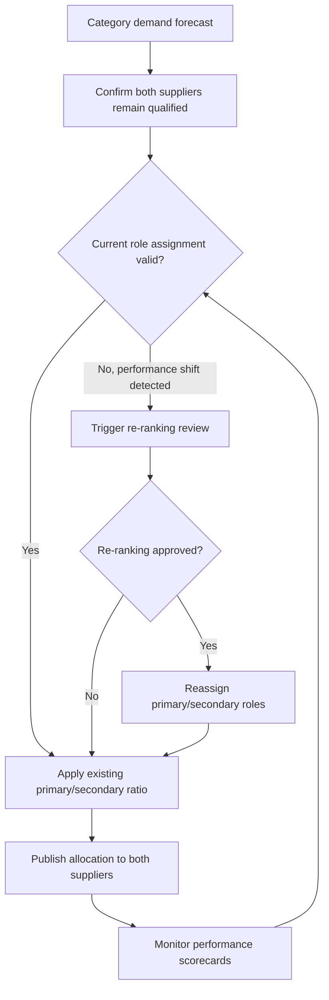

## Primary and Secondary Supplier Allocation Models

### Definition and Scope

A primary/secondary allocation model is a dual-sourcing structure in which one supplier is designated the primary source and carries the majority of demand under normal conditions, while a second qualified supplier is designated secondary and carries a smaller, explicitly defined share. This differs from a fully balanced dual-source arrangement (e.g., 50/50) in that the roles are asymmetric by design, not merely as a temporary or transitional state.

The model formalizes an intentional hierarchy: the primary supplier is optimized for cost, scale, and depth of relationship; the secondary supplier is optimized for risk mitigation, competitive tension, and surge capability.

### Strategic Rationale

**Key Points**

- Preserves most of the economies-of-scale benefit of concentrated volume while retaining a live, qualified alternative.
- Keeps the secondary supplier commercially engaged (unlike a pure contingency/standby arrangement) so their capability doesn't atrophy.
- Creates ongoing competitive benchmarking — the primary supplier knows a functioning alternative exists and is currently shipping product.
- Provides a faster surge path than cold or warm standby contingency sourcing, since the secondary is already in live production.

### Common Allocation Structures

#### Fixed Majority/Minority Split

A static ratio (e.g., 80/20, 75/25, 70/30) held for the duration of a contract term. The primary supplier receives a guaranteed majority; the secondary receives a guaranteed floor sufficient to remain commercially viable (see Minimum Viable Volume in split-sourcing analysis).

- Best suited for: mature categories with stable demand and established, well-understood suppliers.

#### Role-Based Allocation

Allocation is tied not to a fixed percentage but to product/SKU segmentation:

- Primary supplier handles high-volume, standard SKUs.
- Secondary supplier handles low-volume, specialty, or new-product-introduction (NPI) SKUs, building capability and relationship depth before earning increased allocation.

This lets the secondary supplier prove performance on a contained scope before the organization increases its share of critical volume.

#### Graduated/Escalator Allocation

The secondary supplier's share increases over time on a pre-agreed schedule, contingent on meeting performance milestones (quality, delivery, cost-down commitments). This is common when a secondary source is newly qualified and the organization wants a controlled ramp rather than an immediate large commitment.

$$A_{secondary}(t) = A_0 + \sum_{k=1}^{t} \Delta_k \cdot \mathbb{1}[\text{milestone}_k \text{ met}]$$

Where $A_0$ is the initial allocation, and each $\Delta_k$ increment is released only if the corresponding performance milestone is met.

#### Geographic/Plant-Based Primary-Secondary

The primary supplier serves the buyer's main production region; a secondary supplier — often geographically closer to a specific plant or market — serves that subset, effectively acting as "secondary" in aggregate volume but "primary" for a defined local scope.

### Determining Which Supplier Is Primary

| Factor | Typically Favors Primary Designation |
| --- | --- |
| Unit cost competitiveness | Lower cost at required quality/volume |
| Production capacity headroom | Ability to absorb full baseline demand plus reasonable growth |
| Track record / tenure | Longer history of consistent performance |
| Process/technology maturity | More mature, proven manufacturing process for the part |
| Geographic proximity to primary demand center | Shorter lead time, lower logistics cost/risk |
| Financial stability | Lower risk of disruption from the supplier's own financial distress |

[Inference] In many categories, the primary designation reflects the supplier's position at the time dual sourcing was established rather than a re-optimized decision — meaning periodic re-evaluation of which supplier *should* hold primary status is often warranted but frequently skipped.

### Primary vs. Secondary: Typical Treatment Differences

| Dimension | Primary Supplier | Secondary Supplier |
| --- | --- | --- |
| Volume share | Majority (typically 60–90%) | Minority (typically 10–40%) |
| Forecast visibility | Full rolling forecast | Often abbreviated or delayed forecast |
| New product introduction priority | First engagement | Second engagement, or specific NPI carve-out |
| Cost-down expectations | Standard annual cost-down targets | May have relaxed targets to preserve viability |
| Escalation/support priority | Full engineering and quality support | Support commensurate with volume, or contractually guaranteed minimum |
| Contractual volume commitment | Higher minimum volume guarantee | Lower, but still non-zero, minimum to preserve engagement |

### Role Reversal and Re-Ranking

A well-governed primary/secondary model includes a mechanism for the roles to swap if performance or market conditions shift materially — otherwise the "secondary" label becomes a permanent ceiling regardless of merit, which undermines the competitive tension the model is meant to create.

**Example**

A secondary supplier consistently outperforms the primary on quality and delivery for three consecutive quarters, and closes the unit-cost gap through their own process improvements. A pre-agreed re-ranking clause allows the buyer to formally reclassify the roles — increasing the outperforming supplier's allocation toward majority share and demoting the underperformer to secondary — without requiring a full contract renegotiation or new supplier qualification cycle.

### Allocation Decision Flow

### Governance Cadence

**Key Points**

- **Quarterly**: scorecard review to confirm current roles remain justified.
- **Annually**: formal strategic review of whether the primary/secondary structure itself (versus a balanced split or contingency-only model) remains the right approach for the category.
- **Event-driven**: immediate review upon any trigger event as defined in the contingency-sourcing framework, since a disruption at the primary may necessitate a temporary or permanent role shift.

### Common Pitfalls

- Allocating the secondary supplier so little volume that they lack incentive to invest in quality or capacity improvements, defeating the purpose of maintaining them as a live secondary rather than pure standby.
- No re-ranking mechanism, allowing an underperforming primary to retain majority share indefinitely through inertia.
- Underinvesting in the secondary supplier's engineering/NPI relationship, so that if the primary fails, the secondary lacks the technical depth to absorb full volume quickly.
- Treating the primary/secondary designation as purely historical rather than an active, periodically re-justified strategic choice.
- Failing to communicate the allocation rationale transparently to both suppliers, creating relationship friction or perceived favoritism disputes.

### Related Topics

- Split Sourcing and Volume Allocation Ratios
- Contingency Sourcing and Activation Triggers
- Supplier Scorecards and KPI Weighting Methodologies
- Supplier Qualification and Second-Source Approval Processes
- New Product Introduction (NPI) Sourcing Strategy
- Total Cost of Ownership (TCO) in Multi-Supplier Sourcing
- Kraljic Matrix and Sourcing Risk Segmentation