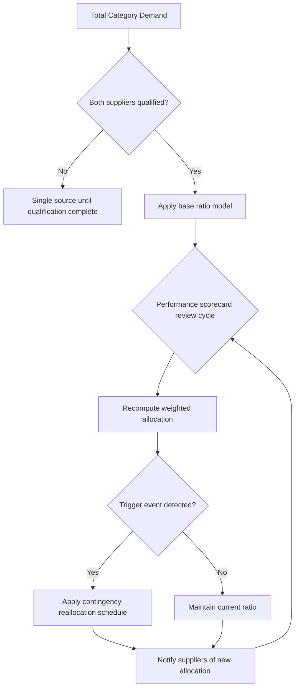

## Split Sourcing and Volume Allocation Ratios

### Definition and Scope

Split sourcing is the deliberate practice of dividing purchase volume for a given part, commodity, or category across two or more qualified suppliers rather than concentrating it with a single source. The volume allocation ratio is the specific percentage split assigned to each supplier (e.g., 70/30, 60/40, 50/50), and it is the primary lever a buying organization uses to manage risk, cost, and supplier behavior simultaneously.

Split sourcing is the operational mechanism through which dual (or multi) sourcing strategy is executed. Dual sourcing defines *that* two suppliers will be used; split sourcing and its ratios define *how much* each supplier receives and *why*.

### Why Allocation Ratios Matter

**Key Points**

- Ratios are not static; they are a dynamic control variable that should be re-evaluated on a defined cadence (quarterly, semi-annually, or upon trigger events).
- The ratio signals relative strategic priority to each supplier — an uneven split communicates preference without eliminating competitive tension entirely.
- Ratios directly affect each supplier's economies of scale, which affects their unit cost, which cycles back into future negotiations.
- Ratios are the mechanism for de-risking single-source dependency while retaining most of the cost benefits of concentrated volume.

### Common Allocation Ratio Models

#### Fixed Ratio Allocation

A static split (e.g., 70/30) held constant for a contract period regardless of short-term performance fluctuations. This provides suppliers with predictable demand signals for their own capacity and investment planning.

- Best suited for: stable demand categories, long lead-time capital components, or relationships still building trust/history.
- Trade-off: reduces the organization's ability to reward or penalize performance in near-real-time.

#### Performance-Weighted (Dynamic) Allocation

The ratio shifts periodically based on a scorecard of supplier KPIs — typically on-time delivery, quality (PPM/defect rate), cost competitiveness, and responsiveness.

$$A_i = \frac{S_i}{\sum_{j=1}^{n} S_j} \times V_{total}$$

Where $A_i$ is the allocated volume to supplier $i$, $S_i$ is supplier $i$'s composite performance score, and $V_{total}$ is total category demand.

- Best suited for: categories where suppliers are truly interchangeable (qualified, homogenous output) and performance differentiation is meaningful and measurable.
- [Inference] Overly frequent ratio changes (e.g., monthly) can undermine supplier planning stability and may be counterproductive versus a quarterly or semi-annual cadence.

#### Threshold/Trigger-Based Allocation

A base ratio (e.g., 80/20) holds until a defined trigger event fires — a quality escape, a delivery failure exceeding an agreed threshold, a force majeure event, or a capacity shortfall — at which point volume shifts toward the secondary source according to a pre-agreed contingency schedule.

- Requires the secondary supplier to maintain "warm" or "hot" standby capacity (see Capacity Reservation below).
- Trigger definitions must be unambiguous and contractually codified to avoid disputes at the moment they're needed most.

#### Geographic/Regional Split

Volume divided by region to serve local markets, hedge currency exposure, reduce logistics lead time, or comply with local-content regulations (e.g., 60% APAC supplier for APAC-bound demand, 40% EU supplier for EU-bound demand).

### Determining the Right Ratio: Key Inputs

| Factor | Influence on Ratio |
| --- | --- |
| Supplier capacity ceiling | Sets the mathematical upper bound of what can be allocated |
| Switching/qualification cost | High switching costs favor a more concentrated (uneven) split |
| Criticality of the part/commodity | Higher criticality favors a more balanced split to reduce single-point-of-failure risk |
| Cost differential between suppliers | Larger gaps favor skewing toward the lower-cost source, tempered by risk tolerance |
| Supplier's minimum viable volume | Splits too thin can make the category commercially unattractive to a supplier, degrading their service priority |
| Geopolitical/tariff exposure | May force a floor allocation to a secondary region regardless of cost |
| Contractual MOQ/MOV commitments | Constrains how far a ratio can be adjusted without breaching existing commitments |

### The "Minimum Viable Volume" Constraint

A frequently underestimated risk: allocating too small a share to a secondary supplier can backfire. If the secondary supplier's volume falls below their internal threshold for profitability or strategic interest, they may:

- Deprioritize the account during capacity constraints (the opposite of the intended risk mitigation)
- Decline to invest in tooling, capacity, or process improvements for the account
- Exit the relationship at contract renewal

**Example**

A buyer splits a component 90/10 between Supplier A and Supplier B to "maintain dual sourcing." Supplier B's 10% share doesn't cover their fixed qualification and tooling amortization. When a regional disruption hits Supplier A, Supplier B — never having invested in scaled capacity for this low-priority account — cannot absorb the surge volume. The dual-sourcing strategy fails at the exact moment it was designed to protect the buyer. A more defensible split might have been 75/25 or 70/30, with a contractual minimum guaranteed volume to Supplier B sufficient to justify their continued investment.

### Capacity Reservation and Option Contracts

To make threshold-based reallocation actually executable, buyers often pair split sourcing with:

- **Capacity reservation fees**: a retainer paid to the secondary supplier to hold surge capacity, even if unused.
- **Option-to-call contracts**: the buyer pays for the *right* to shift volume up to a defined ceiling within a defined notice period, without obligating the volume upfront.
- **Take-or-pay minimums**: guarantees a floor volume/revenue to the secondary supplier in exchange for their standby readiness.

[Inference] The cost of maintaining true surge-ready secondary capacity is often the single largest hidden cost of a dual-sourcing program, and is frequently underbudgeted relative to the perceived "insurance" value it provides.

### Modeling the Allocation Decision

### Governance Cadence

**Key Points**

- **Quarterly Business Reviews (QBRs)**: standard checkpoint for reviewing scorecards and confirming or adjusting ratios.
- **Trigger monitoring**: continuous (real-time or weekly) tracking of trigger-event conditions (OTIF, defect rate, capacity utilization) independent of the QBR cycle.
- **Annual strategic review**: reassessment of whether the category still warrants dual sourcing at all, or whether market conditions justify returning to single-source or moving to a third qualified supplier.

### Common Pitfalls

- Setting ratios once at contract signing and never revisiting them as market or performance conditions change.
- Failing to contractually define what "trigger event" means, leading to disputes precisely when reallocation is most urgent.
- Ignoring the secondary supplier's minimum viable volume, causing latent capacity risk.
- Treating the ratio purely as a cost-optimization lever while ignoring the qualification, tooling, and relationship-maintenance costs of keeping a secondary source active.
- Allowing procurement-system ratios (ERP allocation rules) to drift out of sync with the commercially agreed ratio, creating silent execution errors.

### Related Topics

- Supplier Qualification and Dual-Source Approval Processes
- Total Cost of Ownership (TCO) in Multi-Supplier Sourcing
- Supplier Scorecards and KPI Weighting Methodologies
- Contract Structures for Option-to-Call and Take-or-Pay Volume
- Risk Segmentation Models (Kraljic Matrix) for Sourcing Strategy Selection
- Supply Chain Resilience and Business Continuity Planning
- Second-Source Qualification Timelines and Cost Amortization