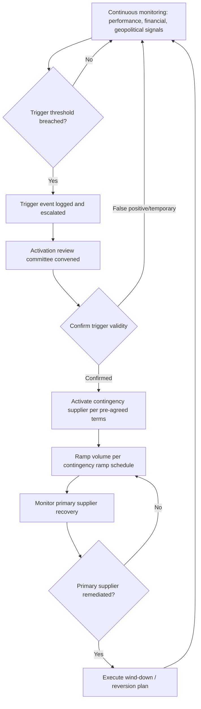

## Contingency Sourcing and Activation Triggers

### Definition and Scope

Contingency sourcing is the pre-arranged capability to shift purchase volume to a secondary or backup supplier in response to a disruption at the primary source, without incurring the full lead time of an unplanned qualification-from-scratch process. An activation trigger is the specific, pre-defined condition or event whose occurrence authorizes and initiates that shift.

Contingency sourcing differs from routine split sourcing in intent: split sourcing runs continuously as a steady-state allocation strategy, whereas contingency sourcing is a dormant or low-volume backup relationship that activates (or scales up) only when a defined trigger fires.

### Core Components of a Contingency Sourcing Program

**Key Points**

- A pre-qualified secondary supplier (or a "warm" qualification status short of full production release).
- A documented set of activation triggers with unambiguous, measurable thresholds.
- A pre-negotiated activation mechanism (pricing, lead time, minimum order commitments) that avoids renegotiating terms under crisis pressure.
- A communication and decision-rights protocol defining who can declare a trigger event and authorize activation.
- A de-activation or wind-down plan for reverting to the primary supplier once the disruption resolves.

### Readiness Tiers

Contingency suppliers are typically maintained at one of several readiness levels, each with a different cost/speed trade-off.

| Tier | Description | Typical Activation Lead Time | Ongoing Cost |
| --- | --- | --- | --- |
| Cold standby | Supplier is qualified on paper but produces no parts; tooling may not exist | Months | Lowest |
| Warm standby | Supplier holds approved PPAP/FAI status and periodic trial runs; tooling exists but idle | Weeks | Moderate |
| Hot standby | Supplier runs low-rate production continuously (effectively split sourcing at a small ratio) | Days | Highest |

[Inference] The choice of tier is generally a function of the part's criticality and the primary supplier's disruption probability — highly critical, high-risk-of-disruption parts justify hot standby despite the carrying cost, while lower-criticality parts are adequately served by cold or warm standby.

### Categories of Activation Triggers

#### Performance-Based Triggers

Quantitative breaches of agreed service levels, typically defined in the supplier agreement or SLA:

- On-time-in-full (OTIF) falling below an agreed threshold over a rolling window (e.g., below 90% over 3 consecutive months).
- Defect/PPM rate exceeding an agreed ceiling.
- Repeated corrective-action failures (CAPA non-closure within agreed timelines).

#### Capacity-Based Triggers

- Primary supplier communicates a capacity shortfall or allocation constraint.
- Order backlog or lead-time inflation beyond an agreed multiple of standard lead time.

#### Financial Health Triggers

- Adverse changes in credit rating, D&B risk score, or financial-health monitoring service alerts.
- Public news of restructuring, bankruptcy filing, or covenant breach.
- [Unverified] Some organizations use payment-behavior signals (e.g., a supplier's own payables stretching to their sub-tier suppliers) as an early-warning proxy, though this depends on visibility that isn't always available.

#### Force Majeure / External Shock Triggers

- Natural disasters affecting the supplier's facility or region.
- Geopolitical events: sanctions, export controls, sudden tariff changes, conflict.
- Pandemic-related shutdowns or logistics disruptions.
- Single-point infrastructure failure (fire, cyberattack, power grid failure) at the primary site.

#### Quality/Compliance Triggers

- Failed regulatory or customer audit.
- Product recall or field failure traced to the supplier.
- Loss of a required certification (e.g., ISO 9001, IATF 16949, AS9100).

#### Strategic/Relationship Triggers

- Contract non-renewal notice from either party.
- Irreconcilable commercial dispute.
- Change of ownership at the supplier introducing strategic misalignment (e.g., acquisition by a competitor).

### Defining Triggers Without Ambiguity

A trigger is only useful if it is unambiguous enough to act on under pressure. Weak trigger definitions are a leading cause of contingency programs failing exactly when needed.

**Example**

- Weak: "Significant delivery delays will result in activation of the backup supplier."
- Strong: "If OTIF falls below 92% for two consecutive calendar months, as measured by [specific ERP/report source], the category manager will convene the activation review within 5 business days."

Strong trigger definitions specify: the metric, the measurement source, the threshold, the time window, the decision-maker, and the response-time SLA for the activation decision itself.

### Activation Decision Workflow

### Governance and Decision Rights

**Key Points**

- Activation authority should be assigned explicitly (e.g., category manager can activate up to a defined volume/dollar threshold; above that requires sourcing director or VP sign-off).
- A standing cross-functional activation committee (procurement, quality, operations, legal) shortens response time versus ad hoc assembly during a live disruption.
- Pre-approved activation communication templates (to the secondary supplier, to internal stakeholders, to customers if downstream impact is possible) reduce delay.

### Contractual Mechanisms Supporting Activation

- **Standby/reservation fees**: compensate the secondary supplier for maintaining readiness, independent of volume ordered.
- **Pre-agreed activation pricing**: locks in unit pricing for contingency volume in advance, avoiding opportunistic pricing during a crisis.
- **Ramp-up service levels**: contractually specifies how quickly the secondary supplier must scale from standby to a defined volume ceiling (e.g., 50% of required volume within 10 business days).
- **Data and IP escrow or transfer clauses**: ensures the secondary supplier has access to necessary specs, drawings, or process documentation ahead of time, not negotiated mid-crisis.

### Testing and Validating Contingency Readiness

A contingency plan that has never been exercised carries significant hidden execution risk. Common validation practices:

- Periodic trial orders or low-rate production runs at the contingency supplier (validates the "warm standby" tier stays current).
- Tabletop exercises simulating a trigger event and walking the decision workflow without actually shifting volume.
- Annual or semi-annual re-certification of the contingency supplier's qualification status (PPAP/FAI currency).

[Inference] Organizations that periodically test activation (rather than treating it as a static document) generally experience shorter real-world activation lead times, since the decision workflow and supplier readiness have already been exercised rather than assumed.

### Common Pitfalls

- Triggers defined so vaguely that activation becomes a political negotiation rather than a mechanical decision.
- No designated decision-maker, causing delay while stakeholders debate authority during an active disruption.
- Contingency supplier's qualification allowed to lapse (stale PPAP, outdated tooling) so "readiness" exists only on paper.
- No pre-agreed pricing, forcing rushed commercial negotiation at the worst possible time.
- Treating contingency sourcing as a one-time setup exercise rather than a program requiring ongoing maintenance and testing.
- Failing to define a reversion/de-activation plan, leaving the organization unsure when or how to return to the primary supplier.

### Related Topics

- Split Sourcing and Volume Allocation Ratios
- Supplier Risk Monitoring and Early-Warning Systems
- PPAP/FAI and Warm Qualification Maintenance
- Business Continuity Planning in Supply Chain
- Force Majeure Clauses in Supplier Contracts
- Supplier Financial Health Scoring Methodologies
- Crisis Response Governance and Decision-Rights Frameworks