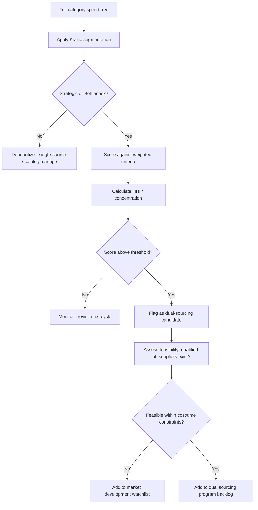

## Identifying Candidate Categories for Dual Sourcing

### Overview

Identifying candidate categories is the analytical gateway to a dual sourcing program. Not every spend category benefits from a second supplier — dual sourcing carries real costs (qualification, tooling duplication, reduced volume leverage, coordination overhead), so the goal is to systematically screen the category tree and surface those where risk exposure or strategic value outweighs those costs.

### Why Category Screening Matters

**Key Points**

- Dual sourcing every category indiscriminately destroys the volume consolidation benefits that single-sourcing provides (price breaks, preferred terms, supplier investment in the relationship).
- Under-sourcing critical categories exposes the business to single point of failure risk: one plant fire, one geopolitical event, one supplier bankruptcy can halt production.
- The screening exercise converts an intuitive "this feels risky" judgment into a defensible, repeatable, auditable methodology — important for procurement governance and for justifying budget to finance/leadership.

### Primary Screening Framework: Risk-Spend (Kraljic) Matrix

The Kraljic Portfolio Matrix remains the standard starting lens for category segmentation. It plots categories along two axes:

1. **Supply Risk** (availability, number of suppliers, switching cost, geographic concentration, lead time volatility)
2. **Profit/Business Impact** (spend volume, effect on product quality, contribution to differentiation)

```mermaid
quadrantChart
    title Kraljic Matrix - Dual Sourcing Candidate Screening
    x-axis Low Supply Risk --> High Supply Risk
    y-axis Low Business Impact --> High Business Impact
    quadrant-1 Strategic (Prime dual-sourcing candidates)
    quadrant-2 Bottleneck (Dual-source for continuity)
    quadrant-3 Non-critical (Single-source, low priority)
    quadrant-4 Leverage (Single-source, negotiate hard)
    Custom ASICs: [0.8, 0.85]
    Sole-source Connectors: [0.75, 0.35]
    Commodity Fasteners: [0.2, 0.15]
    Bulk Packaging: [0.25, 0.7]
```

- **Strategic items** (high risk, high impact) — top dual sourcing candidates. Both continuity and negotiating leverage justify the qualification cost.
- **Bottleneck items** (high risk, low impact) — often single-supplier by nature (niche process, IP-protected, low volume). Dual sourcing here is about *risk mitigation*, not cost, so the business case must be framed around availability rather than savings.
- **Leverage items** (low risk, high impact) — usually already competitive markets with many suppliers; dual sourcing may already exist informally, or the category may not need formal dual sourcing since switching is cheap.
- **Non-critical items** (low risk, low impact) — rarely worth the qualification overhead of a second source; manage via catalog/PO automation instead.

### Quantitative Screening Criteria

Each candidate category should be scored against a structured criteria set rather than judged qualitatively. A common weighted scorecard:

| Criterion | What It Measures | Typical Weight |
| --- | --- | --- |
| Annual spend | Absolute exposure | 15–20% |
| Supplier concentration (HHI or % from top supplier) | Dependency risk | 15–20% |
| Lead time / substitutability | Time to recover from disruption | 10–15% |
| Switching cost / qualification complexity | Feasibility of adding a source | 10–15% |
| Product/quality criticality | Impact of a defect or outage on end product | 15–20% |
| Geopolitical/geographic concentration | Exposure to regional shocks (tariffs, natural disaster, export controls) | 10–15% |
| Price volatility | Exposure to commodity or FX swings | 5–10% |
| Supplier financial health | Bankruptcy/insolvency risk | 5–10% |

**Supplier Concentration — Herfindahl-Hirschman Index (HHI)**

A standard way to quantify how concentrated a category's supply base is:

$$HHI=\sum_{i=1}^{n}s_i^2$$

where $s_i$ is supplier $i$'s share (as a percentage, 0–100) of category spend. An HHI above roughly 2,500 signals a highly concentrated (single-source-dominated) category and is a strong dual sourcing signal; below ~1,500 the category is already fragmented and additional sourcing effort may be unnecessary.

**Example**

A connector category with one supplier at 90% share and a backup at 10% share:

$$HHI=90^2+10^2=8100+100=8200$$

This is heavily concentrated — a strong candidate for formal dual sourcing versus, say, a fastener category split 30/25/25/20 across four suppliers ($HHI=30^2+25^2+25^2+20^2=2650$), which is only moderately concentrated.

### Qualitative Risk Signals to Flag

**Key Points**

- Single facility risk: supplier manufactures the item at only one plant, regardless of how many "suppliers" are on paper (shell distributors of the same OEM part don't count as diversification).
- Sole-source by design: parts requiring supplier-owned tooling, custom molds, or proprietary processes where switching requires long requalification.
- Regulatory/compliance exposure: categories subject to export controls (e.g., ITAR, EAR), conflict minerals reporting, or industry-specific certifications (AS9100, IATF 16949) that limit the qualified supplier pool.
- Geographic concentration: category sourced predominantly from a single country or region exposed to tariff changes, port congestion, or political instability. [Inference] — the specific regions of concern shift over time with trade policy, so this should be re-evaluated on a recurring cadence rather than treated as a static list.
- History of disruption: categories with a documented track record of late deliveries, quality escapes, or capacity constraints in the last 12–24 months.
- Demand growth trajectory: categories where forecasted volume growth would strain a single supplier's capacity.

### Screening Process Workflow



### Prioritization Output

Once scored, categories are typically stack-ranked into a prioritization matrix:

**Output**

| Category | Spend ($M) | HHI | Risk Score (1–10) | Feasibility | Priority |
| --- | --- | --- | --- | --- | --- |
| Custom ASIC | 42 | 8,900 | 9 | Low (long qual cycle) | Tier 1 — long-term |
| Precision Connector | 18 | 8,200 | 8 | Medium | Tier 1 — near-term |
| Molded Enclosure | 12 | 6,100 | 6 | High | Tier 2 |
| Standard Fastener | 3 | 2,650 | 3 | High | Tier 3 — monitor |

- **Tier 1** categories enter the dual sourcing program immediately (see chapter on supplier identification/qualification).
- **Tier 2** categories are scheduled for the next planning cycle.
- **Tier 3** categories are logged and revisited annually or upon a triggering event (single-source supplier issue, spend growth, M&A).

### Common Pitfalls

**Key Points**

- Screening only by spend and ignoring supply risk — high-spend, low-risk leverage categories often don't need dual sourcing at all.
- Treating "two suppliers on the vendor master" as diversification when both draw from the same upstream sub-tier or raw material source (sub-tier mapping is necessary to validate true independence).
- Ignoring feasibility: flagging a category as a candidate without confirming that qualified alternate suppliers actually exist in the market is a common planning failure. [Inference] — feasibility gaps are especially common in highly specialized or IP-constrained categories.
- Static, one-time screening: category risk profiles shift with demand, geopolitics, and supplier financial health, so this should be a recurring (typically annual, or event-triggered) exercise rather than a one-off project.

### Related Topics

- Total Cost of Ownership (TCO) Modeling for Dual Sourcing Decisions
- Supplier Qualification and Onboarding for Alternate Sources
- Sub-Tier Supply Chain Mapping and Visibility
- Volume Allocation Strategies Between Primary and Secondary Suppliers
- Building the Business Case: Dual Sourcing Cost-Benefit Analysis
- Supply Risk Monitoring and Early Warning Systems