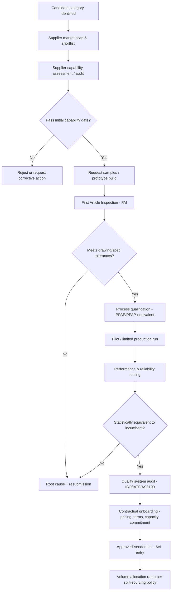
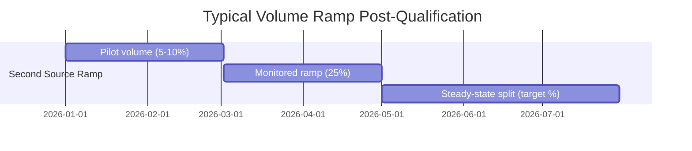

## Second Source Qualification Process

### Overview

Second source qualification is the structured process of vetting, testing, and approving an alternate supplier to produce a part, material, or service that is functionally and quality-equivalent to the incumbent (first) source. Unlike qualifying a brand-new supplier in isolation, second source qualification carries the added burden of proving *equivalence* — the output must be interchangeable with the existing supply without disrupting downstream manufacturing, regulatory status, or customer specifications.

### Objectives of the Qualification Process

**Key Points**

- Confirm the candidate supplier can consistently meet the same specification, tolerance, and performance requirements as the incumbent.
- Establish documented, auditable evidence that the second source is equivalent — critical for regulated industries (aerospace, medical device, automotive) where change control and traceability are audited.
- Determine whether the second source requires part number differentiation (form-fit-function equivalent but not identical) or is a true drop-in replacement.
- Build the operational, quality, and contractual infrastructure needed to allow volume to flow to either supplier without re-qualification friction each time.

### Qualification Process Workflow

### Stage 1: Supplier Capability Assessment

Before any physical samples are exchanged, the candidate undergoes a paper and on-site (or virtual) capability review:

- **Technical capability**: process technology, equipment list, tooling capacity, engineering support depth.
- **Quality system maturity**: certifications held (ISO 9001, IATF 16949, AS9100, ISO 13485 as applicable), internal defect rate (PPM) history, CAPA (Corrective and Preventive Action) process maturity.
- **Financial stability**: D&B or equivalent credit rating, days of cash on hand, ownership structure — relevant because a second source that fails financially defeats the purpose of dual sourcing.
- **Capacity headroom**: confirmed available capacity to take on allocated volume without becoming a new bottleneck itself.
- **Compliance posture**: conflict minerals (3TG) reporting, REACH/RoHS compliance, export control classification, and any industry-specific regulatory requirements.

A weighted scorecard is typically used to gate suppliers before investing in sample and tooling costs:

| Dimension | Weight | Example Threshold to Proceed |
| --- | --- | --- |
| Quality system certification | 20% | Must hold or be actively pursuing required cert |
| Technical/process fit | 25% | Equipment matches or exceeds spec requirements |
| Capacity availability | 15% | ≥ allocated volume + buffer |
| Financial health | 15% | Above minimum credit threshold |
| Compliance/regulatory | 15% | No open violations |
| Cost competitiveness | 10% | Within target cost corridor |

### Stage 2: First Article Inspection (FAI)

FAI verifies that a single representative unit produced by the candidate supplier conforms to all drawing and specification requirements before committing to a production run.

- Typically follows **AS9102** (aerospace) or an equivalent internal FAI standard for non-aerospace industries.
- Every characteristic on the engineering drawing (dimensional, material, finish, performance) is measured and recorded against tolerance, producing a **Ballooned Drawing** and **FAI Report**.
- Dimensional variance is commonly summarized using process capability indices once enough units are available:

$$C_{pk}=\min\left(\frac{USL-\bar{x}}{3\sigma},\frac{\bar{x}-LSL}{3\sigma}\right)$$

A $C_{pk}\geq1.33$ is a common minimum acceptance threshold for critical characteristics, though thresholds vary by industry and criticality classification. [Inference] — the specific threshold (1.33, 1.67, etc.) should be set per the organization's quality policy and the characteristic's criticality tier rather than assumed universal.

### Stage 3: Process Qualification (PPAP or Equivalent)

For manufactured parts, **Production Part Approval Process (PPAP)** — an AIAG-originated automotive standard now widely adopted across industries — formalizes proof that the supplier's *production* process (not just a hand-built sample) can repeatably meet requirements.

Standard PPAP elements adapted for second-source qualification:

1. Design records and engineering change documentation
2. Process flow diagram
3. Process FMEA (Failure Mode and Effects Analysis)
4. Control plan
5. Measurement System Analysis (MSA / Gage R&R)
6. Dimensional results (FAI data)
7. Material and performance test results
8. Initial process studies (capability data, $C_{pk}$)
9. Qualified laboratory documentation
10. Sample production parts
11. Master sample retention
12. Checking aids/fixtures
13. Part Submission Warrant (PSW) — the formal sign-off document

**Example**

A dual-sourced PCB connector: the second source submits a full PPAP package after producing 300 units on production tooling. Quality engineering runs Gage R&R on the critical pin-spacing dimension, confirms $C_{pk}=1.51$ across the sample, and cross-references results against the incumbent supplier's historical capability data before approving the PSW.

### Stage 4: Pilot Run and Performance Testing

Before full AVL (Approved Vendor List) entry, a limited pilot run validates real-world performance:

- **Functional/reliability testing**: environmental stress screening, accelerated life testing, or application-specific performance tests matched to the incumbent's original qualification protocol.
- **Statistical equivalence testing**: comparing the second source's output distribution to the incumbent's using methods such as two-sample t-tests or equivalence (TOST) testing on key characteristics, rather than relying solely on pass/fail inspection.
- **Field/pilot deployment**: for critical parts, a limited-quantity pilot in actual production or field use, with heightened monitoring, before unrestricted volume release.

### Stage 5: Quality System and Compliance Audit

Independent of part-level qualification, the supplier's quality management system is audited to the relevant standard (ISO 9001 baseline; IATF 16949 for automotive; AS9100 for aerospace; ISO 13485 for medical devices). This is typically a prerequisite gate rather than a parallel step — many organizations require QMS certification *before* accepting PPAP submissions for regulated categories.

### Stage 6: Contractual and Systems Onboarding

**Key Points**

- Commercial terms negotiated: pricing tiers, minimum order quantities, capacity reservation/commitment levels, lead time SLAs, and quality/delivery performance clauses.
- ERP/MRP system setup: second source added as an approved supplier record, sourced part numbers cross-referenced (especially if the second source requires an alternate part number due to minor form-fit-function differences).
- Change control agreement: process for how future engineering changes will be propagated to both sources simultaneously to prevent divergence over time.
- Ongoing monitoring plan defined: incoming inspection sampling plan (often reduced-frequency skip-lot sampling once trust is established), scorecard cadence, and re-qualification triggers (e.g., process change, facility relocation, subcontracting to a new sub-tier).

### AVL Entry and Volume Ramp

Once approved, the second source enters the **Approved Vendor List (AVL)**, and volume allocation typically ramps gradually rather than shifting abruptly:

- Ramp pacing allows quality and delivery performance to be validated at increasing volume before full reliance.
- Steady-state allocation split (e.g., 70/30, 60/40) is set per the category's dual sourcing strategy — see related topic on volume allocation.

### Common Pitfalls

**Key Points**

- Treating sample approval as sufficient without production-process qualification (PPAP) — a hand-built sample can pass inspection while the production process cannot repeatably hold tolerance.
- Skipping statistical equivalence testing and relying only on the second source's own inspection reports rather than independent verification.
- Failing to define a re-qualification trigger policy, allowing supplier process drift to go undetected after initial approval.
- Under-resourcing the qualification timeline — rushing FAI/PPAP stages on critical parts increases the risk of field failures traceable back to inadequate second-source validation. [Inference] — typical qualification timelines vary widely (weeks for simple commodity items to 12+ months for complex regulated parts), so duration should be scoped per category complexity rather than assumed fixed.

### Related Topics

- Volume Allocation Strategies Between Primary and Secondary Suppliers
- Production Part Approval Process (PPAP) Deep Dive
- Supplier Scorecarding and Ongoing Performance Monitoring
- Engineering Change Management Across Dual Sources
- Approved Vendor List (AVL) Governance and Maintenance
- Total Cost of Ownership (TCO) Modeling for Dual Sourcing Decisions