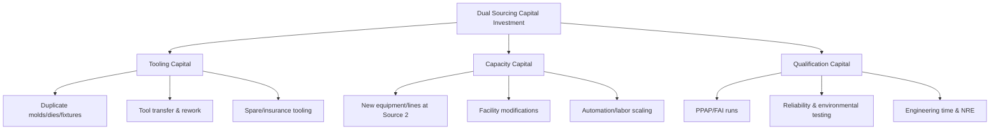

## Tooling, Capital, and Capacity Planning Across Sources

<syllabot_broad_topic/>

### Overview

Tooling, capital, and capacity planning is the operational core of any dual sourcing program. Once a category strategy identifies two or more qualified suppliers, the program's viability depends on how production assets (tools, molds, dies, fixtures, test equipment), capital investment, and manufacturing capacity are allocated, sequenced, and governed across those sources. Poor planning in this domain is the single most common cause of dual sourcing programs failing to deliver their intended resilience — a "dual source" that exists only on paper because the second supplier's tooling was never qualified to full-rate production, or because capacity was never contractually reserved, provides no real protection against disruption.

This topic covers four interlocking domains: (1) tooling strategy and ownership models, (2) capital allocation and investment recovery mechanics, (3) capacity modeling and reservation mechanisms, and (4) the governance processes that keep tooling/capital/capacity decisions synchronized with the broader dual sourcing objective.

---

### 1. Tooling Strategy Across Multiple Sources

**Key Points**

- Tooling refers to the dedicated production assets required to manufacture a specific part: injection molds, stamping dies, jigs and fixtures, gauges, test fixtures, cutting tools, casting dies, and specialized assembly equipment.
- In a dual sourcing context, the central question is whether each supplier gets its **own dedicated tool set** or whether a **single tool set is transferred/shared** between suppliers.

#### 1.1 Tooling Models

| Model | Description | When Used | Trade-offs |
| --- | --- | --- | --- |
| **Duplicate tooling** | Each supplier has an independent, fully built tool set | High-volume parts, geographically distant suppliers, strategic risk categories | Highest capital cost; eliminates transfer downtime; parallel capacity from day one |
| **Master + clone tooling** | One "master" tool is built and fully validated first; clone tools are built off the master's data package | Precision parts where tool-to-tool variation must be minimized | Requires tight tolerance control on tool duplication; clone qualification (see below) still required |
| **Transferable/shared tooling** | A single tool set is physically moved between suppliers as needed | Low-volume or intermittent-demand parts; early-stage dual sourcing pilots | No parallel capacity (defeats the primary resilience purpose during transfer windows); transfer/logistics downtime (typically 2–8 weeks depending on complexity) |
| **Soft-tooled second source** | Second supplier uses lower-cost tooling (e.g., 3D-printed inserts, aluminum vs. hardened steel tools) for qualification/low-volume backup only | Bridge strategy while hard tooling is built; low-volume surge protection | Lower tool life (often 10K–50K shots vs. 500K+ for production steel tooling); not suitable as true full-rate backup |

[Inference] The choice between these models is typically driven by a cost-risk trade-off: duplicate tooling can add 60–120% of the original tool cost but removes transfer lead time as a failure mode; this ratio varies significantly by part complexity and tooling technology.

#### 1.2 Tool Ownership and IP Control

Tooling ownership is a contractual decision with direct bearing on dual sourcing agility:

- **Buyer-owned tooling (BOT):** The OEM/buyer owns the tool, typically tagged and asset-tracked, and can direct its movement between suppliers without renegotiation. This is the standard model for enabling supplier switching in dual sourcing.
- **Supplier-owned tooling:** The supplier owns and amortizes the tool into piece price. This creates switching friction — moving to a second source requires either buying out the tool or fully duplicating it, and the incumbent supplier has leverage during a dispute.
- **Buyer-funded, supplier-held:** A hybrid where the buyer pays for the tool but it resides at the supplier's site under a bailment agreement; ownership and right-of-removal are documented separately from possession.

**Contractual essentials for dual sourcing tooling clauses:**

- Explicit buyer ownership and right to relocate tooling to any qualified supplier
- Tool tagging/serialization requirements for audit
- Maintenance and preventive-maintenance (PM) obligations, often with defined tool-life metrics (shots-to-refurbishment)
- Data package ownership (CAD, process sheets, PPAP/APQP documentation) — required for clone tooling and for building at a third location if both primary sources fail
- Tool insurance and liability allocation

#### 1.3 Tool Qualification for Secondary Sources

A tool is not interchangeable simply because it was built from the same CAD data. Tool-to-tool and site-to-site variation must be validated:

1. **First Article Inspection (FAI)** on the second tool, benchmarked against the master/first-source part
2. **Process capability study** ($C_{pk}$) run separately at each source, since machine, environment, and operator variation compound tool variation
3. **PPAP (Production Part Approval Process)** submission per site, not just per tool — most automotive/aerospace frameworks (AIAG PPAP, in particular) require site-specific approval even for an identical tool
4. **Golden sample retention** at both sites for ongoing drift comparison

$$C_{pk} = \min\left(\frac{USL - \mu}{3\sigma}, \frac{\mu - LSL}{3\sigma}\right)$$

A common qualification gate requires $C_{pk} \geq 1.33$ at each site independently before the second source is released to ship production volume — this is a widely used industry threshold (often reflected in customer-specific PPAP requirements), though the exact number is negotiated per program.

---

### 2. Capital Allocation and Investment Recovery

**Key Points**

- Dual sourcing capital falls into three buckets: **tooling capital**, **capacity/equipment capital** (new lines, machines, cleanrooms), and **qualification capital** (testing, sample runs, engineering time).
- The central financial tension is that dual sourcing capital is spent to *reduce risk*, not to *increase output* — it often does not pay for itself through volume-driven ROI alone, so it must be justified against a risk-adjusted cost of disruption.

#### 2.1 Capital Categories

#### 2.2 Cost Allocation Models Between Buyer and Supplier

| Model | Mechanics | Typical Use Case |
| --- | --- | --- |
| **Buyer-funded NRE** | Buyer pays 100% of non-recurring engineering (tooling, qualification) upfront | Strategic/single-purpose components; buyer needs ownership for leverage |
| **Amortized-in-price** | Supplier funds capital, recovers it via a piece-price uplift over a committed volume/period | Standard components; supplier retains tooling ownership (see 1.2 caveats) |
| **Cost-share** | Buyer and supplier split NRE by a negotiated ratio (e.g., 50/50, 70/30) | Common in dual sourcing to align incentives — supplier has "skin in the game" for quality but buyer retains partial ownership rights |
| **Volume-contingent recovery** | Supplier capital recovered only if minimum order quantities (MOQs) are met; shortfall triggers a true-up payment | Protects supplier from buyer under-allocating volume away from the new source |

#### 2.3 Amortization Mechanics

For amortized-in-price tooling, the piece-price uplift is calculated as:

$$\Delta P = \frac{C_{tool}}{V_{committed}} \times (1 + r)$$

Where $C_{tool}$ is total tooling cost, $V_{committed}$ is the contractually committed volume over the amortization window, and $r$ is a risk/finance charge the supplier applies to cover the capital carrying cost.

**Worked example:**

- Tool cost: $480,000
- Committed volume: 2,000,000 units over 3 years
- Finance charge: 8%

$$\Delta P = \frac{480{,}000}{2{,}000{,}000} \times 1.08 = \$0.259/\text{unit}$$

If actual volume comes in under commitment (common when a second source is deliberately kept at 20–30% allocation for resilience rather than cost optimization), the amortization clause should define a true-up: either a lump-sum shortfall payment or an extended recovery window.

#### 2.4 Risk-Adjusted Capital Justification

Because dual sourcing capital doesn't produce incremental revenue by itself, it is typically justified using an **expected cost of disruption avoided** framework rather than standard payback/IRR:

$$E[\text{Loss Avoided}] = P(\text{disruption}) \times \text{Impact}_{\$} \times (1 - \text{Coverage}_{\text{secondary source}})$$

- $P(\text{disruption})$: annualized probability of a single-source outage (derived from supplier risk scoring, geographic/geopolitical exposure, financial health indicators)
- $\text{Impact}_{\$}$: revenue-at-risk or margin-at-risk from a full stockout, including contractual penalties for late delivery to the buyer's own customers
- $\text{Coverage}_{\text{secondary source}}$: fraction of demand the second source can absorb if activated (this is precisely the capacity question addressed in Section 3)

Dual sourcing capital is justified when the annualized capital carrying cost is materially below $E[\text{Loss Avoided}]$. [Inference] In practice, many organizations set a qualitative threshold (e.g., "any single source representing >40% of a critical category's revenue exposure warrants dual sourcing investment") rather than running this calculation with hard numbers, because $P(\text{disruption})$ is difficult to estimate precisely.

---

### 3. Capacity Modeling and Reservation

**Key Points**

- Capacity planning across dual sources must answer three questions: **how much can each source produce**, **how much is actually reserved/committed to the buyer**, and **how fast can reserved-but-unused capacity be activated (surge)**.
- A second source with no reserved capacity — i.e., one that must compete with the supplier's other customers for machine time — is a materially weaker hedge than one with contractually protected capacity.

#### 3.1 Capacity Allocation Ratios

Common allocation patterns between primary and secondary sources:

| Pattern | Primary Share | Secondary Share | Rationale |
| --- | --- | --- | --- |
| **70/30 split** | 70% | 30% | Standard "resilience baseline" — secondary source stays warm and cost-competitive without losing primary's volume leverage |
| **50/50 split** | 50% | 50% | True dual sourcing with no favored source; typical when both suppliers are equally capable and the buyer wants ongoing price competition |
| **80/20 with surge rights** | 80% | 20% baseline + contractual right to surge to 50%+ | Preserves primary relationship economics while guaranteeing meaningful secondary capacity in a crisis |
| **Geographic split** | Regional allocation (e.g., APAC source serves APAC demand) | Regional allocation | Reduces logistics risk and lead time simultaneously with supply risk; each source is "primary" for its region and "secondary" for the other |

#### 3.2 Capacity Reservation Mechanisms

1. **Take-or-pay capacity contracts**: buyer commits to a minimum utilization of reserved capacity regardless of actual draw, compensating the supplier for holding capacity idle
2. **Capacity options**: buyer pays a smaller reservation fee for the *right* to activate additional capacity within a defined lead time (e.g., 4 weeks), without committing to a take-or-pay volume
3. **Rolling capacity forecasts**: buyer provides a rolling 13/26/52-week forecast with tiered commitment bands (e.g., weeks 1–4 firm, weeks 5–13 committed within ±10%, weeks 14–52 indicative) — standard in MRP/S&OP-integrated supplier relationships
4. **Shared risk pooling**: in consortium or multi-buyer sourcing arrangements, several buyers jointly fund reserved capacity at a supplier, each drawing against a pooled allocation

#### 3.3 Surge and Ramp Modeling

The critical capacity metric for dual sourcing is not steady-state output but **time-to-full-rate** under a surge scenario — how long it takes the secondary source to go from its baseline allocation to covering the full demand if the primary source fails.

$$T_{ramp} = T_{tooling\_activation} + T_{qualification} + T_{yield\_maturation}$$

- $T_{tooling\_activation}$: time to bring reserved/idle tooling online (near-zero if duplicate tooling is warm; weeks if transfer-based)
- $T_{qualification}$: time for any requalification (often reduced or waived if the source already ships production volume regularly, since PPAP is already current)
- $T_{yield\_maturation}$: time for the secondary source's process yield to reach the primary source's steady-state yield when volume suddenly increases — new labor, unfamiliar takt rates, and line balancing typically depress yield temporarily

[Inference] A "warm" secondary source that already ships 20–30% of steady volume typically ramps to full-rate substitution in days to a few weeks, whereas a "cold" secondary source (qualified but not currently producing) can take months, primarily driven by workforce ramp-up and yield maturation rather than equipment availability. Exact figures are highly part- and process-specific and should be validated against actual ramp data from the specific category.

#### 3.4 Capacity Modeling Diagram (svg_diagram)

<svg viewBox="0 0 900 420" xmlns="http://www.w3.org/2000/svg">
<text x="450" y="30" font-size="18" font-weight="bold" text-anchor="middle" fill="#1a1a1a">Dual Source Capacity Ramp Comparison (svg_diagram)</text>
<!-- Axes -->
<line x1="80" y1="370" x2="850" y2="370" stroke="#333" stroke-width="2"/>
<line x1="80" y1="370" x2="80" y2="60" stroke="#333" stroke-width="2"/>
<text x="465" y="405" font-size="14" text-anchor="middle" fill="#333">Time (weeks after primary source disruption)</text>
<text x="30" y="220" font-size="14" text-anchor="middle" fill="#333" transform="rotate(-90 30 220)">% of Demand Covered</text>
<!-- Gridlines -->
<line x1="80" y1="290" x2="850" y2="290" stroke="#ddd" stroke-width="1"/>
<line x1="80" y1="210" x2="850" y2="210" stroke="#ddd" stroke-width="1"/>
<line x1="80" y1="130" x2="850" y2="130" stroke="#ddd" stroke-width="1"/>
<text x="65" y="375" font-size="11" text-anchor="end" fill="#666">0%</text>
<text x="65" y="295" font-size="11" text-anchor="end" fill="#666">25%</text>
<text x="65" y="215" font-size="11" text-anchor="end" fill="#666">50%</text>
<text x="65" y="135" font-size="11" text-anchor="end" fill="#666">75%</text>
<text x="65" y="65" font-size="11" text-anchor="end" fill="#666">100%</text>
<!-- X labels -->

<text x="80" y="390" font-size="11" text-anchor="middle" fill="#666">0</text>

<text x="270" y="390" font-size="11" text-anchor="middle" fill="#666">4</text>

<text x="460" y="390" font-size="11" text-anchor="middle" fill="#666">8</text>

<text x="650" y="390" font-size="11" text-anchor="middle" fill="#666">12</text>

<text x="840" y="390" font-size="11" text-anchor="middle" fill="#666">16</text>

<!-- Warm secondary source line (fast ramp) -->
<polyline points="80,290 150,220 270,110 400,80 850,80" fill="none" stroke="#2563eb" stroke-width="3"/>
<text x="420" y="70" font-size="12" fill="#2563eb" font-weight="bold">Warm secondary (duplicate tooling, already shipping 25%)</text>
<!-- Cold secondary source line (slow ramp) -->
<polyline points="80,370 150,365 270,340 400,280 550,190 700,120 850,90" fill="none" stroke="#dc2626" stroke-width="3" stroke-dasharray="6,4"/>
<text x="560" y="180" font-size="12" fill="#dc2626" font-weight="bold">Cold secondary (qualified, not currently producing)</text>
<!-- Demand shortfall shading annotation -->

<text x="150" y="345" font-size="11" fill="#888">Tool/line reactivation</text>

<text x="330" y="300" font-size="11" fill="#888">Workforce & yield ramp</text>

</svg>

---

### 4. Governance: Keeping Tooling, Capital, and Capacity Synchronized

**Key Points**

- Tooling, capital, and capacity decisions are frequently made by different functions (engineering, finance, procurement/supply chain) on different cadences, which is the primary source of drift in dual sourcing programs — e.g., capacity is contractually reserved but the tooling to use it was never actually built.
- A single governance cadence and a shared "dual source readiness" record are the standard mitigations.

#### 4.1 Dual Source Readiness Matrix

A widely used governance artifact tracks, per part number/category, the actual (not assumed) state of each pillar:

| Part/Category | Tool Status (Source 2) | Capital Committed | Capacity Reserved | Qualification Status | Time-to-Full-Rate |
| --- | --- | --- | --- | --- | --- |
| Example: Connector Housing X | Duplicate tool built, PPAP approved | 100% funded, amortized in price | 25% baseline + 50% surge option | PPAP Level 3 approved, $C_{pk}=1.51$ | 2 weeks |
| Example: Power Module Y | Master tool only; clone tool 60% built | 40% funded | Not yet contracted | FAI pending | 5+ months (tool completion is critical path) |

This matrix should be reviewed on a defined cadence (typically quarterly for stable categories, monthly for categories under active ramp or risk escalation) as part of a broader supplier risk/business continuity review.

#### 4.2 Common Failure Modes

1. **Phantom dual source**: contract exists, second supplier is "approved," but no tooling was ever built or capacity reserved — the capability to actually ship is fictional until an emergency forces a multi-month scramble.
2. **Capital committed, capacity not reserved**: tooling exists but the supplier's line is fully booked by other customers; the buyer discovers this only during an actual disruption.
3. **Capacity reserved, tooling not maintained**: a "warm" secondary source's tooling degrades from disuse (tool wear, obsolete process parameters, lost institutional knowledge) if it isn't run periodically — mitigated by minimum production requirements (e.g., "Source 2 must produce at least 10% of volume monthly to stay qualified").
4. **Single point of capital failure**: buyer-funded tooling sits in a supplier's plant with no insurance or disaster recovery plan, so a fire/flood at the "backup" site destroys the buyer's only redundancy.

#### 4.3 Integration with S&OP / IBP

Capacity reservation across dual sources should feed into (not sit outside of) the buyer's Sales & Operations Planning (S&OP) or Integrated Business Planning (IBP) process, so that:

- Demand forecasts drive rolling capacity commitments to both sources, not just the primary
- Capacity shortfalls at either source trigger a defined escalation before they become firm-order misses
- Tooling maintenance/PM windows are planned against the demand calendar, avoiding scheduling a secondary source's tool refurbishment during a period when it might be needed for surge

---

### Related Topics

- Supplier PPAP/APQP and Production Part Approval frameworks
- Multi-tier sub-supplier mapping and capacity risk cascade (Tier 2/3 tooling dependencies)
- Total Cost of Ownership (TCO) modeling for dual-sourced components
- Supplier financial health monitoring and early-warning risk scoring
- Contract structures: take-or-pay, minimum order quantities, and volume commitment clauses
- Business continuity planning (BCP) and disaster recovery integration with sourcing strategy
- Should-cost modeling for tooling and capital investment negotiation
- S&OP/IBP integration for multi-source demand and capacity planning