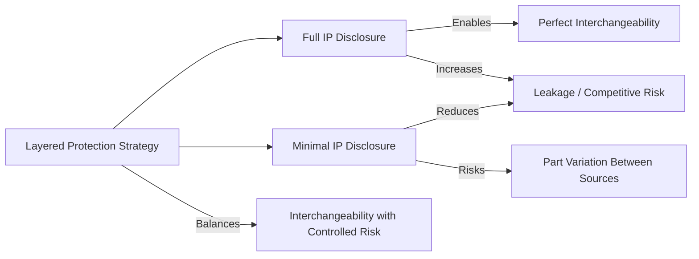
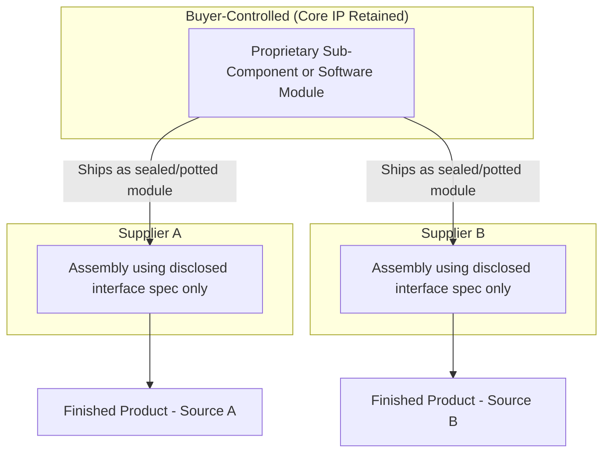
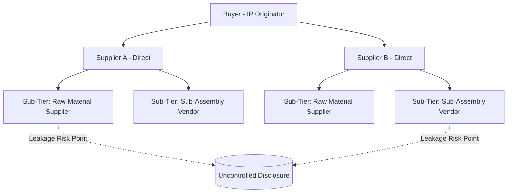

## Intellectual Property Protection Across Suppliers

### Overview

Dual sourcing inherently multiplies IP exposure: the same drawings, process know-how, firmware, and test specifications that must flow to one supplier now flow to two (or more) independent, potentially competing organizations. Each additional recipient is an additional point of leakage risk, an additional jurisdiction of enforceability to consider, and an additional set of employees, subcontractors, and sub-tier suppliers who may see protected information. Effective IP protection across dual sources is not a single control but a layered system spanning legal instruments, technical controls, organizational process, and ongoing monitoring — calibrated to the sensitivity of what's being shared and the trustworthiness/jurisdiction of each supplier.

---

### 1. The Core Tension in Dual Sourcing IP

**Key Points**

- Dual sourcing requires giving each supplier *enough* technical information to manufacture an interchangeable, qualified part — but giving away more than necessary increases both direct IP leakage risk and the risk of enabling a supplier to become an unauthorized competitor or to leak designs to a competitor.
- The two sourcing objectives — **interchangeability** (both sources must produce a functionally identical part) and **IP minimization** (each source should know as little as necessary) — are frequently in tension, since interchangeability often demands sharing complete drawings, tolerances, and process parameters.

[Inference] Organizations typically resolve this tension by tiering disclosure: functional/interface specifications shared broadly, but core process know-how (e.g., proprietary heat-treat recipes, software source code, formulation ratios) held back or shared only under stricter controls — the exact split is category-specific and depends on what actually drives differentiation versus what is needed merely for fit/form/function.

---

### 2. Legal Instruments

#### 2.1 Non-Disclosure Agreements (NDAs)

- **Mutual NDAs** are standard where some reciprocal information flow occurs (e.g., supplier shares proprietary process capability data back to the buyer).
- **Unilateral NDAs** are used when information flows one direction only (buyer to supplier).
- Dual sourcing NDAs should explicitly address **multi-party context**: many standard NDA templates assume a bilateral relationship and don't address what happens if the same information is independently also disclosed to a competing supplier. Best practice is to include a clause acknowledging the buyer's right to disclose the same or similar information to other qualified suppliers, so the receiving supplier cannot later argue exclusivity was implied.

**Key clauses for dual-source NDAs:**

| Clause | Purpose |
| --- | --- |
| Definition of Confidential Information | Precisely scopes what's protected — critical because overly broad definitions are hard to enforce and overly narrow ones leave gaps |
| Permitted use / field-of-use restriction | Limits use strictly to manufacturing for the buyer, prohibiting use in the supplier's own or third-party programs |
| No-compete / non-solicitation carve-outs | Where enforceable, restricts the supplier from using disclosed know-how in a competing product line |
| Flow-down to sub-tier suppliers | Requires the supplier to bind its own sub-suppliers/subcontractors to equivalent confidentiality terms before any further disclosure |
| Residual knowledge clause (or its explicit exclusion) | Some suppliers push for a clause allowing use of information "retained in unaided memory" by employees — buyers in IP-sensitive dual sourcing typically negotiate to exclude or narrow this, since it can effectively nullify protection |
| Return/destruction obligations | Defines what happens to drawings, samples, and tooling data at contract termination or supplier disqualification |
| Survival period | How long confidentiality obligations persist after the relationship ends (often 3–10 years, or indefinite for trade secrets) |

#### 2.2 IP Ownership and License Clauses

Distinct from confidentiality, the **ownership and license** terms determine who owns what is created or improved during the sourcing relationship:

- **Background IP**: IP each party brought into the relationship (buyer's original design; supplier's proprietary process). Typically each party retains ownership of its own background IP.
- **Foreground IP**: new IP created during the engagement (e.g., a process improvement the supplier develops specifically to manufacture the buyer's part). Ownership is negotiated — common models:
  - Buyer owns all foreground IP related to the part design (standard in build-to-print relationships)
  - Supplier owns foreground IP related to *how* it manufactures (process improvements), buyer owns IP related to *what* is manufactured (design)
  - Joint ownership with cross-license — administratively heavier, used less often due to enforcement complexity
- **License-back provisions**: even where the buyer owns the design IP, a license grant to the supplier is required for the supplier to lawfully manufacture; this license should be explicitly **non-exclusive** in dual sourcing (each supplier receives a parallel, independent license) and **revocable** on disqualification or contract termination.

#### 2.3 Trade Secret Protection

Trade secret status (as opposed to patent protection) is often the primary protection mechanism for process know-how shared with manufacturing suppliers, because:

- Process parameters, yield-optimization techniques, and formulation details are frequently *not patentable* (or the buyer chooses not to patent to avoid public disclosure) but retain value precisely because they're secret.
- Trade secret protection under frameworks such as the U.S. Defend Trade Secrets Act (DTSA) or the EU Trade Secrets Directive (2016/943) requires the holder to have taken **"reasonable measures"** to maintain secrecy — a legal precondition, not just good practice. Weak access controls, unmarked documents, or unrestricted supplier access can undermine trade secret status in litigation even if an NDA was signed.

**Reasonable measures typically expected:**

1. Marking documents "Confidential — Trade Secret"
2. Access logs and need-to-know restrictions
3. Employee/supplier training and signed acknowledgments
4. Technical controls (see Section 4)
5. Regular audits of compliance

#### 2.4 Jurisdictional Considerations

Enforceability of these instruments varies materially by supplier location:

| Consideration | Impact on Dual Sourcing |
| --- | --- |
| Governing law and forum selection | Determines which country's courts and IP framework govern disputes; dual-sourced suppliers in different countries mean potentially different enforcement regimes for the *same* underlying IP |
| Patent filing strategy | Filing in the supplier's home jurisdiction (in addition to buyer's home market) may be necessary for enforceability if infringement occurs there |
| Export control overlap | Technical data shared with a foreign supplier may itself be subject to export control regimes (e.g., ITAR, EAR in the U.S., or equivalent regimes elsewhere) independent of IP protection — this is a compliance obligation layered on top of, not a substitute for, IP agreements |
| Local trade secret/confidentiality law maturity | Enforceability and available remedies for trade secret misappropriation vary significantly by country; this should factor into the risk tiering discussed in Section 3 |

[Unverified] Specific enforceability outcomes depend heavily on the jurisdictions and current state of law involved; organizations sourcing IP-sensitive categories internationally typically engage local IP counsel per supplier jurisdiction rather than relying on a single global template.

---

### 3. Risk-Tiered Disclosure Strategy

**Key Points**

- Not all information shared with a dual-sourced supplier carries equal risk; a tiered disclosure model calibrates *what* is shared, *how completely*, and *under what additional controls* based on sensitivity.

#### 3.1 Disclosure Tiering Model

| Tier | Content | Typical Controls |
| --- | --- | --- |
| **Tier 1 — Public/Low Sensitivity** | Generic specifications, industry-standard interfaces, published standards references | Standard NDA only |
| **Tier 2 — Confidential/Competitive** | Detailed drawings, tolerances, material specifications, test procedures | NDA + field-of-use restriction + marked documents + access logging |
| **Tier 3 — Trade Secret/Core IP** | Proprietary process parameters, formulations, firmware source code, algorithmic control logic | All Tier 2 controls + need-to-know limited to named individuals + technical DRM/watermarking + no offsite/cloud storage without encryption + periodic audit rights |
| **Tier 4 — Withheld/Not Disclosed** | True core differentiators the buyer will not share even with a qualified manufacturing partner | Buyer retains critical sub-process in-house (e.g., ships a pre-processed component to both suppliers for final assembly only) or uses a "black box" module design |

#### 3.2 Black-Box / Modular Disclosure Pattern

A common architectural mitigation for Tier 3/4 content is designing the product or process so the most sensitive element is physically or logically decoupled from what the supplier needs:

This pattern (sometimes called "split manufacturing" in electronics/semiconductor contexts) allows both suppliers to build fully functional, qualified products while never receiving the design data for the protected core element. It's especially common where a buyer dual-sources final assembly/manufacturing but retains sole-source control of a critical sub-component (e.g., a proprietary IC, a formulated chemical additive, or firmware binary shipped pre-compiled rather than as source).

---

### 4. Technical and Process Controls

**Key Points**

- Legal instruments define rights and remedies after the fact; technical and process controls are what actually reduce the *probability* of leakage occurring.

#### 4.1 Document and Data Controls

- **Watermarking and document fingerprinting**: unique, supplier-specific watermarks or hidden identifiers embedded in drawings/documents allow a leaked document to be traced to its source of disclosure — useful both as a deterrent and as forensic evidence.
- **Controlled PLM/PDM distribution**: Product Lifecycle Management or Product Data Management systems with role-based access, rather than emailing drawing packages, allow granular control (view-only, no-download, expiring access) and centralized revocation when a supplier relationship ends.
- **Redacted/tiered drawing sets**: issuing different drawing revisions to different suppliers — e.g., a version with proprietary coating specifications redacted, supplemented with a separate controlled process document shared only under Tier 3 terms.
- **Digital Rights Management (DRM)** on CAD files: some PLM platforms support DRM that restricts printing, copying, or forwarding of native CAD files even after transfer.

#### 4.2 Firmware/Software-Specific Controls

For mechatronic or electronic components where software/firmware is part of what's dual-sourced:

- Ship **compiled binaries only**, never source code, unless the supplier's role specifically requires source-level modification
- Use **hardware security modules (HSMs)** or secure boot mechanisms so firmware cannot be extracted/reverse-engineered from the physical product even if a supplier has full manufacturing access
- **Code obfuscation** for cases where some source-level access is unavoidable (lower assurance than compiled-binary-only, used when the supplier must customize logic)
- Maintain a **single firmware build authority** (buyer-controlled) even when hardware is dual-sourced, so both suppliers install an identical, buyer-signed firmware image rather than each maintaining their own build

#### 4.3 Physical/Site Controls

- On-site visit protocols restricting photography, device use, and access to areas beyond the immediate production line
- Segregated production areas within a supplier's facility for buyer-specific tooling/processes, physically separated from the supplier's other customer programs (reduces both accidental cross-contamination of know-how and opportunity for a supplier to "borrow" the buyer's process improvements for another customer)
- Employee-level NDAs/confidentiality agreements at the supplier for personnel with direct access, flowed down from the master supplier agreement

#### 4.4 Sub-Tier and Fourth-Party Risk

Dual sourcing IP exposure doesn't stop at the direct (Tier 1) supplier — it cascades to that supplier's own sub-suppliers:

Controls to manage this:

- Contractual **flow-down requirements** obligating Supplier A/B to impose equivalent confidentiality terms on their own sub-tier suppliers before disclosing any buyer IP
- **Sub-tier disclosure registers**: buyer requires visibility into which sub-tier entities receive buyer IP, even if the buyer has no direct contract with them
- **Audit rights** extending contractually to sub-tier compliance, not just the direct supplier

---

### 5. Monitoring, Audit, and Enforcement

**Key Points**

- IP protection is not "set and forget" — ongoing monitoring detects leakage or misuse, and a credible audit/enforcement posture deters violations more effectively than legal language alone.

#### 5.1 Monitoring Mechanisms

| Mechanism | What It Detects |
| --- | --- |
| Periodic compliance audits (documented, scheduled) | Access control adherence, document handling practices, physical security compliance |
| Competitive intelligence monitoring | Unexpected appearance of similar designs/process capability in a supplier's other customer offerings or marketing materials |
| Patent/trademark watch services | Filings by a current or former supplier that closely resemble buyer IP |
| Employee movement tracking (where legally permissible) | Key personnel with access to sensitive IP moving to a competing supplier or buyer competitor |
| Document access logs (from PLM/PDM controls in 4.1) | Anomalous access patterns — bulk downloads, access outside normal working hours, access by personnel outside the approved list |

#### 5.2 Escalation and Remedies

A defined escalation path should exist for suspected IP violations, distinct from standard quality/delivery non-conformance escalation:

1. **Internal investigation** — legal and procurement jointly assess evidence before any supplier confrontation
2. **Formal notice** — cure notice under the governing agreement, specifying the alleged breach and remedy period
3. **Contractual remedies** — audit rights invocation, liquidated damages clauses (if pre-negotiated), supplier disqualification/offboarding
4. **Legal remedies** — injunctive relief to prevent further use/disclosure, damages litigation, criminal referral in jurisdictions where trade secret theft is criminally prosecutable

[Inference] In dual sourcing specifically, a credible enforcement posture against one supplier also functions as a deterrent signal to the other qualified source(s), which is part of why organizations often maintain consistent, visibly enforced IP terms across all suppliers in a category rather than negotiating materially different protection levels per relationship.

#### 5.3 Offboarding an IP-Exposed Supplier

When a dual-sourced supplier is disqualified, deprioritized, or the relationship ends, IP-specific offboarding steps are required beyond standard contract termination:

- Formal **return or certified destruction** of drawings, samples, and process documentation, with written certification
- **Tooling data purge** — if tooling was transferred or clone-built (see the tooling topic), removal of buyer-specific process parameters from the supplier's equipment/control systems
- **PLM/PDM access revocation** — immediate, not delayed to contract end date
- **Survival clause activation confirmation** — explicit written acknowledgment from the supplier that confidentiality obligations continue post-termination per the NDA's survival period

---

### 6. Balancing IP Protection Against Dual Sourcing Objectives

A poorly calibrated IP protection regime can itself undermine the dual sourcing program's core purpose:

- **Over-restriction** slows supplier onboarding and qualification (Section on tool/process qualification elsewhere in this chapter depends on timely, complete technical data transfer) — if IP controls make it too slow or costly to fully qualify a second source, the "backup" is never actually ready.
- **Under-restriction** exposes the buyer to the leakage and competitive risks this topic addresses, and can *reduce* long-term negotiating leverage if a supplier absorbs enough know-how to become a de facto co-owner of the design.

[Inference] The practical resolution most organizations converge on is treating IP protection scope as a variable to be explicitly negotiated as part of the dual sourcing business case (see the capital/tooling topic's risk-adjusted justification framework) — accepting a defined, bounded IP exposure in exchange for the resilience benefit, rather than treating IP minimization as an unconditional constraint.

---

### Related Topics

- Trade secret law fundamentals and the Defend Trade Secrets Act / EU Trade Secrets Directive
- Export control compliance for technical data transfer (ITAR, EAR, dual-use goods regimes)
- PLM/PDM system selection and role-based access architecture
- Supplier offboarding and disqualification procedures
- Black-box/modular product architecture for IP-sensitive manufacturing
- Contract structures: flow-down clauses and sub-tier supplier obligations
- Competitive intelligence and patent landscape monitoring programs
- Tooling ownership and data package rights (cross-reference: Tooling, Capital, and Capacity Planning)