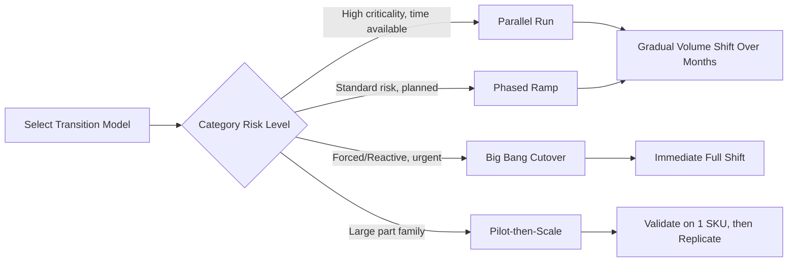
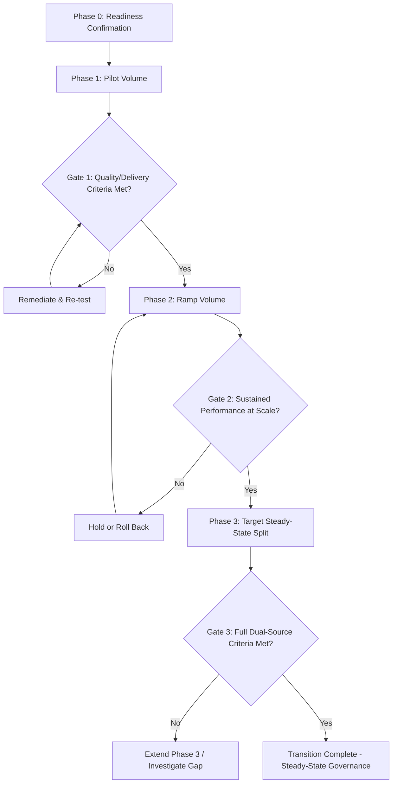
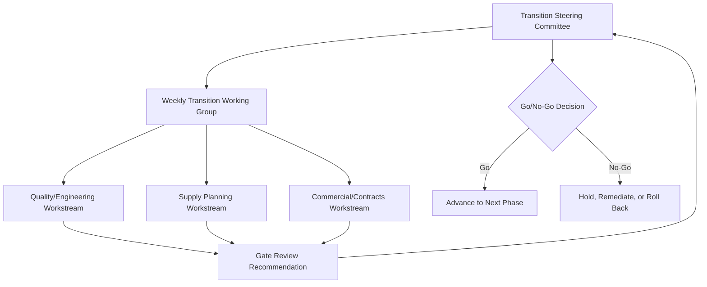

## Transition Planning From Single to Dual Source

### Overview

Transition planning is the disciplined program-management process for moving a category from single-source dependency to a functioning dual-source structure without triggering the very disruption the dual sourcing strategy is meant to prevent. This is distinct from the upstream activities of *selecting* a second source or *qualifying* its tooling — transition planning is the execution layer that sequences volume migration, manages the incumbent supplier relationship through the change, and defines the objective criteria for declaring the transition complete. A well-designed second source with no disciplined transition plan frequently causes the exact outage dual sourcing was meant to avoid, through premature volume shifts, incumbent supplier retaliation, or an undefined "how much is enough" endpoint that leaves the category permanently stuck in a fragile partial state.

---

### 1. Transition Planning Objectives and Triggers

**Key Points**

- Transition planning begins only after the second source has cleared upstream qualification gates (tooling qualification, PPAP/FAI, capacity/capital commitments — see related chapter topics); it governs the period from "qualified but unproven at volume" to "fully operational dual source."
- Three common triggers initiate a formal transition: (1) proactive risk mitigation for a strategic/high-risk category, (2) reactive response to an incumbent's quality, delivery, or financial distress signal, and (3) commercial rebalancing to restore price competition.

[Inference] Reactive transitions (triggered by an incumbent's deteriorating performance or a live disruption) tend to compress the timeline significantly compared to proactive transitions, which increases execution risk — much of what follows in this topic is more critical, not less, when the transition is reactive and time-pressured.

---

### 2. Transition Models

**Key Points**

- The choice of transition model determines the risk profile, speed, and incumbent-relationship impact of the shift. There is no universally superior model — the right choice depends on category criticality, switching cost, and how much slack exists in current inventory/capacity.

#### 2.1 Comparison of Transition Models

| Model | Mechanics | Speed | Risk Profile |
| --- | --- | --- | --- |
| **Parallel run** | Both sources produce simultaneously from day one at a defined split (e.g., 90/10 initial); ratio shifts gradually over a defined period | Slow, deliberate | Lowest risk — any Source 2 quality issue is caught at low volume before it matters; highest short-term cost (dual supply chain overhead) |
| **Phased ramp** | Source 2 volume increases in discrete steps (e.g., 10% → 25% → 50%) gated by defined performance criteria at each step | Moderate | Balances risk and speed; most common model for planned (non-reactive) transitions |
| **Big bang cutover** | Volume shifts to Source 2 at a single point in time, typically because Source 1 is being fully exited (not a true dual-source end state, but sometimes the transition *path* to get there) | Fast | Highest risk; used mainly in forced/reactive scenarios (incumbent insolvency, contract termination for cause) where there's no time for gradual ramp |
| **Pilot-then-scale** | Source 2 runs a limited pilot (single SKU, single region, or single customer-facing product line) before broader rollout across the full part family | Slow initially, faster after pilot validates | Used when a category has many part numbers/variants and validating the transition approach on one part reduces risk for the rest |

#### 2.2 Volume Migration Curve

For phased/parallel models, the migration curve is typically defined with explicit gate criteria at each step rather than a fixed calendar schedule — advancing to the next volume tier requires passing quality, delivery, and yield thresholds, not simply the passage of time.

$$V_2(t) = V_{2,0} + \sum_{i=1}^{n} \Delta_i \cdot \mathbb{1}[\text{Gate}_i \text{ passed}]$$

Where $V_2(t)$ is Source 2's volume share at time $t$, $V_{2,0}$ is the initial pilot allocation, and each $\Delta_i$ increment is contingent on passing gate $i$ (e.g., $C_{pk} \geq 1.33$ sustained for a defined number of consecutive lots, on-time delivery $\geq 95\%$, defect PPM below a threshold).

[Inference] Typical initial pilot allocations range roughly 5–15% of total category volume, though the appropriate starting point depends heavily on part complexity, criticality, and how much confidence the qualification phase already established — this is not a fixed industry standard.

---

### 3. Sequencing and Milestone Structure

**Key Points**

- A transition plan is sequenced as a project with defined phases, gate criteria, and rollback triggers at each stage — not an open-ended ramp.

#### 3.1 Standard Phase Structure

**Phase 0 — Readiness Confirmation** (pre-transition gate)

- Confirms upstream prerequisites are actually in place before volume moves: tooling qualified, PPAP/FAI approved, capacity contractually reserved, IP/contractual terms executed
- This phase catches the common failure mode of beginning volume migration before qualification work is genuinely complete under schedule pressure

**Phase 1 — Pilot Volume**

- Low-volume allocation to Source 2, often on a subset of SKUs or a single distribution region
- Heightened inspection/monitoring cadence (e.g., 100% incoming inspection rather than standard AQL sampling)
- Explicit rollback trigger defined *before* the pilot begins (e.g., "any single lot rejection reverts allocation to zero pending root cause")

**Phase 2 — Ramp Volume**

- Stepped volume increases per the migration curve in Section 2.2
- Monitoring shifts from 100% inspection toward statistical process control as confidence builds
- Incumbent (Source 1) performance is monitored in parallel — a common error is focusing all attention on Source 2's ramp while Source 1's performance is assumed constant; incumbent behavior often changes once it perceives reduced volume/leverage (see Section 4)

**Phase 3 — Target Steady-State Split**

- Volume reaches the intended long-term allocation ratio (e.g., 70/30, 50/50 — see capacity planning topic)
- Final gate confirms the split is sustainable, not just momentarily achieved

**Steady-State Governance**

- Transition formally closes; the category moves into standard dual-source operational governance (ongoing scorecarding, periodic capacity/tooling readiness review) rather than active transition management

#### 3.2 Exit Criteria — Defining "Transition Complete"

A transition without explicit, objective exit criteria tends to remain indefinitely in an ambiguous "in-progress" state. Recommended exit criteria typically combine:

| Criterion | Example Threshold |
| --- | --- |
| Sustained quality performance | Both sources meet defect PPM target for N consecutive months |
| Sustained delivery performance | Both sources meet on-time-in-full (OTIF) target for N consecutive months |
| Capacity validation | Source 2 has demonstrated ability to absorb a defined surge scenario (not just steady-state volume) |
| Target allocation achieved | Volume split matches the strategic target ratio within an agreed tolerance |
| Governance cadence established | Regular business reviews, scorecards, and readiness matrix (see tooling/capacity topic) are operating on a defined cadence with both sources |
| Contractual completeness | All amendments, capacity reservations, and IP agreements are fully executed (not still "in negotiation") |

---

### 4. Incumbent (Source 1) Relationship Management

**Key Points**

- The transition period is the highest-risk window for incumbent relationship deterioration — the incumbent is aware volume is shifting away and may respond in ways ranging from improved performance (positive competitive response) to reduced service quality, price increases at renewal, or in extreme cases deliberate obstruction.

#### 4.1 Communication Strategy

- **Timing**: notifying the incumbent too early (before Source 2 is genuinely ready) risks premature service degradation from an incumbent who feels threatened; notifying too late risks the incumbent discovering the shift informally (e.g., noticing reduced POs) and reacting negatively to the lack of transparency. [Inference] Many organizations time incumbent notification to coincide with the start of Phase 1 (pilot volume), once Source 2's readiness is confirmed but before volume commitments are large enough to be commercially painful for the incumbent to absorb.
- **Framing**: positioning the change as risk-mitigation/business continuity policy (applicable to the category broadly) rather than as a performance indictment of the specific incumbent, where the incumbent's performance is not the trigger — this preserves the relationship and reduces defensive reactions.
- **Contractual basis**: transition activity should be grounded in existing contract terms (e.g., a non-exclusivity clause, a right to qualify alternate sources) rather than appearing to unilaterally violate an implied exclusivity understanding, even where no formal exclusivity was contracted.

#### 4.2 Incumbent Performance Risk During Transition

| Risk | Mitigation |
| --- | --- |
| Service/quality degradation once incumbent perceives reduced strategic priority | Maintain (or increase) scorecard scrutiny on Source 1 throughout the transition, not just Source 2; make clear continued volume is contingent on continued performance |
| Price increase at next renewal, leveraging remaining volume dependency | Time transition milestones relative to contract renewal windows; avoid entering a renewal negotiation while still critically dependent on the incumbent for 100% of volume |
| Reduced willingness to support engineering changes, expedites, or flexibility | Contractually preserve service-level obligations independent of volume share; monitor responsiveness as an explicit scorecard metric during transition |
| Data/tooling non-cooperation (e.g., delays in providing data packages needed for Source 2's clone tooling) | Establish data package transfer obligations and timelines in the original contract, ideally before the incumbent has motivation to slow-walk them |
| Retaliatory actions in extreme cases (rare but possible with distressed or adversarial suppliers) | Legal/contractual review of exit and dispute clauses before transition begins; contingency buffer stock for worst-case scenarios |

#### 4.3 Incumbent Retention Scenarios

Not all transitions aim to fully displace the incumbent — in the steady-state dual-source model (see capacity planning topic), Source 1 typically retains a significant ongoing allocation (e.g., 70% or 50%). Framing matters:

- If the target end-state retains the incumbent as a continuing (if reduced-share) partner, transition communication should make this explicit early — an incumbent who believes it's being fully displaced may behave very differently (with less cooperation) than one who understands it retains substantial ongoing business.

---

### 5. Risk Management During Transition

**Key Points**

- The transition window is a period of elevated operational risk by construction — inventory buffers, contingency triggers, and rollback plans are essential, not optional, components of the plan.

#### 5.1 Buffer Inventory Strategy

- Build a **transition safety buffer** ahead of Phase 1 initiation, sized to cover a defined disruption scenario (e.g., N weeks of demand) in case either source underperforms during the ramp
- Buffer should be drawn down and replenishment obligations should shift as the transition progresses — an often-missed step is failing to define when/how the buffer itself transitions from "insurance for this specific cutover" to "standard steady-state safety stock" (or is released back to working capital)

$$\text{Buffer}_{qty} = D_{avg} \times (T_{ramp} + T_{contingency})$$

Where $D_{avg}$ is average weekly demand, $T_{ramp}$ is the expected time for a rollback/recovery action (see capacity planning topic's ramp modeling), and $T_{contingency}$ is an added margin for unplanned delay.

#### 5.2 Rollback Triggers and Contingency Planning

Every phase gate (Section 3.1) should have a paired, pre-agreed **rollback trigger** — the objective condition under which volume reverts to the prior allocation rather than advancing. Defining these *before* the transition begins (not improvising them mid-crisis) is the key discipline:

| Trigger Type | Example |
| --- | --- |
| Quality escape | Field/customer-detected defect traced to Source 2 above an agreed severity threshold |
| Delivery failure | Missed delivery causing (or risking) a line-down event at the buyer or buyer's customer |
| Capacity shortfall | Source 2 unable to sustain committed volume for a defined consecutive period |
| Process control loss | $C_{pk}$ falls below the qualification threshold on a sustained basis, not a single outlier lot |

#### 5.3 Change Management and Internal Stakeholder Alignment

Transition risk is not purely supplier-facing — internal functions must be aligned and prepared:

- **Quality/inspection**: staffing and procedures for heightened Phase 1 inspection cadence must be resourced in advance
- **Planning/MRP**: systems and planners must be configured to split purchase orders and track dual-source inventory/lead-time parameters correctly — a common technical gap is an ERP/MRP system configured for single-source part records that requires reconfiguration to support split sourcing rules
- **Engineering**: available to support Source 2 through early-ramp issues (a common resourcing gap if engineering assumes its role ended at PPAP approval)
- **Customer-facing teams** (if the buyer's own customers could be sensitive to a sourcing change, e.g., in regulated industries): informed and equipped to respond to inquiries, particularly in regulated sectors where a manufacturing source change may itself require customer notification or regulatory filing

---

### 6. Transition Governance and Tracking

**Key Points**

- A dedicated transition governance structure — distinct from standard ongoing supplier management — provides the cadence and decision authority needed to execute gate reviews and rollback decisions in real time.

#### 6.1 Governance Structure

- **Transition Steering Committee**: cross-functional decision authority (procurement, quality, engineering, planning, and commercial leadership) with explicit authority to approve gate advancement or trigger rollback — decisions should not default to the category buyer alone given the cross-functional risk involved
- **Working group cadence**: typically weekly during active phases (more frequent than standard supplier business reviews), tapering to standard cadence once steady-state governance begins
- **Documented gate reviews**: each phase gate decision (advance/hold/rollback) should be formally recorded with the supporting data, creating both an audit trail and a reference for future transition planning

#### 6.2 Transition Tracking Dashboard Elements

A transition-specific dashboard (distinct from standard supplier scorecards) typically tracks:

- Volume split trend vs. planned migration curve
- Gate status per phase (met / at-risk / missed)
- Quality metrics for Source 2 specifically (not blended with Source 1, since blended metrics can mask a ramping source's true performance)
- Incumbent performance trend (to detect the relationship risks in Section 4)
- Buffer inventory level vs. target
- Open risk/issue log with owners and target resolution dates

---

### 7. Common Failure Modes

1. **Volume migration ahead of qualification**: schedule pressure causes Phase 1 to begin before Phase 0 readiness criteria are genuinely met — the most frequent root cause of transition-related disruptions.
2. **No defined exit criteria**: the transition never formally closes, leaving the category in a permanently ambiguous state with no clear governance ownership.
3. **Blended performance metrics**: tracking combined quality/delivery metrics across both sources during ramp, obscuring a struggling Source 2's true performance until a significant incident forces attention.
4. **Ignoring incumbent behavioral risk**: treating Source 1 as a static baseline throughout the transition, missing early signals of relationship deterioration described in Section 4.
5. **Undersized or undefined buffer inventory**: no safety stock strategy specific to the transition window, leaving no margin to absorb an early-phase Source 2 shortfall without customer impact.
6. **Rollback triggers defined reactively**: deciding "how bad is bad enough to roll back" only after an incident occurs, rather than as a pre-agreed objective threshold — this typically leads to delayed, inconsistent, or politically influenced rollback decisions.

---

### Related Topics

- Tooling, Capital, and Capacity Planning Across Sources (upstream readiness prerequisite)
- Supplier qualification, PPAP/APQP, and process capability ($C_{pk}$) frameworks
- Supplier scorecarding and ongoing performance governance
- Safety stock and buffer inventory modeling
- ERP/MRP system configuration for split/multi-source part records
- Incumbent supplier relationship and renewal negotiation strategy
- Business continuity planning and disruption contingency design
- Change management and cross-functional stakeholder alignment in supply chain transformation