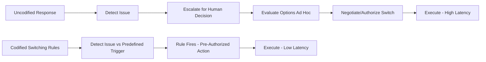
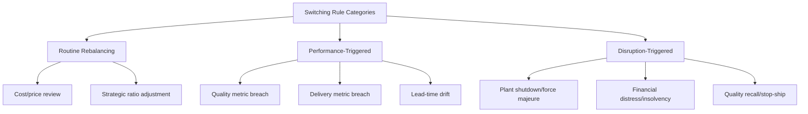
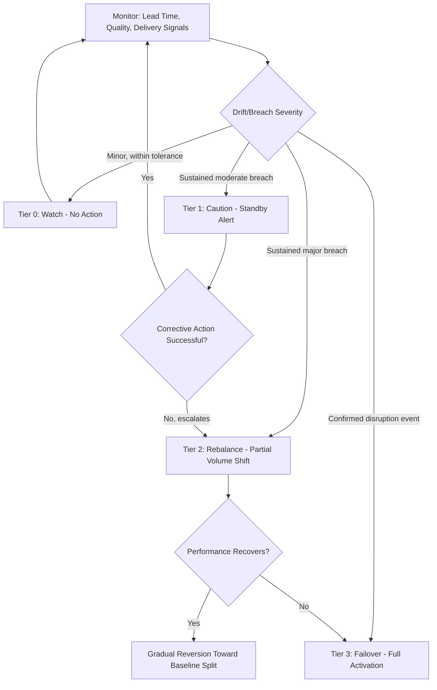
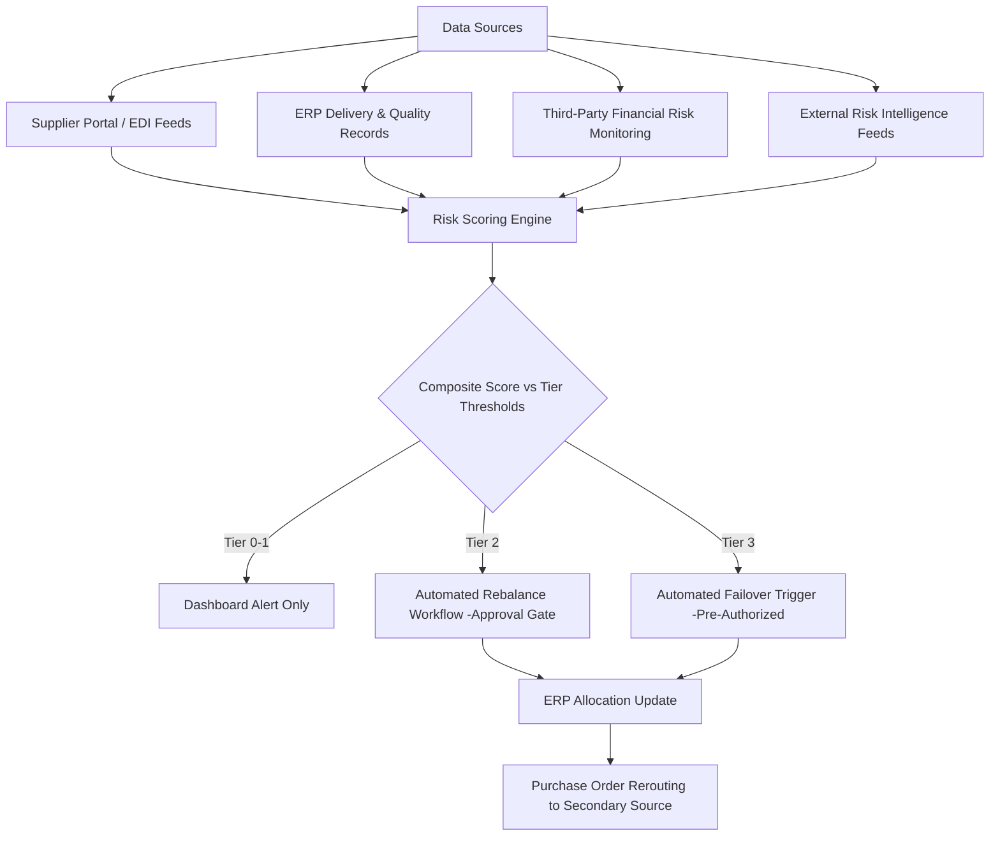

## Switching Rules and Lead-Time Triggers

### Overview

Switching rules and lead-time triggers are the operational decision logic that governs *when* and *how* volume actually moves between an established dual-source pair during steady-state operation — as distinct from the one-time transition plan that establishes the dual source in the first place. Once both sources are qualified and operating at a target allocation, the program needs a codified, largely pre-agreed rule set so that reallocation decisions (routine rebalancing, disruption response, capacity surge activation) happen quickly and consistently rather than being improvised ad hoc each time a trigger condition occurs. Without codified switching rules, the resilience value of dual sourcing is undermined by decision latency: the second source may be qualified and capable, but if the organization takes weeks to decide *to* activate it, the effective time-to-recovery is no better than single sourcing.

---

### 1. Why Codified Switching Rules Matter

**Key Points**

- A dual source with no predefined switching logic still requires a human decision-maker to recognize a trigger condition, evaluate options, and authorize a reallocation — every step of which adds latency during exactly the moment (a disruption) when latency is most costly.
- Codified rules convert this into a largely pre-authorized, criteria-driven response, reducing decision time from potentially weeks to days or hours for defined scenarios.

[Inference] The latency reduction from codified rules is most valuable for high-frequency, well-understood trigger types (e.g., a missed delivery threshold) and less complete for genuinely novel disruption scenarios that no rule anticipated — codified rules reduce but do not eliminate the need for human judgment in edge cases.

---

### 2. Categories of Switching Rules

**Key Points**

- Switching rules generally fall into three categories distinguished by *why* volume moves: routine rebalancing (no problem, just optimization), performance-triggered reallocation (a source underperforms against defined metrics), and disruption-triggered failover (a source becomes unable to supply).

#### 2.1 Rule Category Comparison

| Category | Trigger Basis | Typical Response Speed | Reversibility |
| --- | --- | --- | --- |
| **Routine rebalancing** | Scheduled review cadence, cost/price changes, strategic allocation targets | Planned, non-urgent (weeks/months) | Fully reversible, incremental |
| **Performance-triggered reallocation** | Scorecard metrics breach a defined threshold (quality, delivery, capacity) | Days to weeks | Usually reversible once performance recovers |
| **Disruption-triggered failover** | Binary/near-binary event: plant shutdown, force majeure, insolvency, quality recall | Hours to days | May not be reversible quickly; often becomes a semi-permanent reallocation |

---

### 3. Lead-Time Triggers: Core Mechanics

**Key Points**

- Lead time is one of the most operationally sensitive trigger variables because it directly determines how much warning the buyer has before a supply gap becomes a production gap — a lead-time-based trigger is designed to fire *before* an actual stockout, using the supplier's replenishment lead time as the countdown clock.

#### 3.1 Lead-Time-Based Reorder and Switch Logic

The foundational relationship is between **available inventory position**, **demand rate**, and **supplier lead time**:

$$t_{trigger} = t_{stockout} - LT_{alt}$$

Where $t_{stockout}$ is the projected date inventory reaches zero at current demand, and $LT_{alt}$ is the lead time required for the alternate (second) source to deliver. A switch decision must be made no later than $t_{trigger}$ to avoid a gap.

For a rolling/continuous monitoring model, this is often expressed as a **switch-point inventory level**, analogous to a reorder point but keyed to *activating the second source* rather than simply reordering from the primary:

$$SP = (D_{avg} \times LT_{primary}) + SS - (D_{avg} \times \Delta LT)$$

Where:

- $SP$ = switch point (inventory level that triggers evaluation of a source switch)
- $D_{avg}$ = average daily/weekly demand
- $LT_{primary}$ = primary source's normal replenishment lead time
- $SS$ = safety stock
- $\Delta LT$ = additional lead time the secondary source requires versus the primary (if the secondary source is slower to deliver, e.g., due to longer transit or lower allocation priority)

**Worked example:**

- $D_{avg} = 500$ units/week
- $LT_{primary} = 6$ weeks
- $SS = 750$ units
- Secondary source lead time is 2 weeks longer than primary ($\Delta LT = 2$ weeks)

$$SP = (500 \times 6) + 750 - (500 \times 2) = 3000 + 750 - 1000 = 2750 \text{ units}$$

This means: if primary-source lead time signals (see 3.2) indicate risk while inventory is still above 2,750 units, there is theoretically enough buffer to activate the secondary source's slower lead time without a gap; below that level, the decision window has effectively closed and the risk of a stockout gap increases materially.

#### 3.2 Lead-Time Drift as a Leading Indicator

Rather than waiting for an outright delivery failure, sophisticated switching frameworks monitor **lead-time drift** — a gradual increase in a supplier's actual quoted or realized lead time — as an early warning signal that precedes an outright disruption:

| Signal | Interpretation |
| --- | --- |
| Quoted lead time increasing across successive POs | Supplier's own backlog/capacity is tightening; may foreshadow delivery misses |
| Realized (actual) lead time trending above quoted | Supplier is under-delivering against its own commitments; systemic capacity or process issue likely |
| Increased variance in lead time (even if average is stable) | Reduced supplier process control; higher probability of an individual order falling outside acceptable bounds |
| Sub-tier material lead time extensions reported by supplier | Upstream risk in the supplier's own supply chain, a common precursor to the supplier's own delivery risk |

$$\text{Drift}_{\%} = \frac{LT_{realized,t} - LT_{quoted,baseline}}{LT_{quoted,baseline}} \times 100\%$$

A common rule structure ties Drift% to a graduated response rather than a single binary threshold — see Section 4.

---

### 4. Graduated Trigger and Response Framework

**Key Points**

- Effective switching rules avoid a single binary "switch/don't switch" threshold in favor of graduated tiers, since an overly sensitive trigger causes unnecessary volume churn (which itself carries cost and relationship risk) while an overly conservative trigger arrives too late to prevent a gap.

#### 4.1 Tiered Trigger-Response Matrix

| Tier | Trigger Condition (example) | Response |
| --- | --- | --- |
| **Tier 0 — Watch** | Lead-time drift 5–10% above baseline; single late delivery within acceptable variance | Increased monitoring frequency; no allocation change; flagged in scorecard |
| **Tier 1 — Caution** | Lead-time drift >10% sustained over 2+ consecutive POs; OTIF drops below target for one review period | Formal supplier discussion/corrective action request; secondary source placed on standby alert (pre-notified, no volume shift yet) |
| **Tier 2 — Rebalance** | Lead-time drift >20% sustained; OTIF breach continues after corrective action window; quality PPM breach | Defined volume percentage shifts to secondary source per pre-agreed rebalancing schedule (not full cutover) |
| **Tier 3 — Failover** | Confirmed plant shutdown, force majeure declaration, insolvency filing, stop-ship quality recall | Immediate activation of secondary source at maximum available capacity; buffer inventory drawdown authorized without further approval |

[Inference] The specific numeric thresholds shown (drift percentages, OTIF targets) are illustrative rather than universal — appropriate thresholds vary by category criticality, historical supplier performance variance, and how much buffer/safety stock exists; each program should calibrate these against its own category's historical data rather than adopting fixed figures.

#### 4.2 Pre-Authorization and Decision Rights

A critical design element is defining, in advance, **who can authorize each tier's response** so that Tier 3 failover doesn't require an emergency executive approval cycle in the middle of an actual crisis:

| Tier | Typical Decision Authority | Rationale |
| --- | --- | --- |
| Tier 0–1 | Category buyer / supply chain analyst | Low-risk, reversible, routine |
| Tier 2 | Category manager + quality/planning sign-off | Moderate commercial/operational impact, cross-functional input needed |
| Tier 3 | Pre-authorized under a standing emergency protocol (executed by category manager without new approval) | Speed is paramount; the whole point of pre-authorization is removing the approval bottleneck at the moment of highest urgency |

---

### 5. Trigger Types Beyond Lead Time

**Key Points**

- While lead time is a central trigger variable, a complete switching rule framework typically monitors multiple signal types in combination, since lead-time drift alone doesn't capture all disruption modes (e.g., a quality escape can occur with no lead-time impact at all).

#### 5.1 Multi-Signal Trigger Framework

| Signal Type | Example Metric | Data Source |
| --- | --- | --- |
| Lead time | Quoted/realized lead time, drift % | PO history, supplier portal, EDI 856 (ASN) timing |
| Quality | Defect PPM, $C_{pk}$ drift, customer complaints | Incoming inspection data, SPC systems |
| Delivery reliability | OTIF %, fill rate | ERP delivery performance tracking |
| Financial health | Credit rating change, D&B risk score movement, payment behavior signals | Third-party financial risk monitoring services |
| Capacity utilization | Supplier's stated utilization %, order backlog trend | Supplier-reported capacity data, business reviews |
| External/geopolitical | Natural disaster alerts, port/logistics disruption indices, sanctions/trade policy changes | News monitoring, supply chain risk intelligence platforms |
| Force majeure declarations | Formal notice from supplier | Direct supplier communication |

#### 5.2 Composite Risk Scoring

Rather than treating each signal independently, many frameworks combine signals into a **composite supplier risk score** that itself becomes the trigger variable, weighting signal types by relevance to the category:

$$R_{composite} = w_1 \cdot R_{leadtime} + w_2 \cdot R_{quality} + w_3 \cdot R_{delivery} + w_4 \cdot R_{financial} + w_5 \cdot R_{external}$$

Where each $R_i$ is a normalized (e.g., 0–100) risk sub-score and weights $w_i$ sum to 1, calibrated to reflect which risk dimensions matter most for the specific category (e.g., a category with a financially fragile supplier base might weight $w_4$ higher; a category with a volatile geopolitical exposure might weight $w_5$ higher).

Composite score bands can then map directly onto the tiered response framework in Section 4.1 (e.g., $R_{composite} > 70$ triggers Tier 2 rebalancing).

---

### 6. System and Process Architecture

**Key Points**

- Executing switching rules reliably at the speed the framework intends requires supporting systems and defined data flows — a rule that exists only as a policy document, with no automated monitoring or system enforcement, tends to fire late or inconsistently in practice.

#### 6.1 Monitoring and Execution Architecture

- **Monitoring layer**: aggregates lead-time, quality, delivery, and financial signals from ERP, supplier portals/EDI, and third-party risk services into a common risk-scoring view
- **Rule/decision engine**: evaluates incoming signals against the tiered thresholds (Section 4.1) and either raises an alert (Tier 0–1), initiates an approval workflow (Tier 2), or fires an automated action (Tier 3)
- **Execution layer**: ERP/MRP allocation percentage updates, PO rerouting, and (where integrated) automatic notification to the secondary source's planning contact

[Unverified] The degree to which this is fully automated versus manually executed against documented rules varies enormously by organizational maturity and system investment; many organizations operate with partially automated monitoring (dashboards, alerts) but manual execution of the actual allocation change, even where the decision criteria are fully codified.

#### 6.2 Data Quality Prerequisites

Switching rules are only as reliable as the underlying data feeding them:

- **Lead-time data integrity**: requires consistent capture of both *quoted* lead time (at PO placement) and *realized* lead time (actual delivery date vs. promise date) — many ERP configurations only track one or the other by default, which undermines drift calculation (Section 3.2)
- **Baseline recalibration**: lead-time and performance baselines should be periodically refreshed (e.g., annually or upon material process change at the supplier), since a stale baseline can cause a trigger to fire against an outdated expectation, or fail to fire because the "current normal" has silently degraded
- **Master data alignment**: part numbers, supplier codes, and allocation rules must be consistently maintained across ERP, supplier portal, and risk-monitoring systems to avoid triggers firing against incomplete or mismatched data

---

### 7. Reversion Rules

**Key Points**

- A switching rule framework is incomplete without symmetric **reversion logic** — the criteria under which volume moves back toward the original steady-state split once a triggering condition resolves. Without defined reversion rules, a Tier 2/3 reallocation tends to become permanently "sticky" even after the underlying issue is fixed, which erodes the commercial rationale for maintaining the original allocation ratio and can strain the primary source relationship unnecessarily.

#### 7.1 Reversion Criteria Structure

| Element | Design Consideration |
| --- | --- |
| Sustained recovery period | Reversion typically requires the triggering metric to remain within normal range for a defined period (e.g., 2–3 consecutive review cycles), not just a single good data point, to avoid reversion followed immediately by re-triggering |
| Gradual vs. immediate reversion | Mirrors the phased ramp logic used in initial transition planning (see related topic) — sudden full reversion can itself create a supply risk if the primary source's capacity has atrophied during the reallocation period |
| Root cause closure verification | Reversion should be gated on confirmed root-cause resolution at the primary source, not merely the absence of further symptoms |
| Commercial/contractual reconciliation | Any interim pricing, minimum volume commitment adjustments, or penalty clauses triggered during the reallocation period should be formally closed out as part of reversion |

---

### 8. Common Failure Modes

1. **Undefined or purely informal triggers**: switching decisions made case-by-case with no documented threshold, leading to inconsistent response speed and second-guessing during actual crises.
2. **Single binary threshold instead of graduated tiers**: causes either excessive volume churn (over-sensitive trigger) or dangerously late response (under-sensitive trigger).
3. **No pre-authorization for high-severity tiers**: Tier 3 failover logic exists on paper but still requires an emergency approval meeting, eliminating the speed advantage the framework was designed to provide.
4. **Lead-time monitoring based on quoted lead time only**: misses the more predictive signal of realized-lead-time drift, since a supplier can maintain a stable quoted lead time while consistently under-delivering against it.
5. **No reversion rules**: reallocations become permanently sticky, undermining the original strategic allocation rationale and potentially causing the primary source's capacity/readiness to atrophy from disuse.
6. **Stale baselines**: trigger thresholds calibrated against outdated performance data fail to reflect the supplier's current "normal," causing false triggers or missed real degradation.
7. **Single-signal reliance**: monitoring lead time alone while ignoring quality, financial, or capacity signals misses disruption modes that don't manifest as lead-time drift (e.g., a sudden quality recall).

---

### Related Topics

- Transition Planning From Single to Dual Source (initial ramp vs. steady-state switching distinction)
- Tooling, Capital, and Capacity Planning Across Sources (secondary source's actual ability to absorb a Tier 2/3 volume shift)
- Supplier scorecarding and composite risk scoring methodologies
- Safety stock, reorder point, and inventory buffer modeling
- ERP/MRP configuration for multi-source allocation and automated reallocation workflows
- Supplier financial health monitoring and early-warning risk services
- Force majeure and business continuity contract clauses
- EDI/ASN data integration for real-time delivery performance tracking