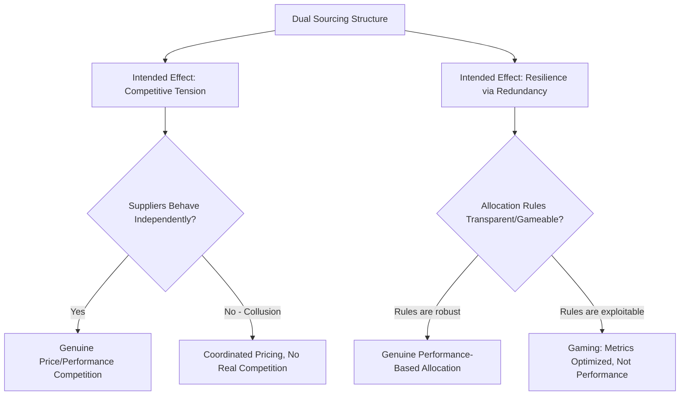
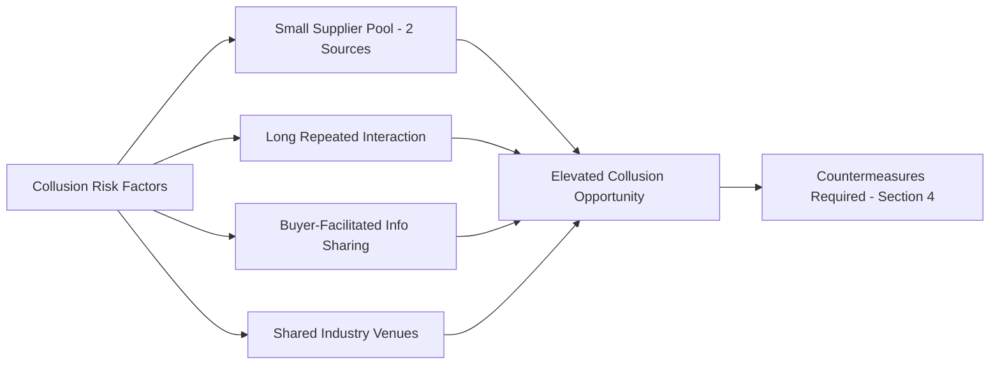
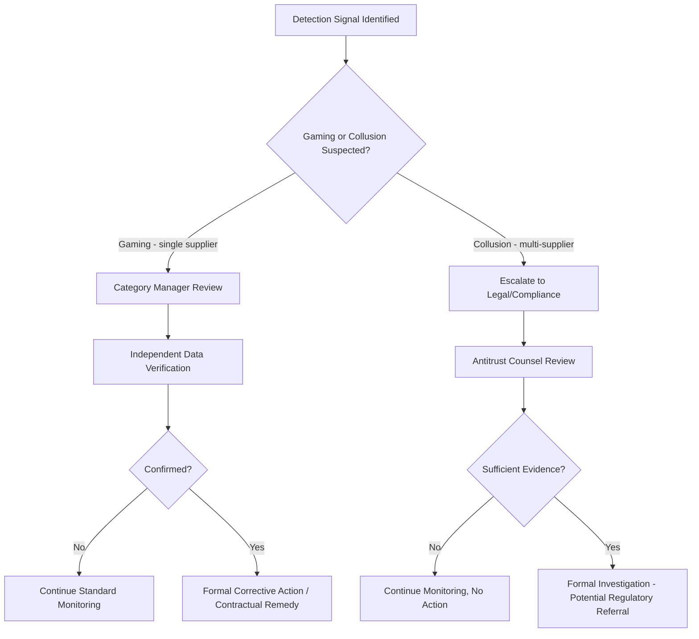

## Avoiding Supplier Gaming and Collusion

### Overview

Dual sourcing is designed to create competitive tension and supply resilience — but the same structure that enables healthy competition also creates specific opportunities for suppliers to game the system or, in adversarial cases, coordinate with each other against the buyer's interests. Gaming refers to a single supplier exploiting known scorecard metrics, allocation formulas, or switching rules to protect its position without genuinely improving performance. Collusion refers to two or more suppliers coordinating — explicitly or tacitly — to align pricing, avoid genuine competition, or otherwise defeat the purpose of maintaining multiple sources. This topic covers the mechanics of both risks and the detection, contractual, and process countermeasures used to preserve genuine competitive and resilience value from a dual-source structure.

---

### 1. Why Dual Sourcing Creates Gaming and Collusion Risk

**Key Points**

- The moment a buyer publishes (or a supplier can infer) the rules governing volume allocation, pricing benchmarks, or switching triggers, those rules become a target for strategic behavior rather than genuine performance improvement — this is a general property of any rules-based incentive system, not unique to sourcing.
- Collusion risk is structurally elevated in dual sourcing because, unlike single sourcing, the buyer is explicitly relying on the *interaction* between two independent suppliers (competitive tension) to produce a benefit; if the suppliers stop acting independently, that mechanism fails silently — the buyer may not notice for a long time, because deliveries continue and quality remains acceptable.

---

### 2. Supplier Gaming: Mechanisms and Detection

**Key Points**

- Gaming exploits the specific, literal definition of a metric or rule rather than violating any explicit contract term — which is precisely what makes it hard to address through standard non-conformance or breach processes.

#### 2.1 Common Gaming Patterns

| Pattern | Mechanism | Example |
| --- | --- | --- |
| **Metric optimization over substance** | Supplier manages behavior to hit the *measured* threshold precisely, without improving underlying performance | Expediting only the shipments that would otherwise breach the OTIF threshold, while allowing lower-visibility shipments to run late |
| **Sandbagging quotes to win allocation** | Supplier quotes an unrealistically short lead time or aggressive price to win a rebalancing decision, then underdelivers post-award | Quoting a 4-week lead time to win volume during a Tier 2 rebalance trigger (see switching rules topic), then routinely missing it once volume is secured |
| **Selective data disclosure** | Supplier reports favorable capacity/utilization figures during business reviews while withholding backlog or sub-tier risk information | Claiming ample spare capacity when in fact fully booked, discovered only when a surge request is actually issued |
| **Threshold gaming on inspection/sampling** | Supplier becomes aware of the buyer's inspection sampling plan or AQL parameters and manages quality just above the detection threshold rather than at the target level | Consistently shipping just inside AQL limits rather than toward a Cpk target, exploiting known statistical sampling gaps |
| **Strategic timing of quality escapes disclosure** | Delaying self-reported quality issues until after a volume/allocation decision point has passed | Withholding a known process drift until after winning a Tier 2 rebalance |
| **Capacity claim inflation** | Overstating true available capacity during RFQ/qualification to win initial dual-source status, planning to catch up later | Common in initial second-source selection, not just steady-state — see the tooling/capacity planning topic for capacity verification methods |

#### 2.2 Gaming Detection Methods

| Method | What It Reveals |
| --- | --- |
| **Metric triangulation** | Cross-checking a single reported metric (e.g., OTIF) against independent secondary evidence (e.g., actual receiving-dock timestamps, EDI 856 ASN data) rather than relying solely on supplier-reported figures |
| **Distribution analysis, not just averages** | Examining the *distribution* of delivery/quality performance (not just the mean) can reveal clustering just inside a threshold — a statistical signature consistent with gaming rather than genuine capability |
| **Unannounced/random audits** | Reduces the ability to selectively prepare or present favorable conditions only during scheduled reviews |
| **Independent capacity verification** | Physical or third-party audit of claimed capacity/utilization rather than accepting self-reported figures — particularly important before a Tier 2/3 volume commitment (see switching rules topic) |
| **Root-cause pattern tracking over time** | Recurring "just barely compliant" performance without genuine trend improvement is itself a signal worth investigating, distinct from a single compliant period |

$$\text{Distribution Skew Signal} = P(\text{metric within } \epsilon \text{ of threshold}) \gg P(\text{metric within } \epsilon \text{ of target})$$

[Inference] An unusually high concentration of results clustered just inside a compliance threshold, relative to a more normal distribution around a genuine performance target, is a common statistical signature associated with gaming — though it is not conclusive proof on its own and typically warrants further investigation (e.g., independent audit) rather than an immediate adverse action.

#### 2.3 Structural Countermeasures to Gaming

- **Outcome-based rather than activity-based metrics**: designing scorecards around end results the supplier cannot easily manage around (e.g., customer-received quality/delivery data rather than supplier-self-reported shipment data)
- **Randomized/unpredictable audit and inspection cadence**: removing predictability from when heightened scrutiny will occur
- **Multiple independent data sources per metric**: requiring metric verification from at least one source outside the supplier's own reporting (e.g., third-party logistics tracking, buyer receiving records)
- **Rolling/trailing performance windows rather than single-period snapshots**: reduces the incentive to "surge" performance right before a review period, since a longer trailing window (e.g., trailing 6-month average) dilutes the benefit of short-term gaming
- **Penalty structures for detected gaming distinct from ordinary non-conformance**: contractually distinguishing "genuine performance shortfall" from "deliberate manipulation of reporting or metrics" with different remedy severity, since the latter reflects a trust/integrity issue rather than a capability gap

---

### 3. Supplier Collusion: Mechanisms and Legal Context

**Key Points**

- Collusion in a dual-source context ranges from explicit, unlawful coordination (price-fixing, bid-rigging, market/customer allocation) to more ambiguous "tacit coordination" or parallel behavior that is difficult to distinguish from independent rational responses to a shared market environment.

#### 3.1 Forms of Collusion Risk

| Form | Description | Legal Status |
| --- | --- | --- |
| **Explicit price-fixing** | Direct communication/agreement between suppliers to set or coordinate pricing offered to the buyer | Illegal under most competition/antitrust law (e.g., Sherman Act Section 1 in the U.S., Article 101 TFEU in the EU, and equivalent regimes elsewhere) |
| **Bid-rigging / cover bidding** | One supplier deliberately submits a non-competitive quote to ensure the other "wins," rotating which supplier appears to win over time | Illegal in most jurisdictions; a well-recognized antitrust violation pattern |
| **Market/customer or volume allocation** | Suppliers agree between themselves to split customers or maintain fixed relative volume shares rather than compete for share | Illegal in most jurisdictions when the agreement is between competitors |
| **Information exchange (signaling)** | Suppliers share competitively sensitive information (pricing intentions, capacity plans) directly or through a common channel, without an explicit agreement, enabling coordinated behavior | Often illegal or at minimum high antitrust risk, even without a formal "agreement," in many competition law frameworks — the exchange of competitively sensitive information between competitors is itself frequently actionable |
| **Tacit coordination / conscious parallelism** | Suppliers independently arrive at similar pricing/behavior by rationally observing and responding to each other's public conduct, with no communication or agreement | [Unverified — jurisdiction-dependent] Generally not illegal on its own in many legal frameworks, since no agreement exists; distinguishing this from genuine (illegal) tacit collusion is a well-known, difficult area of competition law and case-specific |

[Unverified] Antitrust/competition law treatment of these behaviors varies by jurisdiction and evolves through case law; this section describes general patterns rather than legal advice, and any specific suspected collusion situation should involve qualified competition/antitrust counsel rather than being assessed by procurement alone.

#### 3.2 Collusion Risk Factors Specific to Dual Sourcing

Certain structural features of a dual-source arrangement can inadvertently increase collusion opportunity or ease:

- **Small, stable supplier pool**: with exactly two qualified sources in a category (as opposed to many competitors), coordination is logistically simpler and more durable than in a fragmented market — this is a well-documented general finding in market structure/antitrust economics regarding oligopoly dynamics, not specific to sourcing.
- **Repeated interaction over long time horizons**: long-term dual-source relationships (common because switching/qualification costs are high — see tooling topic) provide suppliers repeated opportunity to observe each other's behavior and implicitly establish stable patterns.
- **Buyer-facilitated information sharing**: if the buyer inadvertently shares one supplier's pricing, capacity, or performance data with the other (e.g., in joint supplier meetings, benchmarking exercises, or through common third-party consultants/auditors), this can facilitate coordination even without direct supplier-to-supplier contact.
- **Industry association or standards-body overlap**: suppliers in the same category frequently interact through legitimate industry channels (trade associations, standards committees), which are common (and legally sensitive) venues where inadvertent competitively sensitive discussion can occur.

---

### 4. Countermeasures to Collusion

**Key Points**

- Countermeasures span buyer-side process discipline (avoiding inadvertently facilitating coordination), contractual provisions, and detection/monitoring — collusion prevention is not purely a legal matter but also an operational design responsibility.

#### 4.1 Buyer Process Discipline (Avoiding Facilitation)

| Practice | Purpose |
| --- | --- |
| **Separate, confidential supplier communications** | Conduct pricing negotiations, performance reviews, and RFQ processes with each supplier independently; avoid joint sessions where competitively sensitive information could be exchanged |
| **Information firewalls in benchmarking** | Where third-party benchmarking or should-cost data is shared with suppliers, ensure it is anonymized/aggregated rather than attributable to the specific competing source |
| **Careful management of joint supplier events** | If joint events occur (e.g., a supplier day, an industry consortium), explicit agendas and legal review to avoid facilitating any exchange of individualized pricing/capacity information |
| **Internal information barriers** | Ensuring the buyer's own category team doesn't inadvertently signal one supplier's pricing or intentions to the other during negotiations ("Supplier A is quoting X, can you beat it?" style tactics, while sometimes used deliberately for negotiation leverage, should be a conscious choice with awareness of the signaling risk, not an accidental disclosure) |

#### 4.2 Contractual Provisions

- **Independent pricing certification**: many RFP/RFQ processes for competitively sensitive categories include a certification clause where each bidding supplier attests that its bid was prepared independently, without collusive communication with competitors — a standard practice in public-sector and regulated procurement, increasingly adopted in private dual-source RFQs for high-value categories
- **Audit rights**: buyer-reserved rights to audit supplier communications or records in the event of suspected collusion (though the practical scope of such audits is often limited without regulatory subpoena power)
- **Termination for cause provisions**: explicit contract language allowing termination if collusive behavior is discovered, distinct from standard performance-based termination clauses

#### 4.3 Detection Signals

| Signal | What It May Indicate |
| --- | --- |
| **Suspiciously synchronized pricing changes** | Both suppliers adjusting prices by similar amounts at similar times, absent an obvious shared cost driver (e.g., a common raw material spike that would independently justify it) |
| **Bid patterns with no economic logic** | A supplier's quote pattern that doesn't track its own cost structure or capacity utilization, but does track the buyer's known allocation triggers |
| **Persistent, stable "winner" pattern despite formally competitive process** | One supplier consistently "winning" competitive rebids in a pattern inconsistent with genuine cost/capability differences |
| **Unusual quote timing correlation** | Quotes submitted close together in time with similar structure/format, suggesting possible coordination (though this alone is weak evidence and requires further investigation) |
| **Whistleblower or employee-reported contact** | Direct or indirect reports of supplier-to-supplier contact outside legitimate channels |

[Inference] Most of these signals are individually ambiguous and consistent with innocent explanations (shared input cost markets, genuinely similar cost structures, coincidental timing); they function best as triggers for further investigation — potentially including qualified legal/antitrust counsel — rather than as standalone proof, and procurement teams should generally avoid drawing conclusions or taking adverse supplier action based on pattern signals alone without appropriate review.

---

### 5. Distinguishing Gaming/Collusion from Legitimate Behavior

**Key Points**

- Not every pattern that superficially resembles gaming or collusion is actually problematic — distinguishing genuine, benign explanations from actual gaming/collusion is essential before taking action, both to avoid damaging a legitimate supplier relationship and to avoid legal risk from unfounded accusations.

| Observed Pattern | Possible Benign Explanation | Possible Problematic Explanation |
| --- | --- | --- |
| Similar pricing between suppliers | Shared commodity input costs, similar labor markets, genuinely competitive market convergence | Coordinated price-fixing |
| Consistent metric compliance just above threshold | Genuinely well-tuned process control targeting the requirement efficiently | Deliberate gaming to the detection limit |
| One supplier consistently winning rebids | Genuinely superior cost structure or capability | Bid-rigging with the other supplier deliberately underbidding to lose |
| Stable, unchanging allocation split over time | Both suppliers genuinely performing at parity, no rebalancing trigger has fired | Tacit market/volume allocation agreement between suppliers |

This ambiguity is precisely why detection frameworks (Section 2.2, Section 4.3) emphasize triangulation, independent data verification, and escalation to qualified review rather than unilateral procurement-level judgment calls — the cost of a false accusation (relationship damage, potential legal exposure to the buyer itself) is significant, as is the cost of missing genuine gaming or collusion.

---

### 6. Governance and Escalation Framework

**Key Points**

- Gaming and collusion concerns should route through a defined escalation path distinct from standard performance management, given the legal sensitivity (particularly for suspected collusion) and the risk of false-positive damage to legitimate supplier relationships.

- **Gaming suspicions**: typically remain within procurement/category management, escalating to independent data verification (Section 2.2) before any corrective action or contractual remedy is pursued.
- **Collusion suspicions**: should escalate promptly to legal/compliance functions given antitrust law complexity and the risk of the buyer itself facing liability for improperly facilitating or failing to report anticompetitive conduct in certain regulated contexts — procurement teams generally should not attempt to independently investigate or confront suppliers about suspected collusion without legal guidance.

---

### 7. Common Failure Modes

1. **Metrics that reward the letter, not the spirit, of performance**: poorly designed scorecards create the exact gaming incentive they were meant to prevent.
2. **Relying solely on supplier-self-reported data**: without independent verification, gaming (and in some cases collusion) can persist undetected indefinitely.
3. **Buyer-facilitated information leakage**: joint supplier meetings, shared benchmarking, or careless negotiation tactics inadvertently create the conditions for coordination, even without any supplier intent to collude.
4. **Treating ambiguous signals as proof**: acting unilaterally on pattern-based suspicion without independent verification or legal review, risking both false accusations and legal exposure.
5. **No distinct escalation path for collusion**: routing collusion suspicions through standard supplier performance management rather than legal/compliance, missing the antitrust-specific expertise required.
6. **Static, unaudited allocation rules**: allocation formulas or switching triggers that remain unchanged and fully known to suppliers for years become easier to game or implicitly coordinate around over time — periodic review and recalibration (see switching rules topic) reduces this exposure.

---

### Related Topics

- Switching Rules and Lead-Time Triggers (the mechanisms gaming often targets)
- Supplier scorecarding and outcome-based metric design
- Competition/antitrust law fundamentals for procurement professionals
- Supplier financial health and third-party risk monitoring
- RFQ/RFP process design and independent-bid certification practices
- Should-cost modeling and benchmarking data governance
- Contractual audit rights and termination-for-cause provisions
- Tooling, Capital, and Capacity Planning Across Sources (capacity claim verification)