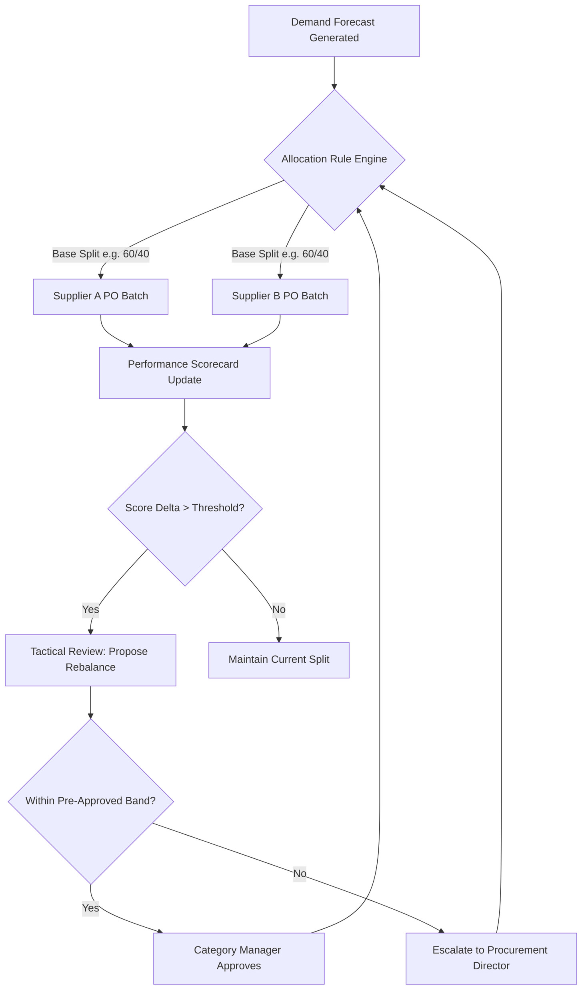
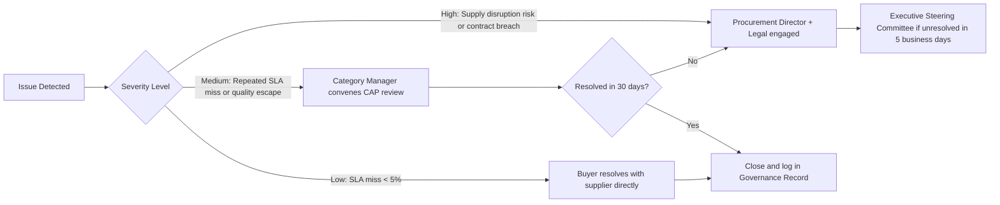

## Governance Model for Managing Two Active Suppliers

### Overview

A governance model for dual sourcing defines the decision rights, review cadences, escalation paths, and data structures needed to manage two active suppliers for the same part, material, or service category without creating coordination chaos. Unlike single-source governance, dual sourcing governance must explicitly handle allocation decisions, comparative performance measurement, and conflict-of-interest boundaries between two active commercial relationships.

The core problem this governance model solves is that dual sourcing introduces a second axis of complexity: not just "is this supplier performing?" but "how should volume, information, and risk be allocated *between* these two suppliers, and who decides?"

### Governance Objectives

**Key Points**

- Prevent ad hoc allocation decisions that erode supplier trust or create legal exposure
- Maintain competitive tension between suppliers without triggering destructive rivalry
- Provide a documented audit trail for allocation, pricing, and performance decisions
- Ensure information parity/firewalling where required (avoiding one supplier gaining unfair insight into the other's terms)
- Create clear escalation paths when performance or supply disputes arise

### Governance Structure Layers

A functional dual-sourcing governance model typically operates across three layers:

#### 1. Strategic Layer (Quarterly/Annual)

Owned by category management or procurement leadership. Responsibilities include:

- Setting the target allocation split (e.g., 70/30, 60/40) and the rationale (cost, risk, capacity)
- Approving changes to the split based on performance trends
- Reviewing total cost of ownership (TCO) across both suppliers
- Approving entry/exit of a supplier from the dual-source pool

#### 2. Tactical Layer (Monthly)

Owned by category managers / commodity managers. Responsibilities include:

- Running the joint or parallel Supplier Performance Reviews (SPRs)
- Adjusting near-term allocation within pre-approved bands (e.g., ±10% without escalation)
- Managing corrective action plans (CAPs) for underperformance
- Tracking capacity commitments against actual orders

#### 3. Operational Layer (Weekly/Daily)

Owned by buyers/planners. Responsibilities include:

- Issuing purchase orders per the allocation split
- Managing day-to-day delivery, quality, and invoice exceptions
- Flagging deviations that may require tactical-layer intervention

### Decision Rights Matrix (RACI)

| Decision | Buyer/Planner | Category Manager | Procurement Director | Legal/Compliance |
| --- | --- | --- | --- | --- |
| Routine PO issuance per allocation split | R/A | I | — | — |
| Allocation adjustment within approved band | C | R/A | I | — |
| Allocation adjustment outside approved band | I | C | R/A | I |
| Supplier onboarding/offboarding | I | C | R/A | C |
| Pricing/contract terms changes | I | C | A | R |
| Emergency single-source failover | R | A | I | I |

*R = Responsible, A = Accountable, C = Consulted, I = Informed*

### Allocation Governance Mechanics

The allocation split is the central artifact this governance model must control. A common structure:

**Allocation adjustment triggers** typically include:

- On-time delivery falling below an agreed threshold (e.g., 95%)
- Quality defect rate (PPM) exceeding contractual limits
- Lead time variance beyond an agreed standard deviation
- Force majeure or capacity constraint events at one supplier

### Performance Scorecard Framework

Both suppliers must be measured on an identical, weighted scorecard to keep allocation decisions defensible and non-discriminatory. A typical weighting:

$$\text{Composite Score} = 0.35Q + 0.30D + 0.20C + 0.15R$$

Where $Q$ = Quality score, $D$ = Delivery score, $C$ = Cost/competitiveness score, $R$ = Responsiveness/service score, each normalized to a 0–100 scale.

**Example**

Supplier A: Q=92, D=88, C=85, R=90 → Composite = $0.35(92) + 0.30(88) + 0.20(85) + 0.15(90) = 89.3$

Supplier B: Q=80, D=95, C=90, R=82 → Composite = $0.35(80) + 0.30(95) + 0.20(90) + 0.15(82) = 87.8$

A governance rule might state: composite score differentials under 3 points do not trigger reallocation (to avoid thrashing), while differentials over 8 points trigger a mandatory tactical-layer review.

### Information Firewalling and Conflict of Interest

**Key Points**

- Pricing terms from Supplier A must never be disclosed to Supplier B (and vice versa) except in aggregated, anonymized benchmarking form
- Category managers handling both suppliers should have documented conduct guidelines preventing favoritism (e.g., no accepting hospitality above policy thresholds from either party)
- Joint supplier meetings (if held) must have a published agenda excluding competitor-sensitive content; most dual-sourcing governance models mandate **separate** business reviews rather than joint ones for this reason
- [Inference] Some organizations establish a formal ethical wall with named individuals restricted from cross-supplier commercial data access, though the rigor of this varies by industry and contract value

### Escalation Path Design

### Governance Cadence Calendar

| Cadence | Forum | Participants | Output |
| --- | --- | --- | --- |
| Weekly | Ops sync (internal only) | Buyer, Planner | Exception log |
| Monthly | Supplier Business Review (per supplier, separate) | Category Manager, Supplier Account Lead | Scorecard, CAP updates |
| Quarterly | Dual-Source Portfolio Review | Procurement Director, Category Manager | Allocation split ratification |
| Annual | Strategic Sourcing Review | Procurement Leadership, Finance | Contract renewal, split strategy reset |

### Governance Documentation Artifacts

**Key Points**

- **Dual-Source Charter**: the foundational document defining objectives, allocation philosophy, and decision rights (the RACI above)
- **Allocation Policy**: the specific bands, thresholds, and triggers for rebalancing
- **Scorecard Template**: standardized metrics applied identically to both suppliers
- **Escalation Log**: a running record of disputes, resolutions, and precedents (important for defensibility if a supplier alleges unfair treatment)
- **Contract Addenda**: dual-source-specific clauses covering minimum/maximum volume commitments, capacity reservation, and most-favored-nation (MFN) pricing terms where applicable

### Common Governance Failure Modes

- **Split ossification**: the allocation ratio is set once and never revisited, eliminating the competitive benefit of dual sourcing
- **Shadow favoritism**: informal buyer preference for one supplier undermines the documented governance process
- **Scorecard gaming**: metrics defined loosely enough that either supplier can optimize the measured number without improving actual performance
- **Escalation fatigue**: too many minor issues routed to the director/executive layer, causing delayed decisions on genuinely critical matters
- [Inference] Organizations that skip the quarterly portfolio review most often report allocation splits drifting away from strategic intent over 12–18 months

### Related Topics

- Allocation Rule Design and Rebalancing Thresholds
- Supplier Scorecard Design and Weighting Methodologies
- Contractual Structures for Dual Sourcing (MFN clauses, capacity reservation agreements)
- Conflict-of-Interest Policy Design in Multi-Supplier Procurement
- Single-Source Failover and Business Continuity Planning
- Category Management Organizational Design