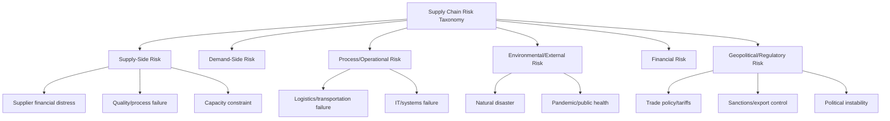

## Supply Chain Risk Category Taxonomy

### Overview

A supply chain risk category taxonomy is a structured classification system that organizes potential disruptions by their source, mechanism, and impact pathway. In a dual-sourcing context, the taxonomy serves a specific purpose beyond general risk cataloging: it determines which risks are actually mitigated by having two suppliers (correlated vs. uncorrelated risk) and which risks persist regardless of supplier count. Without this distinction, organizations often assume dual sourcing provides broader risk protection than it actually does.

### Primary Taxonomy Structure

Supply chain risks are typically classified along two intersecting dimensions: **source** (where the risk originates) and **propagation scope** (how widely it can spread). A dual-sourcing-aware taxonomy adds a third dimension: **correlation**, i.e., whether a risk event affects one supplier or both simultaneously.

### Category 1: Supply-Side Risk

Risks originating at or near the supplier itself.

**Key Points**

- **Supplier financial distress**: bankruptcy, insolvency, credit downgrade affecting a supplier's ability to fulfill orders
- **Quality/process failure**: defect escapes, process drift, certification lapses (e.g., ISO 9001 non-conformance)
- **Capacity constraint**: supplier is unable to scale output to meet demand spikes
- **Single-point-of-failure sub-tier risk**: both suppliers may unknowingly depend on the same upstream sub-supplier or raw material source, which is the single most important correlation risk to identify in dual sourcing

**Correlation note**: Financial distress and quality failure are typically *uncorrelated* between two independently-owned suppliers, meaning dual sourcing meaningfully mitigates them. Sub-tier dependency risk is often *correlated* and is frequently missed during initial dual-source qualification.

### Category 2: Demand-Side Risk

Risks arising from volatility or misestimation in the buyer's own demand signal.

- Demand forecast error causing over- or under-allocation to either supplier
- Bullwhip effect amplification across a two-supplier order pattern
- Sudden product mix changes requiring re-qualification of one supplier's tooling or capability

### Category 3: Process/Operational Risk

Risks embedded in the physical and informational flow of goods.

- **Logistics/transportation failure**: port congestion, carrier capacity shortage, customs delay
- **IT/systems failure**: EDI outage, ERP integration failure between buyer and either supplier
- **Inventory/warehouse risk**: stockout or overstock due to poor allocation synchronization between the two supply streams

**Correlation note**: Logistics risk can be correlated if both suppliers ship through the same port, corridor, or carrier — a common oversight when dual sourcing is done for supplier diversity but not logistics diversity.

### Category 4: Environmental/External Risk

- **Natural disaster**: earthquake, flood, hurricane affecting a supplier's facility or region
- **Pandemic/public health disruption**: workforce unavailability, regional lockdowns
- **Climate-driven resource scarcity**: water stress, energy rationing affecting production regions

**Correlation note**: This is the category where geographic dual sourcing (placing suppliers in different regions/countries) provides the clearest, most measurable risk reduction. Two suppliers in the same industrial park or seismic zone provide little protection here.

### Category 5: Financial Risk

- Currency/FX exposure differing between suppliers priced in different currencies
- Commodity/raw material price volatility affecting supplier cost structures differently
- Payment term and working capital risk (e.g., a smaller secondary supplier may have less financial cushion to absorb payment delays)

### Category 6: Geopolitical/Regulatory Risk

- **Trade policy/tariffs**: sudden tariff changes affecting the landed cost of one supplier's goods more than the other's
- **Sanctions/export control**: restrictions that could abruptly disqualify a supplier
- **Political instability**: civil unrest, regime change, or regulatory nationalization risk in a supplier's home country

**Correlation note**: Often deliberately *decorrelated* by design — this is the primary strategic rationale for geographic dual sourcing (e.g., pairing a domestic supplier with an offshore one, or suppliers in different trade blocs).

### Risk Correlation Matrix for Dual Sourcing

| Risk Category | Typically Correlated Across Two Suppliers? | Dual-Sourcing Mitigation Value |
| --- | --- | --- |
| Supplier financial distress | No (if independently owned) | High |
| Quality/process failure | No | High |
| Sub-tier/raw material dependency | Often Yes | Low (unless verified independent) |
| Logistics/transportation | Sometimes (same corridor/carrier) | Medium |
| Natural disaster | No (if geographically separated) | High |
| Pandemic/public health | Partially (regional spread) | Medium |
| Currency/FX | No (if different currency zones) | Medium |
| Trade policy/tariffs | No (if different trade blocs) | High |
| Demand forecast error | Yes (internal risk, not supplier-specific) | None |

### Risk Scoring Within the Taxonomy

Each identified risk is typically scored on likelihood and impact, then weighted by correlation status:

$$\text{Adjusted Risk Score} = L \times I \times (1 - M_c)$$

Where $L$ = likelihood (0–1), $I$ = impact severity (0–1), and $M_c$ = mitigation credit from dual sourcing (0–1, where 1 means the second source fully neutralizes the risk and 0 means it provides no protection due to correlation).

**Example**

A natural disaster risk with $L=0.15$, $I=0.9$, and dual sourcing across separate regions giving $M_c=0.8$:

$$\text{Adjusted Risk Score} = 0.15 \times 0.9 \times (1 - 0.8) = 0.027$$

Compare to a sub-tier dependency risk with the same $L=0.15$, $I=0.9$, but $M_c=0.1$ (both suppliers share an upstream chip fabricator):

$$\text{Adjusted Risk Score} = 0.15 \times 0.9 \times (1 - 0.1) = 0.1215$$

This scoring approach exposes cases where dual sourcing creates a false sense of security — the raw risk looks identical, but the adjusted score reveals the sub-tier dependency as the far more dangerous exposure.

### Taxonomy Governance and Maintenance

**Key Points**

- The taxonomy should be reviewed at least annually and after any major disruption event (post-incident reviews often reveal previously uncategorized risks)
- Sub-tier mapping (Category 1) requires active supplier disclosure and periodic verification, since it degrades over time as suppliers change their own sourcing
- Ownership typically sits with the risk management or procurement risk function, with input from category managers who hold supplier-specific knowledge
- [Inference] Mature organizations often integrate this taxonomy directly into supplier risk scoring tools or ERP risk modules rather than maintaining it as a standalone document, though implementation maturity varies widely by organization size

### Related Topics

- Sub-Tier Supplier Mapping and Visibility Techniques
- Geographic and Logistics Diversification Strategy for Dual Sourcing
- Risk Scoring Models and Likelihood/Impact Matrices
- Business Continuity Planning per Risk Category
- Supplier Financial Health Monitoring
- Post-Incident Review and Taxonomy Update Processes